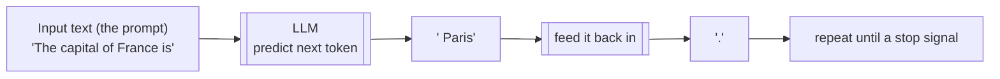
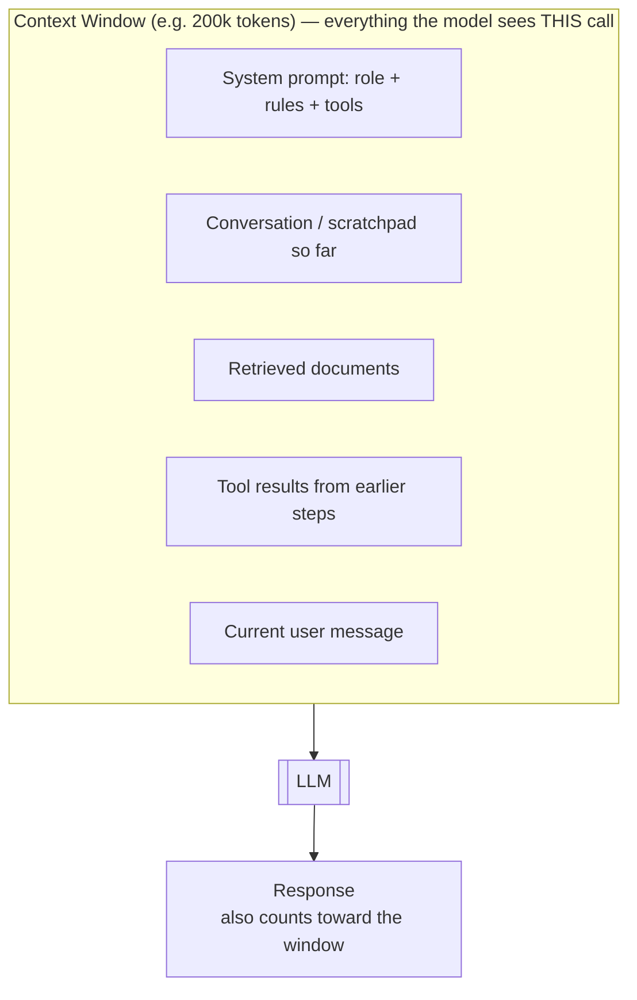
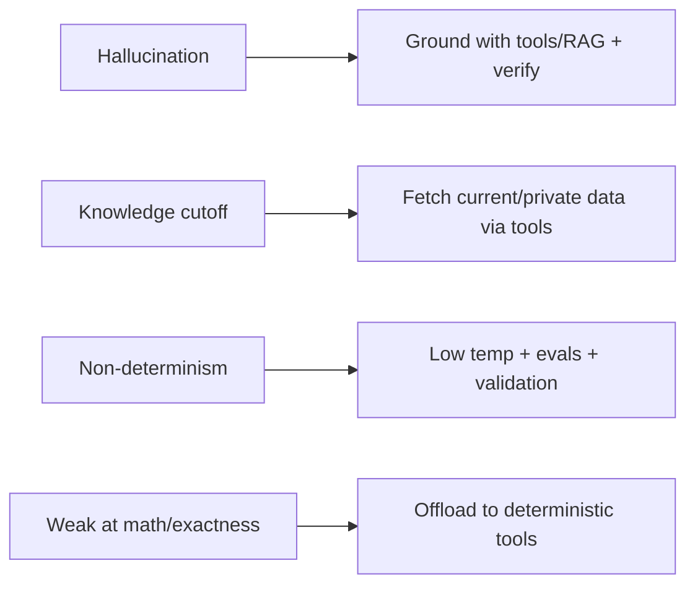
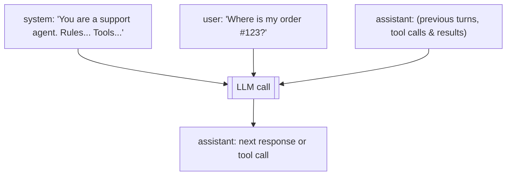

# 02 — LLM Fundamentals for Agent Builders

> You don't need to know how to *train* an LLM. You need to know the handful of properties that dictate every agent design decision: tokens, the context window, sampling/temperature, structured output, and the failure modes (hallucination, cutoff, non-determinism). This chapter is the "just enough ML" chapter.

---

## 1. What an LLM Actually Does (in one paragraph)

A Large Language Model is a function that, given a sequence of text, **predicts the next chunk of text** — one piece at a time. That's it. It was trained on enormous amounts of text to become extremely good at "what word most plausibly comes next." Everything an agent does — reasoning, tool calls, writing code — is this next-token prediction, dressed up. Internalize this and the model's strengths (fluent, knowledgeable, flexible) and weaknesses (confidently wrong, no true memory, non-deterministic) both make sense.



The model generates **autoregressively**: it predicts one token, appends it to the input, and predicts the next. This is why longer outputs cost more and take longer, and why the model can "change its mind" mid-generation.

---

## 2. Tokens — the Unit of Everything

LLMs don't see words or characters; they see **tokens** — sub-word chunks. Roughly:

- **1 token ≈ 4 characters ≈ ¾ of a word** in English.
- "unbelievable" might be `un` + `believ` + `able` (3 tokens). "cat" is 1 token.
- Code, punctuation, and other languages tokenize differently (often less efficiently).

**Why you must care:**
- **You pay per token** (input + output), so tokens = money. (Ch 17)
- **The context window is measured in tokens**, so tokens = how much the model can "see." (§3)
- **Latency scales with output tokens** — generating 2,000 tokens takes ~2× generating 1,000.

> Practical: "~750 words ≈ 1,000 tokens." A 100-page document is ~50k–70k tokens. Keep a rough token-budget in your head like you keep a memory budget.

---

## 3. The Context Window — the Model's *Only* Memory

The **context window** is the maximum number of tokens the model can consider at once — the prompt **plus** the response it generates. Modern models range from ~8k to **200k–1M+** tokens.

**This is the single most important concept for agent builders**, so read it twice:

> **The model has no memory between calls. The context window is its entire world for one call.** Anything you want it to "know" or "remember" must be *inside the context you send on that call.* Every time.



Consequences that shape every agent:
- An agent that runs for 30 steps **accumulates** tool results in its context — it will eventually **fill up**. Managing this is *context engineering* (Ch 19).
- "Long-term memory" (Ch 5) exists precisely because the window is finite and wiped between sessions — you store things outside and *retrieve them back into the window* when needed (that's RAG, Ch 6).
- **Position matters:** models attend better to the start and end of a long context than the middle ("lost in the middle"). Put the most important instructions where they'll be seen.
- **Bigger window ≠ free.** More tokens = more cost, more latency, and sometimes *worse* focus. Don't dump everything in "just in case."

---

## 4. How Output Is Generated: Sampling & Temperature

The model doesn't output one certain next token — it produces a **probability distribution** over all possible next tokens, then **samples** from it. Key knobs:

- **Temperature (0 → ~1+):** how random the sampling is.
  - **Low (0–0.2):** near-deterministic, picks the most likely token. Use for tool-calling, extraction, code, math — anywhere you want consistency.
  - **High (0.7–1.0):** more varied/creative. Use for brainstorming, writing.
- **Top-p / top-k:** alternative ways to restrict the candidate tokens before sampling.
- **Stop sequences:** strings that tell the model to stop generating.
- **Max tokens:** a hard cap on output length (budget/safety).

> **For agents, prefer low temperature.** You want the tool call to be right, not creative. Even at temperature 0, output isn't 100% guaranteed identical across runs (floating-point and infra reasons) — which leads to the next point.

---

## 5. The Four Failure Modes You Must Design Around

Agents fail in *characteristic* ways. Good agent design is largely about compensating for these:

### 5.1 Hallucination
The model can produce fluent, confident, **false** statements — invented facts, fake API signatures, non-existent file paths, made-up citations. It's not lying; it's predicting plausible text, and plausible ≠ true.
**Mitigations:** ground it with real data (RAG, tools that fetch truth), ask for citations you can verify, use structured output + validation, and never trust an unverified claim in a high-stakes path.

### 5.2 Knowledge cutoff
The model only knows what was in its training data, up to a **cutoff date**. It doesn't know today's date, recent events, your private data, or your codebase.
**Mitigations:** give it current/private info via tools and retrieval. This is *the* reason tool use and RAG exist.

### 5.3 Non-determinism
The same input can yield different output. You **cannot** write `assertEquals(expected, llm(input))` tests the classic way.
**Mitigations:** low temperature; structured output; **evals** that check properties/semantics rather than exact strings (Ch 14); retries with validation.

### 5.4 Limited/So-so at some things
Reliable arithmetic, precise counting, up-to-the-second data, exact long-document recall — LLMs are shaky here.
**Mitigations:** offload to tools (a calculator tool, a DB query, code execution). *Don't ask the model to do what a function can do deterministically.*



---

## 6. Structured Output — Making the Model Machine-Readable

Free-form text is hard for code to consume. For agents you almost always want **structured output** — typically JSON matching a schema — so your program can act on it reliably.

Ways to get it (increasing reliability):
1. **Ask in the prompt** ("respond with JSON like `{...}`") — works, but the model may add prose or malformed JSON.
2. **Provide a schema / use "JSON mode"** — the API enforces valid JSON.
3. **Tool/function calling with a typed schema** — the most reliable: the model is constrained to emit arguments matching your schema (this is also how tool use works — Ch 4).

Example concept (Python-ish, provider-agnostic):
```python
schema = {
  "type": "object",
  "properties": {
    "sentiment": {"type": "string", "enum": ["positive", "negative", "neutral"]},
    "confidence": {"type": "number"}
  },
  "required": ["sentiment", "confidence"]
}
# The model is forced to return an object matching `schema` → your code can trust result["sentiment"].
```

> **Rule:** if your code needs to branch on the model's answer, make the model return **structured data**, not a paragraph you have to parse with regex.

---

## 7. Prompts: System vs User vs Assistant

A chat LLM call is a list of **messages**, each with a **role**:

- **System** — the standing instructions: who the model is, its rules, its tools, its constraints. Set once; highest authority. *This is where most of your "agent design" lives.*
- **User** — input from the human (or the calling program).
- **Assistant** — the model's own prior responses (including its tool calls). You feed these back so it remembers the conversation.



In an agent loop, the message list **grows** each step (you append the model's tool call and the tool's result), and you resend the whole list next call — because, again, the model has no memory except what's in the context. (Ch 3 shows this concretely.)

---

## 8. A Few Numbers Worth Knowing

- **Token ≈ ¾ word**; ~1,000 tokens ≈ 750 words.
- **Context windows** today: commonly 128k–200k, some 1M+.
- **Pricing** is per-million-tokens, and **input is usually much cheaper than output** — which is why stuffing context is cheaper than generating long outputs, and why **prompt caching** (reusing a fixed prefix) saves a lot (Ch 17).
- **Latency:** dominated by *output* tokens + model size; streaming tokens to the user hides latency (Ch 17).

*(Exact model names, context sizes, and prices change constantly — verify against current provider docs when you implement, rather than trusting a number from a blog post. We'll pull live specs in the build chapters.)*

---

## 9. Check Yourself

1. Why must everything the model "remembers" be inside the context window?
2. What temperature would you use for a tool-calling agent, and why?
3. Name the four failure modes and one mitigation for each.
4. Why can't you test an agent with `assertEquals`?
5. What's the most reliable way to get JSON out of a model?

---

## 10. Key Takeaways

- An LLM is a **next-token predictor**; everything follows from that.
- **Tokens** are the unit of cost, context, and latency (~¾ word each).
- The **context window is the model's only memory** — it's wiped between calls, so you resend everything each time. Managing it is the core agent skill.
- Use **low temperature** for agents; expect **non-determinism** regardless.
- Design around **hallucination, knowledge cutoff, non-determinism, and weak exactness** — mostly by **offloading truth and precision to tools** and validating outputs.
- Prefer **structured output** whenever code consumes the result.

**Next:** *03 — The Agent Loop* — how these fundamentals combine into the reason→act→observe cycle that *is* an agent.
