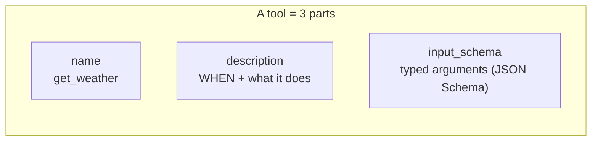
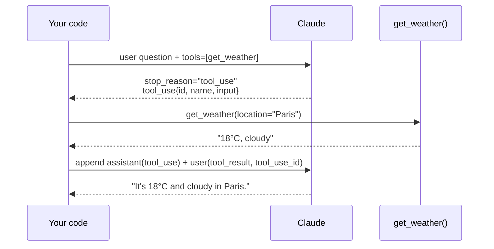
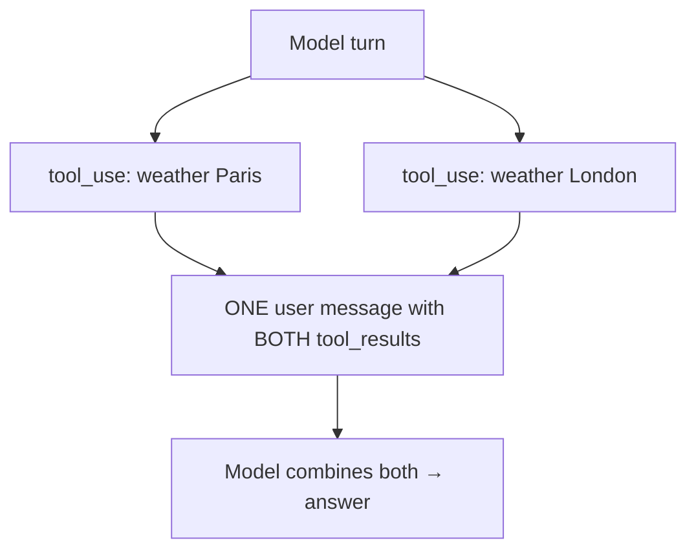

# 04 — Tool Use / Function Calling

> Tools are how an LLM *does* things instead of just *talking*. The critical idea: the model never runs a tool — it emits a structured request saying "call `get_weather` with `{city: 'Paris'}`", **your code runs it**, and you feed the result back. This chapter is the mechanism in full, with accurate Claude API reference code.

---

## 1. The Problem in Plain English

An LLM is trapped in a box. It can read the text you send and write text back — nothing else. It can't check today's weather, read your database, send an email, or run code. **Tool use is the door out of the box.**

You give the model a menu of tools (each with a name, a description, and the shape of its inputs). When the model decides it needs one, it says so in a structured way. Your program executes the real function and returns the result. The model then continues, now armed with real-world information.

**Analogy — a chef and a runner.** The chef (LLM) is brilliant but can't leave the kitchen. When the chef needs fresh basil, they write a ticket: "basil, 200g." A runner (your code) takes the ticket, goes to the market, and brings back the basil. The chef never leaves; the runner does the fetching. Tools are that ticket system.

---

## 2. The Golden Rule (say it three times)

> **The model requests a tool call. YOUR code executes it. YOU return the result.**

The model's output when it wants a tool is just *text in a structured format* — a JSON object naming the tool and its arguments. Nothing happens until your runtime sees that request, runs the actual function, and sends back the output. This is why:
- You control security (validate/deny dangerous calls).
- You control what's real (the model can hallucinate a tool call; your code decides whether to honor it).
- The "loop" from Chapter 3 exists at all (execute → return → model decides again).

---

## 3. A Tool Definition

A tool is three things: a **name**, a **description** (this is what the model reads to decide when to use it), and an **input schema** (JSON Schema describing the arguments).

```python
weather_tool = {
    "name": "get_weather",
    "description": "Get the current weather for a location. "
                   "Call this when the user asks about current weather or temperature.",
    "input_schema": {
        "type": "object",
        "properties": {
            "location": {"type": "string", "description": "City and state, e.g. San Francisco, CA"},
            "unit": {"type": "string", "enum": ["celsius", "fahrenheit"], "description": "Temperature unit"}
        },
        "required": ["location"]
    }
}
```

**The description is the most important part.** The model chooses tools based on it. Be *prescriptive about when to call it*, not just what it does — "Call this when the user asks about current prices or recent events" beats "Gets prices." Good descriptions are the difference between an agent that uses tools correctly and one that flails.



---

## 4. The Full Round-Trip

Here's one complete tool interaction against the Claude API (reference — study it, don't run it):

```python
import anthropic
client = anthropic.Anthropic()

# 1. Send the question + the tool menu
response = client.messages.create(
    model="claude-opus-4-8",
    max_tokens=1024,
    tools=[weather_tool],
    messages=[{"role": "user", "content": "What's the weather in Paris?"}],
)

# 2. The model decides it needs the tool. stop_reason tells you.
#    response.stop_reason == "tool_use"
#    response.content contains a tool_use block:
#      { type: "tool_use", id: "toolu_abc", name: "get_weather", input: {"location": "Paris"} }
```

Now **your code** runs the real function and sends the result back — as a `tool_result` block that references the tool call's `id`:

```python
# 3. Execute the tool yourself
tool_call = next(b for b in response.content if b.type == "tool_use")
result = get_weather(**tool_call.input)   # your real function → "18°C, cloudy"

# 4. Send the conversation back, now including the tool call AND its result
followup = client.messages.create(
    model="claude-opus-4-8",
    max_tokens=1024,
    tools=[weather_tool],
    messages=[
        {"role": "user", "content": "What's the weather in Paris?"},
        {"role": "assistant", "content": response.content},          # the tool_use block
        {"role": "user", "content": [                                 # the tool_result
            {"type": "tool_result", "tool_use_id": tool_call.id, "content": result}
        ]},
    ],
)
# 5. Now the model answers: "It's 18°C and cloudy in Paris."
```



**Three rules that trip everyone up:**
1. You must append the assistant's `tool_use` block to history **and** the `tool_result` — both, or the API rejects the mismatch.
2. The `tool_result` must carry the matching `tool_use_id`.
3. On error, return `tool_result` with `"is_error": true` and a message — don't drop it. The model will adapt.

---

## 5. The Agent Loop = Tool Use in a `while`

Chapter 3's loop is literally: keep calling the model, and every time `stop_reason == "tool_use"`, run the tools and feed results back, until it stops asking. Reference (Claude API manual loop):

```python
messages = [{"role": "user", "content": user_input}]

while True:
    response = client.messages.create(
        model="claude-opus-4-8", max_tokens=4096, tools=tools, messages=messages,
    )
    if response.stop_reason == "end_turn":
        break                                   # model is done → final answer

    # remember what the model asked for
    messages.append({"role": "assistant", "content": response.content})

    # run every requested tool, collect results
    tool_results = []
    for block in response.content:
        if block.type == "tool_use":
            result = execute_tool(block.name, block.input)   # YOUR code
            tool_results.append({
                "type": "tool_result", "tool_use_id": block.id, "content": result,
            })
    messages.append({"role": "user", "content": tool_results})   # feed results back
```

That's the whole engine. Everything fancy (planning, sub-agents, RAG) is elaboration around this.

> 💡 **Framework shortcut:** SDKs ship a *tool runner* that runs this loop for you (Python `@beta_tool` + `client.beta.messages.tool_runner(...)`). Great for production, but write the manual loop **once** by hand so you understand what the runner hides — the moment you need approval gates, custom logging, or conditional execution, you'll drop back to the manual loop.

---

## 6. Parallel Tool Calls

One model turn can request **multiple** tools at once (e.g. weather in Paris *and* London). Run them all — ideally concurrently — and return **all** `tool_result` blocks in a **single** user message.



**Common bug:** splitting the two results across two separate user messages. That silently teaches the model to stop making parallel calls. One turn's tool calls → one results message. Set `tool_choice` with `disable_parallel_tool_use: true` if you *want* at most one tool per turn.

---

## 7. Controlling Tool Choice

`tool_choice` steers whether/which tool the model uses:

| Value | Behavior | Use for |
|---|---|---|
| `{"type": "auto"}` | Model decides (default) | Normal agents |
| `{"type": "any"}` | Must use *some* tool | "Always take an action" flows |
| `{"type": "tool", "name": "x"}` | Must use tool *x* | Forcing structured extraction |
| `{"type": "none"}` | No tools this turn | Force a plain text answer |

---

## 8. Server-Side vs Client-Side Tools

Two flavors, and the distinction matters:

- **Client-side tools (the default)** — *you* define and *you* execute them. Everything above. The model requests; your runtime runs your code. Full control, full responsibility.
- **Server-side tools** — the provider hosts and runs them; you just declare them. On the Claude API these include **web search**, **web fetch**, and **code execution** — you add them to `tools` and results come back in the same response, no execution loop on your side.

```python
# Server-side: declared, not executed by you
tools = [
    {"type": "web_search_20260209", "name": "web_search"},
    {"type": "code_execution_20260120", "name": "code_execution"},
]
```

**Rule of thumb:** start with a broad `bash`/code-execution capability for breadth; **promote an action to a dedicated typed tool** when you need to gate it (security), validate it (staleness), render it specially (UI), or run it in parallel safely. A `send_email` tool you can approve beats `bash -c "curl ..."` you can't.

---

## 9. Failure Scenarios

| Scenario | What happens | Handling |
|---|---|---|
| Tool throws / returns an error | Model would be blind to it | Return `tool_result` with `is_error: true` + message; model retries or adapts |
| Model hallucinates a tool that doesn't exist | Invalid tool name | Your dispatcher returns an error result; don't crash |
| Model invents plausible arguments | Bad inputs (wrong city, negative amount) | **Validate inputs in your handler** before executing; reject with a clear error |
| Dangerous/irreversible action (delete, pay, email) | Autonomy risk | **Human-in-the-loop**: pause and require approval before executing (Ch 16) |
| Model loops calling the same failing tool | Wasted cost | Max-steps bound (Ch 3) + detect repeated identical calls |
| Tool result is huge (100k-token dump) | Blows the context window | Summarize/truncate the result before feeding back; or write to a file and return a path (Ch 19) |

---

## ❌ 10. Common Mistakes

- **Thinking the model runs the tool.** It never does. Your runtime does. (Chapter's whole point.)
- **Vague tool descriptions.** The model chooses by description — "when to call it" matters more than "what it is."
- **Dropping the assistant `tool_use` block from history.** The API needs both the call and the result, paired by `id`.
- **Splitting parallel results across messages.** Kills parallel tool use.
- **Not validating tool inputs.** The model can pass garbage; treat tool inputs like untrusted user input — because effectively they are.
- **Executing dangerous tools without a gate.** Reversibility is the test — hard-to-undo actions need approval.
- **Too many tools.** A giant tool menu confuses the model. Keep it focused; use *tool search* if you truly have dozens (Ch 19).

---

## 11. Check Yourself

1. Who executes a tool — the model or your code?
2. What two things must you append to the message history after a tool call, and how are they linked?
3. What does `stop_reason == "tool_use"` tell you to do?
4. How do you return multiple parallel tool results correctly?
5. When should you promote a `bash` action to a dedicated typed tool?

---

## 12. Key Takeaways

- **Tools give an LLM hands.** It emits a structured *request*; your code runs the real function and returns the result.
- A tool = **name + description + input_schema**; the description (especially *when to call it*) drives correct selection.
- The round-trip: `tool_use` block → you execute → `tool_result` block (matched by `tool_use_id`) → model continues.
- The **agent loop is just tool use in a `while`** until `stop_reason == "end_turn"`.
- **Parallel tool calls** go out together and their results come back in **one** message.
- **Validate inputs, handle errors as results, and gate dangerous actions** — tool inputs are untrusted model output.
- Server-side tools (web search, code execution) are declared, not executed by you; client-side tools are yours to run.

**Next:** *05 — Memory & State* — the model forgets everything between calls; here's how agents remember.
