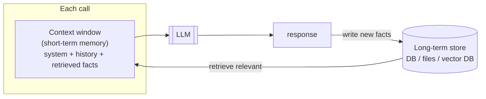
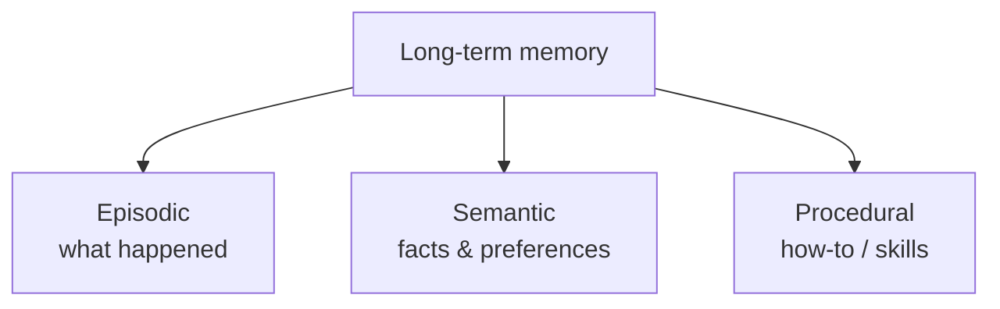
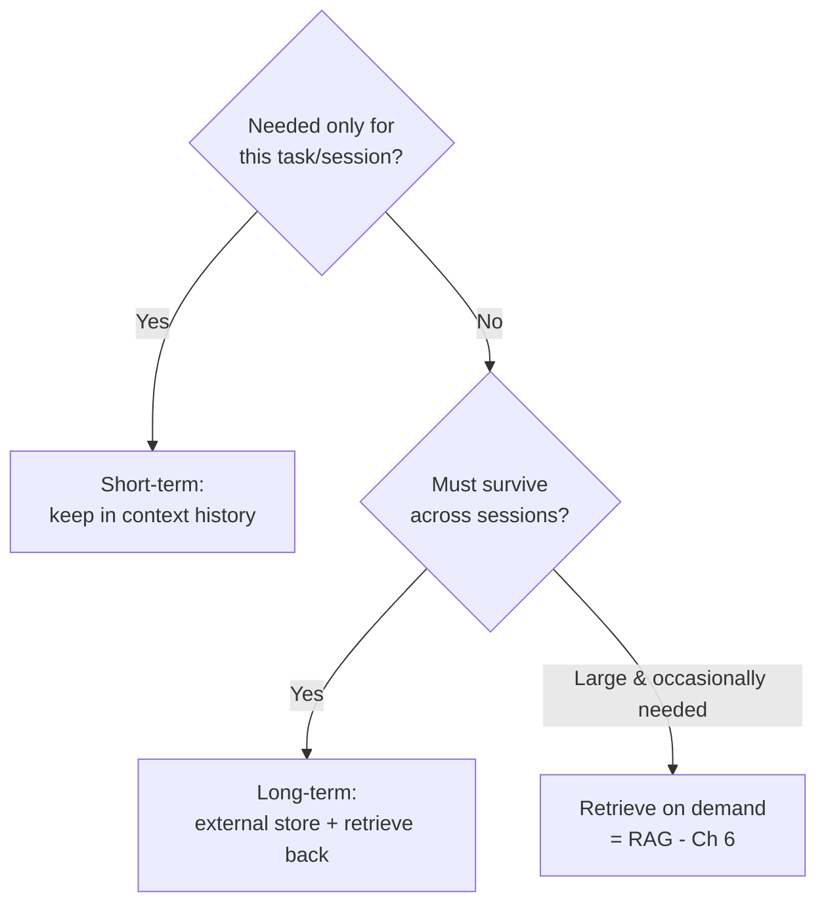
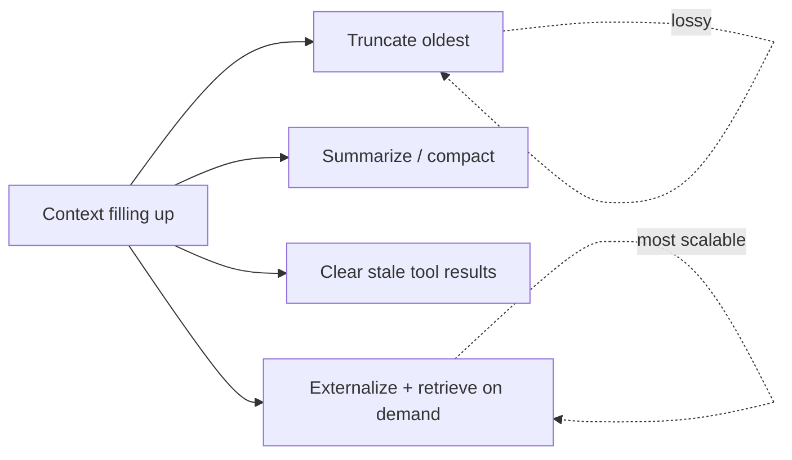

# 05 — Memory & State

> The model forgets **everything** between calls. Any "memory" an agent appears to have is something *you* put back into the context window on the next call. This chapter is about the two kinds of memory — short-term (the context window) and long-term (external storage you retrieve from) — and how to manage them.

---

## 1. The Problem in Plain English

From Chapter 2: the LLM is stateless. Each API call is independent — the model has no recollection of previous calls. If you ask "What's my name?" in call #2, it has no idea, *unless* you resend the earlier turn where you told it.

So "giving an agent memory" is really two engineering jobs:
1. **Short-term memory** — carry the current conversation/work forward by resending it each call (it lives in the context window).
2. **Long-term memory** — store things durably *outside* the model (a database, files, a vector store) and *retrieve the relevant bits back into the context window* when needed.

**Analogy — a brilliant consultant with amnesia.** Every morning they wake up remembering *how to do their job* (that's the trained weights) but nothing about *your* project. Each day you hand them a briefing folder. Whatever's in the folder, they know; whatever's not, they don't. **Short-term memory is today's folder. Long-term memory is the filing cabinet you pull pages from to build the folder.**



---

## 2. Short-Term Memory — the Conversation History

The simplest memory: keep a list of messages and resend the whole list every call. This is exactly the growing `messages` array from Chapters 3–4.

```python
messages = []
def chat(user_text):
    messages.append({"role": "user", "content": user_text})
    resp = client.messages.create(model="claude-opus-4-8", max_tokens=1024, messages=messages)
    reply = next(b.text for b in resp.content if b.type == "text")
    messages.append({"role": "assistant", "content": reply})
    return reply

chat("My name is Pankaj.")
chat("What's my name?")   # works — because turn 1 is resent in the history
```

Types of short-term/working memory an agent accumulates in-context:
- **Conversation turns** (user ↔ assistant).
- **Tool call results** (each observation from Chapter 3's loop piles up here).
- **A scratchpad / plan** the model writes to itself (Chapter 7).

The catch: **it grows without bound.** A 30-step agent accumulates 30 tool results. Eventually it overflows the context window (Chapter 2 §3). Managing that is §5 and Chapter 19.

---

## 3. Long-Term Memory — Beyond the Window

Long-term memory persists across sessions and beyond the window's limit. You store information externally and pull the relevant slice back in when needed. Three classic *types* (borrowed from cognitive science, useful as a design vocabulary):

| Type | What it holds | Example | Typical store |
|---|---|---|---|
| **Episodic** | Specific past events/interactions | "On Tuesday the user asked about refunds" | DB rows, logs |
| **Semantic** | Facts & knowledge | "The user prefers Python", "Our return policy is 30 days" | Vector DB, key-value |
| **Procedural** | How to do things / learned skills | "Steps to reset a password" | Prompt templates, skill files |



**How it's used, mechanically:** before (or during) a turn, you fetch the relevant records and inject them into the context — as a system note, a message, or a tool result. "Retrieving semantic memory into the window" is exactly **RAG**, which gets its own chapter (Ch 6).

Two concrete patterns you'll actually build:
- **A memory tool** — give the agent a tool it can call to read/write notes (e.g. a `/memories` directory of markdown files). The model decides what's worth remembering and writes it; next session it reads it back. (Claude offers a built-in `memory` tool type; you implement the storage backend.)
- **A user/profile store** — a plain database of durable facts (preferences, IDs, settings) you load into the system prompt at session start.

> 💡 Larger models are notably better when given an explicit memory surface — even a single `notes.md` file. Tell the agent *where* to write, *when* to consult it, and *what format* to use (one lesson per note, a one-line summary on top). This is a cheap, high-leverage addition to long-horizon agents.

---

## 4. Short-Term vs Long-Term — When to Use Which



| | Short-term (context) | Long-term (external) |
|---|---|---|
| Lives in | The context window | DB / files / vector store |
| Survives restart? | ❌ No | ✅ Yes |
| Size limit | The window (finite, costly) | Effectively unlimited |
| Access speed | Instant (it's already in the prompt) | A retrieval step (query → inject) |
| Cost | Tokens every call | Storage + retrieval |

---

## 5. Managing a Growing Context (the real skill)

A long-running agent *will* fill its window. Four techniques, cheapest first:

1. **Truncation / sliding window** — drop the oldest turns. Simple, but you lose information (and can break tool_use/tool_result pairing if careless).
2. **Summarization / compaction** — replace old turns with an LLM-generated summary. Keeps the gist, frees tokens. (Claude offers server-side *compaction* that summarizes earlier context automatically as you near the limit; you must pass the returned compaction block back on the next call.)
3. **Context editing / clearing** — *prune* stale tool results and thinking blocks (remove, don't summarize). Good when old tool outputs are no longer relevant. (Claude offers server-side *context editing* — `clear_tool_uses` / `clear_thinking`.)
4. **Externalize + retrieve** — write details to long-term store, keep only pointers in context, retrieve on demand (RAG). The most scalable.



> This "decide what the model sees each turn" discipline is **context engineering** — the frontier skill for long-horizon agents. Chapter 19 goes deep. For now: *context is a budget; spend it on what the current step actually needs.*

---

## 6. Failure Scenarios

| Scenario | What happens | Handling |
|---|---|---|
| Context overflows mid-task | Request errors or silently truncates; agent "forgets" its goal | Compact/summarize proactively; bound tool-result size |
| Truncation breaks a tool_use/tool_result pair | API rejects the malformed history | Trim at safe boundaries; never orphan a tool_use |
| Stale long-term memory | Agent acts on outdated facts | Timestamp memories; prefer fresh; expire/refresh |
| Wrong memory retrieved | Irrelevant context pollutes reasoning | Better retrieval (Ch 6): reranking, filters, fewer-but-relevant |
| Sensitive data written to memory | Privacy/compliance risk | Never store secrets; scope per-user; redact PII (Ch 16) |
| "Lost in the middle" | Model ignores facts buried in a huge context | Put critical info at the start/end; retrieve less, more relevant |

---

## ❌ 7. Common Mistakes

- **Assuming the model remembers between calls.** It doesn't. Resend, or retrieve.
- **Letting context grow unbounded.** Plan compaction/eviction *before* you hit the wall.
- **Dumping the entire long-term store into context "to be safe."** More tokens = more cost, more latency, and *worse* focus. Retrieve the relevant slice.
- **Storing secrets/PII in memory files.** Treat memory like a database with the same privacy rules.
- **Naive truncation that orphans tool calls.** Keep tool_use/tool_result pairs intact.
- **Confusing summarization (compaction) with clearing (context editing).** One condenses, one deletes — different tools for different needs.

---

## 8. Check Yourself

1. Where does an agent's short-term memory physically live?
2. Why does long-term memory exist at all, given the context window?
3. Name the three cognitive *types* of long-term memory and an example of each.
4. Give two ways to keep a long-running agent from overflowing its context.
5. What's the difference between compaction and context editing?

---

## 9. Key Takeaways

- The model is **stateless**; all memory is engineering *around* it.
- **Short-term memory = the context window** (the resent conversation + tool results + scratchpad). It's instant but finite and wiped between sessions.
- **Long-term memory = external storage** (DB, files, vector DB) that you **retrieve back into the window** when relevant — episodic, semantic, procedural.
- Retrieving semantic memory into context *is* RAG (Ch 6).
- Long-running agents **must manage a growing context**: truncate → summarize/compact → clear → externalize.
- Give agents an explicit memory surface (even a notes file) and tell them when/how to use it — it measurably helps.
- Treat memory as sensitive data: no secrets, scope per-user, expire stale facts.

**Next:** *06 — RAG (Retrieval-Augmented Generation)* — how to give the model knowledge it was never trained on, on demand.
