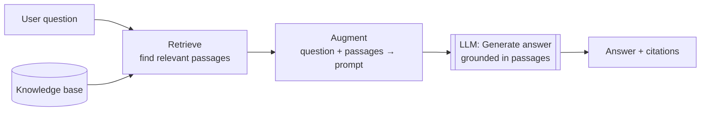
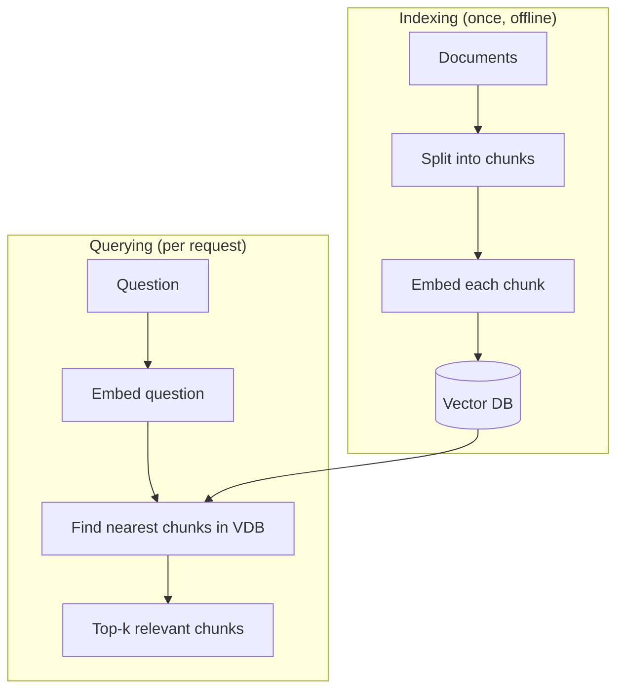
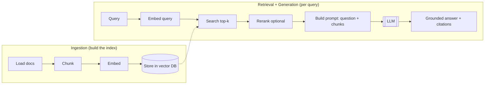
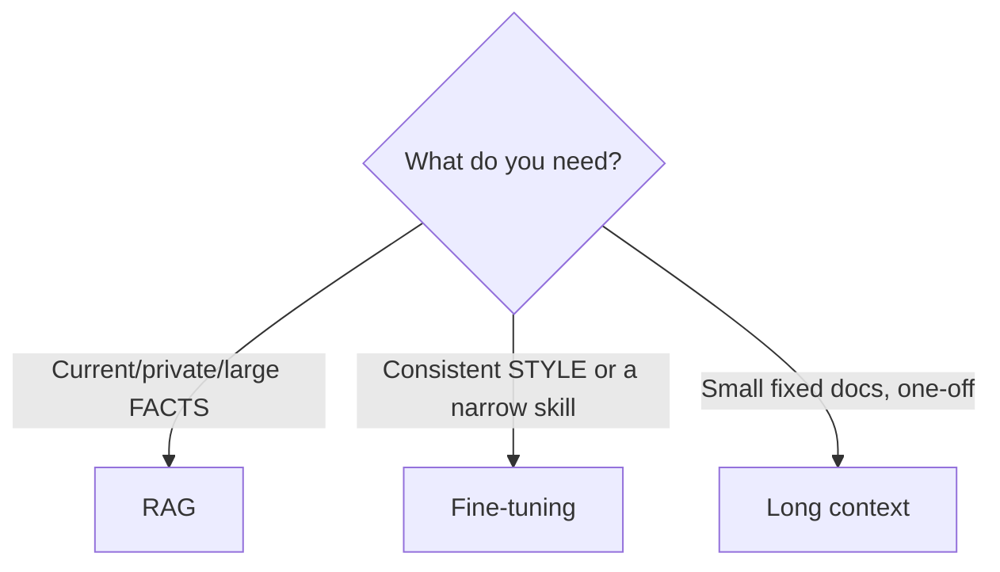
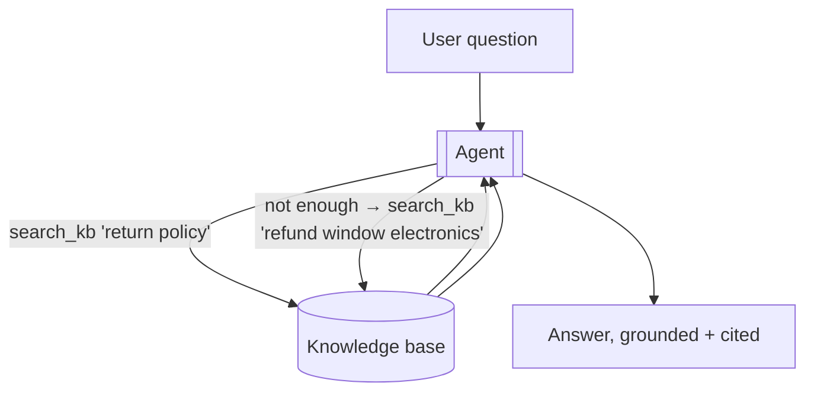

# 06 — RAG (Retrieval-Augmented Generation)

> RAG = look up relevant information first, then put it in the prompt so the model answers from *facts* instead of memory. It's how you give an LLM knowledge it was never trained on — your docs, your database, today's data — and the standard cure for hallucination and the knowledge cutoff.

---

## 1. The Problem in Plain English

The model only knows what was in its training data, up to its cutoff (Chapter 2 §5). It doesn't know your company's internal wiki, your product docs, or what happened yesterday. Ask it and it will either say "I don't know" or — worse — confidently make something up.

**RAG fixes this by adding a step before the model answers:** search a knowledge source for the most relevant passages, paste them into the prompt, and ask the model to answer *using those passages*. "Retrieval-Augmented Generation" = **retrieve** relevant text, **augment** the prompt with it, then **generate** the answer.

**Analogy — open-book vs closed-book exam.** A closed-book exam tests what you memorized (the raw LLM). RAG turns it into an open-book exam: before answering each question, you flip to the relevant page and read it. You still need to be smart enough to understand the page — but you're no longer limited to what you memorized, and you can cite the page.

---

## 2. How Retrieval Works — Embeddings & Vector Search

The hard part is "find the *relevant* passages." Keyword search misses paraphrases ("car" vs "automobile"). The modern answer is **semantic search** via **embeddings**.

- An **embedding** is a list of numbers (a vector) that captures the *meaning* of a piece of text. Similar meanings → nearby vectors.
- You embed every chunk of your knowledge base once and store the vectors in a **vector database**.
- At query time, you embed the question, then find the chunks whose vectors are **nearest** to it (cosine similarity). Those are your relevant passages.

**Vector DBs** you'll hear about: Pinecone, Weaviate, Qdrant, Milvus, Chroma, pgvector (Postgres extension). They all do the same core job: store vectors, return nearest neighbors fast.

---

## 3. The Full RAG Pipeline

**Step by step:**
1. **Load** — pull in your source documents (PDFs, wiki pages, DB rows).
2. **Chunk** — split into passages (see §4 — this decision matters a lot).
3. **Embed** — turn each chunk into a vector.
4. **Store** — index the vectors in a vector DB (with metadata: source, date, section).
5. **Retrieve** — embed the query, fetch the top-k nearest chunks.
6. **(Rerank)** — optionally re-score the top candidates with a more precise model and keep the best few.
7. **Augment** — build a prompt: the question + the retrieved chunks + an instruction to answer *only* from them and cite sources.
8. **Generate** — the model answers, grounded in real text you can verify.

---

## 4. Chunking — the Underrated Decision

You can't embed a whole 100-page PDF as one vector — it'd be too coarse to match anything precisely. So you split documents into **chunks**. Trade-offs:

- **Too small** (a sentence): precise matches, but each chunk lacks context; the model gets fragments.
- **Too large** (a whole page): rich context, but retrieval is fuzzy and you waste tokens on irrelevant text.
- **Sweet spot:** usually a few hundred tokens, often with **overlap** (each chunk repeats the last sentence or two of the previous one) so ideas that straddle a boundary aren't lost.
- **Smarter:** split on natural boundaries (headings, paragraphs) rather than blind character counts, so a chunk is a coherent unit.

Store **metadata** with each chunk (source URL, section, date) — it powers citations and filtering ("only search docs from this year").

---

## 5. RAG vs Fine-Tuning vs Long Context

Three ways to get the model to "know" something. They solve *different* problems — don't confuse them.

| Approach | What it does | Best for | Weakness |
|---|---|---|---|
| **RAG** | Retrieves facts into the prompt at query time | Large, changing, or private *knowledge*; needs citations | Retrieval can miss; adds a lookup step |
| **Fine-tuning** | Adjusts the model's weights on your data | Teaching *behavior/style/format*, or a narrow domain skill | Expensive; static (retrain to update); doesn't add live facts well |
| **Long context** | Just paste all the docs into a big context window | Small, fixed corpora that fit; one-off analysis | Costly per call; "lost in the middle"; doesn't scale to millions of docs |

**Rule of thumb:** RAG for *knowledge that changes or is too big to memorize*. Fine-tuning for *how to behave*. Long context when the whole corpus is small enough to just include. They combine — a fine-tuned model can still use RAG.

---

## 6. RAG and Agents — Retrieval as a Tool

In an agentic system, RAG usually becomes a **tool** (Chapter 4): give the agent a `search_knowledge_base(query)` tool. Now the agent *decides* when it needs to look something up, *chooses* the query, reads the results, and can search again with a refined query — the loop from Chapter 3 applied to retrieval. This "agentic RAG" is far more powerful than one-shot retrieve-then-answer:

You can also skip a self-hosted vector DB entirely for public info by giving the agent a **web search tool** (a server-side tool that fetches current results) — retrieval over the open web instead of your corpus.

---

## 7. Failure Scenarios

| Scenario | What happens | Handling |
|---|---|---|
| Relevant chunk not retrieved | Model answers from memory or says "don't know" | Better chunking; more k; add keyword/hybrid search; reranking |
| Irrelevant chunks retrieved | Noise pollutes the answer | Reranking; metadata filters; raise the similarity threshold |
| Model ignores retrieved text, uses training memory | Wrong/outdated answer | Instruct "answer ONLY from the provided context; if it's not there, say so" |
| Model hallucinates a citation | Fake source | Require citations that map to retrieved chunk IDs; verify before trusting |
| Stale index | Answers from old docs | Re-index on a schedule; store & filter by date |
| Contradictory chunks | Confused answer | Prefer recent/authoritative; surface the conflict |

---

## ❌ 8. Common Mistakes

- **Blind fixed-size chunking** that cuts sentences/ideas in half. Split on structure; use overlap.
- **Retrieving too many chunks** "to be safe" — noise lowers quality and raises cost. Fewer, better chunks win.
- **No instruction to stay grounded.** Without "answer only from the context," the model happily blends in training memory.
- **No citations.** Grounding is worthless if you can't verify it. Return sources.
- **Using RAG to change behavior** (that's fine-tuning) or **fine-tuning to add live facts** (that's RAG). Wrong tool.
- **Forgetting to re-index.** RAG is only as fresh as your last ingestion run.
- **Ignoring "lost in the middle."** Put the most relevant chunk near the top or bottom of the context, not buried.

---

## 9. Check Yourself

1. What do the three letters in RAG stand for, as steps?
2. What is an embedding, and why does semantic search beat keyword search?
3. Why does chunk size matter, and what does overlap buy you?
4. When would you choose fine-tuning over RAG?
5. How does RAG change when it's used inside an agent rather than one-shot?

---

## 10. Key Takeaways

- **RAG = retrieve relevant text → put it in the prompt → generate a grounded answer.** It's the standard fix for hallucination and the knowledge cutoff.
- Retrieval works via **embeddings + a vector database**: nearby vectors = similar meaning; find the query's nearest chunks.
- The pipeline: **load → chunk → embed → store**, then **embed query → search → (rerank) → augment → generate**.
- **Chunking is a real decision** — split on structure, use overlap, keep metadata for citations/filters.
- **RAG ≠ fine-tuning ≠ long context**: knowledge that changes vs behavior vs small fixed corpora.
- In agents, retrieval becomes a **tool** the agent calls and re-calls — "agentic RAG."
- Always **instruct the model to stay grounded and cite sources**, and keep the index fresh.

**Next:** *07 — Planning & Reasoning* — how agents break big problems into steps and check their own work.
