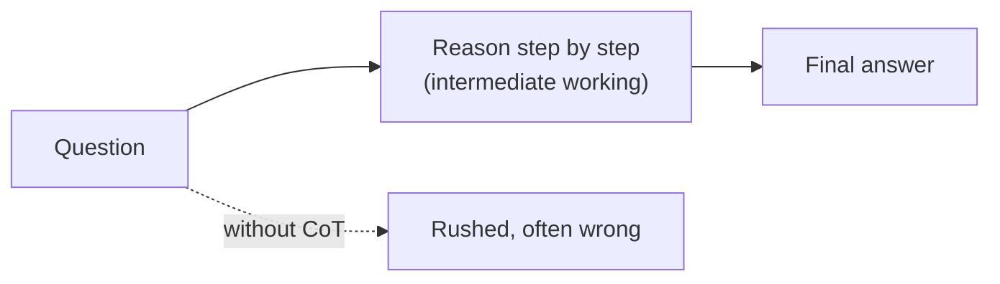
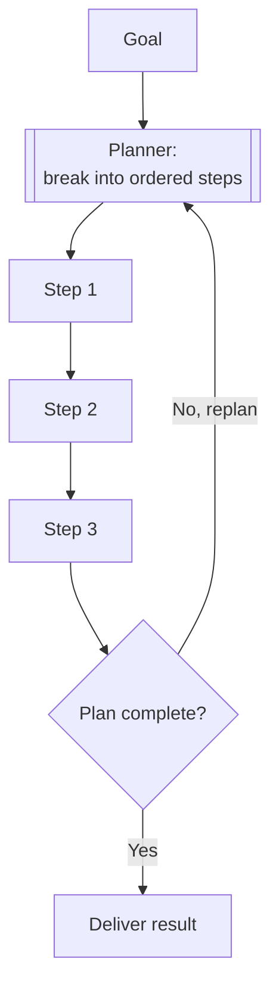
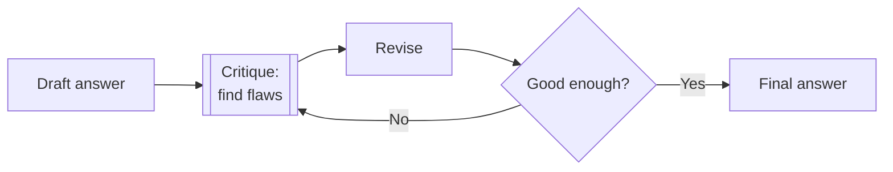
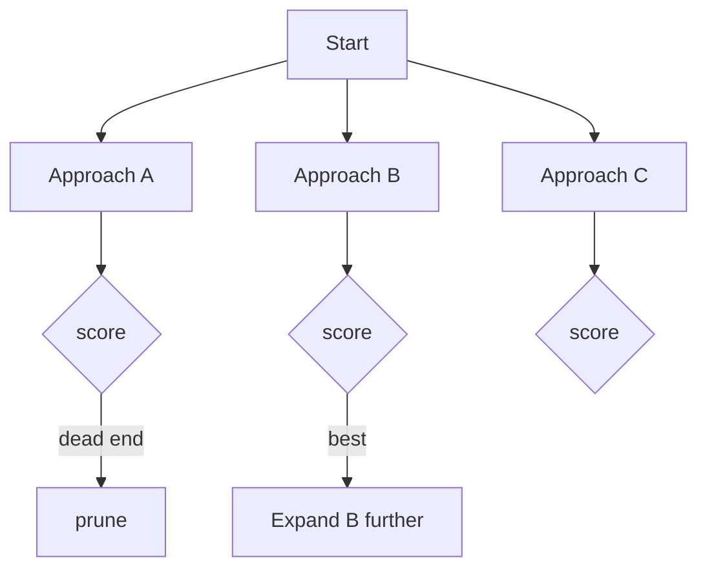
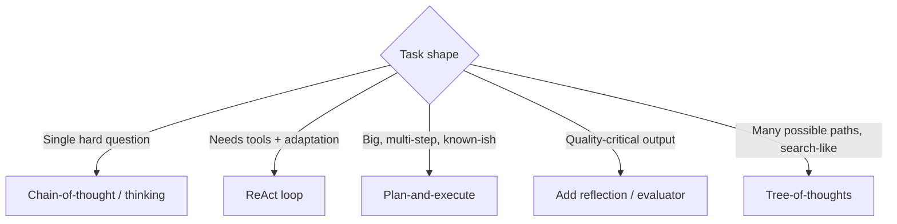

# 07 — Planning & Reasoning

> Hard tasks need more than one shot of thinking. This chapter covers the techniques that make LLMs reason better and tackle multi-step problems: chain-of-thought, ReAct, plan-and-execute, reflection/self-critique, and tree-of-thoughts — and when each is worth its cost.

---

## 1. The Problem in Plain English

Ask a model a hard question and demand an instant answer, and it often blurts out a wrong one — the same way a person does if forced to answer before thinking. LLMs generate token by token (Chapter 2); if they commit to an answer immediately, there's no room to work through the problem.

**The fix is to give the model room to think and structure to plan.** These reasoning techniques are all variations on: *don't answer immediately — reason first, act in steps, and check your work.*

**Analogy — a student solving a math problem.** A weak student writes the answer and hopes. A strong student shows their working (chain-of-thought), tries an approach and adjusts when it fails (ReAct), outlines the solution before diving in (plan-and-execute), and re-checks the result at the end (reflection). Same brain, dramatically different accuracy — because of *method*, not raw intelligence.

---

## 2. Chain-of-Thought (CoT) — Think Before You Answer

The foundational trick: ask the model to **reason step by step** before giving the final answer. Writing out intermediate steps dramatically improves accuracy on math, logic, and multi-step questions — because each step conditions the next, and the model isn't forced to leap straight to a conclusion.



- **Prompted CoT:** literally add "Let's think step by step" or "Show your reasoning."
- **Built-in "thinking":** modern models have a dedicated reasoning mode (e.g. Claude's *adaptive thinking*) — the model produces internal reasoning tokens before the answer, and you don't have to prompt for it. You control depth with an *effort* setting rather than a prompt trick.

> Reasoning costs tokens (and latency). Use it where it pays — math, planning, tricky logic — and dial it down for simple lookups.

---

## 3. ReAct — Reason + Act (the agent's core)

Chapter 3's loop *is* ReAct: interleave **reasoning** with **actions** (tool calls). Pure CoT can only *think*; it can't touch the world. Pure tool-calling acts without thinking. ReAct alternates:

```text
Thought:  I need the current price. I should search.
Action:   web_search("AAPL stock price")
Observation: $232.10
Thought:  Got it. Now compute the 5% target.
Action:   calculator("232.10 * 1.05")
Observation: 243.71
Thought:  Done.
Answer:   A 5% gain would put AAPL at ~$243.71.
```

Each thought plans the next action; each observation informs the next thought. This is why agents can *adapt* — they reason about what just happened before deciding the next move. (Full mechanics in Chapter 3.)

---

## 4. Plan-and-Execute — Outline First, Then Do

For big tasks, add an explicit **planning phase**: have the model write a plan (an ordered list of steps) *before* executing any of them. Then execute the steps — often with a cheaper/faster loop — checking progress against the plan.



**Why it helps:**
- The model commits to a strategy up front instead of wandering.
- You can review/approve the plan before expensive execution (human-in-the-loop).
- Execution steps can be simpler and cheaper than open-ended reasoning.

**Replanning:** if a step reveals the plan was wrong, loop back and revise. Good agents re-plan when reality diverges from expectation — a plan is a hypothesis, not a contract.

> **Give the goal up front.** Frontier models do their best long-horizon work when handed a complete, well-specified goal in one shot and allowed to plan — rather than dribbling requirements across many turns.

---

## 5. Reflection / Self-Critique — Check Your Own Work

After producing an answer or completing a step, have the model **critique it** and revise. "Here's my draft — what's wrong with it? Now fix those issues." This catches errors the first pass missed.



- **Self-reflection:** the same model critiques itself.
- **Evaluator–optimizer (stronger):** a *separate* call/agent evaluates the output against criteria and sends feedback; the first agent revises. A fresh-context critic is more objective than self-critique and catches more (it isn't anchored to the original reasoning). This is a named workflow pattern in Chapter 9.

**Caution:** reflection loops can run forever or "improve" into worse answers. Bound the iterations and use concrete criteria ("does it compile? do the tests pass?") rather than vague "make it better."

---

## 6. Tree-of-Thoughts — Explore Multiple Paths

For problems where the first approach might be a dead end, **branch**: generate several candidate next steps, evaluate them, and pursue the most promising — like exploring a tree, with backtracking. More thorough than a single reasoning line, but much more expensive (many model calls per step). Reserve it for genuinely hard search-like problems (puzzles, planning with many options); it's overkill for everyday tasks.



---

## 7. Choosing a Technique



| Technique | Adds | Cost | Use when |
|---|---|---|---|
| Chain-of-thought | Step-by-step reasoning | Low | Math, logic, any non-trivial answer |
| ReAct | Reasoning + tool actions | Medium | Anything needing tools/external info |
| Plan-and-execute | Explicit up-front plan | Medium | Large multi-step tasks; want reviewable plan |
| Reflection / evaluator | Self-critique + revise | Medium–High | Correctness/quality matters |
| Tree-of-thoughts | Multi-path search + backtrack | High | Hard search problems, many options |

Most real agents combine them: a plan (plan-and-execute), executed via a ReAct loop, with thinking on each step, and a reflection pass at the end.

---

## 8. Failure Scenarios

| Scenario | What happens | Handling |
|---|---|---|
| Reflection loop never ends | Agent keeps "improving" forever | Bound iterations; concrete stop criteria |
| Over-thinking simple tasks | Wasted tokens/latency on a lookup | Lower reasoning effort; skip planning for trivial tasks |
| Plan is wrong but agent follows it blindly | Confidently wrong outcome | Re-plan when observations contradict the plan |
| Reasoning is right but the answer contradicts it | Model "thinks" correctly then answers wrong | Ask it to derive the final answer *from* its reasoning; verify |
| Tree-of-thoughts cost explosion | Huge bill | Cap branches/depth; only use where warranted |
| Self-critique misses its own blind spot | Errors survive | Use a separate evaluator with fresh context |

---

## ❌ 9. Common Mistakes

- **Forcing an instant answer on a hard problem.** Give it room to reason.
- **Reasoning without a stop condition** in reflection loops → infinite / degrading loops.
- **Vague critique prompts** ("make it better"). Use concrete, checkable criteria.
- **Treating the plan as immutable.** Re-plan when reality diverges.
- **Reaching for tree-of-thoughts by default.** It's expensive; most tasks don't need it.
- **Paying for heavy reasoning on trivial tasks.** Match the technique (and effort) to the difficulty.
- **Trusting self-critique for high-stakes checks.** A fresh-context evaluator catches more.

---

## 10. Check Yourself

1. Why does "think step by step" improve accuracy for an LLM?
2. What does ReAct interleave, and why can't chain-of-thought alone act on the world?
3. What's the benefit of writing a plan before executing?
4. Why is a separate evaluator often better than self-critique?
5. When is tree-of-thoughts worth its cost — and when is it overkill?

---

## 11. Key Takeaways

- Reasoning techniques all share one idea: **don't answer immediately — reason, act in steps, and check.**
- **Chain-of-thought / thinking** = reason before answering; the foundation. Modern models do it natively via an *effort* dial.
- **ReAct** = interleave reasoning with tool actions; it's the agent loop and the source of adaptivity.
- **Plan-and-execute** = outline steps first (reviewable, strategic), and **re-plan** when reality diverges.
- **Reflection / evaluator-optimizer** = critique and revise; a fresh-context evaluator beats self-critique for correctness.
- **Tree-of-thoughts** = branch and backtrack; powerful but expensive — reserve for hard search problems.
- Real agents **combine** these and **match the technique (and reasoning effort) to task difficulty.**

**Next:** *08 — Prompt Engineering for Agents* — how to write the system prompt and instructions that make all of this behave.
