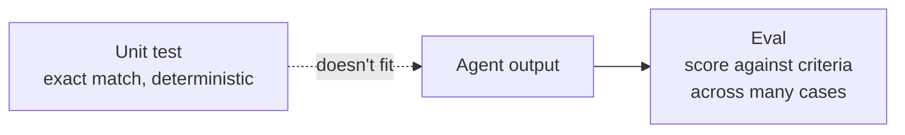
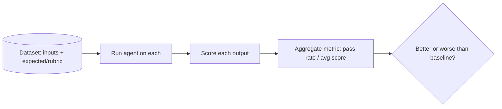
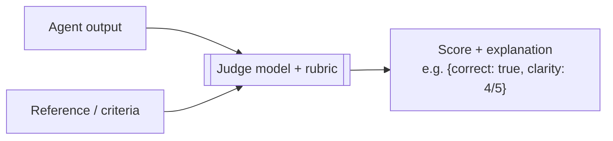
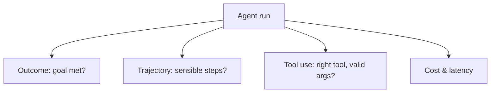

# 14 — Evaluation & Testing

> You can't unit-test an agent the old way — the same input can give different output, and "correct" is often a judgment call, not an exact string. This chapter is how to actually know your agent works: evals, LLM-as-judge, and regression suites that catch when a prompt or model change breaks something.

---

## 1. The Problem in Plain English

Traditional tests assert exact outputs: `assertEqual(add(2,3), 5)`. Agents break this in two ways (Chapter 2):
1. **Non-determinism** — the same prompt can produce different wording each run, so `assertEqual(agent(x), "expected string")` fails even when the answer is fine.
2. **Fuzzy correctness** — "is this summary good?" or "did the agent resolve the ticket?" has no single right string.

So you don't test agents; you **evaluate** them. An **eval** measures whether outputs meet criteria across many cases — checking *properties* and *quality*, not exact equality. Evals are to LLM apps what unit tests are to normal code: your safety net for shipping and for every future change.

**Analogy — grading essays vs. marking a math quiz.** A math quiz has one right answer per question (unit test). Essays don't — a teacher grades against a rubric (structure, accuracy, clarity). Evaluating an agent is grading essays at scale: define the rubric, then score many samples.

---

## 2. Anatomy of an Eval

An eval has three parts:
1. **A dataset** — representative inputs (and ideally reference answers or rubrics). Start small (20–50 real cases) and grow it — especially with every bug you find.
2. **A scorer** — how you decide if an output is good (see §3).
3. **A metric** — the aggregate you track (pass rate, average score, % of criteria met).

Run the eval whenever you change the prompt, tools, model, or logic — and compare to the previous baseline. That comparison is the whole point.

---

## 3. Ways to Score an Output

From cheapest/most objective to most flexible:

| Scorer | How | Best for |
|---|---|---|
| **Exact / structural match** | Compare to a known answer or check JSON shape/fields | Classification, extraction, structured output |
| **Programmatic checks** | Assertions on the output (does the code compile? tests pass? valid JSON? contains required fields?) | Anything with an objective property |
| **Similarity** | Embedding similarity to a reference answer | "Close enough" semantic matches |
| **LLM-as-judge** | Ask a model to score the output against a rubric | Subjective quality, open-ended answers |
| **Human review** | A person grades | Gold standard; expensive; use for calibration & high-stakes |

**Prefer objective scorers where possible** (a passing test suite is a perfect scorer for a coding agent). Reach for LLM-as-judge when correctness is genuinely subjective.

---

## 4. LLM-as-Judge

Use a (usually strong) model to grade outputs against explicit criteria. Powerful and scalable, but only reliable if you engineer it well:

Rules for a trustworthy judge:
- **Explicit, gradeable rubric.** "Rate 1–5 on factual accuracy; a 5 means every claim is supported" beats "is it good?" Vague rubrics give noisy scores.
- **Ask for structured output + reasoning.** Have the judge output a JSON score with a short justification (Ch 2/8) — easier to aggregate and audit.
- **Prefer binary/criterion checks** ("Does it cite a source? yes/no", "Does it answer the question? yes/no") over fuzzy 1–10 scales when you can — they're more consistent.
- **Watch judge biases** — models can favor longer answers, their own style, or the first option shown. Randomize order in pairwise comparisons; calibrate the judge against human labels on a sample.
- **Use a separate/strong model** as judge, not the agent grading itself.

> Practical pattern from real systems: for an outcome-oriented agent, define a rubric up front and run a **generate → grade → revise** loop until the rubric passes (evaluator-optimizer, Ch 9). The grader is an LLM-as-judge with a rubric.

---

## 5. What to Evaluate in an Agent (not just final answers)

Agents are multi-step, so evaluate at multiple levels:
- **End-to-end (outcome):** did it achieve the goal? (the most important — and hardest)
- **Trajectory:** did it take a sensible path — right tools, no needless steps, no loops?
- **Tool use:** did it call the correct tool with valid arguments? Handle errors?
- **Component:** unit-eval a single prompt/step in isolation (e.g. just the router's classification accuracy).
- **Cost/latency:** tokens and time per task — quality isn't free (Ch 17).

---

## 6. Regression Suites & CI

Turn your eval dataset into a **regression suite** that runs in CI (or before every deploy). Every time you tweak a prompt or upgrade the model, the suite tells you what got better and what broke. **Every bug you find in production becomes a new eval case** — so it can never silently return.

Because outputs vary run-to-run, account for non-determinism: run each case a few times and track pass *rate*, set thresholds (e.g. "≥95% of cases pass") rather than demanding perfection, and use low temperature for more stable scoring.

---

## 7. Failure Scenarios

| Scenario | What happens | Handling |
|---|---|---|
| Exact-match test on a non-deterministic output | Flaky "failures" on fine answers | Use property/semantic/judge scoring, not exact match |
| Judge is inconsistent | Noisy scores you can't trust | Sharper rubric; binary criteria; calibrate vs humans |
| Eval set too small / unrepresentative | Green evals, broken in prod | Grow the dataset from real traffic and every bug |
| Only evaluating final answers | Miss bad trajectories/tool misuse | Evaluate trajectory, tool use, cost too |
| Prompt tuned to the eval set | Overfits; fails on new inputs | Hold out a test set; refresh cases |
| No baseline comparison | Can't tell if a change helped | Always compare new run vs previous baseline |

---

## ❌ 8. Common Mistakes

- **Testing agents like deterministic code** (exact-match assertions). Score properties and quality instead.
- **Vague judge rubrics** ("is it good?"). Make criteria explicit and gradeable.
- **Trusting a single run.** Non-determinism means you measure *rates* over multiple runs.
- **Only checking final output.** Bad trajectories and tool misuse hide behind correct-looking answers.
- **No regression suite.** Then every prompt/model change is a gamble.
- **Not turning production bugs into eval cases.** They'll recur.
- **Ignoring cost/latency in evals.** A "better" agent that's 10× slower/pricier may not be better.

---

## 9. Check Yourself

1. Why can't you use exact-match unit tests for agent outputs?
2. What are the three parts of an eval?
3. When should you use a programmatic scorer vs LLM-as-judge?
4. Name two ways to make an LLM judge more reliable.
5. Beyond the final answer, what else should you evaluate in an agent?

---

## 10. Key Takeaways

- Agents are **non-deterministic** with **fuzzy correctness**, so you **evaluate** (score against criteria across many cases) instead of unit-testing exact strings.
- An eval = **dataset + scorer + metric**, run against a **baseline** on every change.
- Score with the most **objective** method available (structural/programmatic/tests), and use **LLM-as-judge** with a sharp, gradeable rubric for subjective quality.
- Evaluate **outcome, trajectory, tool use, and cost/latency** — not just final answers.
- Build a **regression suite in CI**, measure **pass rates over multiple runs**, and turn **every production bug into a new eval case**.

**Next:** *15 — Observability & Tracing* — seeing inside your agent when it misbehaves.
