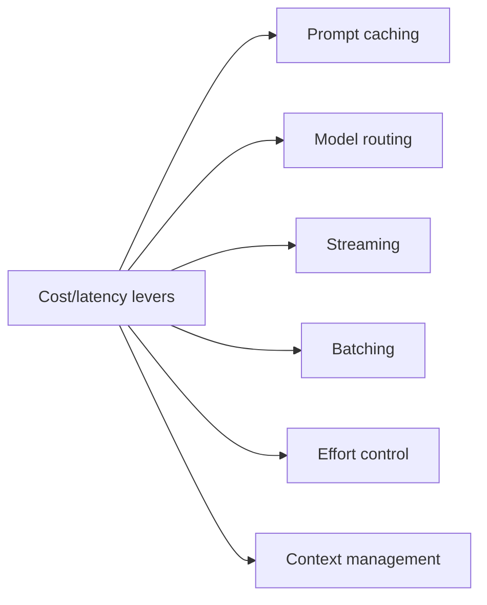
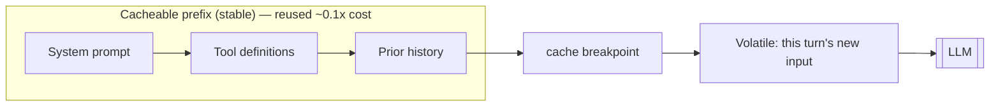
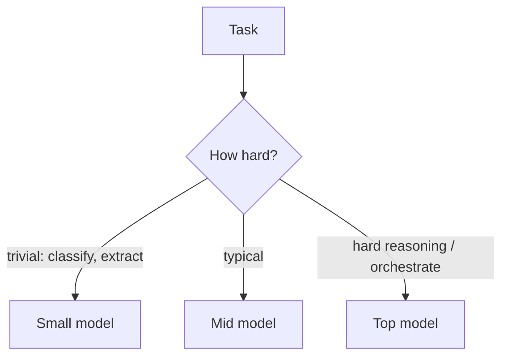
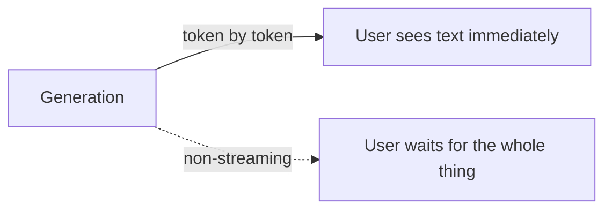
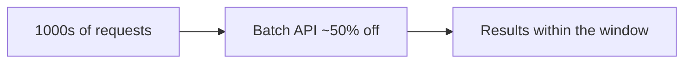
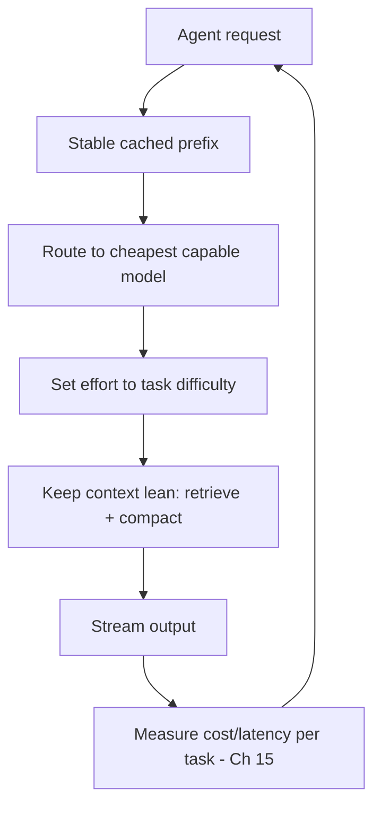

# 17 — Cost & Latency Optimization

> Agents make *many* LLM calls, so cost and latency add up fast — a naive agent can be 10× pricier and slower than it needs to be. This chapter covers the levers that make agents affordable and responsive: prompt caching, model routing, streaming, batching, controlling reasoning effort, and managing context.

---

## 1. The Problem in Plain English

You pay per token (input + output), and latency scales with output tokens and model size (Chapter 2). A single agent task might make 10–30 model calls, each re-sending a growing context. Without optimization, costs balloon and users wait. The good news: a handful of techniques cut both dramatically, often without hurting quality.

**Analogy — a taxi meter running on every errand.** If you make the driver re-read the whole map at every stop (uncached context), take the limousine for trivial errands (wrong model), and wait silently for each leg (no streaming), the fare and the wait balloon. Optimization is: reuse the map (cache), match the vehicle to the errand (routing), and show progress so it *feels* fast (streaming).

---

## 2. Prompt Caching (usually the biggest win)

Agents resend a large, mostly-unchanged prefix every turn — the system prompt, tool definitions, and prior history. **Prompt caching** stores that prefix so repeated tokens are served at a fraction of the price (cache reads cost ~10% of normal input; cache writes cost ~25% more, once) — up to ~90% savings on the cached portion, plus lower latency.

The one rule: **caching is a prefix match — any byte change anywhere in the prefix invalidates everything after it.** So:
- **Keep the prefix stable.** Put frozen content first (system prompt, tool list); never interpolate timestamps, UUIDs, or per-request IDs into it.
- **Put volatile content last**, after the cache breakpoint.
- **Order deterministically** (e.g. sort tool definitions; sort JSON keys) — non-deterministic serialization silently breaks the cache.
- **Verify** via the response's cache-read token count; if it's zero across identical-prefix requests, a "silent invalidator" (a `datetime.now()` in the system prompt, an unsorted dict) is at work.

---

## 3. Model Routing (right model for the job)

Don't send every call to the biggest model. Model tiers trade capability for price/speed (roughly: a top model costs several times a small one per token). **Route** work to the cheapest model that can do it:

- **Small/fast model** (e.g. Haiku-class): classification, routing decisions, simple extraction, cheap sub-agents.
- **Mid/strong model** (Sonnet-class): most production tasks, high-volume workloads.
- **Top model** (Opus/Fable-class): the hardest reasoning, orchestration, long-horizon agentic work.

In multi-agent systems, put the **orchestrator on a strong model and cheap sub-agents on a small one** (Chapter 10). A router (Chapter 9) can classify difficulty and dispatch accordingly.

---

## 4. Streaming (latency you *feel*)

Latency is dominated by output tokens — a long answer takes seconds to generate. **Streaming** sends tokens as they're produced, so the user sees output immediately instead of waiting for the whole response. It doesn't reduce total time, but it slashes **perceived** latency and avoids request timeouts on large outputs.

- **Always stream** anything with long input, long output, or a high `max_tokens` — it prevents hitting HTTP timeouts, and the SDK's "get final message" helper still gives you the complete response.
- For agents, stream the user-facing text; show tool-call activity ("searching…", "editing file…") so the wait is legible.

---

## 5. Batching (throughput, not latency)

For **non-urgent, high-volume** work (evals, bulk classification, offline processing), use a **batch API**: submit many requests at once, get results within a window (often ~1 hour) at a large discount (commonly ~50% off). Not for interactive requests — it trades latency for cost.

---

## 6. Control Reasoning Effort & Output Length

Thinking tokens cost money and time (Chapter 7). Modern models expose an **effort** control:
- Use **low effort** (or thinking off) for simple, latency-sensitive tasks — chat, lookups, classification.
- Use **high effort** only where the reasoning quality pays for itself — hard problems, agentic/coding work.
- Sweep effort levels on your eval set; higher effort up front can *reduce* total cost on agentic tasks (fewer wasted steps), or waste tokens on trivial ones — it's not monotonic.

Also: set a sensible **`max_tokens`** (not needlessly huge), use stop sequences, and instruct concise output where appropriate — every output token is billed and adds latency.

---

## 7. Manage Context (fewer tokens per call)

Every token in the context is paid *every call*, and agents accumulate context (Chapter 5). Trim it:
- **Compaction/summarization** — replace old turns with a summary as history grows.
- **Context editing/clearing** — prune stale tool results and thinking blocks.
- **Retrieve, don't stuff** — pull in only the relevant docs (RAG, Chapter 6) instead of dumping everything "to be safe."
- **Bound tool-result size** — a huge tool dump inflates every subsequent call; summarize it or write to a file and pass a pointer.
- **Curate tools** — a giant tool list is tokens on every call; use tool search for large libraries (Chapter 19).

Bigger context ≠ better: more tokens = more cost, more latency, and sometimes *worse* focus ("lost in the middle").

---

## 8. Putting It Together

**Measure first (Chapter 15).** Don't optimize blind — trace cost and latency per task, find the expensive/slow step, then apply the relevant lever. The biggest wins are usually **prompt caching** (agents re-send huge stable prefixes) and **not over-using the top model / high effort** on easy work.

---

## 9. Failure Scenarios

| Scenario | What happens | Fix |
|---|---|---|
| Cache never hits | A silent invalidator in the prefix (timestamp, unsorted JSON, changing tools) | Freeze the prefix; sort deterministically; verify cache-read tokens |
| Bill spikes | Loop / huge context / top model everywhere | Bound loops (Ch 3); compact context; route cheaper; alert on cost (Ch 15) |
| App feels slow | Not streaming; heavy effort on simple tasks | Stream; lower effort; smaller model |
| Timeouts on big outputs | Non-streaming high `max_tokens` | Stream; use the final-message helper |
| Quality drops after cost-cutting | Over-aggressive routing/effort reduction | Re-check evals (Ch 14); route by measured difficulty, not guesses |
| Context overflow mid-task | Unbounded history | Compaction/clearing; retrieve instead of stuff |

---

## ❌ 10. Common Mistakes

- **Not using prompt caching.** The single biggest miss for agents — you re-pay for a stable prefix every turn.
- **Breaking the cache accidentally** with volatile content or non-deterministic serialization in the prefix.
- **Top model for everything.** Route easy work to cheap models; reserve the strong model for hard steps.
- **High reasoning effort on trivial tasks.** Match effort to difficulty.
- **Never streaming.** Users wait; large outputs time out.
- **Stuffing context "to be safe."** More tokens = more cost, more latency, worse focus. Retrieve and compact.
- **Optimizing without measuring.** Trace cost/latency first; fix the actual bottleneck.

---

## 11. Check Yourself

1. Why is prompt caching especially impactful for agents, and what's the one rule that governs it?
2. How would you route work across a small, mid, and top model?
3. Does streaming reduce total latency? What does it improve?
4. When is a batch API the right tool, and when is it wrong?
5. Name two ways to reduce the tokens in each agent call.

---

## 12. Key Takeaways

- Agents make many calls over a growing context, so **cost and latency compound** — optimization can cut both by large factors.
- **Prompt caching is usually the biggest win**: keep a **stable, deterministic prefix** (system + tools + history), put volatile content last, and verify cache hits.
- **Route to the cheapest capable model** and **match reasoning effort to task difficulty**; strong model + high effort only where it pays.
- **Stream** to slash perceived latency and avoid timeouts; **batch** non-urgent high-volume work for ~50% off.
- **Keep context lean** — compact, clear, retrieve-don't-stuff, bound tool-result size, curate tools.
- **Measure per-task cost and latency first (Ch 15)**, then apply the lever that targets the actual bottleneck.

**Next:** *18 — Deploying Agents to Production* — the reliability playbook (your backend strength).
