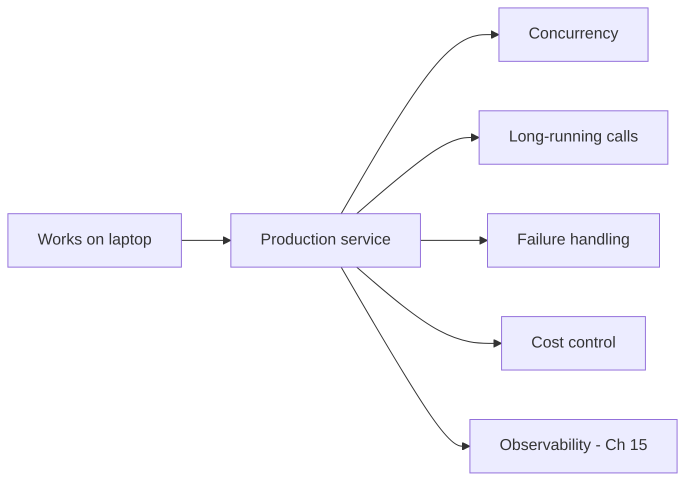
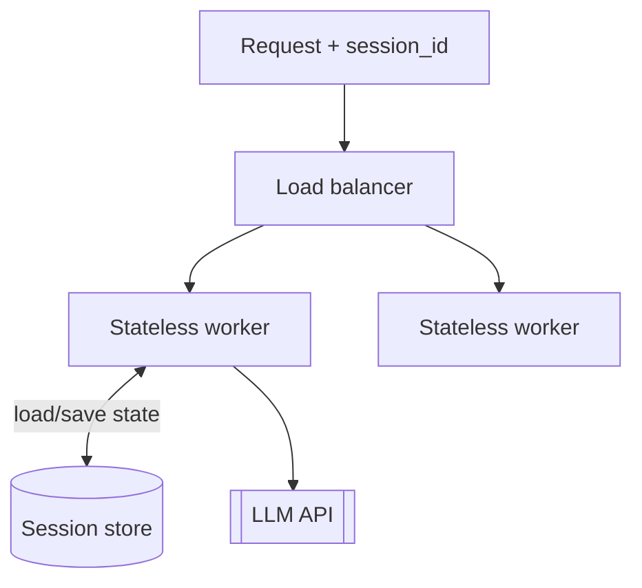
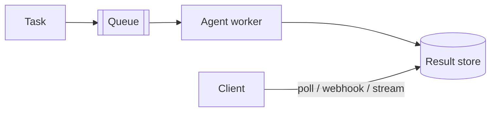
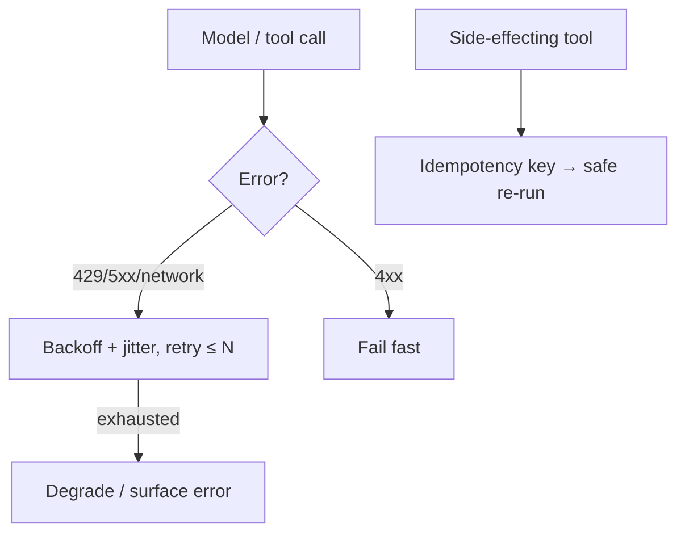
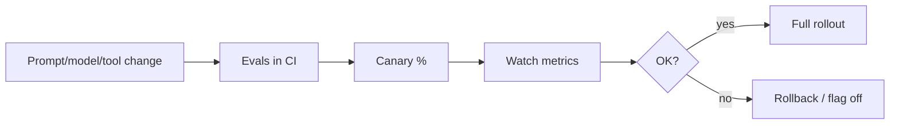

# 18 — Deploying Agents to Production

> Turning an agent that works on your laptop into a reliable service is mostly *backend engineering* — statelessness, queues, retries, idempotency, rate limits, scaling — applied to a slow, non-deterministic, expensive dependency (the LLM). This is your home turf; this chapter maps familiar backend patterns onto agents.

---

## 1. The Problem in Plain English

A demo agent runs once, in one process, for one user, and if it hiccups you just re-run it. Production means: many concurrent users, calls that take *seconds to minutes*, an external dependency that rate-limits and occasionally fails, real money per request, and a hard requirement that it keeps working unattended. None of that is AI-specific — it's distributed-systems reliability, which you already know. The twist is that your slowest, flakiest, priciest dependency is now an LLM.

**Analogy — from a food truck to a restaurant chain.** The recipe (the agent logic) is the same. What changes is *operations*: handling a full dining room (concurrency), dishes that take a long time (long-running requests), suppliers who run out (rate limits/failures), and consistent quality across locations (observability + evals). Deployment is operations, not cooking.

---

## 2. Design the Service Stateless

The LLM API is stateless — it holds no memory between calls (Chapter 2/5). Build your service the same way so it scales horizontally:

- **Keep no agent state in process memory.** Store conversation/agent state (the `messages` history, scratchpad, step count) in an external store (DB, Redis) keyed by session/conversation ID. Any worker can then pick up any request.
- **Each request reconstructs context** from the store, calls the model, persists the new state. This is exactly the stateless-app-tier pattern from system design.

---

## 3. Handle Long-Running Work with Queues

Agent tasks can run seconds to minutes (many steps, big reasoning). Holding an HTTP connection open that long is fragile. Two patterns:

- **Async / job queue:** accept the task, return a job ID immediately, run the agent on a background worker, and let the client poll or receive a webhook/stream when done. This is the standard pattern for anything non-instant.
- **Streaming:** for interactive UX, stream partial output over SSE/WebSocket so the user sees progress even though the full run is long (Chapter 17).

Managed agent platforms formalize this: you create a **session**, send events, and receive a stream of events (status, messages, tool calls) — the queue/streaming plumbing handled for you.

---

## 4. Reliability: Retries, Timeouts, Idempotency

The LLM API will occasionally rate-limit (429) or error (5xx). Treat it like any unreliable downstream:

- **Retries with exponential backoff + jitter** on 429/5xx and network errors. (SDKs do this automatically to a point; tune `max_retries`.) Don't retry 4xx client errors.
- **Timeouts** on every call; stream large outputs so you don't hit HTTP timeouts.
- **Idempotency** — agent steps can have side effects (Chapter 4). If a step is retried, don't double-charge or double-send. Use idempotency keys on external actions; make tools safe to re-run.
- **Graceful degradation** — if the model/tool is down, fail with a clear message or a fallback, don't hang.
- **Bounds everywhere** — max steps, max tokens, max cost/time per task (Chapter 3). An unbounded agent in prod is a runaway bill.

---

## 5. Scaling & Cost Control

- **Horizontal scale the stateless workers** behind a queue/load balancer; state lives in the store (§2).
- **Concurrency is bounded by API rate limits**, not just your CPUs — track your tokens-per-minute / requests-per-minute limits and back-pressure when near them (a rate limiter, Chapter connections to system design).
- **Cost guardrails:** per-user and global budget caps; alert on cost outliers (Chapter 15). A single looping agent can blow the budget — bound and monitor it.
- **Apply Chapter 17 levers in prod:** prompt caching (huge at scale), model routing, batching for offline jobs.

---

## 6. Ship Safely: Versioning, Rollout, Evals-in-CI

Prompts and models are part of your deployable surface — treat them like code:

- **Version prompts, tool definitions, and model IDs** in source control; changing any of them changes behavior.
- **Run evals in CI** (Chapter 14) before deploy; block regressions.
- **Canary / staged rollout** — release to a small % first, watch metrics (quality, cost, latency, errors), then ramp.
- **Feature-flag risky changes** so you can roll back instantly.
- **Pin the model version** where reproducibility matters; re-run evals before adopting a new model (behavior shifts across versions — Chapter 8).

---

## 7. Operate It: Observability, Guardrails, HITL

Everything from the last three chapters is a *production* requirement, not a nice-to-have:
- **Observability (Ch 15):** trace every run; dashboards + alerts for cost, latency, error rate, quality.
- **Guardrails & security (Ch 16):** input/output filters, least privilege, sandboxed tools, secrets in a vault.
- **Human-in-the-loop (Ch 16):** approval gates on irreversible actions, wired into your workflow (queue a task for human review).
- **Feedback loop:** capture user thumbs/escalations and production failures → new eval cases → improve.

---

## 8. Failure Scenarios

| Scenario | What happens | Handling |
|---|---|---|
| Worker crashes mid-run | Task lost | Externalize state; make steps resumable/idempotent; requeue |
| API rate limit under load | Cascading 429s | Back-pressure; queue; respect retry-after; provision limits |
| Retried step double-charges | Duplicate side effect | Idempotency keys; safe-to-re-run tools |
| Runaway loop in prod | Budget blowout | Max steps/cost/time bounds; cost alerts (Ch 15) |
| New model version changes behavior | Silent quality regression | Pin version; re-run evals before adopting |
| Long run drops HTTP connection | Timeout/lost result | Async queue + polling/streaming |
| Cost spike from one tenant | Unfair usage / bill shock | Per-user rate limits and budget caps |

---

## ❌ 9. Common Mistakes

- **Keeping agent state in process memory.** Breaks horizontal scaling and loses work on crashes — externalize it.
- **Synchronous long HTTP requests.** Use a queue + async / streaming.
- **No idempotency on side-effecting steps.** Retries double-charge or double-send.
- **No per-task bounds or cost caps.** A loop in prod is a runaway bill.
- **Treating prompts/models as not-deployable.** Version them; run evals in CI; canary changes.
- **Skipping observability/guardrails "for now."** They're production requirements, not extras.
- **Adopting a new model without re-evaluating.** Behavior shifts between versions.

---

## 10. Check Yourself

1. Why design the agent service stateless, and where does state go?
2. Why use a queue for agent tasks instead of a long synchronous request?
3. What makes idempotency important for agent steps specifically?
4. Name three production bounds you must set on an agent.
5. Why must prompts and model IDs be versioned and go through CI evals?

---

## 11. Key Takeaways

- Deploying an agent is **backend reliability engineering** applied to a slow, flaky, costly dependency — your existing strength.
- **Design stateless**: externalize conversation/agent state, key by session, so any worker handles any request and crashes don't lose work.
- **Use queues/async (and streaming)** for long-running runs; managed platforms provide sessions/event streams for this.
- **Reliability = retries+backoff, timeouts, idempotency on side effects, graceful degradation, and hard bounds** (steps/tokens/cost/time).
- **Scale stateless workers behind rate-limit-aware back-pressure**, with **cost caps and alerts**.
- **Ship prompts/models like code**: version, eval in CI, canary, feature-flag, pin versions, re-eval on upgrades.
- **Observability, guardrails, and HITL are production requirements** — plus a feedback loop from prod failures into evals.

**Next:** *19 — Advanced: Context Engineering & Long-Horizon Tasks* — the frontier skill.
