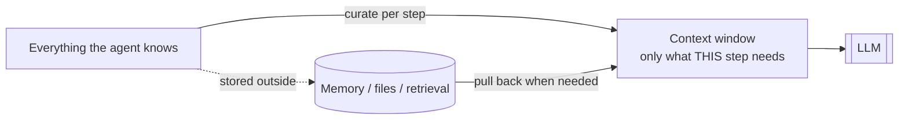
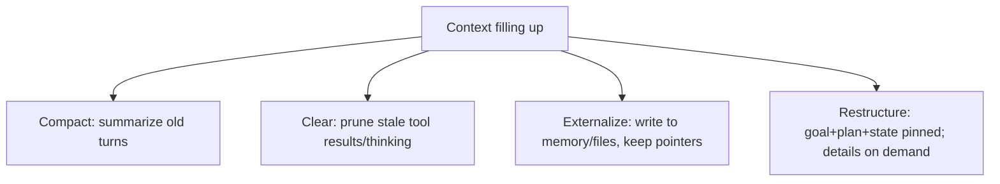
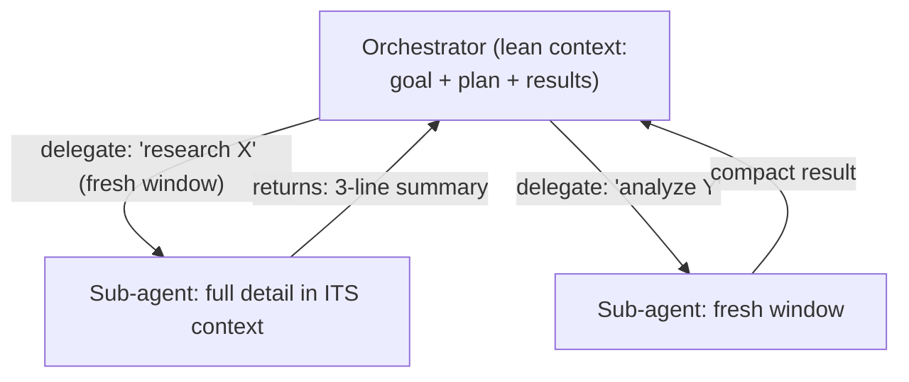
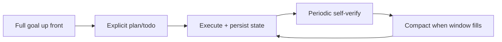

# 19 — Advanced: Context Engineering & Long-Horizon Tasks

> The frontier skill in agent building isn't prompting — it's **context engineering**: deciding exactly what goes into the model's limited context window at each step. This chapter covers managing context over long-horizon tasks, sub-agent orchestration for context isolation, memory compaction, and the techniques that let agents run for hours without falling apart.

---

## 1. The Problem in Plain English

By now you know the two hard truths: the model's only knowledge each turn is what's in its context window (Chapter 2), and that window is finite and fills up as an agent works (Chapter 5). For a short task this is fine. For a **long-horizon task** — a multi-hour coding job, a deep research project, an overnight agent run — the context becomes the bottleneck: it overflows, or fills with stale junk that drowns out what matters, and the agent loses the plot.

**Context engineering** is the discipline of curating that window: at every step, put in what the model *needs now* and keep out everything else. It's a step beyond prompt engineering (writing good instructions) — it's managing the *entire* set of tokens the model sees, dynamically, across a long run.

**Analogy — a surgeon's tray, not the whole supply room.** A great surgical nurse doesn't dump every instrument on the tray — they place exactly the tools needed for *this* step, and clear away the ones from the last step. The context window is the tray; context engineering is the nurse. A cluttered tray is as dangerous as an empty one.

---

## 2. Why "More Context" Is Not the Answer

It's tempting to solve overflow by using a bigger window and stuffing everything in. That backfires:
- **Cost & latency** scale with tokens — every extra token is paid every call (Chapter 17).
- **"Lost in the middle"** — models attend best to the start and end; facts buried in a huge context get ignored (Chapter 2).
- **Distraction** — irrelevant history and stale tool results actively degrade reasoning; the model chases noise.

So the goal isn't *maximum* context, it's the **minimum sufficient** context — the smallest set of tokens that lets the model take the right next step. Treat context as a **budget you spend deliberately.**

---

## 3. Core Techniques

### 3.1 Compaction (summarize history)
When the running history gets long, replace old turns with an LLM-generated **summary** that preserves the essentials (decisions made, current state, open threads) and drops the verbatim detail. The agent keeps its "memory" of the task at a fraction of the tokens. (Providers offer server-side compaction that does this automatically near the limit — you must pass the returned compaction state back on the next call.)

### 3.2 Context editing / clearing (prune, don't summarize)
Remove stale, no-longer-relevant blocks outright — old tool results, completed thinking. Different from compaction: clearing *deletes*, compaction *condenses*. Use clearing when old tool outputs simply don't matter anymore.

### 3.3 Externalize + retrieve (offload to memory)
Write details to an external store (files, a scratchpad, a memory store, a vector DB) and keep only **pointers** in context; pull specifics back in on demand (RAG, Chapter 6). This is how agents "remember" far more than fits in the window. Giving the agent a notes/memory file it maintains is a cheap, high-leverage version (Chapter 5).

### 3.4 Structure the context deliberately
Lead with the goal and current plan; put the most relevant material near the top or bottom (not the middle); keep a compact, always-present "working state" (the task, the plan, what's done, what's next) so the agent never loses the thread even as details rotate through.

---

## 4. Sub-Agents for Context Isolation

The most powerful context-engineering move: **give a subtask its own fresh context** by delegating to a sub-agent (Chapter 10). The sub-agent works in a clean window with only *its* task's information, returns a **compact result**, and its noisy intermediate steps never pollute the orchestrator's context.

This is why deep-research and large-codebase agents scale: the orchestrator holds only the plan and distilled results, while each sub-agent burns its own context on the messy details and hands back just the answer. Context isolation, not just parallelism, is the point.

---

## 5. Patterns for Long-Horizon Runs

Running for hours/many steps needs more than trimming:

- **Give the full goal up front.** Frontier models do their best long-horizon work when handed a complete, well-specified goal in one shot (plus a plan), rather than dribbled requirements — they plan better and waste fewer steps.
- **Maintain an explicit plan/todo the agent updates** — it's the durable spine that survives compaction; the agent re-reads it to stay oriented.
- **Persist state to disk/memory**, so a long run is resumable and survives compaction/restart (Chapter 18).
- **Self-verify periodically** — have the agent (or a fresh-context verifier sub-agent) check progress against the spec on a cadence, catching drift early (Chapter 7/9).
- **Ground progress claims in evidence** — require the agent to check claims against actual tool results before reporting "done," which curbs fabricated status on long runs.
- **Scale tools with the task** — for huge tool libraries, use **tool search** so only relevant tool schemas load into context instead of all of them.
- **Watch for context-limit anxiety / early stopping** — very long runs can make an agent try to "wrap up" or ask permission it doesn't need; explicit instructions ("you have ample context; continue until the task is complete") keep it going.

---

## 6. Failure Scenarios

| Scenario | What happens | Handling |
|---|---|---|
| Context overflows mid-run | Errors or forgets the goal | Compact/clear proactively; pin goal+plan; externalize |
| "Lost in the middle" | Ignores a key fact buried in huge context | Restructure: important info at start/end; retrieve less, more relevant |
| Stale tool results distract | Chases irrelevant noise | Clear old tool results (context editing) |
| Sub-agent returns a wall of text | Re-pollutes orchestrator context | Require compact, structured summaries from sub-agents |
| Agent loses the plot on a long run | No durable spine | Maintain an explicit plan/todo the agent re-reads |
| Fabricated progress | Reports "done" without doing it | Require evidence-grounded claims; verifier sub-agent |
| Agent stops early / "runs out of context" worry | Premature wrap-up | Persist state; instruct to continue; resume mechanism |

---

## ❌ 7. Common Mistakes

- **Stuffing the window "to be safe."** More context = more cost, latency, and distraction; aim for *minimum sufficient*.
- **Relying on a bigger window instead of managing it.** Big windows still suffer lost-in-the-middle and cost.
- **Letting sub-agents dump raw detail back.** Insist on compact results — context isolation is the whole point.
- **No durable plan/state.** Compaction or a restart wipes an agent with nothing to re-anchor on.
- **Dribbling the goal across turns** for long-horizon work. Specify it fully up front.
- **Trusting long-run self-reports.** Ground progress in tool evidence; verify periodically.
- **Loading every tool every call.** Use tool search for large libraries.

---

## 8. Check Yourself

1. What is context engineering, and how is it more than prompt engineering?
2. Why isn't "just use a bigger context window" the fix?
3. Compaction vs context clearing — what's the difference?
4. How do sub-agents help with *context* (not just parallelism)?
5. Name three techniques that keep a multi-hour agent run coherent.

---

## 9. Key Takeaways

- **Context engineering — curating exactly what's in the window at each step — is the frontier agent skill**, and the key to long-horizon tasks.
- Aim for the **minimum sufficient context**, not the maximum: more tokens = more cost, latency, and "lost in the middle" distraction.
- Manage a growing context with **compaction (summarize), context clearing (prune), externalize+retrieve (offload to memory), and deliberate structure** (pin goal/plan; important info at edges).
- **Sub-agents isolate context**: each works in a fresh window and returns a compact result, keeping the orchestrator lean — this is why deep-research/large-codebase agents scale.
- Long-horizon runs need a **full up-front goal, an explicit maintained plan, persisted resumable state, periodic self-verification, and evidence-grounded progress**.
- Treat context as a **budget spent deliberately** — the discipline that separates toy agents from ones that run for hours.

**Next:** *20 — Capstone Projects* — build these to prove (to yourself) you've mastered it.
