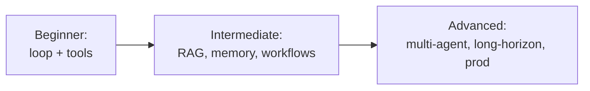
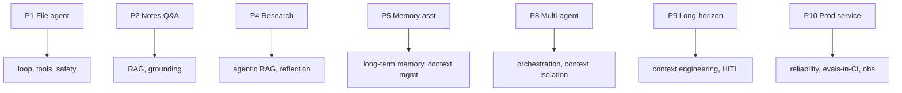

# 20 — Capstone Projects

> You don't understand agents until you've built one that got stuck in a loop, hallucinated a tool call, or blew its context — and you fixed it. These projects, from beginner to advanced, force you to apply every concept in the course. Build at least one end to end.

---

## How to Use This Chapter

Pick a project at your level and **build it with the raw SDK first** (Chapter 13's pattern), then optionally refactor onto a framework (Chapter 12). For each project below you get: the goal, the concepts it exercises, a suggested tool set, and "done when" criteria. Treat "done when" as your eval spec (Chapter 14).

> **General rule:** start with the smallest version that runs end to end, then add one capability at a time. A working 50-line agent beats a half-built 500-line one.

---

## Beginner Projects (nail the fundamentals)

### P1 — CLI File/Coding Agent
Extend Chapter 13's agent into something you'd actually use.
- **Goal:** answer questions about a codebase and make small edits from natural-language requests.
- **Concepts:** the loop (Ch 3), tool use (Ch 4), system prompt (Ch 8), short-term memory (Ch 5), bounds & safety (Ch 3, 16).
- **Tools:** `list_files`, `read_file`, `write_file`, `run_tests`.
- **Done when:** given "make the failing test pass," it reads, edits, re-runs tests, and stops when green — without you specifying the steps; refuses paths outside the sandbox; never loops past `max_steps`.

### P2 — Q&A Bot over Your Notes (mini-RAG)
- **Goal:** answer questions grounded in a folder of your own markdown/PDF notes, with citations.
- **Concepts:** RAG (Ch 6), grounding & guardrails in the prompt (Ch 8), structured output (Ch 2).
- **Tools/pieces:** chunk + embed the notes → vector store → `search_notes(query)` tool → answer only from retrieved chunks, citing the source file.
- **Done when:** it answers from your notes (not training memory), cites the file for each claim, and says "I don't know" when the notes don't cover it.

### P3 — Support Ticket Router
- **Goal:** classify an incoming message and route it to the right handler (billing / technical / refund / escalate).
- **Concepts:** routing workflow (Ch 9), structured output (Ch 2), evals (Ch 14).
- **Done when:** it outputs a valid category as structured JSON, routes to the matching prompt, and you have a 30-case eval measuring routing accuracy.

---

## Intermediate Projects (compose the patterns)

### P4 — Research Assistant (web + synthesis)
- **Goal:** given a question, search the web, read sources, and produce a cited summary.
- **Concepts:** agentic RAG / tools (Ch 4, 6), planning & ReAct (Ch 7), reflection (Ch 7/9), cost/latency (Ch 17), observability (Ch 15).
- **Tools:** `web_search`, `web_fetch` (server-side tools), plus a scratchpad.
- **Done when:** it decides its own searches, reads multiple sources, synthesizes with citations, self-critiques the draft once, and you can trace every step and its cost.

### P5 — Personal Assistant with Memory
- **Goal:** a chat agent that remembers facts about you across sessions (preferences, projects, people).
- **Concepts:** long-term memory (Ch 5), a memory tool, context management (Ch 5/19), prompt design (Ch 8).
- **Tools:** `remember(note)`, `recall(query)` backed by a store/file; conversation history for short-term memory.
- **Done when:** it writes durable facts, retrieves them in a *new* session, and doesn't overflow its context on a long conversation (compaction kicks in).

### P6 — Data-Analysis Agent (code execution)
- **Goal:** load a CSV and answer analytical questions, generating charts.
- **Concepts:** code-execution tool (Ch 4), sandboxing (Ch 16), structured output, evals.
- **Tools:** a sandboxed `code_execution` (or a `run_python` tool you isolate).
- **Done when:** it writes and runs code to compute answers (not guessing numbers), handles a bad query gracefully, and never escapes the sandbox.

### P7 — Self-Improving Writer (evaluator-optimizer)
- **Goal:** draft content, grade it against a rubric, and revise until it passes.
- **Concepts:** evaluator-optimizer workflow (Ch 9), LLM-as-judge (Ch 14), bounded loops (Ch 3).
- **Done when:** a separate judge scores the draft against an explicit rubric, the writer revises on feedback, and the loop terminates on pass or a max-iteration bound.

---

## Advanced Projects (the real thing)

### P8 — Multi-Agent Research/Build System
- **Goal:** an orchestrator that decomposes a big task and delegates to specialized sub-agents in parallel, then synthesizes.
- **Concepts:** multi-agent (Ch 10), orchestrator-workers (Ch 9), context isolation via sub-agents (Ch 19), cost control (Ch 17).
- **Done when:** the orchestrator holds only the plan + distilled results, sub-agents run in fresh contexts and return compact summaries, and you can justify (with traces) that multi-agent beat a single agent for this task.

### P9 — Long-Horizon Autonomous Agent
- **Goal:** an agent that runs a large multi-step job unattended (e.g. migrate a pattern across a codebase, or a multi-stage research report).
- **Concepts:** context engineering (Ch 19), plan + persisted state (Ch 18/19), periodic self-verification (Ch 7), guardrails + HITL on risky steps (Ch 16), observability (Ch 15).
- **Done when:** it maintains an explicit plan, compacts context as it grows, persists resumable state, verifies its own progress, gates destructive actions, and finishes a job too big for one context window.

### P10 — Production-Grade Agent Service
- **Goal:** deploy one of the above as a real service.
- **Concepts:** stateless design, queues/streaming, retries+idempotency, rate limits, cost caps (Ch 18); evals in CI (Ch 14); full observability + guardrails (Ch 15/16).
- **Done when:** it's stateless + horizontally scalable, handles concurrent users and API failures without losing work, has cost/latency dashboards and alerts, blocks regressions via CI evals, and gates irreversible actions with human approval.

---

## Project → Concept Map

---

## What "Mastery" Looks Like After These

You can call yourself competent when you've built projects that made you:
- **Debug a loop** that wouldn't stop (→ you learned bounds and trace-reading).
- **Fix a hallucinated tool call** (→ you learned validation and grounding).
- **Handle a context overflow** on a long run (→ you learned compaction and sub-agent isolation).
- **Cut a cost blowup** (→ you learned caching, routing, effort control).
- **Catch a prompt-injection** in fetched content (→ you learned guardrails and least privilege).

Each of those is a scar you only get by building. The reading (Chapters 1–19) makes the fixes obvious; the building makes them yours.

---

## Key Takeaways

- **Build at least one project end to end** — reading isn't understanding until you've debugged a real agent.
- Start **small and raw** (Chapter 13's pattern), add one capability at a time, and use each project's "done when" as your **eval spec**.
- The ladder: **beginner** (loop + tools + RAG basics) → **intermediate** (workflows, memory, code exec, evaluator-optimizer) → **advanced** (multi-agent, long-horizon, production).
- Mastery shows up as **fixed scars**: stopped a loop, grounded a hallucination, tamed context, cut cost, blocked an injection.

**Next:** *21 — Glossary* — every term in one place.
