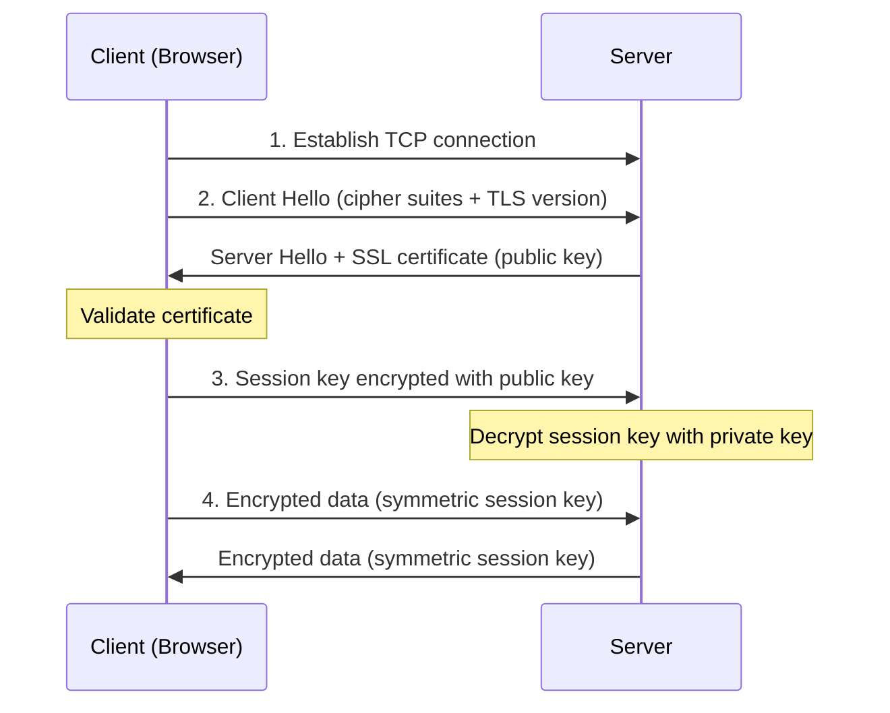
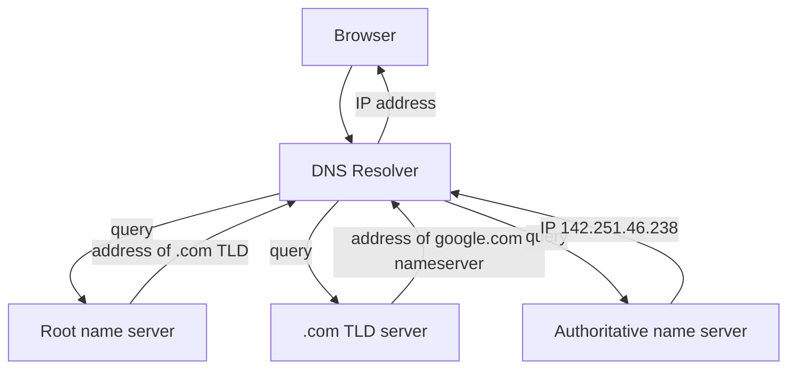
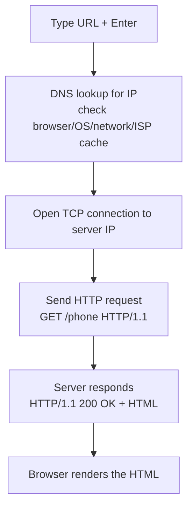
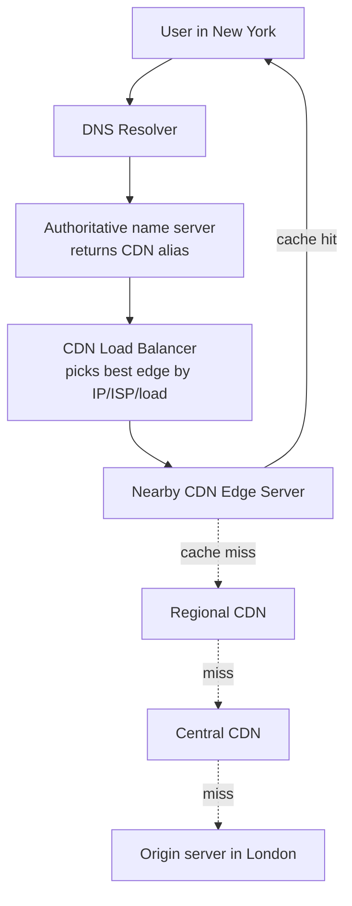
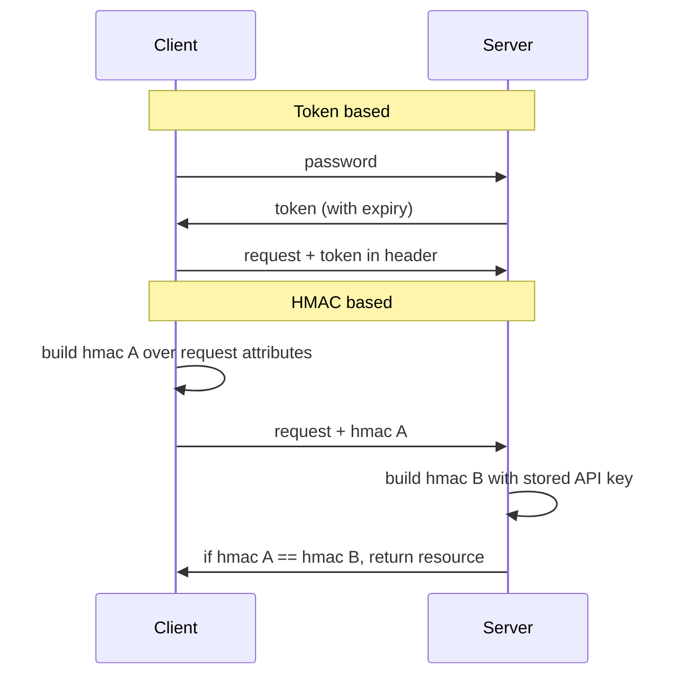
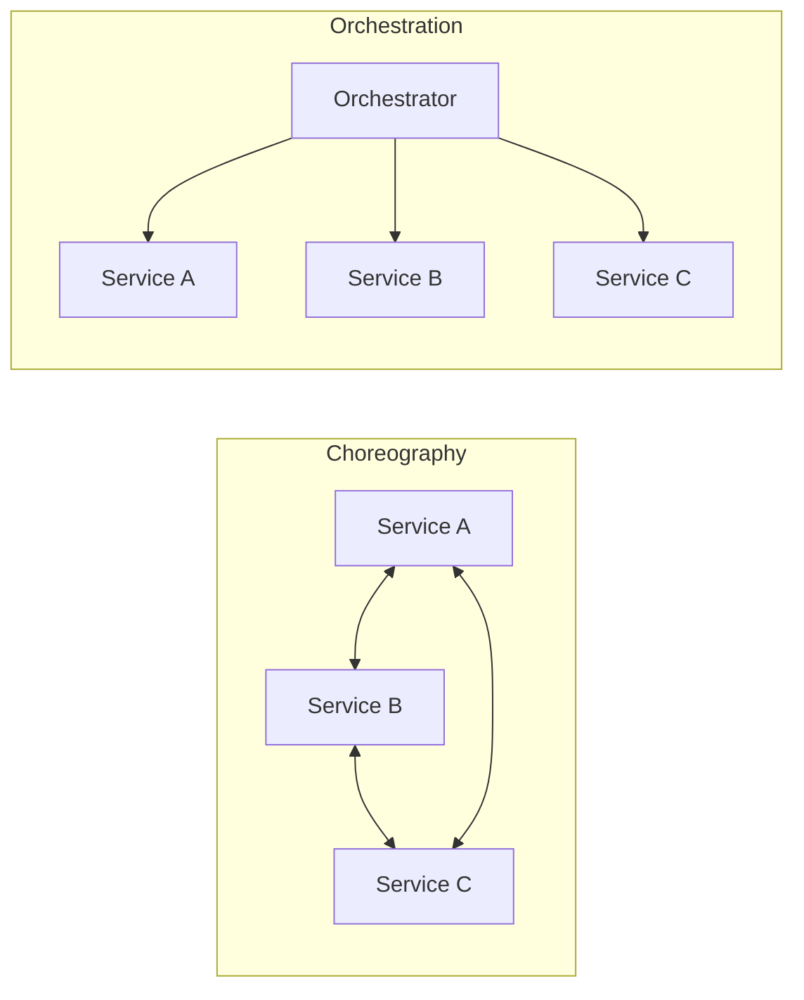

# Networking & Web Fundamentals · ByteByteGo

Simple notes on how the web moves data around: secure connections, the HTTP protocol family, DNS, browsers, CDNs, and the different ways services and APIs talk to each other.

## How HTTPS Works

HTTPS is just HTTP with encryption added on top using TLS (Transport Layer Security). If someone steals the data on the way, all they get is scrambled binary. It uses two kinds of encryption together: slow "asymmetric" encryption (public/private key) only to safely agree on a shared secret, then fast "symmetric" encryption for the actual data. This switch happens for two reasons: security (asymmetric goes only one way, so anyone with the public key could decrypt server-to-client data) and speed (asymmetric encryption is heavy and bad for long sessions).

## HTTP 1.0 → 1.1 → 2.0 → 3.0 (QUIC)

Each generation of HTTP fixes a problem from the last one.
- **HTTP 1.0** (1996): every request to the same server needs a brand-new TCP connection.
- **HTTP 1.1** (1997): a TCP connection can stay open and be reused (persistent connection). But it still has **head-of-line (HOL) blocking**: once the browser's allowed parallel requests are all used up, new requests must wait for older ones to finish.
- **HTTP 2.0** (2015): introduces **streams** and **request multiplexing**, so many HTTP exchanges share one TCP connection and don't need to arrive in order. This removes HOL blocking at the application layer, but HOL still exists at the TCP (transport) layer.
- **HTTP 3.0** (first draft 2020): uses **QUIC** (built on UDP) instead of TCP. Streams are first-class at the transport layer and are delivered independently, so packet loss on one stream usually doesn't hold up the others. This removes HOL blocking at the transport layer too, with no extra handshakes/slow-starts for new streams.

## Domain Name System (DNS) Lookup

DNS is like an address book: it turns a human name (google.com) into a machine IP address (142.251.46.238). DNS servers are arranged in a hierarchy with 3 levels: **Root name servers** (there are 13 logical ones globally, they point to TLD servers), **TLD name servers** (like .com, .org, .us), and **Authoritative name servers** (which give the real answer; you register these with a registrar like GoDaddy or Namecheap). A lookup usually takes 20–120 milliseconds.

## What Happens When You Type a URL Into Your Browser?

A URL like `https://example.com/product/electric/phone` has 4 parts: **scheme** (`https://`, tells the browser to use HTTPS), **domain** (`example.com`), **path** (`product/electric`), and **resource** (`phone`). After you hit Enter, the browser finds the IP, opens a connection, asks for the page, and draws it.

## How Modern Browsers Work

Modern browsers (like Chrome) are made of multiple processes and components working together to fetch, parse, and paint web pages. Google published an excellent 4-part series, "Inside look at modern web browser," that walks through how the browser process, renderer process, and other pieces coordinate to turn a URL into pixels on your screen.

## CDN (Content Delivery Network)

A CDN is a set of servers spread out geographically (called **edge servers**) that deliver static and dynamic content quickly. If Bob in New York visits a site hosted in London, going all the way to London is slow, so the content is served from a nearby CDN edge server instead. The trick is done mostly with DNS: the authoritative name server returns a CNAME alias pointing to the CDN, and the CDN's load balancer picks the best edge server based on the user's IP, ISP, the content, and server load. If an edge server doesn't have the content, it goes up to a regional CDN, then a central CDN, and finally to the origin server.

## SOAP vs REST vs GraphQL vs RPC

These are different **API styles** for exchanging data between systems, released over time, each with its own patterns for standardizing that exchange.
- **SOAP**: an older, strict, XML-based protocol; common in enterprise and financial systems that need formal contracts.
- **REST**: uses standard HTTP verbs on resources; the most common style for public web APIs.
- **GraphQL**: lets the client ask for exactly the fields it wants in one request, avoiding over- or under-fetching.
- **RPC**: calls a remote function as if it were local; good for fast internal service-to-service communication.

## How to Design a Secure Web API Access

When you open an API to users, every call must be **authenticated** so the caller really is who they claim to be. Two common approaches:

**Token based**: the user sends their password to an Authentication Server, which returns a token with an expiry time. The client then attaches that token in the HTTP header on each request until it expires.

**HMAC based**: the server issues a Public APP ID (public key) and an API Key (private key). The client builds an HMAC signature (using a hash like SHA256 or MD5) over the request attributes and sends it in the header ("hmac A"). The server recreates the signature on its side using its stored API key ("hmac B") and compares the two; if they match, it returns the resource. Including a request timestamp helps protect against replayed requests and ensures data integrity.

## How Microservices Collaborate and Interact

There are two ways services work together: **choreography** and **orchestration**.

**Choreography** is point-to-point: services react to each other's messages using agreed rules, with no central boss (like dancers following a shared routine).

**Orchestration** uses a central **orchestrator** that invokes and combines services and manages transactions (like a conductor leading an orchestra). Its benefits are reliability (built-in transaction management and error handling) and scalability (to add a service you only change the orchestrator's rules). Its limits are higher latency (everything goes through one hub) and a single point of failure (so the orchestrator must be highly available). A real example is **Netflix Conductor**.

