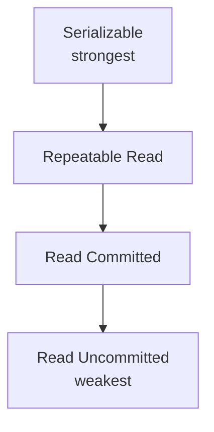
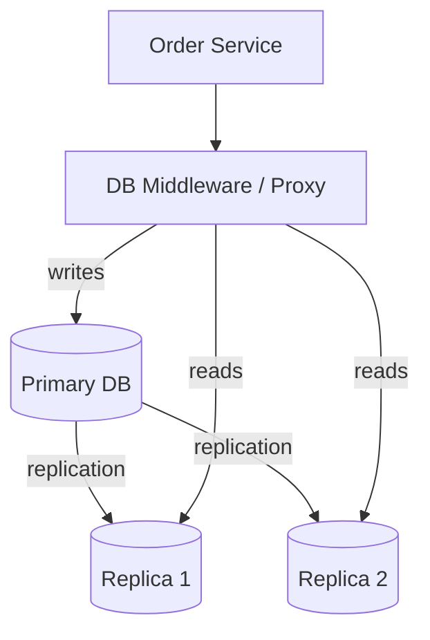
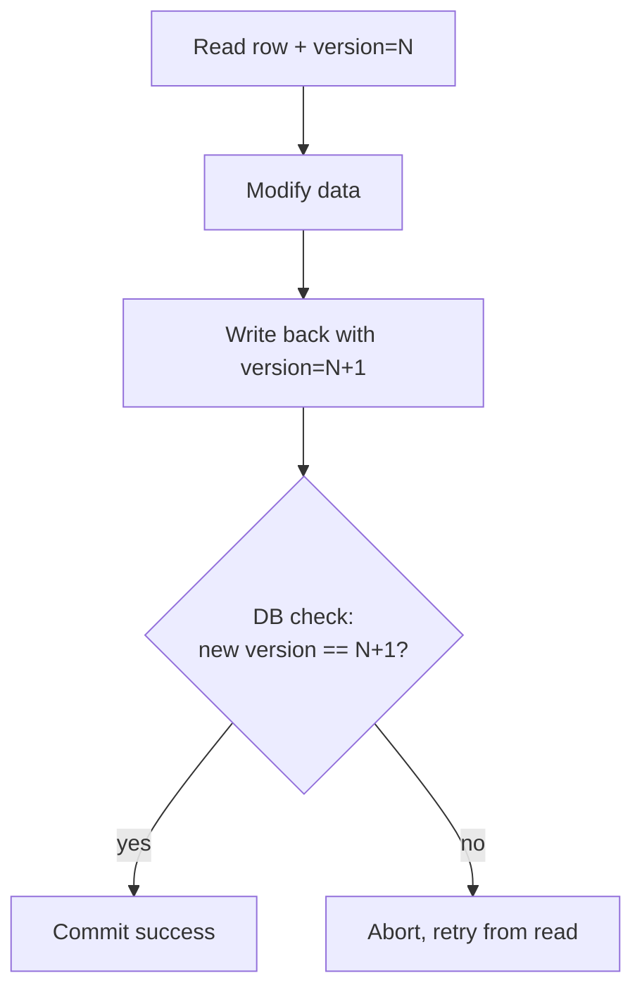
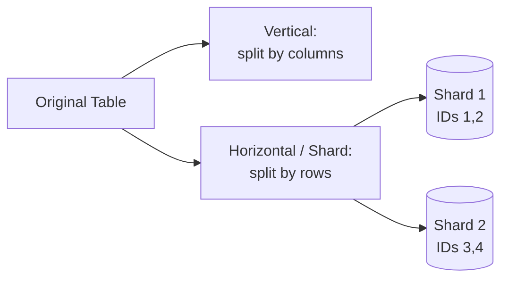
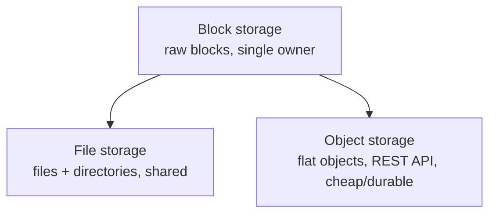
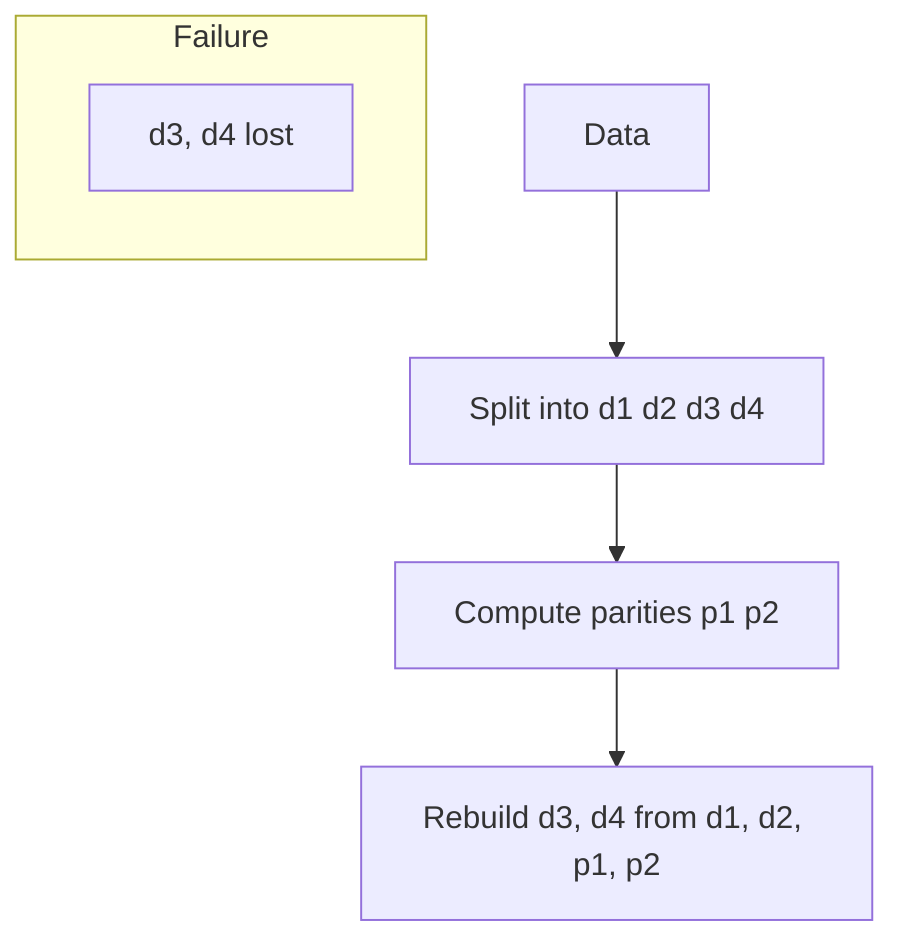

# Databases & Storage · ByteByteGo

Simple notes on database behavior and storage systems: isolation levels, picking a database, read replicas, locking, partitioning, and the main storage types.

## Database Isolation Levels

Isolation lets a transaction run as if no other transactions are happening at the same time. There are four levels, from strongest to weakest:
- **Serializable**: the highest level; concurrent transactions run as if in sequence, one after another.
- **Repeatable Read**: data you read stays the same for the whole transaction, even if others change it.
- **Read Committed**: you can only read another transaction's changes after it commits.
- **Read Uncommitted**: you can read another transaction's changes even before it commits.

Isolation is enforced by **MVCC (Multi-Version Concurrency Control)** and locks. In MVCC each row has hidden `transaction_id` and `roll_pointer` columns. When a transaction starts it gets a Read View. If transaction A changes a balance but hasn't committed, transaction B (which started with its own Read View) still reads the old committed value (e.g. balance=100), even after A commits, because B keeps reading against the snapshot from when B started.

## How to Choose the Right Database

Picking a database is a long-term commitment, so choose the right one for the job. First, know your data shape: **structured** (SQL table schema), **semi-structured** (JSON, XML), or **unstructured** (Blob). Then match it to a database category. Common categories include: Relational, Columnar, Key-value, In-memory, Wide column, Time Series, Immutable ledger, Geospatial, Graph, Document, Text search, and Blob.

## Read Replica Pattern

In this common setup, all writes (insert, delete, update) go to the **primary** database, and reads go to **read replicas**. This spreads read load and increases write throughput. The big problem is **replication lag**: replicas can be seconds or minutes behind, so if Alice checks an order right after placing it, the replica may not show it yet ("read-after-write" consistency problem).

Ways to fix the lag:
1. Send latency-sensitive reads to the primary.
2. Route reads that immediately follow a write to the primary.
3. Check whether a replica is caught up; if yes read the replica, otherwise read from the primary or fail.

You can route in two ways: put routing logic in the app code, or use **database middleware** that sits between the app and the databases as a proxy (it speaks the standard MySQL network protocol). Middleware simplifies app code and eases migration, but adds complexity, needs high availability (no single point of failure), and adds network latency.

## Optimistic Locking

Optimistic locking (optimistic concurrency control) lets many users try to update the same row at once, without locking the database. It's usually done with a **version number** (preferred over a timestamp, since server clocks drift). Steps: add a `version` column; before updating, read the current version; on update, increase version by 1 and write it back; a check ensures the new version is exactly current+1, otherwise the transaction aborts and the user retries.

It's usually faster than pessimistic locking because nothing is locked. But under **high concurrency** it degrades badly: imagine many clients booking the same hotel room; they all read the same version, only one write succeeds, and everyone else fails the version check and must retry, round after round. The result is correct but the user experience is poor.

## Vertical vs Horizontal Partitioning

- **Vertical partitioning**: move some **columns** into new tables. Same number of rows, fewer columns per table.
- **Horizontal partitioning (sharding)**: split a table into smaller tables. Same columns, fewer rows per table. Each shard is a separate data store.

For sharding, a **routing algorithm** decides which shard holds a row:
- **Range-based**: use ordered columns (integers, timestamps). E.g. User IDs 1–2 in shard 1, 3–4 in shard 2.
- **Hash-based**: apply a hash function. E.g. `User ID mod 2` puts IDs 1,3 in shard 1 and 2,4 in shard 2.

**Benefits**: horizontal scaling (add machines to spread load) and shorter response time (queries scan fewer rows). **Drawbacks**: `ORDER BY` is harder (you fetch from multiple shards and sort in app code) and **uneven distribution** where some shards get more data (hotspots).

## Block, File, and Object Storage

Three broad storage categories, each a higher-level abstraction than the last:

**Block storage** (came first, 1960s): presents raw blocks to a server as a volume. Most flexible: the server can format it as a file system or let an app (database, VM engine) manage the blocks directly for maximum performance. Includes attached HDD/SSD, or network block storage over Fibre Channel (FC) or iSCSI. It is owned by a single server, not shared.

**File storage**: built on top of block storage. Stores data as files in a hierarchical directory structure and hides block management. Many servers can share it using protocols like SMB/CIFS and NFS. Great for sharing lots of files within an organization.

**Object storage** (newest): trades performance for high durability, huge scale, and low cost. Stores everything as objects in a **flat** structure (no directory tree), accessed via a RESTful API. It's relatively slow and aimed at "cold" data (archival, backup). Examples: AWS S3, Google Cloud Storage, Azure Blob storage.

## Erasure Coding

Erasure coding is a technique (used in object storage like S3) to keep data durable while using much less space than replication. Data is chunked and spread across servers, and math-based **parities** are added so lost chunks can be rebuilt. Example **4 + 2**: split data into 4 chunks (d1–d4), compute 2 parities (p1, p2) using formulas like `p1 = d1 + 2*d2 - d3 + 4*d4`. If d3 and d4 are lost, the formulas rebuild them from d1, d2, p1, p2.

**Space**: one parity block per two data chunks means ~50% storage overhead, versus 200% overhead for 3-copy replication. **Durability**: assuming a 0.81% annual node failure rate, Backblaze's calculation shows erasure coding reaches **11 nines** durability vs **6 nines** for 3-copy replication.

## Why Is a Solid-State Drive (SSD) Fast?

An SSD reads up to 10x faster and writes up to 20x faster than a hard disk drive (HDD). An SSD is flash-memory based: bits are stored in cells made of floating-gate transistors, with **no moving parts** (unlike an HDD). Commands come from the host interface (SATA or PCIe) to the SSD controller, which passes them to the flash controller; the SSD also has embedded RAM for caching and mapping. The key speed reason: the controller drives many NAND flash particles **in parallel** over multiple channels, so it can write many pages at once, while an HDD has a single head that reads one place at a time. Every time a host page is written, the controller picks a physical page and records the mapping so later reads know where to look.
