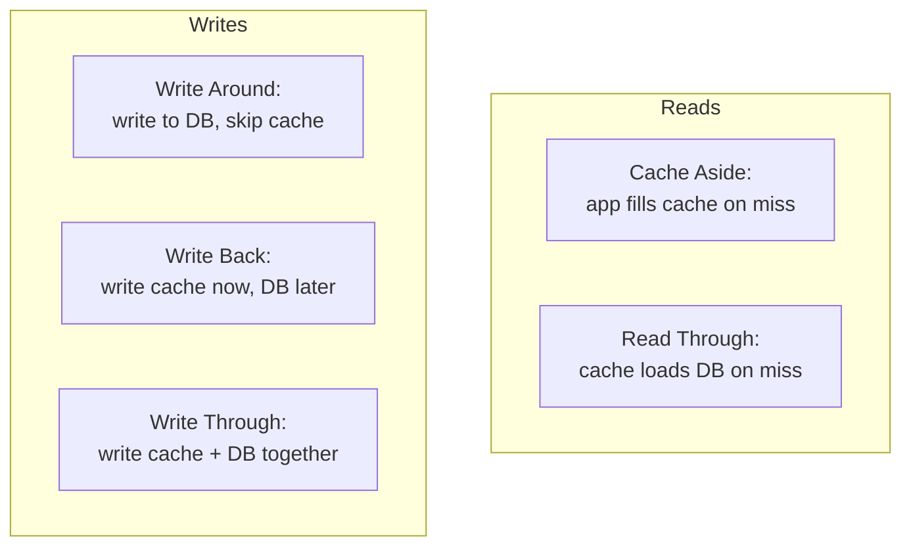
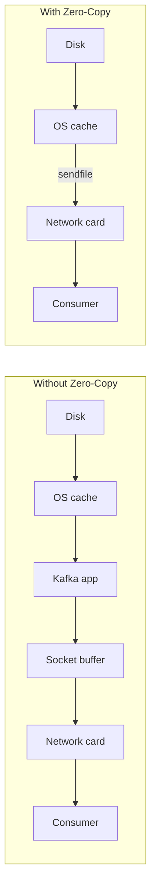
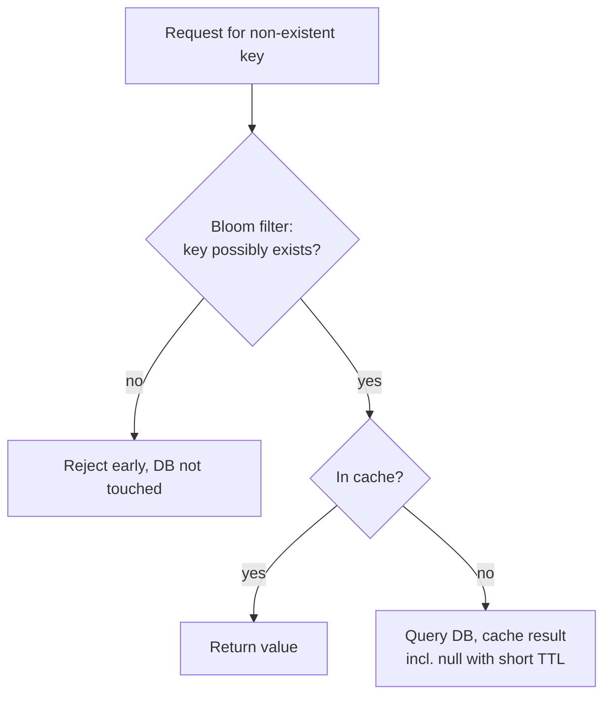

# Caching & Performance · ByteByteGo

Simple notes on making systems fast: cache strategies, in-memory stores, why Redis and Kafka are fast, a caching security pitfall, the latency-vs-consistency tradeoff, and diagnosing resource hogs.

## Top Cache Strategies

There are 5 common strategies, split into reads and writes (some can be combined):

**Reading data:**
- **Cache aside**: the app checks the cache first; on a miss, it reads the database and then fills the cache itself.
- **Read through**: the cache itself loads from the database on a miss and returns the data (the app only talks to the cache).

**Writing data:**
- **Write around**: writes go straight to the database, skipping the cache.
- **Write back**: write to the cache first and return quickly; the cache writes to the database later (fast but risks data loss).
- **Write through**: write to the cache and the database together, so they stay in sync.

## Redis vs Memcached

Both are popular in-memory stores. The big difference is that **Redis supports rich data structures** while Memcached is a simpler key-value store. Those data structures make Redis great for:
- Counting clicks and comments per post (**hash**).
- Sorting and de-duplicating a commented-user list (**zset** / sorted set).
- Caching user behavior history and filtering malicious behavior (**zset, hash**).
- Storing boolean flags for huge datasets in tiny space, like login or membership status (**bitmap**).

## Why Is Redis So Fast?

Three main reasons:
1. Redis is a **RAM-based** database, and RAM access is at least 1000x faster than random disk access.
2. It uses **IO multiplexing** with a **single-threaded execution loop**, which is very efficient.
3. It uses several efficient **lower-level data structures**.

## Why Is Kafka Fast?

Kafka gets low-latency delivery from two techniques: **Sequential I/O** and the **Zero Copy** principle.

Without zero-copy, sending a message means many copies: disk → OS cache → Kafka application → socket buffer → network card → consumer. **Zero copy** skips the trips through the application: the OS cache copies data directly to the network card using the `sendfile()` command. This removes the extra copies between application context and kernel context, cutting the time by about **65%**.

## Cache Miss Attack

A cache miss attack happens when someone repeatedly asks for data that exists **neither in the cache nor in the database**. Every such request misses the cache and slams the database, defeating the point of caching; a malicious user can overload the database this way. Two common fixes:
- **Cache the null value**: store the "not found" result with a short TTL so repeated requests hit the cache, not the DB.
- **Use a Bloom filter**: a data structure that quickly tells you if a key might exist. If the Bloom filter says the key isn't in the dataset, the query never touches the cache or database at all.

## Tradeoff Between Latency and Consistency

When you replicate data, there is a fundamental tradeoff between **latency** and **consistency**. If you wait for all replicas to confirm a write before responding, you get strong consistency but higher latency. If you respond as soon as one replica accepts the write, you get low latency but replicas may temporarily disagree (weaker consistency). Understanding this tradeoff matters both in system design interviews and in real systems.

## Diagnosing High CPU, Memory, or IO

When a mysterious process eats too much CPU, memory, or IO on Linux, these tools help pinpoint it:
- **`vmstat`**: reports processes, memory, paging, block IO, traps, and CPU activity.
- **`iostat`**: reports CPU and input/output statistics.
- **`netstat`**: shows statistics for IP, TCP, UDP, and ICMP protocols.
- **`lsof`**: lists open files on the system.
- **`pidstat`**: monitors resource use (CPU, memory, device IO, task switching, threads) per process.
