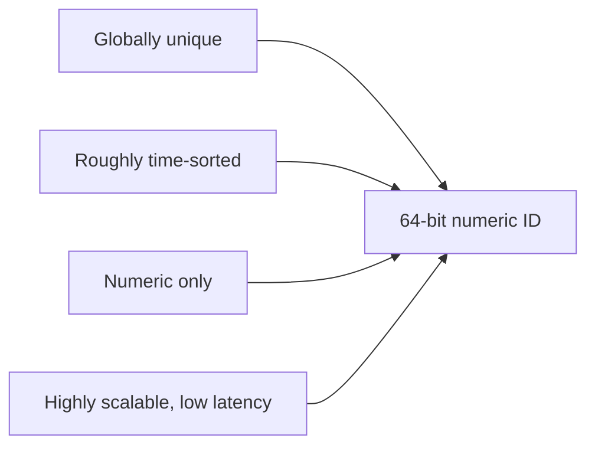
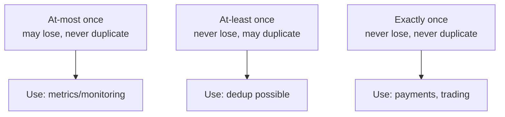
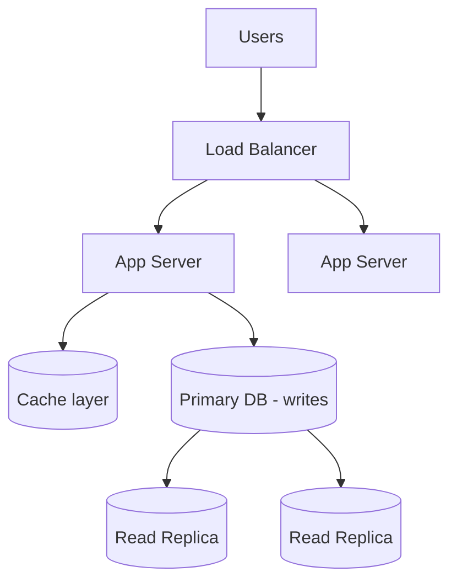
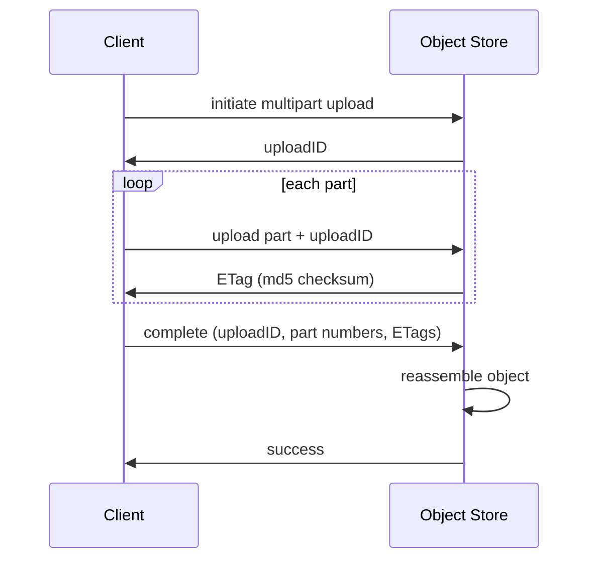

# Distributed Systems Concepts · ByteByteGo

Simple notes on building systems that span many machines: unique IDs, message delivery guarantees, scaling to millions of users, surviving outages, and uploading big files.

## Generating Globally Unique IDs

Social platforms like Facebook, Twitter, and LinkedIn need ID generators that meet several requirements at once:
- **Globally unique** (no collisions anywhere).
- **Roughly sorted by time** (newer IDs are larger).
- **Numerical values only**.
- **64 bits** in size.
- **Highly scalable, low latency**.

These requirements are what popular schemes (like time-based, distributed ID generators) are designed to satisfy: packing a timestamp so IDs sort by time, plus machine/sequence information so many servers can generate IDs independently without coordinating.

## At-Most Once, At-Least Once, and Exactly Once

Message queues coordinate the independent building blocks of a system. There are three delivery guarantees ("semantics"):

- **At-most once**: a message is delivered no more than once. Messages may be **lost** but are never redelivered. Good when small data loss is fine, e.g. monitoring metrics.
- **At-least once**: no message is lost, but a message **may be delivered more than once**. Fine when duplication is acceptable or the consumer can de-duplicate (e.g. a unique key lets the DB reject duplicate writes).
- **Exactly once**: each message is delivered exactly one time. The hardest and most expensive to build, but essential for financial use cases (payment, trading, accounting) where duplication is unacceptable and the downstream service doesn't support idempotency.

## How to Scale a Website to Millions of Users

A website usually evolves step by step, from one server to a microservice architecture:

1. **Split app and database**: put the application server and the database on separate servers.
2. **Add an app server cluster**: one app server isn't enough, so run several.
3. **Add a load balancer**: it routes incoming requests evenly across the app servers.
4. **Separate reads and writes**: send frequent read queries to **read replicas** to boost write throughput on the primary.
5. **Handle a growing database** with: vertical partitioning (more CPU/RAM, but has a hard limit), horizontal partitioning (add more DB servers), and a **caching layer** to offload reads.
6. **Modularize into services**: break functions into separate services, becoming a service-oriented / microservice architecture.

## Handling a Large-Scale Outage

A true story from a Discord Staff Engineer: about 10 years ago a social game with ~30 million daily users went **completely** down on a Friday night. Every AWS instance was terminated: HAProxy, PHP web servers, MySQL databases, Memcache nodes, everything. It took **50 people 10 hours** to bring it all back.

The cause: a third-party cloud management vendor had shipped a bug in its confirmation dialog. When an engineer asked to terminate just an unused Memcache pool, the dialog correctly listed only those nodes, but under the hood it terminated **everything**. This was before Infrastructure as Code (no Terraform), so recovery was fully manual. The lesson: tooling bugs and unsafe UI flows can cause catastrophic outages, and you need safe, automated, reproducible infrastructure.

## Upload Large Files (Multipart Upload)

Uploading a multi-GB file to object storage (like S3) in one shot is risky: it's slow, and if the network drops mid-upload you start over. The fix is **multipart upload**: slice the big file into smaller parts, upload them independently, and let the store reassemble them.

1. Client tells the object store to **initiate** a multipart upload.
2. The store returns an **uploadID** that identifies this upload.
3. Client splits the file (e.g. 1.6 GB into 8 parts of 200 MB) and uploads each part with the uploadID.
4. For each uploaded part, the store returns an **ETag** (the md5 checksum) used to verify the part.
5. After all parts are up, the client sends a **complete** request with the uploadID, part numbers, and ETags.
6. The store **reassembles** the object from the parts by number (may take a few minutes for very large files) and returns success.

