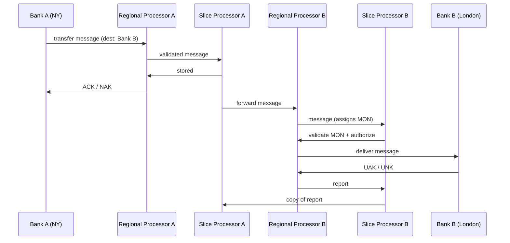
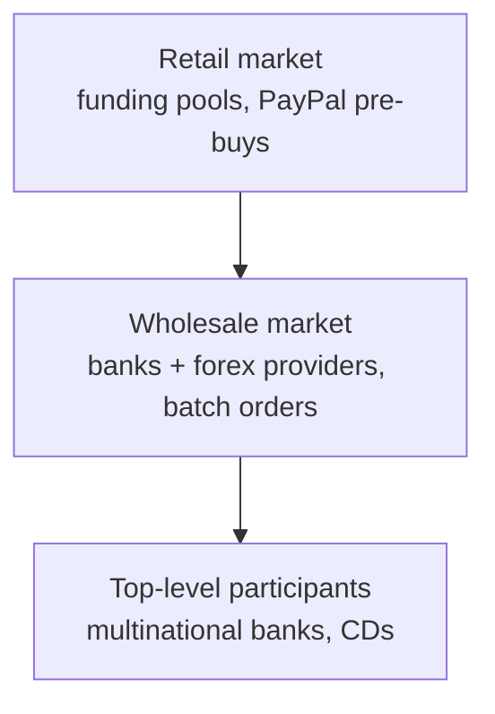

# Payments · ByteByteGo

Simple notes on how money moves online: the possible future of payments, the SWIFT messaging network, and how currency conversion works.

## The Future of Online Payments

One strong candidate for the future of payments is the **blockchain**. A key book here is *Mastering Bitcoin* by Andreas M. Antonopoulos, which explains Bitcoin and its blockchain clearly. Takeaways:

1. A Bitcoin wallet balance is **calculated on the fly**, whereas a traditional wallet balance is **stored in a database**.
2. The blockchain is Bitcoin's single **source of truth** and also its **journal** — similar to using an **Event Sourcing** architecture to build a traditional wallet.
3. Bitcoin (and Ethereum) has a small **virtual machine** with a set of bytecodes for basic tasks like validation.

## SWIFT Payment Network

**SWIFT** (Society for Worldwide Interbank Financial Telecommunication) is the main secure **messaging system** that links the world's banks; it's Belgium-based, run by its member banks, and handles millions of payment messages a day. Importantly, SWIFT moves **messages**, not the money itself.

Two key node types: a **Regional Processor** validates input message formats and queues output messages; a **Slice Processor** stores and safely routes messages. Sending a transfer from Bank A (New York) to Bank B (London) roughly works like this: Bank A sends the transfer message to Regional Processor A, which validates it and forwards it to Slice Processor A, which stores it and acknowledges. Regional Processor A sends an **ACK/NAK** back to Bank A (ACK = will be sent to Bank B, NAK = will not). Slice Processor A then sends the message across to Regional Processor B in London, which stores it, assigns a unique **MON** (Message Output Number), and (after Slice Processor B validates and authorizes) delivers it to Bank B. Bank B stores it and replies with **UAK** (positive acknowledgment) or **UNK** (negative — checksum failure). Finally a report is created, stored, and copied back to Slice Processor A.

## Foreign Exchange in Payment

When you pay in USD online but a European seller receives EUR, that conversion is **foreign exchange (forex)**. Say Bob must pay Alice 100 USD but Alice only takes EUR, via PayPal:
1. Bob sends 100 USD; it moves from Bob's bank to PayPal's USD account.
2. PayPal uses a forex provider (Bank E) and sends the 100 USD to its USD account there.
3. The 100 USD is sold to Bank E's **funding pool**.
4. The funding pool returns ~88 EUR into PayPal's EUR account at Bank E.
5. That 88 EUR reaches PayPal's EUR account at another bank.
6. 88 EUR is paid into Alice's EUR account.

The forex market has **3 layers**: the **retail market** (funding pools, where PayPal pre-buys some foreign currency for efficiency), the **wholesale market** (investment/commercial banks and forex providers that batch up accumulated retail orders), and **top-level participants** (multinational banks holding certificates of deposit from many countries). When a funding pool runs low on EUR, it goes up to the wholesale market to sell USD and buy EUR; when the wholesale market accumulates enough orders, it goes up to the top-level participants.

