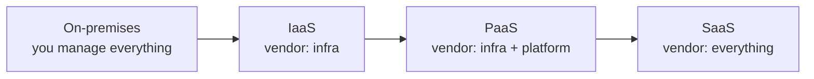
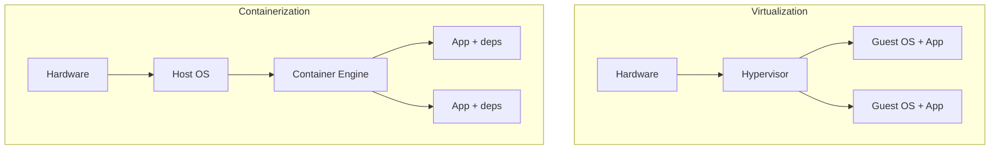
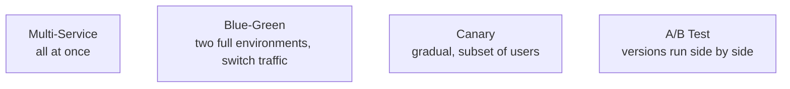
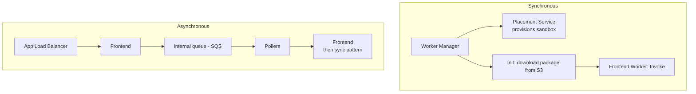
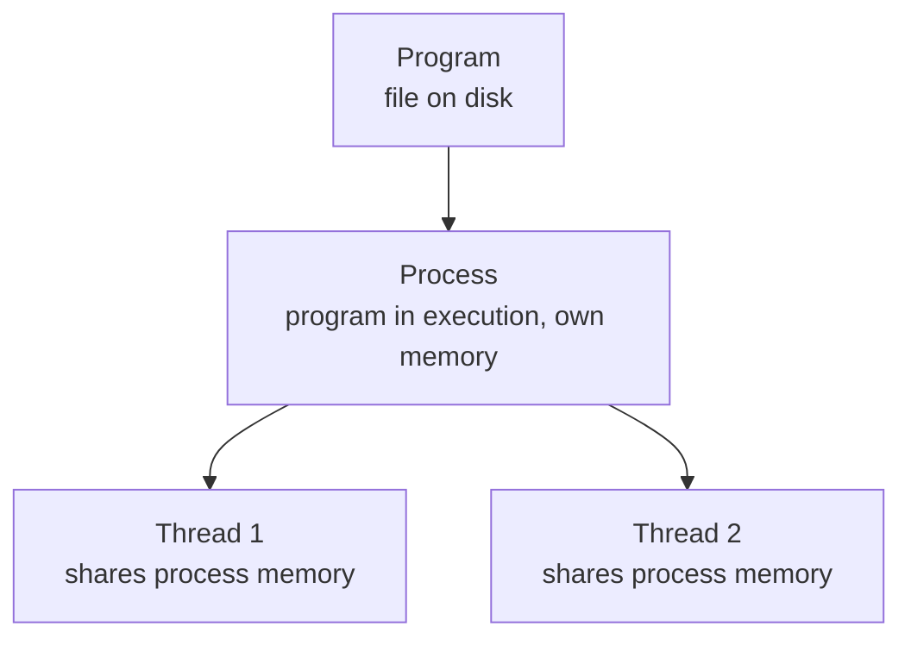

# Cloud, DevOps & Misc · ByteByteGo

Simple notes on cloud models, virtualization vs containers, deployment strategies, serverless internals, choosing a cloud, how Amazon operates, learning design patterns, and processes vs threads.

## IaaS / PaaS / SaaS

If you own and manage all the hardware and software yourself, that's **on-premises**. With cloud computing, vendors offer three models where they manage more of the stack for you:
- **IaaS (Infrastructure-as-a-Service)**: you get infrastructure like servers, storage, and networking; you install and manage the supporting software on top.
- **PaaS (Platform-as-a-Service)**: you get a platform with middleware, frameworks, and tools; you only focus on your application code and data.
- **SaaS (Software-as-a-Service)**: you just use a ready-made application in the cloud, usually for a monthly or annual fee.

## Virtualization (VMware) vs Containerization (Docker)

**Virtualization** creates multiple simulated environments from one physical machine. A **hypervisor** sits over the hardware so several full **operating systems** can run side by side. This was the first generation of cloud computing.

**Containerization** is a lightweight version: it virtualizes the **operating system** instead of the hardware. There's **no hypervisor**, so containers get faster resource provisioning. Each container packages the code plus all its dependencies (libraries, frameworks) together, so the app can run anywhere.

## Deployment Strategies

Deploying or upgrading services is risky. Common strategies to reduce that risk:
- **Multi-Service Deployment**: upgrade many services at once. Easy to do, but hard to test dependencies and hard to roll back safely.
- **Blue-Green Deployment**: run two identical environments — staging (blue) and production (green). Test the new version in staging, then switch traffic over so staging becomes production. Rollback is simple, but running two production-quality environments is expensive.
- **Canary Deployment**: upgrade gradually, exposing each step to a subset of users. Cheaper than blue-green and easy to roll back, but there's no staging environment, so you test in production and must monitor the canary while migrating users.
- **A/B Test**: run different versions in production at once, each version "experimenting" on a subset of users. A cheap way to test new features in production; you must control it so features aren't pushed to users by accident.

## AWS Lambda Behind the Scenes

Lambda is AWS's **serverless** service that runs functions in response to events. Under the hood it's powered by **Firecracker**, a lightweight virtualization engine (a MicroVM) built at Amazon in **Rust**. Functions run inside a sandbox that gives a minimal Linux userland plus common libraries, creating an execution environment (a "worker") on EC2 instances.

There are two ways functions get invoked:
- **Synchronous**: the Worker Manager asks a Placement Service to provision a sandbox on a host; then it calls **Init** to set up the function (downloading the package from S3 and preparing the runtime); then the Frontend Worker calls **Invoke**.
- **Asynchronous**: an Application Load Balancer forwards the invocation to a Frontend, which places the event on an internal queue (**SQS**). A set of **pollers** pulls events off the queue and hands them to a Frontend, after which it follows the same synchronous pattern.

## Which Cloud Provider for a Big Data Solution

Comparing **AWS**, **Google Cloud**, and **Azure**, a big data solution usually has the same 5 common parts regardless of vendor:
1. **Data ingestion** of structured or unstructured data.
2. **Raw data storage**.
3. **Data processing** (filtering, transformation, normalization).
4. **Data warehouse** (key-value store, relational DB, OLAP DB, etc.).
5. **Presentation layer** with dashboards and real-time notifications.

Different vendors just give the same product type different names — for example, the serverless function product is called **Lambda** in AWS but **Function** in Azure and Google Cloud.

## How Amazon Builds and Operates Software

In 2019, Amazon released **The Amazon Builders' Library**, a set of articles on how Amazon architects, releases, and operates technology. Some notable topics: making retries safe with **idempotent APIs**; **timeouts, retries, and backoff with jitter**; going **beyond five 9s** on highly available data planes; **caching challenges and strategies**; ensuring **rollback safety** during deployments; going faster with **continuous delivery**; challenges with **distributed systems**; and Amazon's approach to **high-availability deployment**.

## How to Learn Design Patterns

A great way to learn design patterns (beyond reading good code) is a well-written book. The recommended one is **Head First Design Patterns (2nd edition)**. The classic *Design Patterns* by the Gang of Four is powerful but hard for beginners; Head First makes it click first. Why it works: software is abstract and "invisible," so the book leans heavily on **visualization** — lots of diagrams, arrows, and comments on nearly every page — and it teaches from the **student's point of view**, asking the beginner questions and answering them clearly (there's a Guru and a Student in the book).

## Process vs Thread

Start with a **Program**: an executable file with a set of instructions, stored passively on disk. One program can spawn multiple processes (e.g. Chrome makes a separate process per tab).

A **Process** is a program in execution — loaded into memory and active, needing resources like registers, a program counter, and a stack. A **Thread** is the smallest unit of execution inside a process (e.g. in MS Word, one thread checks spelling while another inserts text).

Main differences:
- Processes are usually **independent**; threads are **subsets** of a process.
- Each process has its **own memory**; threads in the same process **share memory**.
- A process is **heavyweight** — slower to create and terminate.
- **Context switching** between processes is more expensive; inter-thread communication is faster.

