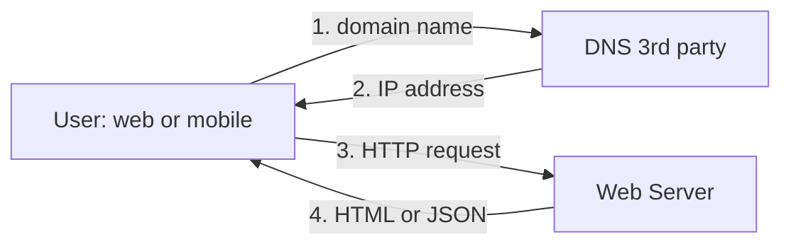
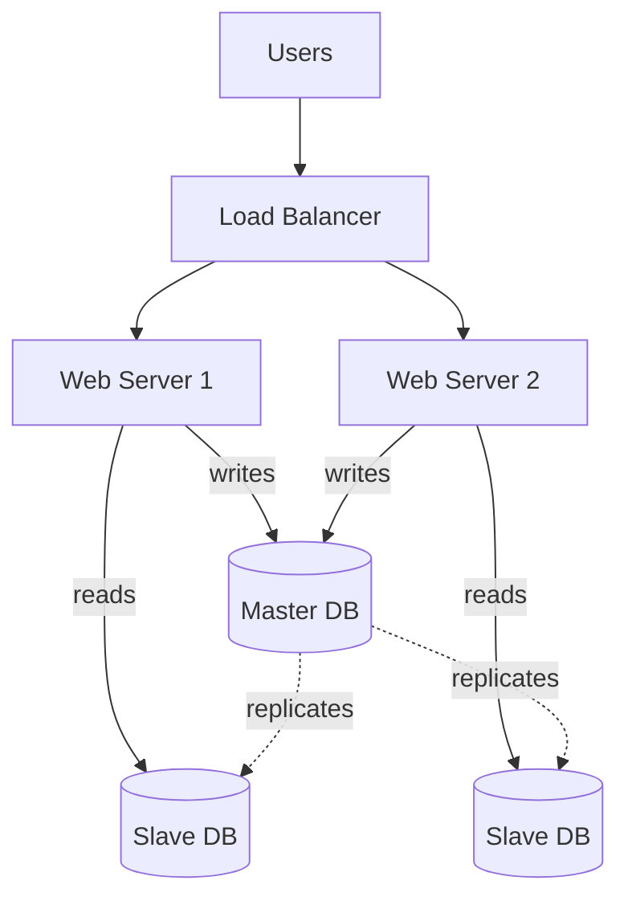
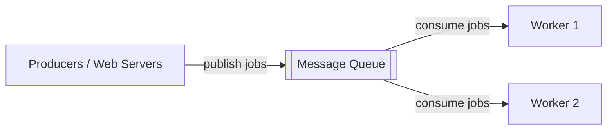
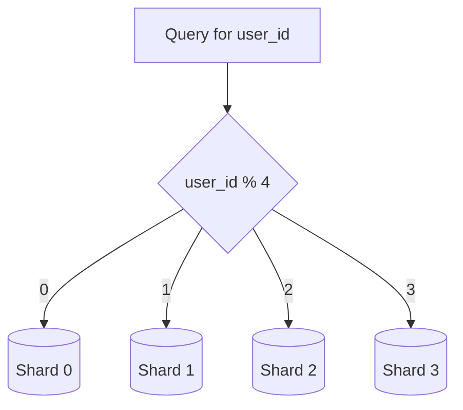

# Scale From Zero to Millions of Users · Vol 1 Ch 1

> How to grow a web system step by step, starting from one small server and ending with an architecture that can serve millions of users.

## 1. The Problem in Plain English

You start with a tiny app running on one computer. As more people use it, that one computer cannot keep up. This chapter walks through the journey of slowly upgrading the system, one improvement at a time, until it can handle millions of users. Each step fixes a specific weakness (slowness, no backup, single point of failure) that appears as traffic grows.

## 2. Requirements (Functional & Non-Functional)

The system must serve web and mobile clients and keep working well as usage grows. The main qualities we care about while scaling:

- **Scalability** – handle more users by adding resources.
- **Availability** – stay up even when a server or database fails (no single point of failure, SPOF).
- **Performance / low latency** – fast response times.
- **Reliability** – no data loss even during disasters.

The book's summary of how to scale to millions of users:
- Keep web tier **stateless**
- Build **redundancy** at every tier
- **Cache** data as much as you can
- Support **multiple data centers**
- Host static assets in **CDN**
- Scale the data tier by **sharding**
- Split tiers into individual **services**
- **Monitor** the system and use automation tools

## 3. Back-of-the-Envelope Estimation

This chapter does not do heavy math, but it uses key real-world facts to justify decisions:
- Amazon RDS can give a single database server up to **24 TB of RAM** (shows how far vertical scaling can go).
- **stackoverflow.com in 2013** had over **10 million monthly unique visitors** but only **1 master database** (shows one strong DB can go far).
- Reads usually far outnumber writes, so systems keep **more slave databases than master databases**.

## 4. High-Level Design

### The request flow (how a user reaches the app)

1. User types a domain name like `api.mysite.com`. **DNS** (usually a paid 3rd-party service) is queried.
2. DNS returns an **IP address** (e.g. `15.125.23.214`) to the browser or mobile app.
3. The client sends **HTTP requests** to that IP (the web server).
4. The web server returns **HTML** (web) or **JSON** (mobile API), e.g. `GET /users/12` returns the user object for id 12.

Traffic comes from two sources: **web apps** (server-side languages like Java/Python + client-side HTML/JavaScript) and **mobile apps** (HTTP + JSON responses).

## 5. Deep Dive — The Step-by-Step Evolution

### Step 1 — Single server
Everything (web app, database, cache) runs on **one server**. Simple, but fragile.

### Step 2 — Separate the database (web tier + data tier)
Move the database onto its own server. Now the **web tier** and **data tier** can be scaled independently.

**Which database?**
- **Relational (SQL / RDBMS)** – MySQL, Oracle, PostgreSQL. Stores data in tables and rows, supports **JOINs**. Best default for most developers (proven for 40+ years).
- **Non-relational (NoSQL)** – CouchDB, Neo4j, Cassandra, HBase, Amazon DynamoDB. Four types: **key-value, graph, column, document** stores. Usually **no JOINs**. Choose NoSQL when you need super-low latency, have unstructured/non-relational data, only need to serialize/deserialize (JSON, XML, YAML), or must store massive data.

### Step 3 — Vertical vs Horizontal scaling
- **Vertical scaling ("scale up")** – add more CPU/RAM to one server. Simple, but has a **hard limit**, and gives **no failover/redundancy** (if it dies, the site dies).
- **Horizontal scaling ("scale-out")** – add more servers. Preferred for large systems.

### Step 4 — Load balancer
A **load balancer** spreads incoming traffic across web servers in a load-balanced set. Users connect only to the load balancer's **public IP**; web servers use **private IPs** (reachable only inside the network) for security. Benefits: if one server dies, traffic goes to the other; if traffic grows, just add more servers to the pool.

### Step 5 — Database replication
Uses a **master/slave** relationship. **Master** handles writes (insert/update/delete). **Slaves** are read-only copies. Because reads outnumber writes, there are usually more slaves.
- Benefits: **better performance** (reads spread across slaves), **reliability** (data survives disasters), **high availability**.
- Failover: if a slave dies, reads go to the master or other slaves temporarily; if the master dies, a **slave is promoted to master** (in production this is complex because a slave's data may be stale, needing recovery scripts). Advanced options: multi-master and circular replication.

### Step 6 — Cache
A **cache** is fast in-memory temporary storage for expensive or frequently-read results. A separate **cache tier** improves performance, reduces DB load, and scales independently.

- **Read-through cache**: web server checks cache first; on a miss it queries the DB, stores the result in cache, then returns it.
- Considerations:
  - **When to use**: data read often but modified rarely. Cache is volatile — a restart loses everything, so keep important data in a persistent store.
  - **Expiration policy**: not too short (reloads too often) and not too long (stale data).
  - **Consistency**: keeping store and cache in sync is hard, especially across regions (see "Scaling Memcache at Facebook").
  - **Mitigating failures**: one cache server is a SPOF — use multiple cache servers across data centers and **overprovision memory**.
  - **Eviction policy**: when full, evict items. Most popular is **LRU (Least Recently Used)**; others are **LFU** and **FIFO**.
- Cache servers expose simple APIs (e.g. Memcached).

### Step 7 — Content Delivery Network (CDN)
A **CDN** is a network of geographically spread servers that cache **static content** (images, video, CSS, JavaScript). The CDN server **closest to the user** serves the content, so nearer users load faster.

CDN workflow: User A requests `image.png` from a CDN URL (e.g. `https://mysite.cloudfront.net/logo.jpg`). If not cached, the CDN pulls it from the **origin** (web server or Amazon S3), caches it with a **TTL (Time-to-Live)** header, and returns it. Later users get it from cache until the TTL expires.

CDN considerations: **cost** (charged per data transfer — don't cache rarely-used assets), **appropriate cache expiry**, **CDN fallback** (client should fetch from origin if CDN fails), and **invalidating files** (via CDN API or object versioning like `image.png?v=2`).

### Step 8 — Stateless web tier
Move **state** (like user session data) out of the web servers into a shared persistent store.
- **Stateful server** remembers client data between requests. Problem: every request from a user must hit the *same* server (requires **sticky sessions**), making it hard to add/remove servers or handle failures.
- **Stateless server** keeps no state; any request can go to any server. State lives in a **shared data store** (relational, Memcached/Redis, or NoSQL — NoSQL chosen for easy scaling). This enables **autoscaling** (adding/removing servers based on load).

### Step 9 — Multiple data centers
Users are routed by **geoDNS (geo-routing)** to the nearest data center, e.g. x% to US-East and (100−x)% to US-West. If one data center goes down, **100% of traffic** is redirected to a healthy one. Challenges: **traffic redirection** (geoDNS), **data synchronization** (replicate data across data centers — Netflix uses asynchronous multi-data-center replication), and **test/deployment** across all locations with automation.

### Step 10 — Message queue
A **message queue** is a durable in-memory component for **asynchronous** communication. **Producers/publishers** post messages; **consumers/subscribers** read and act on them. This **decouples** components so they scale independently. Example: web servers publish photo-processing jobs; photo-processing workers pick them up asynchronously — add more workers when the queue grows, fewer when it's empty.

### Step 11 — Logging, metrics, automation
- **Logging**: monitor error logs, aggregate them to a centralized service.
- **Metrics**: host-level (CPU, memory, disk I/O), aggregated (whole DB/cache tier), and key business metrics (daily active users, retention, revenue).
- **Automation**: continuous integration (each code check-in verified automatically) and automated build/test/deploy.

### Step 12 — Database scaling (sharding)
When the data tier gets overloaded:
- **Vertical scaling** – bigger DB server (up to 24 TB RAM), but hardware limits, higher SPOF risk, expensive.
- **Horizontal scaling (sharding)** – split the DB into smaller **shards**, each with the same schema but unique data. A **hash function** on the **sharding key (partition key)** routes each query. Example: `user_id % 4` picks shard 0–3. The most important criterion is picking a key that **distributes data evenly**.

## 6. Scaling, Bottlenecks & Trade-offs

Each layer added removes a bottleneck but adds complexity. Sharding is powerful but far from perfect:
- **Resharding**: needed when a shard fills up or fills faster than others (shard exhaustion). Requires updating the hash function and moving data. **Consistent hashing** (Chapter 5) helps.
- **Celebrity / hotspot key problem**: if Katy Perry, Justin Bieber, and Lady Gaga all land on the same shard, that shard is overwhelmed by reads. Fix: give each celebrity their own shard (maybe further partitioned).
- **Joins & de-normalization**: JOINs across shards are hard. Workaround: **de-normalize** so queries hit a single table.

Some non-relational functions can also be moved to a **NoSQL store** to reduce DB load.

## 7. Failure / Edge Cases

- **Single point of failure (SPOF)**: any part that stops the whole system if it fails — avoided with redundancy at every tier.
- **Web server dies** → load balancer routes to healthy servers.
- **Slave DB dies** → reads go to master or other slaves; a new slave replaces it.
- **Master DB dies** → a slave is promoted (data may be stale, needs recovery scripts).
- **Cache server dies** → data lost from memory; use multiple cache servers across data centers.
- **CDN outage** → client falls back to origin.
- **Whole data center outage** → geoDNS redirects all traffic to a healthy data center.

## 8. Key Takeaways

- Scaling is an **iterative process**: start simple, add one layer at a time as needed.
- Keep the **web tier stateless** to enable easy horizontal scaling and autoscaling.
- Build **redundancy** everywhere to remove SPOFs.
- Use **caching + CDN** to cut latency and DB load.
- Use **replication** for read scaling and **sharding** for write/storage scaling.
- Use **message queues** to decouple and scale components independently.
- Add **monitoring and automation** once the system is large.

## 9. New Terms & Glossary

- **DNS** – Domain Name System, turns a domain name into an IP address.
- **Web tier / data tier** – the servers handling app logic vs. the servers holding data.
- **RDBMS / SQL** – relational database with tables, rows, and JOINs.
- **NoSQL** – non-relational database (key-value, graph, column, document).
- **Vertical scaling (scale up)** – add power to one machine.
- **Horizontal scaling (scale-out)** – add more machines.
- **Load balancer** – distributes traffic across servers.
- **Replication (master/slave)** – master takes writes, slaves take reads.
- **Cache / cache tier** – fast in-memory temporary storage.
- **Read-through cache** – check cache first, load from DB on a miss.
- **LRU / LFU / FIFO** – cache eviction policies.
- **CDN** – geographically spread servers caching static content.
- **TTL** – Time-to-Live, how long content stays cached.
- **Stateless / stateful** – whether a server remembers client state.
- **Sticky sessions** – load balancer routes a user to the same server.
- **geoDNS** – DNS that resolves based on user location.
- **Message queue / producer / consumer** – async buffer between components.
- **Sharding** – splitting a database into smaller parts.
- **Sharding key (partition key)** – column(s) deciding which shard data goes to.
- **SPOF** – single point of failure.
- **De-normalization** – duplicating data to avoid cross-shard JOINs.
