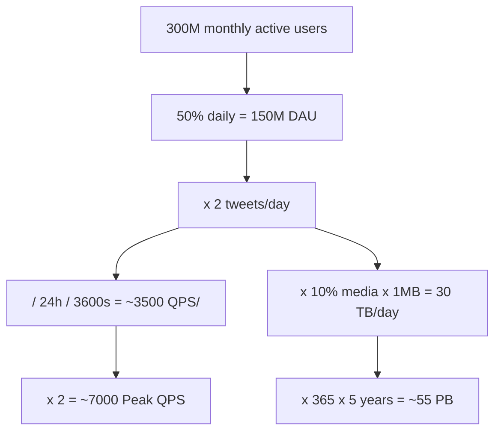

# Back-of-the-Envelope Estimation · Vol 1 Ch 2

> How to quickly estimate a system's capacity (QPS, storage, etc.) using rough math and common performance numbers, so you can judge which designs will actually work.

## 1. The Problem in Plain English

In interviews you are sometimes asked "how big does this system need to be?" You cannot build the real thing, so you make **quick, rough calculations** using simple assumptions and well-known performance numbers. As Google's Jeff Dean puts it, back-of-the-envelope calculations are "estimates you create using a combination of thought experiments and common performance numbers to get a good feel for which designs will meet your requirements."

## 2. Requirements (What you need to know first)

To estimate well, you must be comfortable with three foundations:
- **Power of two** (data volume units)
- **Latency numbers every programmer should know**
- **Availability numbers**

## 3. The Estimation Techniques (with the book's numbers)

### Power of two
A **byte = 8 bits**. An **ASCII character = 1 byte**. Data volume units are based on powers of 2:

| Unit | Power of 2 | Approx value |
|------|-----------|--------------|
| 1 KB | 2^10 | ~1 thousand bytes |
| 1 MB | 2^20 | ~1 million bytes |
| 1 GB | 2^30 | ~1 billion bytes |
| 1 TB | 2^40 | ~1 trillion bytes |
| 1 PB | 2^50 | ~1 quadrillion bytes |

### Latency numbers every programmer should know
Dr. Dean (Google) published typical operation times in 2010. Some are outdated as hardware improved, but they still teach the **relative** speed of operations. Time units:
- **1 ns** = 10⁻⁹ seconds (nanosecond)
- **1 µs** = 10⁻⁶ seconds = 1,000 ns (microsecond)
- **1 ms** = 10⁻³ seconds = 1,000 µs = 1,000,000 ns (millisecond)

Key conclusions from the numbers (a Google engineer, Colin Scott, built a tool to visualize them, updated to 2020):
- **Memory is fast, disk is slow.**
- **Avoid disk seeks** if possible.
- **Simple compression algorithms are fast.**
- **Compress data before sending** it over the internet.
- **Data centers are in different regions**, so cross-region transfer takes time.

### Availability numbers
**High availability** = staying operational for a long time, measured as a percentage. 100% = zero downtime; most services fall between 99% and 100%. A **Service Level Agreement (SLA)** formally defines the uptime a provider promises. Cloud providers **Amazon, Google, and Microsoft set their SLAs at 99.9% or above**. Uptime is measured in **"nines"** — more nines means less downtime:

| Availability | Approx downtime per year |
|--------------|--------------------------|
| 99% (two nines) | ~3.65 days |
| 99.9% (three nines) | ~8.76 hours |
| 99.99% (four nines) | ~52.6 minutes |
| 99.999% (five nines) | ~5.26 minutes |

## 4. Worked Example — Twitter QPS and Storage

> Note: these numbers are made up for the exercise, not real Twitter data.

**Assumptions:**
- 300 million monthly active users
- 50% of users use Twitter daily
- Users post 2 tweets per day on average
- 10% of tweets contain media
- Data is stored for 5 years

**QPS (Query Per Second) estimate:**
- Daily active users (DAU) = 300 million × 50% = **150 million**
- Tweets QPS = 150 million × 2 tweets ÷ 24 hours ÷ 3600 seconds = **~3,500**
- **Peak QPS = 2 × QPS = ~7,000**

**Media storage estimate:**
- Average tweet size: `tweet_id` = 64 bytes, `text` = 140 bytes, `media` = 1 MB
- Media storage per day = 150 million × 2 × 10% × 1 MB = **30 TB per day**
- 5-year media storage = 30 TB × 365 × 5 = **~55 PB**

## 5. Deep Dive — Common quantities to estimate

The commonly asked back-of-the-envelope estimations are:
- **QPS** (queries per second)
- **Peak QPS**
- **Storage**
- **Cache** size
- **Number of servers**

Practice these before an interview.

## 6. Trade-offs — Precision vs Speed

Back-of-the-envelope estimation is about the **process**, not exact numbers. Interviewers test your **problem-solving skills**, so approximate rather than compute precisely.

## 7. Edge Cases / Common Mistakes

The book's tips (things that trip people up):
- **Rounding and approximation** – don't waste time on hard math. `99987 / 9.1` becomes `100,000 / 10`.
- **Write down your assumptions** – so you can reference them later.
- **Label your units** – "5" is ambiguous; write "5 MB" to avoid confusing yourself.

## 8. Key Takeaways

- Use **assumptions + common performance numbers** to size a system fast.
- Master the three foundations: **power of two, latency numbers, availability numbers**.
- The Twitter example shows the flow: users → DAU → QPS → peak QPS → storage over time.
- **Solving the problem matters more than the exact result.** Round, label units, and state assumptions.

## 9. New Terms & Glossary

- **Back-of-the-envelope estimation** – quick rough capacity math using assumptions and known numbers.
- **Byte / bit** – 1 byte = 8 bits; 1 ASCII char = 1 byte.
- **KB, MB, GB, TB, PB** – data units based on powers of 2 (2^10 up to 2^50).
- **ns / µs / ms** – nanosecond / microsecond / millisecond.
- **Latency** – time an operation takes.
- **QPS** – Queries Per Second.
- **Peak QPS** – highest QPS, roughly 2× average in the example.
- **DAU** – Daily Active Users.
- **High availability** – percentage of time a system is up.
- **SLA** – Service Level Agreement, the promised uptime (cloud providers: 99.9%+).
- **"Nines"** – shorthand for availability level (three nines = 99.9%).
