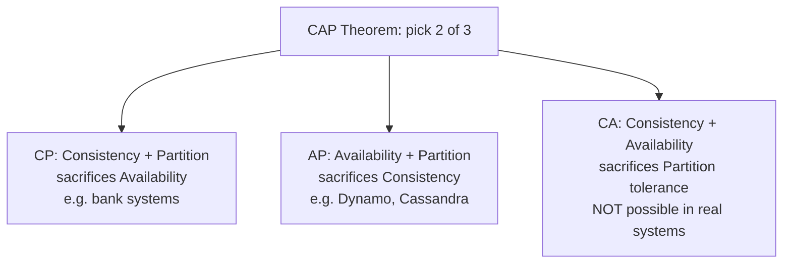
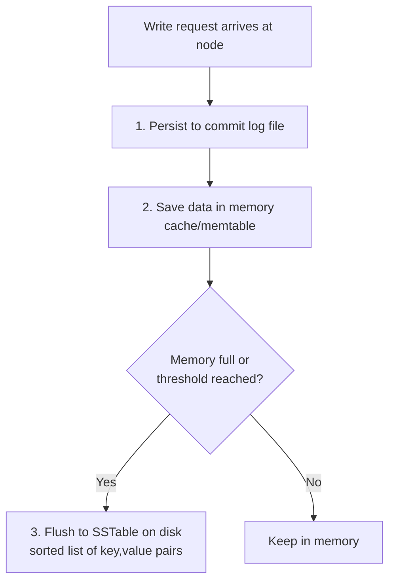
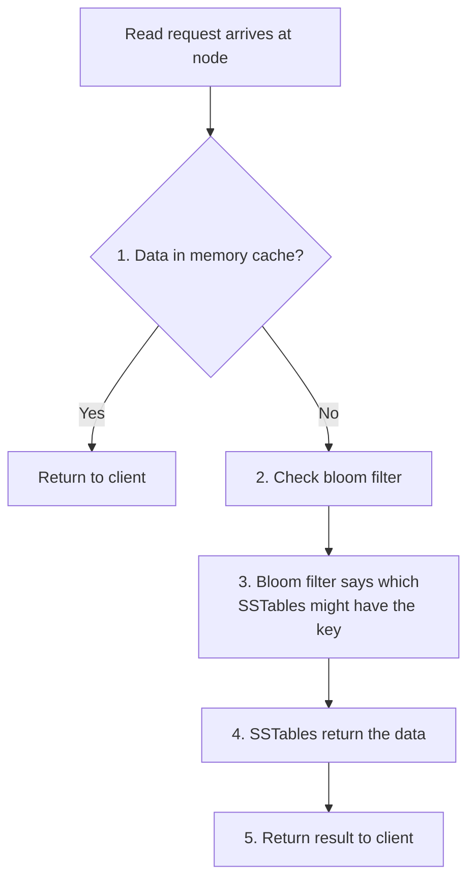

# Design a Key-Value Store · Vol 1 Ch 6

> How to build a distributed, highly available key-value database (like Amazon Dynamo / Cassandra) using consistent hashing, replication, quorum, versioning, and failure handling.

## 1. The Problem in Plain English

A **key-value store** is a simple, non-relational database. Every piece of data is saved as a **key** (a unique name) paired with a **value** (the data). You look up the value using the key.

- The **key** must be unique. It can be plain text (like `last_logged_in_at`) or a hashed value (like `253DDEC4`). Short keys are better for performance.
- The **value** can be a string, list, or object. The store treats it as an **opaque object** (it does not look inside it). Real examples: Amazon Dynamo, Memcached, Redis.

We must support just two operations:

- `put(key, value)` – save a value for a key.
- `get(key)` – read the value for a key.

There is **no perfect design**. Every design is a trade-off between read speed, write speed, memory use, and (most importantly) between **consistency and availability**.

## 2. Requirements (Functional & Non-Functional)

The store we design has these characteristics:

- Each key-value pair is **small** (less than 10 KB).
- Can store **big data** (very large data sets).
- **High availability** – responds quickly even during failures.
- **High scalability** – can grow to support large data sets.
- **Automatic scaling** – servers are added/removed automatically based on traffic.
- **Tunable consistency** – we can dial the consistency level up or down.
- **Low latency**.

### Single-server store (why it fails)

The easy version: store everything in an in-memory hash table on one server. Memory is fast, but you cannot fit everything in memory. Two tricks help:

1. **Data compression.**
2. **Keep only hot (frequently used) data in memory, the rest on disk.**

Even so, one server fills up fast. We need a **distributed key-value store** (also called a **distributed hash table**) that spreads data across many servers.

## 3. Back-of-the-Envelope Estimation

This chapter is design-heavy rather than number-heavy, but two sizing facts matter:

- Key-value pair size: **< 10 KB** each.
- Replication factor **N** (copies of each item) is configurable; a typical value is **N = 3**.
- Merkle tree sizing example: **1 million buckets per 1 billion keys**, so each bucket holds about **1000 keys**.

## 4. High-Level Design

The design borrows heavily from three real systems: **Dynamo**, **Cassandra**, and **BigTable**. The core components are: data partition, data replication, consistency, inconsistency resolution, failure handling, plus the read and write paths.

### CAP Theorem (the big trade-off)

**CAP theorem** says a distributed system cannot give all three of these at the same time — you can only pick **two**:

- **Consistency (C):** every client sees the same data at the same time, no matter which node it talks to.
- **Availability (A):** every request gets a response even if some nodes are down.
- **Partition tolerance (P):** the system keeps working even when the network between nodes breaks (a **partition**).

Stores are classified by the two they choose:

- **CP** (consistency + partition tolerance): gives up availability. Good for banks (must show correct balance; returns an error if inconsistent).
- **AP** (availability + partition tolerance): gives up strong consistency. Keeps serving reads/writes even if data is briefly stale.
- **CA** (consistency + availability): gives up partition tolerance. **Impossible in the real world** because network failures always happen, so a real distributed system must tolerate partitions.

Example with 3 replicas (n1, n2, n3): if n3 goes down and can't talk to n1/n2:
- **CP choice:** block writes to n1/n2 so no one gets stale data → system becomes unavailable.
- **AP choice:** keep accepting reads/writes on n1/n2 (may return stale data), then sync to n3 once the partition heals.

### Data Partition (Consistent Hashing)

We split data across many servers. Two challenges: (1) spread data **evenly**, (2) **minimize data movement** when nodes are added/removed. **Consistent hashing** (from Chapter 5) solves both:

- Servers (s0…s7) are placed on a **hash ring**.
- A key is hashed onto the same ring, then stored on the **first server found going clockwise**. (e.g. key0 → s1.)

Advantages:
- **Automatic scaling:** servers can join/leave based on load.
- **Heterogeneity:** a stronger server gets **more virtual nodes** (proportional to capacity).

### Data Replication

For availability and reliability, each item is copied to **N servers** (N configurable). To pick them: hash the key to a spot on the ring, then walk **clockwise** and choose the **first N servers**. With N=3, key0 lands on s1, s2, s3.

- Because of virtual nodes, the first N ring nodes might belong to fewer than N physical servers, so we only count **unique physical servers**.
- For safety, place replicas in **different data centers** connected by high-speed networks, so one data center outage doesn't lose all copies.

## 5. Deep Dive

### Consistency via Quorum

Replicas must agree. **Quorum consensus** uses three numbers:

- **N** = number of replicas.
- **W** = write quorum. A write succeeds only after **W** replicas acknowledge it.
- **R** = read quorum. A read succeeds only after **R** replicas respond.

A **coordinator** acts as a proxy between the client and the nodes. Note: **W = 1 does not mean written to only one server** — it means the coordinator needs at least one acknowledgment before calling the write successful (data is still replicated to all N).

Trade-offs:
- W=1 or R=1 → fast (wait for just one replica).
- W>1 or R>1 → better consistency but slower (must wait for the slowest replica).
- **If W + R > N → strong consistency guaranteed** (at least one node overlaps and has the latest data).

Common setups:
- **R=1, W=N** → optimized for fast reads.
- **W=1, R=N** → optimized for fast writes.
- **W + R > N** → strong consistency (usually **N=3, W=R=2**).
- **W + R ≤ N** → strong consistency not guaranteed.

### Consistency Models

- **Strong consistency:** a read always returns the most recent write; never see stale data.
- **Weak consistency:** a read might not see the latest write.
- **Eventual consistency:** a type of weak consistency — given enough time, all replicas converge.

Strong consistency blocks new reads/writes until every replica agrees, which hurts availability. **Dynamo and Cassandra use eventual consistency**, which is the recommended model here. It lets inconsistent values enter the system, then the client reconciles them on read.

### Inconsistency Resolution: Versioning & Vector Clocks

Replication causes conflicts. Example: n1 and n2 start with the same value; server 1 changes name to `johnSanFrancisco` while server 2 changes it to `johnNewYork` at the same time → conflicting versions v1 and v2. There's no automatic way to know which is right.

**Versioning** treats every change as a new immutable version. A **vector clock** is a `[server, version]` pair attached to a data item, used to tell whether one version precedes, succeeds, or conflicts with another.

Written as `D([S1, v1], [S2, v2], …])`. When item D is written to server Si:
- **Increment vi** if `[Si, vi]` already exists.
- Otherwise **create a new entry `[Si, 1]`**.

Walk-through:
1. Client writes D1 via Sx → `D1[(Sx, 1)]`.
2. Client reads D1, updates to D2 via Sx → `D2([Sx, 2])` (D2 descends from D1, so it overwrites it).
3. Client reads D2, updates to D3 via Sy → `D3([Sx, 2], [Sy, 1])`.
4. Another client reads D2, updates to D4 via Sz → `D4([Sx, 2], [Sz, 1])`.
5. A client reading D3 and D4 sees a **conflict** (D2 was modified by both Sy and Sz). The **client resolves it**, and the merged write via Sx becomes `D5([Sx, 3], [Sy, 1], [Sz, 1])`.

Rules:
- **X is an ancestor (no conflict) of Y** if every counter in X is ≤ the matching counter in Y. e.g. `([s0,1],[s1,1])` is an ancestor of `([s0,1],[s1,2])`.
- **X and Y are siblings (conflict)** if any counter in Y is less than its match in X. e.g. `([s0,1],[s1,2])` vs `([s0,2],[s1,1])` conflict.

Downsides: (1) adds complexity — the **client** must implement conflict-resolution logic; (2) the `[server:version]` list can grow long. Fix: set a length **threshold** and drop the oldest pairs (slightly reduces accuracy, but Amazon says it hasn't been a problem in production).

### System Architecture

- Clients use simple APIs `get(key)` / `put(key, value)`.
- A **coordinator** node proxies between client and store.
- Nodes sit on a ring via **consistent hashing**.
- Fully **decentralized** — nodes join/leave automatically.
- Data replicated at multiple nodes.
- **No single point of failure** — every node has the same responsibilities.

### Write Path (based on Cassandra)

An **SSTable** (Sorted-String Table) is a sorted list of `<key, value>` pairs on disk.

### Read Path

A **bloom filter** is a space-efficient, probabilistic check that tells us which SSTables *might* contain a key, so we don't scan them all.

## 6. Scaling, Bottlenecks & Trade-offs

- **Consistent hashing** gives automatic, even scaling with minimal data movement, and supports servers of different capacities via virtual nodes.
- **Tunable N/W/R** lets you trade latency for consistency per use case.
- **Eventual consistency** maximizes availability (the AP choice) at the cost of possible temporary conflicts.
- **Memory vs disk:** hot data in the memory cache, everything else in SSTables on disk; bloom filters keep disk reads cheap.
- **Vector clock length** can grow — capped with a threshold, trading some reconciliation accuracy.

## 7. Failure / Edge Cases

### Failure Detection — Gossip Protocol

Trusting one server's word that another is down isn't enough (need at least two independent sources). **All-to-all multicasting** works but is inefficient at scale. Better: the decentralized **gossip protocol**:

- Each node keeps a **membership list** of member IDs and **heartbeat counters**.
- Each node periodically **increments its own heartbeat**.
- Each node periodically sends heartbeats to a **random set of nodes**, which forward them onward.
- Receiving nodes update their membership list.
- If a member's heartbeat hasn't increased for a set period, it's marked **offline** — and that fact spreads to other nodes.

### Temporary Failures — Sloppy Quorum & Hinted Handoff

Strict quorum can block reads/writes. **Sloppy quorum** instead picks the **first W healthy** servers for writes and **first R healthy** servers for reads, ignoring offline ones. When a node is down, another node handles its requests temporarily; when it returns, the substitute pushes the changes back. This is **hinted handoff** (e.g. s3 covers for s2, then hands data back when s2 recovers).

### Permanent Failures — Anti-Entropy & Merkle Trees

If a replica is permanently lost, an **anti-entropy protocol** re-syncs replicas by comparing data and updating each to the newest version. To do this efficiently we use a **Merkle tree** (hash tree): every non-leaf node holds the hash of its children.

Building it:
1. Divide the key space into **buckets** (e.g. 4).
2. Hash each key in a bucket with uniform hashing.
3. Create one hash node per bucket.
4. Build upward to the root by hashing children.

To compare two trees, compare **root hashes**; if they match, data is identical. If not, drill down the mismatching children to find only the buckets that differ, and sync **only those**. So the data transferred is proportional to the **differences**, not the total data size.

### Data Center Outage

Replicate data across **multiple data centers** so a full outage in one still lets users read from another.

## 8. Key Takeaways

- A distributed key-value store = a **distributed hash table** built on **consistent hashing**.
- **CAP theorem** forces a choice: real systems must tolerate partitions, so you pick **CP** or **AP**. Dynamo/Cassandra pick **AP** with **eventual consistency**.
- **N/W/R quorum** is tunable; **W + R > N → strong consistency** (common: N=3, W=R=2).
- **Vector clocks** detect and resolve conflicting versions; conflict resolution happens on the client.
- **Gossip** detects failures; **sloppy quorum + hinted handoff** handle temporary failures; **anti-entropy + Merkle trees** handle permanent ones.
- Write path: **commit log → memory cache → SSTable**. Read path uses a **bloom filter** to find the right SSTable.

## 9. New Terms & Glossary

- **Key-value store / distributed hash table:** database that maps unique keys to opaque values, spread across many servers.
- **CAP theorem:** you can guarantee at most two of Consistency, Availability, Partition tolerance.
- **CP / AP / CA system:** classification by which two CAP properties are supported.
- **Consistent hashing:** placing servers and keys on a hash ring so data spreads evenly and moves little when nodes change.
- **Virtual nodes:** multiple ring positions per physical server; more of them = more capacity assigned.
- **Replication factor N:** number of copies of each item.
- **Quorum (W, R):** number of replicas that must ack a write (W) or respond to a read (R).
- **Coordinator:** node acting as proxy between client and replicas.
- **Strong / weak / eventual consistency:** how up-to-date reads are guaranteed to be.
- **Versioning:** treating each change as a new immutable version.
- **Vector clock:** `[server, version]` pairs used to order versions and detect conflicts (ancestor vs sibling).
- **Gossip protocol:** decentralized failure detection using heartbeat counters spread to random nodes.
- **Sloppy quorum:** using the first W/R *healthy* nodes instead of strict fixed ones.
- **Hinted handoff:** a substitute node temporarily handles a down node's data, then hands it back.
- **Anti-entropy:** background process that re-syncs replicas.
- **Merkle tree (hash tree):** tree of hashes that lets replicas find and sync only the differing data.
- **Commit log:** on-disk log written first on every write for durability.
- **SSTable (Sorted-String Table):** sorted `<key, value>` list stored on disk.
- **Bloom filter:** space-efficient probabilistic set-membership test (may say "maybe present", never "wrongly absent").
