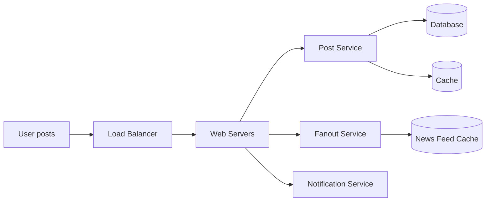
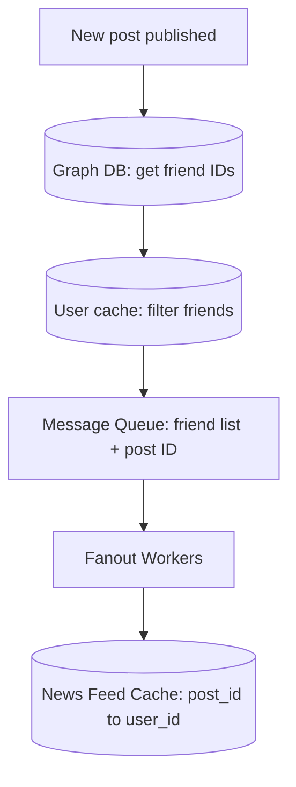

# Design a News Feed System · Vol 1 Ch 11

> How to build the "list of your friends' posts" you see when you open Facebook, Instagram, or Twitter, so it loads fast and updates in near real-time.

## 1. The Problem in Plain English

A **news feed** is the constantly updating list of stories in the middle of your home page (Facebook's own words). It includes status updates, photos, videos, links, app activity, and likes from the people, pages, and groups you follow.

Two things must happen:

1. **You publish a post** — and it needs to reach all your friends' feeds.
2. **You open your feed** — and it needs to show your friends' posts, newest first.

The same design applies to Instagram feed, Twitter timeline, etc.

## 2. Requirements (Functional & Non-Functional)

**Functional (what it must do)**
- A user can **publish a post**.
- A user can **see her friends' posts** on the news feed page.
- Feed is sorted in **reverse chronological order** (newest first). We keep it simple — no topic scoring.
- Feed can contain **media files** (images and videos), not just text.
- Works on **both mobile app and web app**.

**Non-Functional (how well it must do it)**
- **Fast** feed retrieval (this is the top priority).
- Handles high traffic.
- Highly available.

**Key numbers given by the interviewer**
- A user can have up to **5,000 friends**.
- **10 million DAU** (daily active users).

## 3. Back-of-the-Envelope Estimation

The book keeps this chapter light on math, but the important scale facts are:
- **10 million DAU**.
- Up to **5,000 friends per user** — this is what makes "fanout" (delivering a post to every friend) expensive.

## 4. High-Level Design

The design has two flows:

- **Feed publishing** — when you post, data is written to cache and database, then the post is pushed to your friends' feeds.
- **News feed building** — your feed is built by aggregating friends' posts in reverse chronological order.

**APIs (HTTP based):**
- **Publish a post:** `POST /v1/me/feed` with params `content` (the post text) and `auth_token` (to authenticate).
- **Retrieve feed:** `GET /v1/me/feed` with param `auth_token`.

**Feed publishing flow components:**
- **User** — posts content, e.g. `/v1/me/feed?content=Hello&auth_token={auth_token}`.
- **Load balancer** — spreads traffic across web servers.
- **Web servers** — redirect traffic to internal services.
- **Post service** — saves the post in database and cache.
- **Fanout service** — pushes the new post to friends' news feeds (stored in cache for fast reads).
- **Notification service** — tells friends new content is available and sends push notifications.

**News feed building (retrieval) flow components:**
- **User** sends `/v1/me/feed`.
- **Load balancer** → **Web servers** → **Newsfeed service**.
- **Newsfeed service** fetches the feed from the **newsfeed cache**.
- **Newsfeed cache** stores the **feed IDs** needed to render the feed.

## 5. Deep Dive

### Web servers
Besides talking to clients, web servers do **authentication** (only valid `auth_token` can post) and **rate-limiting** (limit how many posts per period, to stop spam and abuse).

### Fanout service — the heart of the design
**Fanout** = delivering a post to all friends. There are two models:

**Fanout on write (push model)** — the feed is pre-computed at write time. A new post is delivered to friends' caches immediately.
- **Pros:** feed is real-time; reading the feed is very fast (already pre-computed).
- **Cons:** if a user has many friends, generating feeds for all of them is slow — this is the **hotkey problem**. Also wastes computing on **inactive users** who rarely log in.

**Fanout on read (pull model)** — the feed is generated at read time, on demand, when the user opens the home page.
- **Pros:** no wasted computing on inactive users; no hotkey problem (nothing is pushed).
- **Cons:** reading the feed is **slow** (not pre-computed).

**The book's choice: a hybrid.**
- Use the **push model for the majority of users** (fast reads matter most).
- For **celebrities / users with many followers**, let followers **pull on-demand** to avoid overloading the system.
- Use **consistent hashing** to spread requests/data evenly and reduce the hotkey problem.

**How the fanout service works step by step:**
1. **Fetch friend IDs** from the **graph database** (good for friend relationships and recommendations).
2. **Get friends' info from the user cache**, then **filter** based on user settings (e.g., muted friends' posts are hidden; some posts are shared with only specific friends).
3. **Send the friend list + new post ID to a message queue.**
4. **Fanout workers** pull from the queue and store feed data in the **news feed cache**. The cache is a `<post_id, user_id>` mapping table; a new post is appended to it.
5. **Store `<post_id, user_id>`** in the news feed cache.

Important memory trick: storing full user and post objects would use too much memory, so **only IDs are stored**. A **configurable limit** caps how many entries are kept (users rarely scroll thousands of posts, so cache-miss rate stays low).

### News feed retrieval deep dive
Media content (images, videos) is stored in a **CDN** for fast delivery. Retrieval steps:
1. User sends `/v1/me/feed`.
2. Load balancer → web servers.
3. Web servers call the news feed service.
4. News feed service gets a **list of post IDs** from the news feed cache.
5. A feed is more than IDs — it needs username, profile picture, post content, post image, etc. So the service fetches full objects from the **user cache** and **post cache** to build a **fully hydrated** feed.
6. The fully hydrated feed is returned as **JSON** to the client.

### Cache architecture (5 layers)
- **News Feed** — IDs of news feeds.
- **Content** — every post's data (popular content kept in a **hot cache**).
- **Social Graph** — user relationship data.
- **Action** — whether a user liked/replied/etc. on a post.
- **Counters** — counters for like, reply, follower, following, etc.

## 6. Scaling, Bottlenecks & Trade-offs

**Scaling the database:** vertical vs horizontal scaling, SQL vs NoSQL, master-slave replication, read replicas, consistency models, database sharding.

**Other talking points:**
- Keep the **web tier stateless**.
- **Cache as much as possible.**
- Support **multiple data centers**.
- **Loosely couple** components with **message queues**.
- **Monitor key metrics** — e.g., QPS during peak hours and latency when users refresh their feed.

**Main trade-off:** push (fast reads, but slow/wasteful writes for big accounts) vs pull (cheap writes, slow reads). The hybrid balances both.

## 7. Failure / Edge Cases

- **Hotkey problem** — a celebrity posting would overload the push model; solved with the hybrid pull approach and consistent hashing.
- **Inactive users** — pushing feeds to them wastes resources; pull handles them better.
- **Muted / selectively shared posts** — the fanout filter step removes posts the recipient shouldn't see.
- **Cache miss** — rare because only recent content is kept; still, the design fetches from DB when needed.

## 8. Key Takeaways

- News feed = **publish flow** + **build/retrieve flow**.
- **Fanout on write** = fast reads, expensive for big accounts. **Fanout on read** = cheap writes, slow reads. **Hybrid** = push for normal users, pull for celebrities.
- Store **only IDs** in the feed cache to save memory; hydrate full objects at read time.
- Use a **graph DB** for friendships, **message queue + workers** for fanout, **CDN** for media, and a **layered cache**.
- **Consistent hashing** helps beat the hotkey problem.

## 9. New Terms & Glossary

- **News feed** — the updating list of your friends' stories on your home page.
- **Fanout** — delivering one post to all of a user's friends.
- **Fanout on write (push model)** — pre-compute feeds when a post is made.
- **Fanout on read (pull model)** — build feeds on demand when a user opens the app.
- **Hotkey problem** — one very popular item (e.g., a celebrity's post) overwhelming the system.
- **Consistent hashing** — a technique to distribute data/requests evenly across servers.
- **Graph database** — a database built for relationships (e.g., who is friends with whom).
- **Hydrated feed** — a feed filled in with full details (names, pictures, content), not just IDs.
- **CDN (Content Delivery Network)** — servers near users that cache media for fast delivery.
- **Hot cache** — cache holding the most popular content.
