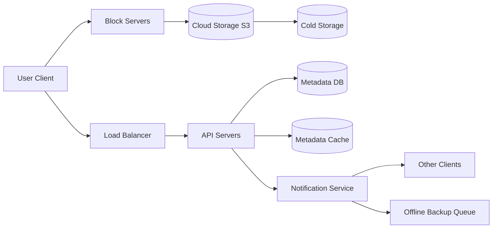
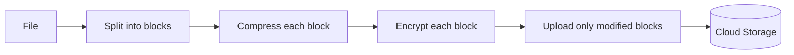
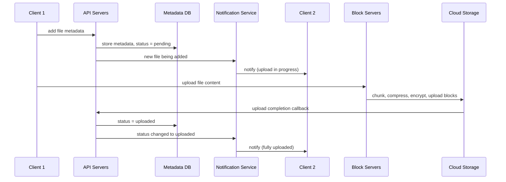

# Design Google Drive · Vol 1 Ch 15

> How to build a cloud file storage and sync service that uploads/downloads files, keeps them in sync across devices, saves bandwidth with block-level delta sync, and never loses data.

## 1. The Problem in Plain English

Google Drive (like Dropbox, OneDrive, iCloud) stores your documents, photos, videos, and files in the cloud so you can reach them from any computer, phone, or tablet — and share them with others. When you change a file on one device, it should automatically appear updated on your other devices.

## 2. Requirements (Functional & Non-Functional)

**Functional**
- **Add (upload) files** (drag and drop).
- **Download files.**
- **Sync files across multiple devices** — a change on one device auto-syncs to others.
- **See file revisions** (version history).
- **Share files** with others.
- **Send notifications** when a file is edited, deleted, or shared with you.
- **Any file type.**
- Files must be **encrypted** in storage.
- Max file size: **10 GB**.

**Out of scope:** Google Docs real-time collaborative editing.

**Non-Functional**
- **Reliability** — data loss is unacceptable.
- **Fast sync speed.**
- **Low bandwidth usage** (important on mobile data).
- **Scalability**, **high availability**.

**Scale**
- **10 million DAU** (50 million signed-up users).

## 3. Back-of-the-Envelope Estimation

- **50M signed-up users, 10M DAU**; each gets **10 GB free**.
- Users upload **2 files/day**, average size **500 KB**; **1:1 read-to-write ratio**.
- **Total space** = 50M × 10 GB = **500 Petabytes**.
- **Upload QPS** = 10M × 2 ÷ 24 ÷ 3600 ≈ **240**.
- **Peak QPS** ≈ **480**.

## 4. High-Level Design

**The book starts with a single server** (a web server + MySQL + a `drive/` directory). Under `drive/` each user has a **namespace** (their root directory) holding their files; a file is uniquely identified by joining **namespace + relative path**.

**APIs (all over HTTPS/SSL, all authenticated):**
1. **Upload** — two types: **simple upload** (small files) and **resumable upload** (large files / flaky networks). Resumable example: `.../files/upload?uploadType=resumable`, done in 3 steps: send initial request to get the resumable URL, upload data while monitoring state, and resume if interrupted.
2. **Download** — `.../files/download` with a `path` param.
3. **Get file revisions** — `.../files/list_revisions` with `path` and `limit`.

**Growing past one server:**
- **Shard the database** (e.g., by `user_id`) when disk fills up.
- Move files to **Amazon S3** (object storage) — supports **same-region and cross-region replication**; redundant copies in **multiple regions** guard against data loss. A **bucket** is like a folder.
- Add a **load balancer** (redistributes traffic; handles a downed web server).
- Add more **web servers** (easy to add/remove).
- Move the **metadata database** off the server; add **replication + sharding**.
- **File storage** = S3, replicated across **two geographic regions**.

**Sync conflicts:** when two users edit the same file at the same time, the **first version processed wins**; the later one gets a **conflict**. The system then shows the losing user **both copies** (their local copy + the latest server version) so they can **merge** or **override**.

**High-level components:**
- **User** — browser or mobile app.
- **Block servers** — split a file into **blocks** (each with a unique hash), compress, encrypt, and upload them to cloud storage. Dropbox uses a **max block size of 4 MB**. To rebuild a file, join its blocks in order.
- **Cloud storage (S3)** — stores the blocks.
- **Cold storage** — for inactive data not accessed for a long time.
- **Load balancer**, **API servers** (auth, profiles, metadata — everything except uploading).
- **Metadata database** — metadata of users, files, blocks, versions (files themselves are in the cloud).
- **Metadata cache** — caches some metadata.
- **Notification service** — a **publish/subscribe** system that tells clients when a file was added/edited/removed elsewhere so they pull changes.
- **Offline backup queue** — stores change info for offline clients to sync when they return.

## 5. Deep Dive

### Block servers
Re-sending an entire large file on every edit wastes bandwidth. Two optimizations:
- **Delta sync** — when a file changes, only the **modified blocks** are synced (using a sync algorithm like rsync). Example: if only "block 2" and "block 5" changed, only those two are uploaded.
- **Compression** — compress blocks by file type (e.g., **gzip / bzip2** for text; different algorithms for images/videos).

So block servers **split → compress → encrypt** each block, then upload only the changed blocks.

### High consistency requirement
The system needs **strong consistency** by default — a file must not look different on different clients at the same time. To achieve it:
- Keep **cache replicas and the master consistent**.
- **Invalidate the cache on every database write** so cache and DB match.

Memory caches default to **eventual consistency** (replicas may differ). Relational databases give strong consistency easily via **ACID** (Atomicity, Consistency, Isolation, Durability); NoSQL doesn't support ACID by default (you'd have to code it). **So the book chooses a relational database.**

### Metadata database (simplified schema)
- **User** — username, email, profile photo.
- **Device** — device info; **`push_id`** for push notifications (a user can have many devices).
- **Namespace** — the user's root directory.
- **File** — everything about the latest file.
- **File_version** — version history; existing rows are **read-only** to keep revision integrity.
- **Block** — block info; any file version is rebuilt by joining its blocks in order.

### Upload flow
Two requests run **in parallel** from client 1: add metadata, and upload the file.

Editing a file follows a similar flow.

### Download flow
Triggered when a file changes elsewhere. A client learns of a change in two ways: if **online**, the **notification service** tells it to pull; if **offline**, the change is saved so it pulls when back online. Steps:
1. Notification service tells client 2 a file changed.
2. Client 2 requests metadata via API servers.
3. API servers fetch metadata from the metadata DB.
4. Metadata returned to API servers.
5. Client 2 gets the metadata.
6. Client 2 asks **block servers** to download blocks.
7. Block servers download blocks from cloud storage.
8. Cloud storage returns the blocks.
9. Client 2 downloads new blocks and **reconstructs the file**.

### Notification service
Keeps clients up to date. Options: **long polling** (used by Dropbox) or **WebSocket**. **The book chooses long polling** because:
- notifications are **one-directional** (server → client only),
- WebSocket suits real-time **bi-directional** apps like chat, but Drive sends notifications **infrequently** with no bursts.

With long polling, each client holds an open connection; when a change is detected, the client **closes the connection**, connects to the metadata server to download changes, then immediately opens a **new** long-poll request.

### Save storage space
Version history × multiple data centers fills storage fast. Three techniques:
- **De-duplicate data blocks** — drop redundant blocks at the account level; **two blocks are identical if they have the same hash**.
- **Intelligent backup strategy** — **set a limit** on stored versions (oldest replaced by newest), and **keep valuable versions only** (a heavily edited file could be saved 1000+ times; give more weight to recent versions; experiment to find the optimal count).
- **Move infrequently used data to cold storage** — cold data (inactive for months/years) → cheaper storage like **Amazon S3 Glacier**.

## 6. Scaling, Bottlenecks & Trade-offs

- Evolved from **one server → sharded DB → S3 → decoupled web/DB/storage** with load balancers.
- **Bandwidth** is the key concern → **delta sync + compression** at the block level.
- **Strong consistency** required → relational DB + cache invalidation on write (trade some flexibility of NoSQL for ACID).
- **Long polling vs WebSocket** → long polling chosen because notifications are one-way and infrequent.
- **Alternative discussed:** upload **directly from client to cloud storage** (only one transfer, faster) vs going through block servers. Drawbacks of direct upload: chunking/compression/encryption logic must be re-implemented per platform (iOS/Android/Web) — error-prone; and putting **encryption on the client is insecure** (clients can be hacked). So block servers centralize this logic.
- **Presence service** (future evolution): move online/offline logic out of notification servers so other services can reuse it.

## 7. Failure / Edge Cases

- **Load balancer failure** — a **secondary** takes over (they monitor each other via **heartbeat**).
- **Block server failure** — other servers pick up pending jobs.
- **Cloud storage failure** — S3 buckets replicated across regions; fetch from another region.
- **API server failure** — stateless; load balancer redirects.
- **Metadata cache failure** — replicated; read from other nodes, replace the dead one.
- **Metadata DB** — **master down**: promote a slave to master and add a new slave; **slave down**: use another slave for reads and add a replacement.
- **Notification service failure** — each server holds **1M+ long-poll connections** (per Dropbox 2012). If it dies, all connections drop and clients must **reconnect to a different server** — a **slow** process since one server can't reconnect everyone at once.
- **Offline backup queue failure** — queues are replicated; consumers re-subscribe to the backup queue.
- **Sync conflict** — first write wins; loser is shown both copies to merge/override.

## 8. Key Takeaways

- Split files into **blocks (max 4 MB)**, each with a **hash**; store blocks in **cloud storage (S3)** and only **metadata** in the DB.
- Save bandwidth with **delta sync** (upload only changed blocks) + **compression**; block servers also **encrypt**.
- Choose a **relational DB** for **strong consistency (ACID)**; invalidate cache on writes.
- Use a **notification service with long polling** (one-way, infrequent) to trigger client pulls; **offline backup queue** for offline clients.
- Save space via **block de-duplication (by hash)**, **version limits / keeping valuable versions**, and **cold storage (S3 Glacier)**.
- Keep chunk/compress/encrypt logic **centralized in block servers** rather than on clients.

## 9. New Terms & Glossary

- **Namespace** — a user's root directory in the storage system.
- **Block / block-level storage** — a file split into fixed-size pieces (max 4 MB), each stored independently.
- **Block servers** — servers that split, compress, encrypt, and upload/download blocks.
- **Delta sync** — syncing only the changed blocks of a file, not the whole file.
- **Compression** — shrinking data (e.g., gzip/bzip2 for text) to save bandwidth.
- **De-duplication** — removing redundant identical blocks (same hash).
- **Metadata database** — stores info about users, files, blocks, and versions (not the file bytes).
- **Object storage / bucket** — cloud storage (Amazon S3) where a bucket acts like a folder.
- **Same-region / cross-region replication** — copying data within or across geographic regions.
- **Cold storage / S3 Glacier** — cheap storage for rarely accessed (inactive) data.
- **Resumable upload** — an upload that can continue after a network interruption.
- **Strong vs eventual consistency** — all clients see the same data immediately, vs replicas that may briefly differ.
- **ACID** — Atomicity, Consistency, Isolation, Durability (guarantees in relational DBs).
- **Long polling** — client holds a request open until the server has an update, then reconnects.
- **Notification service** — pub/sub system informing clients of file changes.
- **Offline backup queue** — stores changes for offline clients to sync later.
- **Heartbeat** — periodic signal used to detect if a component (e.g., a load balancer) is alive.
- **Sync conflict** — two clients editing the same file at once; first-processed wins.
