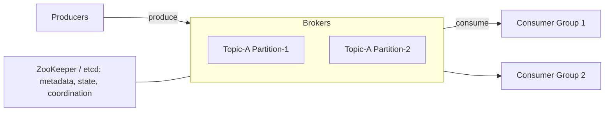
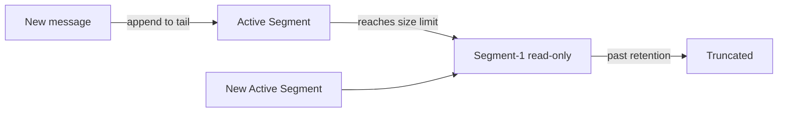
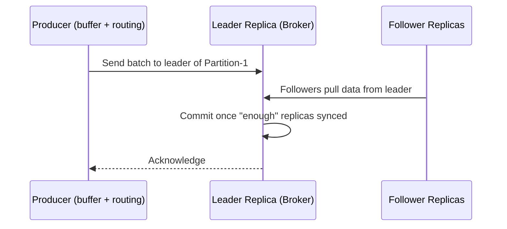
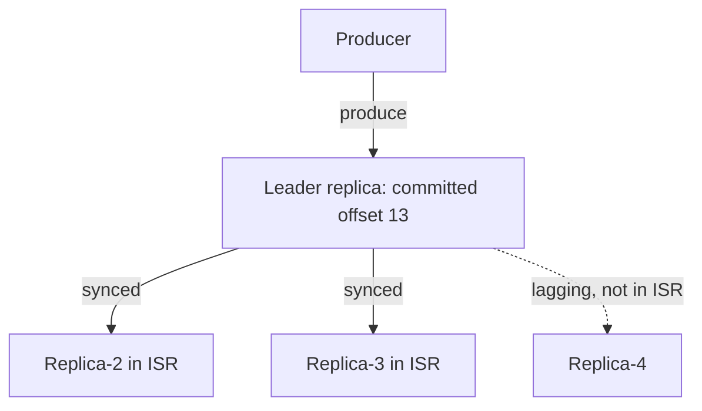

# Design a Distributed Message Queue · Vol 2 Ch 4

> A scalable message queue where producers send messages and consumers read them, with event-streaming extras: long retention, repeated consumption, ordering, replication, and configurable delivery semantics — built on a write-ahead log.

## 1. The Problem in Plain English

A message queue sits between parts of a system so they can talk without being tightly connected. **Producers** put messages in; **consumers** take them out. Benefits: **decoupling** (components update independently), **scalability** (scale producers/consumers separately), **availability** (one part offline doesn't block others), and **performance** (asynchronous — no waiting for each other).

Popular examples: Kafka, RabbitMQ, RocketMQ, ActiveMQ, Pulsar, ZeroMQ. Strictly, Kafka and Pulsar are **event streaming platforms**, but features are converging. This chapter designs a queue with **streaming extras** (long retention, repeated consumption, ordering) and notes where the design can be simplified for a traditional queue.

## 2. Requirements (Functional & Non-Functional)

**Functional**
- Producers send messages to a queue; consumers consume them.
- Messages can be consumed **repeatedly** or only once.
- Historical data can be **truncated**.
- Message size in the **kilobyte** range (text only).
- Deliver messages **in order** they were added.
- **Configurable delivery semantics:** at-most-once, at-least-once, exactly-once.

**Non-Functional**
- **High throughput OR low latency** — configurable per use case.
- **Scalable** and distributed; handle sudden surges.
- **Persistent and durable** — data on disk, replicated across nodes.
- Data retention: **two weeks**.

**Traditional queue simplification:** traditional queues (e.g., RabbitMQ) keep messages in memory just long enough to be consumed, with small on-disk overflow, and don't guarantee ordering — much simpler.

## 3. Back-of-the-Envelope Estimation

The book doesn't do heavy number-crunching here; it frames three throughput-driven design choices instead:
1. Use an **on-disk data structure** that exploits fast **sequential access** of rotational disks and aggressive OS disk caching.
2. Design the **message structure** so a message passes producer → queue → consumer with **no modification** (no expensive copying).
3. Favor **batching** everywhere — producers send batches, the queue persists larger batches, consumers fetch batches. Small I/O is the enemy of throughput.

## 4. High-Level Design

**Messaging models:**
- **Point-to-point:** a message goes to a queue and is consumed by exactly **one** consumer, then removed (no retention). Common in traditional queues.
- **Publish-subscribe:** a message is sent to a **topic** and received by **all** consumers subscribed to that topic.

This design supports both: pub-sub via **topics**, and point-to-point simulated via **consumer groups**.

**Core concepts:**
- **Topic:** a named category of messages (unique name).
- **Partition (sharding):** a topic is split into partitions spread across servers, so capacity scales by adding partitions. Each partition is a FIFO queue; a message's position in a partition is its **offset**.
- **Broker:** a server that holds partitions.
- **Message key:** optional; messages with the same key go to the same partition (`hash(key) % numPartitions`). No key → random partition.
- **Consumer group:** a set of consumers working together. Each group keeps its own offsets. A **single partition can be consumed by only one consumer within a group**. If a group has more consumers than partitions, some consumers get nothing. Putting all consumers in one group = point-to-point.

**Storage & coordination:**
- **Data storage** — the messages themselves.
- **State storage** — consumer states (offsets, partition→consumer mapping).
- **Metadata storage** — topic config (partitions, retention, replica distribution).
- **Coordination service** — service discovery (which brokers are alive) and **leader election** (one broker becomes the **active controller** that assigns partitions). Uses **ZooKeeper** or **etcd**.

## 5. Deep Dive

### Data storage: Write-Ahead Log (WAL)

Traffic is write-heavy, read-heavy, no updates/deletes, mostly sequential. A database doesn't fit both heavy patterns at scale. Instead use a **WAL** — an append-only log file (like MySQL's redo log or ZooKeeper's WAL).

- New messages append to the **tail** of a partition with a monotonically increasing **offset** (line number is the simplest offset).
- A file can't grow forever, so split into **segments**. Only the **active segment** receives new messages; when it hits a size limit, a new active segment is created and the old one becomes read-only. Old non-active segments are **truncated** when past retention/capacity.
- Segments live in a folder `Partition-{partition_id}`.
- **Disk myth:** rotational disks are slow only for *random* access. For *sequential* access, disks in **RAID** achieve several hundred MB/sec. The OS also caches disk data aggressively in memory.

### Message data structure

Schema: `key, value, topic, partition, offset, timestamp, size, CRC`.
- **Key** decides the partition (not the same as the partition number; not required to be unique — unlike a KV-store key).
- **Value** is the payload (text or compressed binary).
- **Offset** = position in the partition; a message is found via (topic, partition, offset).
- **CRC** (cyclic redundancy check) ensures data integrity.
- Optional fields (e.g., **tags**) support features like message filtering.
- Keeping this contract identical across producer/queue/consumer avoids costly copying.

### Batching

Batching improves throughput (fewer network round-trips; larger sequential disk writes/OS-cache pages) but increases latency (waiting to fill a batch). It's a **throughput-vs-latency trade-off** — tune batch size per use case; latency-sensitive queues use smaller batches (and may need more partitions to keep throughput up).

### Producer flow

Instead of a separate routing layer (extra hops, no batching), **wrap routing + a buffer into the producer client library**. Benefits: fewer hops (lower latency), custom partition logic, and in-memory batching.

### Consumer flow — push vs pull

- **Push:** low latency, but can overwhelm slow consumers and struggles with diverse consumer speeds.
- **Pull (chosen by most queues):** consumers control the rate, can process real-time or batch, scale out to catch up, and pull all available messages at once (great for batching). Downside: consumers may keep polling an empty broker — fixed by **long polling** (wait a set time for new messages).

The consumer specifies an offset and gets back a chunk of events from there.

### Consumer group coordination & rebalancing

A **coordinator** manages the group via heartbeats. When a consumer **joins**, **leaves**, or **crashes** (missed heartbeats), the coordinator triggers **rebalancing**: consumers rejoin, one is elected **leader**, the leader builds a **partition dispatch plan**, and consumers start consuming their newly assigned partitions.

### State storage

Stores partition→consumer mapping and each group's **last consumed offset** per partition (e.g., group-1 offset = 6, group-2 offset = 13). If a consumer crashes, another in the same group resumes from the stored offset. Access is frequent read/write, small volume, random, needs consistency → a KV store like **ZooKeeper** (Kafka later moved offsets to brokers).

### Metadata storage

Topic config/properties (partition count, retention, replica distribution). Small, infrequently changed, high consistency → **ZooKeeper**.

### ZooKeeper role

Holds metadata + state storage and does broker leader election, so brokers only need to manage message data storage.

### Replication and In-Sync Replicas (ISR)

Each partition has multiple **replicas** across different brokers — one **leader**, the rest **followers**. Producers write only to the leader; followers **pull** from it. The **replica distribution plan** (which brokers hold which replicas) is generated by the elected controller and stored in metadata.

**In-Sync Replicas (ISR):** replicas caught up with the leader (within a configured lag, e.g., `replica.lag.max.messages`). The leader is always an ISR. A replica that falls behind drops out of ISR and rejoins when it catches up. **Committed offset** = all messages up to it are synced to all ISRs. ISR is the trade-off between **performance and durability** — waiting for all replicas is safest but a slow replica slows the whole partition.

**ACK settings (durability vs latency):**
- **ACK=all:** producer waits until all ISRs receive the message — strongest durability, highest latency.
- **ACK=1:** producer gets ACK once the leader persists — faster, but if the leader dies before replication the message is lost. Good for low-latency with acceptable occasional loss.
- **ACK=0:** producer never waits and never retries — lowest latency, possible loss. Good for high-volume metrics/logging.

Consumers usually read from the **leader** (simpler; connections limited by partitions-per-group). Reading from the closest ISR is possible when consumers are in a different data center.

### Scalability

- **Producers:** trivial — add/remove instances (no group coordination).
- **Consumers:** add/remove groups freely; within a group, rebalancing handles adds/removes/crashes.
- **Brokers — failure recovery:** when a broker crashes, its partitions are lost; the controller detects it and generates a new replica distribution plan so surviving brokers get new follower replicas that catch up to the leader. Guidelines: enough minimum ISRs, replicas **not** on the same node, and spreading across data centers is safer but costlier (data mirroring helps cross-DC).
- **Adding a broker:** temporarily allow **more replicas than configured** — the new broker copies from the leader, and once caught up, redundant old replicas are gracefully removed (avoids data loss). Removing brokers works similarly.
- **Partitions:** producers get notified and consumers rebalance when partition count changes (safe for both).
  - **Increase partitions:** old messages stay put (no migration); new messages spread across all partitions.
  - **Decrease partitions:** harder — the decommissioned partition stops receiving new messages but **can't be deleted immediately** (consumers may still read it); only after the retention period passes can data be truncated. Reducing partitions is not a shortcut to reclaim space.

### Data delivery semantics

- **At-most-once:** message delivered ≤ once; may be lost, never redelivered. Producer uses ACK=0 with no retry; consumer commits offset **before** processing. Good for metrics where small loss is fine.
- **At-least-once:** never lost, but may be delivered more than once. Producer uses ACK=1/all and **retries**; consumer commits offset **only after** successful processing (a crash after processing but before commit → reprocessing → duplicate). Good when duplicates are tolerable or dedupable (e.g., a unique key rejects duplicate DB writes).
- **Exactly-once:** hardest and most expensive; each message processed exactly once. Needed for financial use cases (payments, trading) where duplication is unacceptable and downstream isn't idempotent.

### Advanced features

- **Message filtering:** don't make consumers fetch everything and filter (wasteful). Filter on the **broker side** using **tags stored in message metadata** (not the payload — avoids decryption/deserialization cost and keeps sensitive data unreadable). A list of tags supports most filtering; complex logic (formulae) would need a parser — too heavyweight.
- **Delayed / scheduled messages:** send to **temporary storage** on the broker instead of the topic, then deliver when time's up. Timing implemented via **predefined delay levels** (e.g., RocketMQ: 1s, 5s, 10s, ... 1h, 2h) or a **hierarchical time wheel**.

## 6. Scaling, Bottlenecks & Trade-offs

- **Throughput vs latency:** larger batches and ACK=all/more replicas boost durability/throughput at the cost of latency.
- **WAL + sequential disk + OS cache** is the throughput foundation; small random I/O is the enemy.
- **Partitions** are the scaling unit — allocate enough in advance so you only add consumers to scale.
- **Pull model + long polling** balances consumer control against wasted polling.
- **Replica placement** trades data safety against cost/latency (spread across nodes/DCs).

## 7. Failure / Edge Cases

- **Broker crash** → controller rebuilds the replica distribution plan; new followers catch up.
- **Consumer crash** → missed heartbeats trigger rebalance; another consumer resumes from stored offset.
- **Leader dies with ACK=1** before replication → message lost.
- **Slow replica** → drops out of ISR, rejoins after catching up.
- **Consumer commits offset before processing then crashes** → message lost (at-most-once).
- **Consumer processes then fails to commit** → message reprocessed (at-least-once duplicate).
- **Decommissioned partition** → can't be deleted until retention passes.
- **Failed consumption** → send to a dedicated **retry topic** to consume later without blocking.

## 8. Key Takeaways

- **Topics → partitions → brokers** is the scaling backbone; a partition is a FIFO log with **offsets**.
- Persist messages as an **append-only WAL** in **segments**, exploiting sequential disk speed and OS caching.
- **Replication with a leader + ISR** gives durability; **configurable ACK** trades durability for latency.
- **Consumer groups + rebalancing** support both point-to-point and pub-sub and give fault tolerance.
- **Pull model** with **long polling** lets consumers control their rate.
- **Delivery semantics** (at-most / at-least / exactly-once) are chosen per use case.

## 9. New Terms & Glossary

- **Producer / Consumer:** clients that send / read messages.
- **Broker:** server holding partitions.
- **Topic:** named message category.
- **Partition:** a shard of a topic; a FIFO log.
- **Offset:** a message's position within a partition.
- **Message key:** value that maps a message to a partition.
- **Consumer group:** consumers sharing partitions and offsets.
- **WAL (Write-Ahead Log):** append-only log file used for storage.
- **Segment:** a chunk of the WAL; only the active one takes writes.
- **Replica / Leader / Follower:** copies of a partition; the leader takes writes.
- **ISR (In-Sync Replicas):** replicas caught up with the leader.
- **Committed offset:** offset synced to all ISRs (safe to consume).
- **ACK (0 / 1 / all):** how many replicas must confirm before the producer is acknowledged.
- **Coordinator / controller:** manages consumer rebalancing / partition assignment.
- **Rebalancing:** reassigning partitions when group membership changes.
- **At-most / at-least / exactly-once:** delivery guarantees.
- **CRC:** integrity check on message bytes.
- **Long polling:** consumer waits a set time for new messages instead of busy-polling.
- **ZooKeeper / etcd:** coordination services for metadata, state, and leader election.
