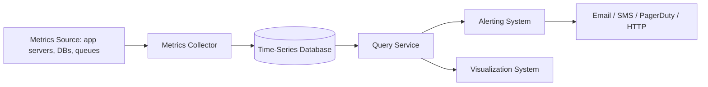
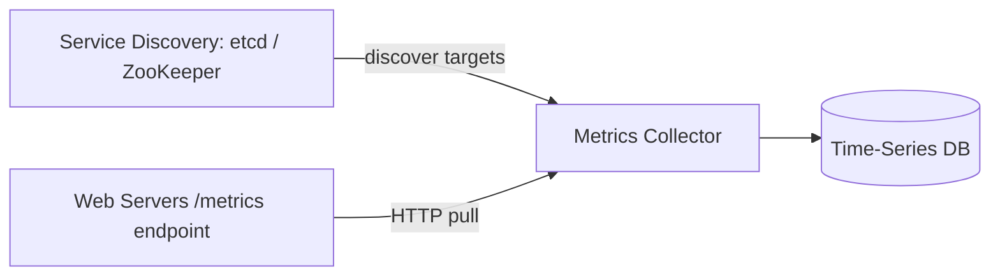
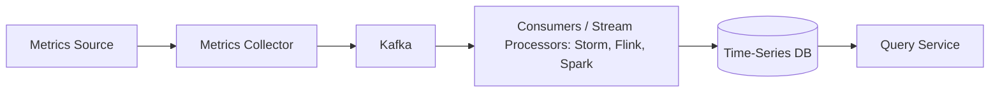
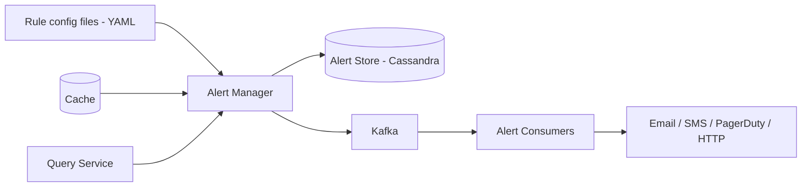

# Design a Metrics Monitoring and Alerting System · Vol 2 Ch 5

> An internal system that collects operational metrics (CPU, memory, requests/sec), stores them in a time-series database, alerts on threshold violations, and visualizes them on dashboards.

## 1. The Problem in Plain English

A monitoring and alerting system watches the health of your infrastructure so you know when something breaks. It gathers **metrics** (like CPU load or requests per second) from many servers, stores them efficiently, shows them on dashboards, and **fires alerts** (email, phone, PagerDuty, webhook) when values cross a threshold.

Popular tools: Datadog, InfluxDB, Nagios, Prometheus, Grafana. Here we build a similar system **for internal use** at a large company.

## 2. Requirements (Functional & Non-Functional)

**Functional / scope (from the interview)**
- Collect **operational system metrics** — low-level (CPU load, memory, disk usage) and high-level (requests per second, running server count). **Business metrics are out of scope.**
- Scale of monitored infra: **100 million DAU, 1,000 server pools, ~100 machines per pool → ~10 million metrics.**
- **Data retention: 1 year.** Resolution roll-up policy: keep raw for **7 days**, roll up to **1-minute resolution for 30 days**, then **1-hour resolution for 1 year**.
- Alert channels: **email, phone, PagerDuty, webhook (HTTP endpoints).**
- **Out of scope:** log monitoring (ELK stack) and distributed tracing (Dapper/Zipkin).

**Non-Functional**
- **Scalability** — grow with metrics/alert volume.
- **Low latency** — fast queries for dashboards and alerts.
- **Reliability** — never miss critical alerts.
- **Flexibility** — easy to integrate new technologies later.

## 3. Back-of-the-Envelope Estimation

- ~**10 million operational metrics** written per day; collected at high frequency → **write-heavy**.
- **Read load is spiky/bursty** — visualization and alerting query the DB depending on dashboard/alert access patterns.
- So: **constant heavy writes + bursty reads.**
- Benchmark cited: an **InfluxDB** with 8 cores + 32 GB RAM handles **> 250,000 writes/sec** (and > 1,000,000 unique series).

## 4. High-Level Design

Five fundamental components: **data collection, data transmission, data storage, alerting, visualization.**

- **Metrics source** — application servers, SQL databases, message queues, etc.
- **Metrics collector** — gathers metrics and writes them into the time-series DB.
- **Time-series database** — stores metrics as time series; provides a custom query interface and maintains **indexes on labels** for fast lookups.
- **Query service** — thin wrapper making it easy to query the TSDB (can be replaced entirely by the TSDB's own query interface).
- **Alerting system** — sends alert notifications to channels.
- **Visualization system** — graphs/charts (dashboards).

### Data model — time series

Metrics are **time series**: a series is uniquely identified by a **metric name** plus a set of **labels/tags**, holding an array of (value, timestamp) pairs.

Example data point:
- `metric_name: cpu.load`, `labels: host:i631,env:prod`, `timestamp: 1613707265`, `value: 0.29`.

The **line protocol** (used by Prometheus and OpenTSDB) looks like:
`CPU.load host=webserver01,region=us-west 1613707265 50`

### Why a time-series database (not MySQL/NoSQL)?

- A general-purpose **relational DB** isn't optimized for time-series operations (e.g., a rolling moving average needs ugly SQL), needs an index per tag, and struggles under constant heavy writes.
- **NoSQL** (Cassandra, Bigtable) *can* work but requires deep expertise to design a good schema.
- **Purpose-built TSDBs** (InfluxDB, Prometheus, OpenTSDB, Twitter's MetricsDB, Amazon Timestream) use far fewer servers, have easier query languages, and handle retention/aggregation. The two most popular are **InfluxDB** and **Prometheus** (in-memory cache + on-disk storage). InfluxDB builds indexes on labels for fast lookup; keep labels **low cardinality** (small set of values) or you overload the DB.

## 5. Deep Dive

### Metrics collection — pull vs push

Occasional data loss is acceptable for metrics (fire-and-forget is fine).

**Pull model (e.g., Prometheus):** a dedicated metrics collector periodically pulls metric values from running apps via an HTTP endpoint (e.g., `/metrics`).
- The collector must know all service endpoints. Don't hardcode a file — use **Service Discovery** (etcd, ZooKeeper) so services register themselves and the collector is notified when endpoints change.
- Flow: collector fetches endpoint metadata (interval, IPs, timeout, retry) from Service Discovery → pulls via HTTP → optionally registers for change notifications.
- One collector can't handle thousands of servers → use a **pool of collectors**. To avoid duplicate pulls, use a **consistent hash ring**: each collector owns a range, each monitored server maps to the ring by name, so each server is handled by exactly one collector.

**Push model (e.g., Amazon CloudWatch, Graphite):** a **collection agent** installed on each monitored server pushes metrics to the collector, and can **aggregate locally** first (reducing volume). If the collector is overwhelmed, the agent buffers locally and resends — but in auto-scaling groups (servers rotated out), local buffering risks data loss. The collector should be an **auto-scaling cluster behind a load balancer**, scaling on CPU load.

**Pull vs push comparison (highlights):**
- **Easy debugging:** pull wins (hit `/metrics` from anywhere, even your laptop).
- **Health check:** pull wins (no response ⇒ server down).
- **Short-lived jobs:** push wins (jobs may end before being pulled; pull can add **push gateways**).
- **Firewalls / complex networks:** push wins (collector with LB + auto-scaling can receive from anywhere).
- **Performance:** push often uses UDP (lower latency); pull uses TCP.
- **Data authenticity:** pull wins (endpoints are pre-defined in config); push can whitelist/authenticate.

No clear winner — large orgs often support **both**, especially with serverless (no agent to install).

### Scale the metrics transmission pipeline

Risk: if the TSDB is unavailable, data is lost. Add a **queue (Kafka)** between the collector and the TSDB.

- Kafka is a reliable, scalable buffer that **decouples collection from processing** and prevents data loss when the DB is down.
- **Scale through Kafka partitions:** set partition count by throughput; **partition by metric name** (consumers aggregate per metric); further partition by **tags/labels**; categorize/prioritize so important metrics are processed first.
- **Alternative to Kafka:** running production Kafka is heavy. Facebook's **Gorilla** in-memory TSDB stays highly available for writes even during partial network failure — arguably as reliable as an intermediate queue.

### Where aggregation happens

- **Collection agent (client-side):** only simple aggregation (e.g., a counter per minute).
- **Ingestion pipeline (before storage):** needs stream processing (Flink); greatly reduces write volume, but loses raw-data precision and struggles with late-arriving events.
- **Query side (after storage):** aggregate raw data at query time — no data loss, but slower queries (computed over the whole dataset).

### Query service and cache

A cluster of query servers sits between the TSDB and the visualization/alerting systems, decoupling them so you can swap the TSDB or front-ends. Add a **cache layer** to store query results and reduce TSDB load.
**Case against a query service:** most industrial visualization/alerting tools already have powerful plugins for popular TSDBs, and a good TSDB doesn't need your own cache — so you may not need to build this.

### Time-series query language

Prometheus and InfluxDB **don't use SQL** — SQL for time series is hard (a moving average is a deeply nested SQL query). InfluxDB's **Flux** language expresses the same in a few readable lines (`range`, `filter`, `exponentialMovingAverage`).

### Storage layer

- **Choose the TSDB carefully:** per a Facebook paper, ≥ 85% of queries hit data from the **past 26 hours** — a TSDB exploiting this greatly boosts performance.
- **Data encoding & compression (double-delta encoding):** store deltas instead of absolute values. Timestamps 10 seconds apart need only ~4 bits instead of 32. Example: `1610087371, 10, 10, 9, 11`.
- **Downsampling:** convert high-resolution to low-resolution to save disk, matching the retention policy: 7 days raw → 30 days at 1-minute → 1 year at 1-hour. (Example: roll up 10-second data to 30-second averages.)
- **Cold storage:** move rarely-used inactive data to cheaper storage.
- Overall recommendation: **use third-party visualization/alerting** rather than building your own.

### Alerting system

Flow:
1. Load alert **rules** (config files, typically **YAML**, e.g., `expr: up == 0`, `for: 5m`) into cache.
2. **Alert manager** fetches rules from cache.
3. On a schedule, the manager calls the **query service**; if a value violates a threshold, it creates an alert event. The manager also:
   - **Filters, merges, dedupes** alerts (e.g., merge 3 "disk_usage > 90%" events on the same instance into one alert).
   - Enforces **access control**.
   - **Retries** to ensure a notification is sent **at least once**.
4. **Alert store** (a KV DB like **Cassandra**) keeps each alert's **state** (inactive, pending, firing, resolved) and guarantees at-least-once notification.
5. Eligible alerts go into **Kafka**.
6. **Alert consumers** pull events from Kafka.
7. Consumers send notifications to email, SMS, PagerDuty, or HTTP endpoints.

**Build vs buy:** many off-the-shelf alerting systems integrate tightly with TSDBs and channels — hard to justify building your own; be ready to defend the decision in a senior interview.

### Visualization system

Built on top of the data layer — dashboards over various time scales (server requests, CPU/memory, page load, traffic, logins) and alert dashboards. High-quality visualization is hard to build; **Grafana** is a strong off-the-shelf choice that integrates with many TSDBs.

## 6. Scaling, Bottlenecks & Trade-offs

- **Write-heavy + bursty reads** → purpose-built TSDB, not general DB.
- **Collector scaling:** pull ⇒ consistent-hash the collector pool (avoid duplicates); push ⇒ auto-scaling cluster behind an LB.
- **Kafka buffer** trades operational complexity for reliability and decoupling (Gorilla is an alternative).
- **Aggregation placement:** earlier = less storage but lost precision; later = full precision but slower queries.
- **Downsampling + encoding/compression + cold storage** manage the enormous 1-year data volume.
- **Build vs buy:** favor off-the-shelf query, alerting, and visualization tools.

## 7. Failure / Edge Cases

- **TSDB unavailable** → Kafka retains data to prevent loss.
- **Push collector overwhelmed** → agent buffers locally and resends (risky in auto-scaling groups).
- **Duplicate pulls from multiple collectors** → consistent hash ring assigns each server to one collector.
- **Short-lived batch jobs** (pull model) → use push gateways.
- **Alert storms / duplicates** → filter/merge/dedupe in the alert manager.
- **Missed alert notification** → retry + alert-store state guarantee at-least-once.
- **Occasional metric loss** → acceptable (fire-and-forget).

## 8. Key Takeaways

- Metrics are **time series**: metric name + labels + (value, timestamp) pairs; keep labels **low cardinality**.
- Use a **purpose-built TSDB** (InfluxDB/Prometheus), not a relational or NoSQL DB.
- **Pull vs push** has no clear winner — know the trade-offs; large orgs support both.
- Insert **Kafka** to decouple collection from storage and survive DB outages.
- Save space with **double-delta encoding, downsampling, and cold storage**, driven by the retention policy.
- Alerting needs **dedupe, retry, and state tracking** for at-least-once delivery.
- **Buy, don't build** query/alerting/visualization where good tools exist (e.g., Grafana).

## 9. New Terms & Glossary

- **Metric / time series:** a value stream identified by name + labels over time.
- **Label / tag:** key-value pair describing a series; indexed for lookup.
- **Cardinality:** number of distinct values a label can take (keep low).
- **Line protocol:** a common text input format for metrics (Prometheus, OpenTSDB).
- **Time-series database (TSDB):** DB optimized for time-stamped metric data (InfluxDB, Prometheus).
- **Pull vs push model:** collector pulls from apps vs agents push to the collector.
- **Service discovery (etcd / ZooKeeper):** tracks which endpoints to collect from.
- **Consistent hash ring:** assigns each monitored server to exactly one collector.
- **Push gateway:** lets short-lived jobs push metrics into a pull system.
- **Downsampling:** reducing data resolution to save space.
- **Double-delta encoding:** storing successive differences instead of absolute values.
- **Cold storage:** cheap storage for rarely-used data.
- **Alert manager / alert store:** components that evaluate rules, dedupe, and track alert state.
- **PagerDuty / webhook:** notification channels.
- **Flux / PromQL:** query languages for time-series data.
- **Grafana:** popular off-the-shelf visualization tool.
