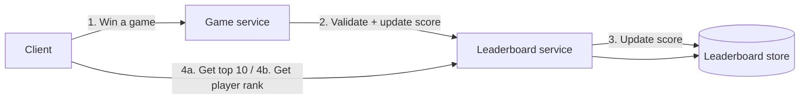
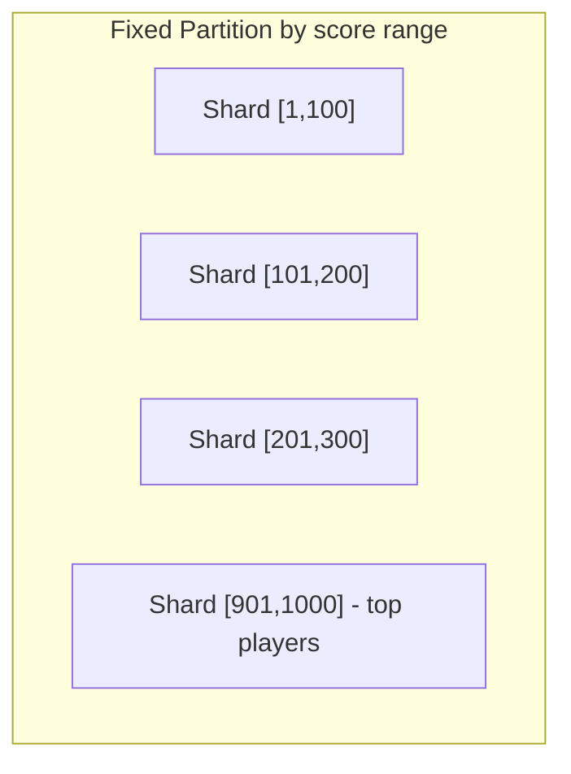

# Design a Real-time Gaming Leaderboard · Vol 2 Ch 10

> Build a leaderboard that shows the top 10 players and any user's rank in real time, powered by Redis sorted sets, and learn how to shard it for hundreds of millions of players.

## 1. The Problem in Plain English

A leaderboard shows who is winning a game or competition. Players earn points by winning matches, and the player with the most points sits at the top. We want to show:

- The **top 10 players**.
- **A specific user's rank** (their position on the board).
- Bonus: the players **four places above and below** a given user.

The tricky part is that scores change constantly and we need results to be **real-time** (or as close as possible). We cannot just show an old, batched result.

## 2. Requirements (Functional & Non-Functional)

**Functional requirements**
- Display the top 10 players on the leaderboard.
- Show a user's specific rank.
- Display players who are four places above and below a chosen user (bonus/nice-to-have).

**Rules gathered from the interviewer**
- A user gets **1 point** each time they win a match (simple point system).
- **All players** are on the leaderboard.
- Each **month** a new tournament starts a fresh leaderboard.
- If two players have the **same score, they get the same rank** (ties allowed; tie-breaking is a bonus topic).

**Non-functional requirements**
- Scores update in **real time** and are reflected on the leaderboard in real time.
- General **scalability, availability, and reliability**.

## 3. Back-of-the-Envelope Estimation

- **5 million DAU** (daily active users), **25 million MAU** (monthly active users).
- Each player plays **10 matches/day**.
- Average scoring: 5M / 86,400 s ≈ **50 users/second**. Peak is assumed 5× average → **250 users/second**.
- QPS for scoring a point: 50 × 10 = **500**; peak = 500 × 5 = **2,500 updates/sec**.
- QPS for fetching top 10 (assume loaded once per day when a user opens the game): **~50**.

**Storage:** worst case all 25M MAU have an entry. With a 24-char user id + a 2-byte (16-bit) score = **26 bytes/entry**. 26 × 25M ≈ **650 MB**. Even doubled for skip-list/hash overhead, one modern Redis server easily holds it, and 2,500 updates/sec is well within one node's capacity.

## 4. High-Level Design

Two services:
- **Game service** – lets users play; validates that a win is real.
- **Leaderboard service** – creates and displays the leaderboard, reads/writes the **leaderboard store**.

**Key design decisions**
- The **client must NOT set the score directly.** If the client set it, an attacker could use a proxy (man-in-the-middle attack) to change scores. Scores are set **server-side**. For server-authoritative games (e.g. online poker) the game server knows the result and sets the score without the client.
- **No message queue** in this design. A Kafka queue would help *if* scores were consumed by many services (analytics, push notifications, multiplayer notifications), but that is not a requirement here, so it is left out.

**APIs**
- `POST /v1/scores` – internal only (called by game servers). Fields: `user_id`, `points`. Returns 200 (success) or 400 (fail).
- `GET /v1/scores` – fetch top 10 (returns `user_id`, `user_name`, `rank`, `score`).
- `GET /v1/scores/{:user_id}` – fetch a specific user's rank and score.

**Data model options**

*Relational database (rejected for scale):* one table with `user_id` and `score`. Insert on first win, `UPDATE ... SET score = score + 1` afterwards. To get a rank, sort by score descending. This works for small data but a rank query is essentially a **table scan over millions of rows**, taking tens of seconds — far too slow for real-time. `LIMIT 10` helps only for the top 10 and does not solve finding an arbitrary user's rank. Caching doesn't help because data changes constantly.

*Redis sorted sets (chosen):* Redis is an **in-memory** key-value store, so reads/writes are fast. Its **sorted set** type is ideal.

## 5. Deep Dive

### Redis sorted sets
A sorted set is like a set (unique members) where every member has a **score**. Scores can repeat. Internally it uses **two structures**: a **hash table** (maps user → score) and a **skip list** (maps score → user, kept sorted).

A **skip list** is a sorted linked list with multiple index levels. The base list has O(n) search. Adding a level-1 index that skips every other node, then a level-2 index, etc., lets you jump quickly like binary search. In the book's example, reaching a node needs traversing **62 nodes** in the base list but only **11 nodes** with 5 index levels. Insert/find/update in a sorted set is **O(log n)** — much better than a relational DB, where getting one user's rank needs a nested `COUNT(*)` sub-query.

### Redis operations used
- **ZADD** – insert a user (or update score if they exist). O(log n).
- **ZINCRBY** – increment a user's score by an amount (starts at 0 if new). O(log n).
- **ZRANGE / ZREVRANGE** – fetch a range of users sorted by score. O(log n + m), m = number returned.
- **ZRANK / ZREVRANK** – fetch a user's position (ascending/descending). O(log n).

### Workflow
Each month a new sorted set is created (e.g. `leaderboard_feb_2021`); old ones move to historical storage.

1. **User scores a point:** `ZINCRBY leaderboard_feb_2021 1 'mary1934'`.
2. **Top 10:** `ZREVRANGE leaderboard_feb_2021 0 9 WITHSCORES` (rev = high to low; WITHSCORES also returns each score).
3. **A user's rank:** `ZREVRANK leaderboard_feb_2021 'mary1934'`.
4. **4 above and below** (e.g. user at rank 361): `ZREVRANGE leaderboard_feb_2021 357 365`.

### Supporting tables
Two MySQL tables back up the Redis data: a **user table** (id, display name, etc.) and a **point table** (user id, score, timestamp per win). The point table supports play history and lets us **rebuild the Redis leaderboard** after a failure. Optionally cache top-10 user details for fast display.

### Cloud vs self-managed
- **Manage our own services:** monthly sorted set in Redis; user names/profile images in MySQL, joined at fetch time; optional user-profile cache for the top 10.
- **Build on the cloud (AWS):** use **Amazon API Gateway** + **AWS Lambda** (serverless). Three Lambdas: `LeaderboardFetchTop10`, `LeaderboardFetchPlayerRank`, `LeaderboardUpdateScore`. Lambdas call Redis and MySQL and **auto-scale** with traffic. (Google Cloud Functions and Azure Functions are equivalents.) The book recommends serverless if building from scratch.

## 6. Scaling, Bottlenecks & Trade-offs

At 5M DAU one Redis node is enough. Imagine **500M DAU (100×)**: worst-case size ≈ **65 GB** and QPS ≈ **250,000/sec**. Now we must **shard**.

**Fixed partition (preferred):** split by score range. E.g. scores 1–1000 across 10 shards, each holding a range (1–100, 101–200, …). Requires roughly even score distribution (adjust ranges otherwise). We shard in application code. When inserting we must know the user's shard (look up score in MySQL, or better a **secondary cache** mapping user → score); when a user's score crosses a boundary we **move them to the new shard**. Top 10 = read the highest-range shard. A user's rank = their local rank plus the count of players in all higher shards (shard size is O(1) via `info keyspace`).

**Hash partition (Redis Cluster):** Redis Cluster auto-shards using **hash slots** (not consistent hashing). There are **16,384 hash slots**; a key's slot = `CRC16(key) % 16384`. Nodes can be added/removed without redistributing all keys. Top-10 requires a **scatter-gather**: fetch top 10 from each shard, then the application sorts/merges (queries can run in parallel).

Limits of hash partition: high latency for large top-k, waits for the slowest partition, and **no straightforward way to get a specific user's rank**. Hence the book leans toward **fixed partition**.

**Sizing:** write-heavy apps need extra memory for snapshots — allocate ~2× memory. Use the **redis-benchmark** tool to measure requests/sec on your hardware.

### Alternative: NoSQL (DynamoDB)
Pick a NoSQL that is **write-optimized** and can **sort within a partition by score** — DynamoDB, Cassandra, or MongoDB. Using DynamoDB (Redis + MySQL replaced by it):
- A denormalized table doesn't scale (full scan to find top scores), so add a **Global Secondary Index (GSI)**.
- First attempt: partition key = `game#year-month`, sort key = `score`. But all recent-month data lands in one **hot partition**.
- Fix with **write sharding**: append a partition number to the key → `game_name#{year-month}#p{partition_number}` (e.g. `chess#2020-02#p0`). Partition count is a trade-off: more partitions reduce per-partition load but add scatter-gather read complexity.
- Fetch top 10 via **scatter-gather** across partitions.
- Exact rank isn't easy, but you can compute a **percentile** (e.g. "top 10–20%") using a cron job that analyzes score distribution per shard and caches thresholds (10th percentile = score < 100, etc.). Telling a user "top 10–20%" is often better than "rank 1,200,001".

## 7. Failure / Edge Cases

- **Redis node failure:** Redis supports persistence, but restarting a large instance from disk is slow. Configure a **read replica**; on failure, promote the replica and attach a new one.
- **Large-scale cluster outage:** rebuild the leaderboard offline from MySQL — iterate every win entry (each has a timestamp) and call `ZINCRBY` once per win per user.
- **Ties:** store a Redis **hash** of user id → timestamp of most recent winning game; on a tie, the **older timestamp ranks higher** (scored first).
- **User moving between shards** (fixed partition): remove from old shard, add to new one.

## 8. Key Takeaways

- Relational DBs cannot do real-time ranking over millions of rows (table scans).
- **Redis sorted sets** give O(log n) inserts and rank lookups — the core of the design.
- Scores must be set **server-side** to prevent cheating.
- To scale to 500M DAU, shard: **fixed partition** is preferred over Redis Cluster hash partition because it can compute an exact rank.
- A relational DB (or DynamoDB) still backs up data so the leaderboard can be rebuilt.
- At extreme scale, **percentile rank** via scatter-gather may be "good enough" when exact rank is too costly.

## 9. New Terms & Glossary

- **Sorted set** – Redis type: unique members each with a score, kept sorted; backed by a hash table + skip list.
- **Skip list** – sorted linked list with multi-level indexes for fast (log-time) search.
- **ZADD / ZINCRBY / ZREVRANGE / ZREVRANK** – Redis commands to add, increment, fetch-range, and fetch-rank.
- **DAU / MAU** – daily / monthly active users.
- **Man-in-the-middle attack** – attacker intercepts and alters traffic (e.g. faking a score).
- **Hash slot** – Redis Cluster's sharding unit; 16,384 slots, slot = CRC16(key) % 16384.
- **Scatter-gather** – query all shards ("scatter") then merge/sort results ("gather").
- **Hot partition** – a single shard receiving a disproportionate share of load.
- **Write sharding** – spreading writes by appending a partition number to a key.
- **Global Secondary Index (GSI)** – DynamoDB index with a different primary key for efficient non-key access.
- **AWS Lambda / API Gateway** – serverless compute + HTTP endpoint mapping used for the cloud build.
