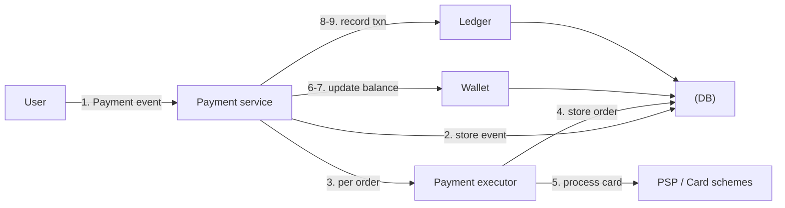
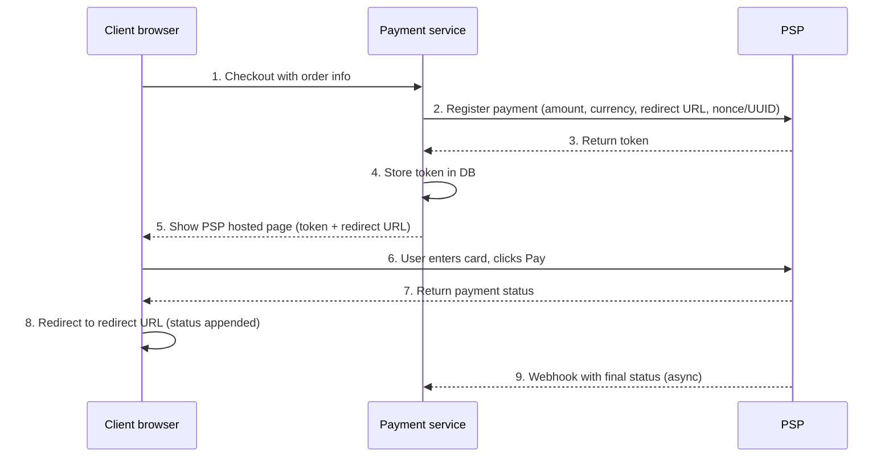
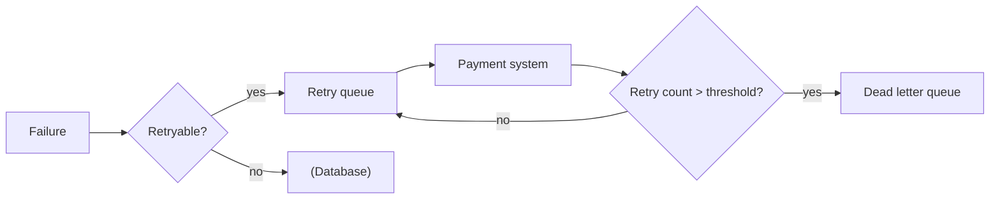

# Design a Payment System · Vol 2 Ch 11

> Build the payment backend for an e-commerce site (like Amazon): handle the pay-in and pay-out money flows correctly using a PSP, a double-entry ledger, idempotency for exactly-once charging, and nightly reconciliation.

## 1. The Problem in Plain English

When you buy something online, a **payment system** moves money behind the scenes. The word "payment system" can mean many things (Apple Pay, PayPal, Stripe), so we scope it: we build the **payment backend for an e-commerce app like Amazon.com** that handles all money movement when a customer places an order.

The scary part is that a small bug can lose real money or **charge a customer twice**. So correctness — not raw throughput — is the focus.

## 2. Requirements (Functional & Non-Functional)

**Scope decisions from the interviewer**
- Use **credit card** payment as the example (real systems support cards, PayPal, bank cards, etc.).
- We do **not** process cards ourselves — we use **third-party payment processors (PSPs)** like Stripe, Braintree, Square.
- We do **not** store card numbers directly (security/compliance); the PSP handles sensitive card data.
- The app is global but assume **one currency**.
- **1 million transactions/day**.
- Must support the **pay-out flow** (paying sellers).
- Must support **reconciliation** to fix inconsistencies between services.

**Functional requirements**
- **Pay-in flow:** receive money from customers on behalf of sellers.
- **Pay-out flow:** send money to sellers around the world.

**Non-functional requirements**
- **Reliability and fault tolerance** — failed payments must be handled carefully.
- **Reconciliation** — an asynchronous process that verifies payment data is consistent across internal services (payment, accounting) and external services (PSPs).

## 3. Back-of-the-Envelope Estimation

- 1,000,000 transactions/day ÷ ~100,000 seconds/day ≈ **10 TPS (transactions per second)**.
- 10 TPS is **tiny** for a database, so the design challenge is **correctness**, not high throughput.

## 4. High-Level Design

The money moves in two phases. When a buyer pays, money flows into the e-commerce company's bank account (**pay-in**). The company is only a custodian; once products are delivered, the balance is released to the seller's bank account (**pay-out**).

### Pay-in flow components
- **Payment service** – accepts payment events, coordinates the process. First does a **risk check** (compliance with AML/CFT, checking for money laundering / terrorism financing). Usually uses a specialized third-party provider.
- **Payment executor** – executes a single **payment order** via a PSP. One payment event can contain several payment orders (e.g. items from multiple sellers in one checkout).
- **Payment Service Provider (PSP)** – moves money from account A to B (here, out of the buyer's credit card).
- **Card schemes** – organizations that process card operations (Visa, MasterCard, Discover); the ecosystem is complex.
- **Ledger** – financial record of each transaction (debit the buyer, credit the seller); vital for revenue analysis and forecasting.
- **Wallet** – keeps each merchant's account balance and how much a user has paid.

Flow: place order → payment service stores event → for each order it calls the executor → executor stores order and calls the **PSP** → on success, payment service updates the **wallet** (seller balance) → then updates the **ledger**. When all orders under a `checkout_id` succeed, `is_payment_done` is set TRUE. A scheduled job monitors in-flight orders and alerts if one stalls past a threshold.

### APIs
- `POST /v1/payments` – execute a payment event. Fields: `buyer_info`, `checkout_id` (unique), `credit_card_info` (encrypted info or a token, PSP-specific), `payment_orders` (list). Each payment order has `seller_account`, `amount`, `currency` (ISO 4217), and a globally unique `payment_order_id`.
- `GET /v1/payments/{:id}` – return the status of one payment order.

Two important notes:
- **`payment_order_id` is globally unique** and is used by the PSP as the **deduplication / idempotency key**.
- **`amount` is a string, not a double.** Doubles cause rounding errors across systems, and numbers can be huge (Japan's GDP ≈ 5×10¹⁴ yen) or tiny (a satoshi = 10⁻⁸ BTC). Keep numbers as strings in transit and storage; parse only for display/calculation.

### Data model
Storage priorities for money systems are **proven stability** (used by big financial firms 5+ years), **rich tooling** (monitoring/investigation), and a **mature DBA job market** — so prefer a **relational database with ACID transactions** over NoSQL/NewSQL.

- **Payment event table:** `checkout_id` (PK), `buyer_info`, `seller_info`, `credit_card_info`, `is_payment_done`.
- **Payment order table:** `payment_order_id` (PK), `buyer_account`, `amount`, `currency`, `checkout_id` (FK), `payment_order_status`, `ledger_updated`, `wallet_updated`.

`payment_order_status` is an enum: **NOT_STARTED → EXECUTING → SUCCESS / FAILED**. On SUCCESS the payment service updates the wallet (`wallet_updated = TRUE`, assumed always succeeds for simplicity) then the ledger (`ledger_updated = TRUE`).

### Double-entry ledger system
The **double-entry principle** (double-entry bookkeeping) is fundamental. Every transaction is recorded into **two accounts with the same amount** — one **debited**, one **credited**:

| Account | Debit | Credit |
|---|---|---|
| buyer | $1 | |
| seller | | $1 |

The **sum of all entries must be 0** — if one cent is lost, someone else gains it. This gives end-to-end traceability and consistency.

### Hosted payment page
To avoid storing card data and dealing with **PCI DSS**, most companies use a **hosted payment page** from the PSP (a widget/iframe on web, or a prebuilt page from the payment SDK). The PSP captures the card info directly, so it never touches our system.

### Pay-out flow
Very similar to pay-in, but instead of a PSP moving money from buyer's card to the company's bank, a **third-party account-payable provider** (e.g. **Tipalti**) moves money from the company's bank account to the seller's. Comes with heavy bookkeeping/regulatory requirements.

## 5. Deep Dive

### PSP integration (hosted page flow)
Direct connections to banks/card schemes exist but are rare and only for very large companies. Two integration styles: (1) store card info yourself and use the PSP API, or (2) use the PSP's **hosted payment page** (most common). Hosted-page flow:

- The **nonce** (a UUID, usually the payment order id) ensures **exactly-once registration**.
- The PSP returns a **token** (UUID identifying the registration) that we persist and use to check status later.
- Sensitive card data is collected by the PSP (e.g. Stripe's JS library) and **never reaches our system**.
- The **redirect URL** shows the checkout status page (different from the webhook URL).
- The **webhook** is an async callback that updates `payment_order_status`.

Because all 9 steps can fail over an unreliable network, the systematic safety net is **reconciliation**.

### Reconciliation
With async communication there's no guarantee a message/response arrives. **Reconciliation periodically compares the state across services** to verify they agree — it's the **last line of defense**. Every night the PSP/bank sends a **settlement file** (account balance + all the day's transactions); the reconciliation system parses it and compares against the ledger. It also checks **internal** consistency (e.g. ledger vs wallet). Mismatches fall into three categories:
1. **Classifiable and auto-fixable** — write a program to classify and adjust automatically.
2. **Classifiable but not worth automating** — put in a job queue; finance team fixes manually.
3. **Unclassifiable** — put in a special queue; finance team investigates manually.

### Handling payment processing delays
Most payments finish in seconds, but some stall for hours/days — e.g. the PSP flags a request as **high risk** needing human review, or a card requires **3D Secure Authentication**. The PSP returns a **pending** status (client shows it and offers a status page) and later notifies us via **webhook**. Alternatively some PSPs require us to **poll** for status.

### Communication among internal services
- **Synchronous (HTTP):** simple, fine for small scale. Drawbacks: low performance (one slow service hurts all), poor failure isolation, tight coupling, hard to scale without a buffer.
- **Asynchronous:**
  - **Single receiver** — shared message queue; each message processed once then removed.
  - **Multiple receivers** — **Kafka**; messages stay after consumption so many services (payment, analytics, billing) can process the same event.
- For a large payment system with many third-party dependencies, **async is preferred** (trades simplicity/consistency for scalability and failure resilience).

### Handling failed payments
- **Track payment state** in an **append-only** table so you always know the current state and whether to retry or refund.
- **Retry queue + dead letter queue (DLQ):** retryable/transient errors go to a **retry queue**; if a message keeps failing, it lands in the **dead letter queue** for debugging. Non-retryable errors (invalid input) go straight to the DB. (Uber's payment system uses Kafka for this.)

### Exactly-once delivery
Double-charging is the worst outcome. **Exactly-once = at-least-once AND at-most-once.**
- **At-least-once via retry.** Retry strategies: immediate, fixed intervals, incremental intervals, **exponential backoff** (double the wait each failure: 1s, 2s, 4s…), or **cancel**. Use exponential backoff when the issue won't resolve quickly; overly aggressive retries can overload the service. Good practice: return an error code with a **Retry-After** header.
- **At-most-once via idempotency.** An **idempotency key** (usually a client-generated **UUID**, sent in the HTTP header `<idempotency-key: key_value>`) makes repeated calls produce the same result.
  - **Scenario 1 (user double-clicks Pay):** the key (often the shopping-cart ID) is already seen, so the second request returns the previous status. Concurrent duplicates get **429 Too Many Requests**. Implemented with a **database unique-key constraint**: try to insert a row; success = new request, failure = already seen.
  - **Scenario 2 (PSP succeeded but response lost, user retries):** the same payment order yields the same **nonce → same token**; the PSP uses the token as its idempotency key and returns the previous execution status.

### Consistency
Many stateful services are involved (payment service, ledger, wallet, PSP, DB replicas). To stay consistent:
- Between internal services, ensure **exactly-once processing**.
- Between internal and external (PSP), use **idempotency + reconciliation** (never assume the external system is right).
- For replication lag: either (1) serve reads and writes only from the **primary** (simple but wastes replicas), or (2) keep replicas **in sync** using consensus algorithms like **Paxos** or **Raft**, or consensus databases like **YugabyteDB** or **CockroachDB**.

### Payment security

| Problem | Solution |
|---|---|
| Eavesdropping | HTTPS |
| Data tampering | Encryption + integrity monitoring |
| Man-in-the-middle | SSL with certificate pinning |
| Data loss | Multi-region DB replication + snapshots |
| DDoS | Rate limiting + firewall |
| Card theft | **Tokenization** (store tokens, not real card numbers) |
| PCI compliance | PCI DSS security standard |
| Fraud | Address verification, CVV, user-behavior analysis |

## 6. Scaling, Bottlenecks & Trade-offs

- Throughput (10 TPS) is trivial; the "scaling" concern is **correctness and resilience**, not QPS.
- **Sync vs async** is the main architectural trade-off: async (Kafka/queues) scales and isolates failures at the cost of design simplicity and strong consistency.
- **Replication trade-off:** primary-only reads are simple but waste replicas; consensus (Raft/Paxos) keeps replicas in sync at higher complexity.
- Choose a **boring, proven ACID relational DB** over trendy NoSQL for financial data.

## 7. Failure / Edge Cases

- **User double-clicks Pay** → idempotency key dedupes; 429 for concurrent duplicates.
- **PSP charged but response lost** → same token acts as idempotency key on the PSP side.
- **Transient network errors** → retry queue with exponential backoff.
- **Repeated permanent failures** → dead letter queue for investigation.
- **Stalled payments** (high risk / 3D Secure) → pending status + webhook or polling.
- **Cross-service inconsistency** → nightly reconciliation against the settlement file; finance team fixes unclassifiable mismatches.

## 8. Key Takeaways

- Split money movement into **pay-in** and **pay-out** flows.
- Use a **PSP** and a **hosted payment page** so you never store card data (avoids PCI DSS burden).
- **Double-entry bookkeeping** in the ledger keeps money provably balanced (sum of entries = 0).
- Guarantee **exactly-once** = retry (at-least-once) + idempotency key (at-most-once) to avoid double charges.
- **Reconciliation** with nightly settlement files is the last line of defense for consistency.
- Store money **amounts as strings**, use an **ACID relational DB**, and prefer **async** communication at scale.

## 9. New Terms & Glossary

- **Pay-in / pay-out** – receiving money from buyers / sending money to sellers.
- **PSP (Payment Service Provider)** – third party (Stripe, Braintree, Square) that moves money and handles card data.
- **Card scheme** – Visa/MasterCard/Discover networks that process card operations.
- **Ledger / double-entry bookkeeping** – financial record where each transaction debits one account and credits another by equal amounts.
- **Wallet** – stores a merchant's account balance.
- **Idempotency key** – unique value (UUID) making repeated requests produce one result.
- **Nonce / token** – unique registration id sent to the PSP / returned by the PSP.
- **Reconciliation** – periodic comparison of states across services to catch mismatches.
- **Settlement file** – nightly file from PSP/bank listing balance and all transactions.
- **Retry queue / dead letter queue (DLQ)** – queues for retryable failures / messages that keep failing.
- **Exactly-once** – at-least-once (retry) plus at-most-once (idempotency).
- **Exponential backoff** – doubling the wait between retries.
- **3D Secure** – extra card-holder verification step.
- **Tokenization** – replacing real card numbers with tokens.
- **PCI DSS** – Payment Card Industry Data Security Standard.
- **AML/CFT** – Anti-Money-Laundering / Countering the Financing of Terrorism checks.
- **Raft / Paxos** – consensus algorithms to keep replicas in sync.
