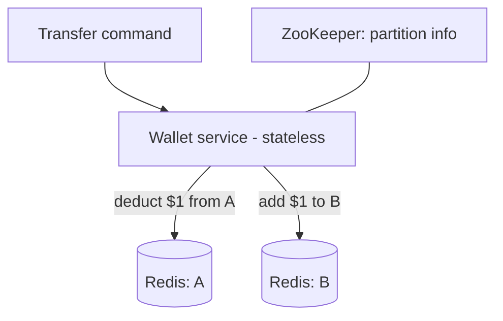
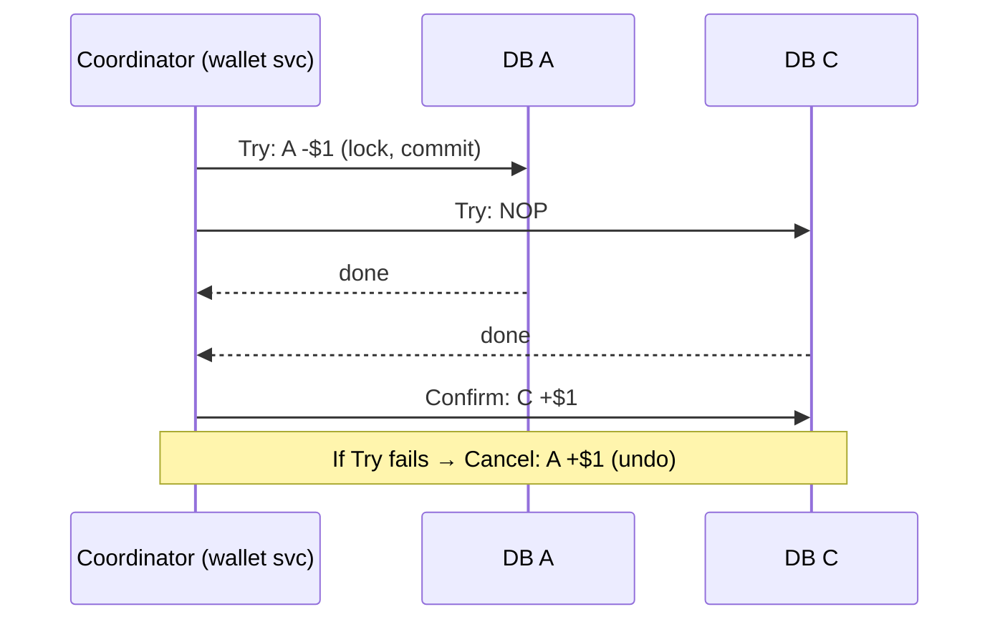
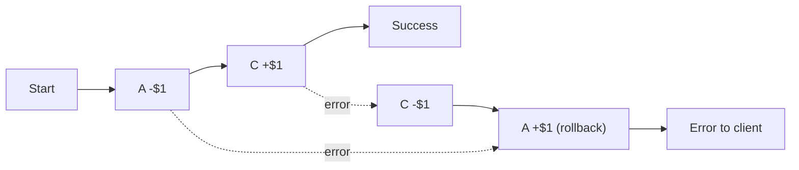
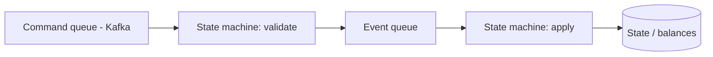
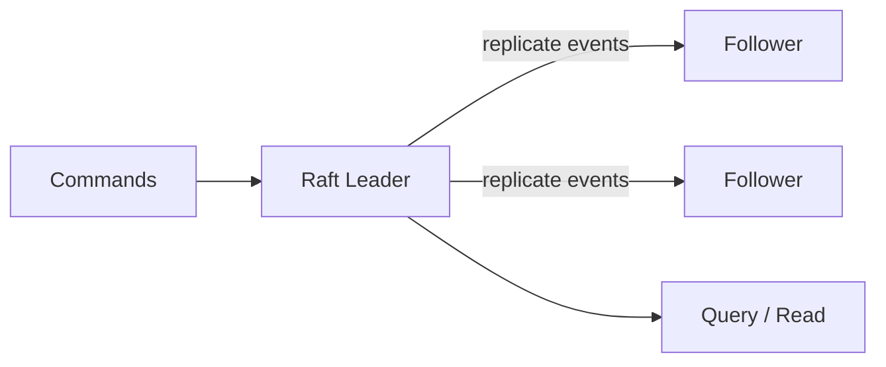

# Design a Digital Wallet · Vol 2 Ch 12

> Build a digital-wallet backend that transfers money between two wallets at 1 million TPS, staying correct via distributed transactions (2PC, TC/C, Saga) and eventually using event sourcing + CQRS + Raft for reproducibility, performance, and reliability.

## 1. The Problem in Plain English

A digital wallet (like PayPal) lets you store money and spend it later. You can add money from a bank card, pay online, and — most importantly for this design — **transfer money directly to another wallet on the same platform**. Wallet-to-wallet transfer is faster than bank-to-bank and usually free.

We design the **backend for the cross-wallet balance transfer** operation. The hard part isn't speed alone — it's **correctness**: money must never be lost or created, and we must be able to **prove** balances are right at any point in time.

## 2. Requirements (Functional & Non-Functional)

**Functional**
- Support **balance transfer between two digital wallets**. (Foreign exchange is out of scope.)

**Non-functional**
- Support **1,000,000 TPS**.
- Reliability at least **99.99%**.
- **Support transactions** (transactional/correctness guarantees).
- **Support reproducibility** — always able to reconstruct historical balances by replaying data from the very beginning. (Reconciliation against bank statements only shows *that* there is a discrepancy, not *how* it arose; reproducibility fixes that.)

## 3. Back-of-the-Envelope Estimation

- A relational DB node handles a few thousand TPS; assume **1,000 TPS/node**.
- Each transfer = **two operations** (deduct from one account, add to the other), so 1M transfers/sec ≈ **2M operations/sec** → about **2,000 nodes**.

| Per-node TPS | Nodes needed |
|---|---|
| 100 | 20,000 |
| 1,000 | 2,000 |
| 10,000 | 200 |

**Design goal:** raise per-node TPS to cut node count and hardware cost.

## 4. High-Level Design

**API** (RESTful): `POST /v1/wallet/balance_transfer` with `from_account`, `to_account`, `amount` (string, to avoid float precision loss), `currency` (ISO 4217), and `transaction_id` (UUID for deduplication). Response gives status + transaction_id.

Three designs are explored, each fixing the previous one's flaw.

### Design 1 — In-memory sharding (Redis)
Balances are a `<user, balance>` map. One Redis node can't do 1M TPS, so run a **Redis cluster** and shard accounts: `partition = hash(accountID) % partitionCount`. **ZooKeeper** stores partition count and Redis node addresses (highly-available config). A **stateless wallet service** receives, validates, and applies transfers by updating two (likely different) Redis nodes.

**Problem:** the two Redis updates are **not atomic**. If the wallet service crashes after the first update but before the second, the transfer is incomplete. We need both updates in **one atomic transaction**.

### Design 2 — Distributed transactions (relational DB)
Replace each Redis node with a **transactional relational database**. But a transfer still touches **two different databases**, so we need a **distributed transaction**. Two families:

## 5. Deep Dive

### Two-Phase Commit (2PC) — low-level
Relies on the database (e.g. the **X/Open XA** standard). The **coordinator** (the wallet service):
1. Does reads/writes on all DBs (databases stay **locked**).
2. **Prepare phase:** asks all DBs to prepare.
3. **Commit phase:** if all reply yes → tell all to commit; if any says no → tell all to abort.

**Problems:** not performant (locks held for a long time while waiting), and the coordinator is a **single point of failure**. In 2PC, local transactions are **still locked** when phase 2 starts.

### Try-Confirm/Cancel (TC/C) — high-level (compensating)
A **compensating transaction** in two phases, but here **each phase is its own separate transaction** (unlike 2PC where both phases share one transaction).
1. **Try:** reserve resources.
2. **Confirm** (all yes) or **Cancel** (any no).

Example: transfer $1 from A to C. Valid ordering (**Choice 1**): Try does `A: -$1` and `C: NOP`; Confirm does `C: +$1`; Cancel does `A: +$1`.

- **Why not Choice 2 (`NOP` on A, `+$1` on C first)?** If A's Try fails, someone might spend C's $1 before Cancel deducts it — violates the guarantee.
- **Why not Choice 3 (`-$1` and `+$1` concurrently)?** If the add succeeds but the deduct fails, money is created. So only **Choice 1** is valid: **deduct before add**.

TC/C is **database-agnostic** (works on any DB with transactions) but you must implement the "undo" logic in the **application layer**.

**Unbalanced state:** after the Try phase, $1 is temporarily missing (A+C = $0). This is fine because TC/C is application-driven and can see/fix the intermediate state; the transactional guarantee still holds by the end.

**Phase status table:** to survive a wallet-service restart mid-TC/C, store progress in a transactional DB — the transaction ID/content, Try-phase status per DB, the second-phase name (Confirm/Cancel), second-phase status, and an **out-of-order flag**. Store it in the DB of the account money is **deducted from**.

**Out-of-order execution:** a Cancel can reach a node **before** its Try (network reorder). Fix: a node may Cancel without a prior Try — it leaves an **out-of-order flag**; a later Try that sees the flag **returns failure**.

### Saga — high-level (linear)
Saga is the **de-facto standard in microservices**. Operations are ordered in a **sequence**, executed first→last; each is an independent transaction. On failure, **roll back in reverse order** using compensating transactions. For *n* operations you prepare **2n** operations (n normal + n compensating). Still deduct-before-add.

Coordination is either **Choreography** (decentralized — services react to each other's events; hard with many services) or **Orchestration** (a single coordinator directs everyone — preferred for a digital wallet).

**TC/C vs Saga:** both are application-level. TC/C compensates in the **Cancel phase**, allows **any order** and **parallel** execution. Saga compensates in the **rollback phase**, is **linear** (no parallelism). Choose **Saga** to follow microservice trends or when latency isn't critical; choose **TC/C** when latency-sensitive with many services.

**Remaining problem:** distributed transactions still can't easily **audit** — you can't trace *why* a balance changed or prove logic correctness after a code change.

### Design 3 — Event Sourcing (from Domain-Driven Design)
Answers auditors' questions: (1) balance at any time? (2) are historical/current balances correct? (3) is logic still correct after a code change?

Four key terms:
- **Command** — an intended action (e.g. "transfer $1 A→C"). Put in a **FIFO queue** (order matters). May contain randomness/IO.
- **Event** — the **validated, deterministic** result/fact of a command (e.g. "transferred $1 A→C", past tense). One command → zero or more events. Events stored in a **FIFO queue**, in command order.
- **State** — what changes when an event is applied; here, the balances map (key-value or relational).
- **State machine** — drives the process: (1) validates commands → generates events, (2) applies events → updates state. **Must be deterministic** (no random, no external IO), so replay always yields the same result.

Wallet flow: commands (transfer requests) go to a **Kafka** FIFO queue; the state machine reads each command, reads balance state, validates (sufficient funds?), and if valid emits **two events** (`A:-$1`, `C:+$1`), then applies each event to update the DB.

**Reproducibility** (the big win): all changes are saved first as an **immutable event history**; the DB is just the current view. Replaying events from the start always reproduces the same historical states (events immutable + logic deterministic). This answers all three audit questions — replay to any time; recompute to verify; run different code versions over the same events to compare.

### CQRS (Command-Query Responsibility Segregation)
Clients outside the framework need to read balances. Instead of publishing state, event sourcing **publishes all events**, and the outside world rebuilds whatever view it needs. One **write** state machine plus **many read-only** state machines, each deriving its own view (current balance, a time-window view for double-charge investigation, an audit trail for reconciliation). Read-only machines **lag but catch up** → the system is **eventually consistent**.

### High-performance event sourcing
- **File-based command & event lists** on local disk instead of remote Kafka — avoids network transit. **Append-only = sequential writes**, which are very fast (sequential disk can beat random memory access). Use **mmap** to write to disk and cache recent content in memory simultaneously.
- **File-based state:** replace the remote relational DB with a local **SQLite** (file-based relational) or **RocksDB** (local key-value store using a **log-structured merge-tree / LSM**, write-optimized, with a read cache). RocksDB is chosen.
- **Snapshot:** periodically stop the state machine and save current state to a file (immutable historical view). Replay/reproducibility can then resume from a snapshot instead of the very beginning. Finance often wants a **00:00 snapshot** daily. Snapshots are big binary files — store in object storage like **HDFS**.

With everything file-based, the node uses the machine's max I/O throughput — but it's now **stateful** and a **single point of failure**.

### Reliable high-performance event sourcing (Raft)
Data vs computation: if **data** is durable, computation can be re-run elsewhere. Of the four data types (command, event, state, snapshot), **state and snapshot are regenerable from events**, and **command isn't enough** because event generation may be non-deterministic (random/IO). So **only the event list needs a strong reliability guarantee.**

Replicate the event list with a **consensus algorithm — Raft**. Guarantees no data loss and same relative order across nodes, as long as **more than half** the nodes are up (5 nodes tolerate 2 failures; 3 tolerate 1). Roles: **Leader, Candidate, Follower**. The **leader** takes commands, converts them to events, appends locally, and Raft replicates to **followers**. All nodes apply the event list to update state (same events → same state).

Failure handling: if the **leader crashes**, Raft **elects a new leader**; if the crash happened before commands became events, the client sees a timeout/error and **resends** to the new leader. A **follower crash** is easy — Raft retries until it restarts or is replaced.

### Distributed event sourcing (scaling to 1M TPS)
Two limits remain: (1) CQRS request/response can be slow (client may have to **poll**); (2) one Raft group's capacity is limited → must **shard** and use distributed transactions.

**Pull vs push:**
- **Pull:** client periodically polls the read-only state machine — not real-time, can overload if polled too often.
- **Pull + reverse proxy:** proxy forwards the command and polls status — simpler client, still not real-time.
- **Push:** the read-only state machine **pushes** status to the reverse proxy as soon as it gets the event — feels real-time. This makes each node group **synchronous** to external users.

**Sharding + distributed transaction:** partition data by `hash(key) % 2` (example). Each partition is its own **Raft node group**. Reuse **TC/C or Saga** across groups, coordinated by a **TC/C/Saga coordinator**.

Happy-path Saga transfer (A→C), simplified:
1. User sends the distributed transaction (`A:-$1`, `C:+$1`) to the **Saga coordinator**.
2. Coordinator records it in the **phase status table**.
3. Coordinator (deduct-first) sends `A:-$1` to **Partition 1**.
4. Partition 1's **Raft leader** stores/validates the command, converts to an event, replicates via Raft, then applies (deduct $1).
5. CQRS syncs to the read path, which rebuilds state/status.
6–8. Read path pushes success to the coordinator, which records Partition 1 success.
9. Coordinator sends `C:+$1` to **Partition 2**.
10–14. Partition 2 does the same (validate, Raft-replicate, apply +$1, push success, record).
15. All succeed → distributed transaction complete; coordinator returns the result.

## 6. Scaling, Bottlenecks & Trade-offs

- **Redis in-memory:** fast but **not durable / not atomic across nodes** — rejected.
- **2PC:** database-level, simple semantics, but **slow locks** and **coordinator SPOF**.
- **TC/C vs Saga:** both app-level; TC/C allows **parallel/any-order** (lower latency), Saga is **linear** (microservice-friendly). Neither gives easy audit.
- **Event sourcing:** enables **reproducibility/audit**, but naive (remote Kafka + DB) is slow → go **file-based (mmap, RocksDB, snapshots)** for max I/O.
- **File-based = stateful SPOF** → replicate the **event list** with **Raft** (only event data truly needs strong reliability).
- **Single Raft group is capacity-limited** → **shard** into many Raft groups + TC/C/Saga; add a **reverse proxy + push** for near-real-time responses. Read path is **eventually consistent**.

## 7. Failure / Edge Cases

- **Wallet service crash mid-transfer** (Design 1) → incomplete transfer; solved by atomic distributed transactions.
- **Wallet service restart mid-TC/C** → recover from the **phase status table**.
- **Out-of-order Cancel before Try** → out-of-order flag makes the later Try fail.
- **Unbalanced state during Try** → temporary, corrected in Confirm/Cancel.
- **Leader crash** → Raft re-election; client resends command if it wasn't converted to an event.
- **Follower crash** → Raft retries until recovery/replacement.
- **Non-deterministic event generation** → why events (not commands) are the durable source of truth.

## 8. Key Takeaways

- Wallet transfers demand **atomicity across two accounts/nodes** — plain sharded Redis fails.
- **Distributed transactions**: 2PC (DB-level, locky, SPOF), **TC/C** (app-level, parallel, compensating), **Saga** (app-level, linear, microservice standard). Always **deduct before add**.
- **Event sourcing** stores immutable **commands → events → state**, giving **reproducibility** and full **audit** (the reason it's the de-facto wallet solution).
- **CQRS** separates the write path from many read-only views; eventually consistent.
- Go **file-based (mmap, RocksDB, snapshots)** for performance, then replicate the **event list with Raft** for reliability (majority-up survives failures).
- Scale to **1M TPS** by sharding into Raft groups coordinated by TC/C/Saga, with a **push-based reverse proxy** for near-real-time responses.

## 9. New Terms & Glossary

- **TPS** – transactions per second.
- **Sharding/partitioning** – splitting data across nodes (`hash(key) % n`).
- **ZooKeeper** – highly-available config store (partition info here).
- **2PC (Two-Phase Commit)** – DB-level distributed transaction (prepare, then commit/abort); uses X/Open XA.
- **TC/C (Try-Confirm/Cancel)** – application-level compensating transaction; each phase is its own transaction.
- **Saga** – application-level linear distributed transaction with reverse-order compensation; choreography vs orchestration.
- **Compensating transaction** – an "undo" that reverses a committed operation.
- **Phase status table** – persisted progress of a distributed transaction (with out-of-order flag).
- **Event sourcing** – store immutable events as the source of truth; state is a derived view.
- **Command / Event / State / State machine** – intended action / validated fact / balances / deterministic driver.
- **Reproducibility** – reconstruct any historical state by replaying events.
- **CQRS** – Command-Query Responsibility Segregation: one write path, many read-only views.
- **mmap** – maps a disk file into memory; disk write + memory cache at once.
- **SQLite / RocksDB / LSM** – file-based relational DB / file-based key-value store / write-optimized log-structured merge-tree.
- **Snapshot** – saved immutable state to speed replay; stored in object storage (HDFS).
- **Raft** – consensus algorithm (Leader/Candidate/Follower) replicating the event list; tolerates a minority of failures.
- **Reverse proxy / pull vs push** – intermediary; polling vs real-time status delivery.
