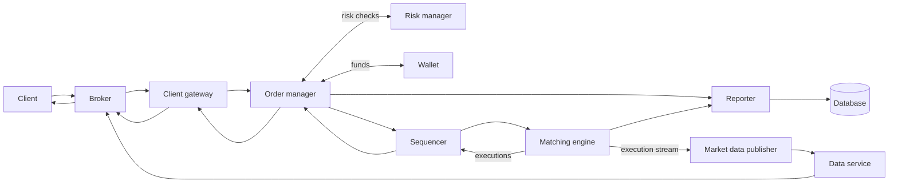
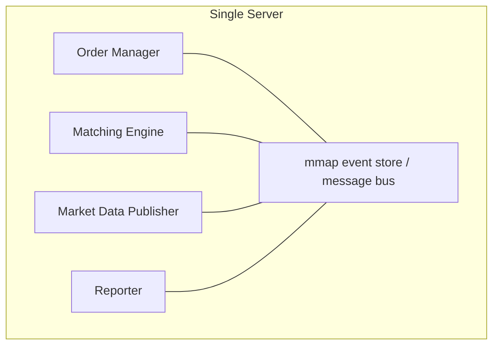
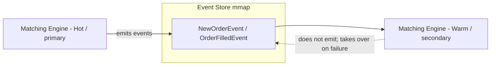

# Design a Stock Exchange · Vol 2 Ch 13

> Build an electronic stock exchange that matches buy and sell orders in real time with millisecond-to-microsecond latency, using a sequencer + deterministic matching engine + event sourcing, and made highly available with a hot-warm design and Raft.

## 1. The Problem in Plain English

A stock exchange matches buyers and sellers efficiently. A client places an order through a **broker** (Robinhood, Fidelity, etc.); the exchange finds a matching order and produces a trade. We must place and cancel **limit orders**, show the **order book** (all buy/sell orders) and matched trades in real time, run **risk checks** (it's a regulated facility), and make sure users have **enough funds** (held/withheld while an order waits).

The two defining challenges are **very low, very stable latency** and **correctness/determinism** — replaying the same orders must produce the same trades.

## 2. Requirements (Functional & Non-Functional)

**Functional**
- Place a new **limit order** and **cancel** an order (only limit orders; only normal trading hours).
- Clients receive matched trades in real time and can view the **real-time order book**.
- **Risk checks** (simple, e.g. max 1M shares of Apple per user per day).
- **Wallet** management: ensure sufficient funds; withhold funds for resting orders.
- Support **tens of thousands** of concurrent users, **≥100 symbols**, **billions of orders/day**.

**Non-functional**
- **Availability ≥ 99.99%** (4 nines ≈ 8.64 s downtime/day) — downtime harms reputation.
- **Fault tolerance** with fast recovery.
- **Latency**: round-trip at the **millisecond** level, focused on the **99th percentile** (measured from order entry to filled execution returning).
- **Security**: account management, **KYC** before opening an account, **DDoS** protection for public market-data pages.
- **Extensibility** (small-to-medium scale, extendable to more symbols/users).

## 3. Back-of-the-Envelope Estimation

- 100 symbols, **1 billion orders/day**.
- NYSE trades 6.5 hours/day (9:30 am–4:00 pm ET).
- **QPS** = 1B / (6.5 × 3,600) ≈ **43,000**.
- **Peak QPS** = 5 × 43,000 ≈ **215,000** (heaviest at open and before close).

## 4. High-Level Design

**Business terms:** **broker** (retail interface); **institutional client** (large volume, e.g. pension funds need order splitting to reduce market impact; hedge-fund market makers need ultra-low latency); **limit order** (fixed price, may partially match); **market order** (no price, executes immediately); **market data levels** L1 (best bid/ask + quantity), L2 (more price levels), L3 (full depth per price level); **candlestick chart** (open/close/high/low over an interval); **FIX** (Financial Information eXchange protocol, 1991, vendor-neutral protocol for encoding trade messages).

Three flows, only the first is latency-critical:

**Trading flow (critical path):** gateway → order manager → sequencer → matching engine. The gateway does auth, validation, rate limiting, normalization, and FIX support. The order manager runs risk checks, verifies wallet funds, and forwards to the sequencer; when a match is found the matching engine emits **two executions (fills)** — one buy, one sell — sequenced for determinism, then returned to the client.

**Market data flow (not critical):** matching engine emits a stream of executions → **market data publisher (MDP)** builds order books and candlestick charts → **data service** → brokers → clients. Persisted for real-time analytics.

**Reporting flow (not critical):** the **reporter** merges attributes from incoming orders and outgoing executions (client_id, price, quantity, order_type, filled/remaining quantity, etc.) and writes consolidated records to the DB for trading history, tax, compliance, settlement.

### Key components
- **Matching engine** (a.k.a. cross engine): maintains the **order book per symbol**, matches buy/sell orders (each match → two fills), distributes the execution stream. **Must be deterministic** — same input order sequence → same output fill sequence on replay.
- **Sequencer**: the component that makes matching deterministic. It stamps every incoming order and every outgoing pair of executions with **sequential sequence IDs** (separate inbound and outbound sequences), so missing numbers are easy to detect. Reasons: **timeliness/fairness, fast recovery/replay, exactly-once**. It also acts as a **message queue** (orders in, executions out) and an **event store** — like two Kafka streams, but Kafka's latency is too high/unpredictable for a low-latency exchange.
- **Order manager**: tracks order state (the major source of complexity — tens of thousands of state-transition cases); sends only the necessary attributes to the matching engine. **Event sourcing** fits it well.
- **Client gateway**: lightweight gatekeeper on the critical path; different gateways for retail vs institutional. Extreme case: a **colocation (colo) engine** — the broker's trading software runs on rented servers **inside the exchange's data center**, so latency is essentially the speed of light over the cable.

### APIs (RESTful; institutions may use faster protocols)
- `POST /v1/order` — symbol, side, price, orderType, quantity → id, creationTime, filledQuantity, remainingQuantity, status.
- `GET /v1/execution?...` — query executions.
- `GET /v1/marketdata/orderBook/L2?symbol=&depth=` — L2 order book (bids/asks arrays).
- `GET /v1/marketdata/candles?symbol=&resolution=&startTime=&endTime=` — candlestick data (open/close/high/low).

### Data models
- **Product / Order / Execution**: a product describes a symbol (lot size, tick size, currencies, cacheable, rarely changes). One matched order → two executions. On the critical path, orders/executions live **in memory** and are persisted via disk/shared memory (in the sequencer) for fast recovery, archived after close. The reporter writes them to the DB; the MDP uses executions to rebuild L1/L2/L3.
- **Order book**: list of buy/sell orders organized by price level. Needs constant-time volume lookup and **O(1)** add/cancel/execute plus best-bid/ask query. Implemented with `Book` → `Map<Price, PriceLevel>`, and each `PriceLevel` holds a **doubly-linked list** of orders plus a `Map<OrderID, Order>` in the order book:
  - **Place** = append to tail → O(1).
  - **Match** = remove from head → O(1).
  - **Cancel** = find via `orderMap` O(1), then delete using the node's prev pointer (doubly-linked) → O(1) instead of O(n).
- **Candlestick chart**: `Candlestick` (open/close/high/low/volume/timestamp/interval) in a `LinkedList` inside `CandlestickChart`. Memory optimizations: **pre-allocated ring buffers** and **limit sticks in memory, persist rest to disk**. Stored in an in-memory columnar DB like **KDB** for real-time analytics, then a historical DB after close.

## 5. Deep Dive

### Performance (from milliseconds to microseconds)
`Latency = Σ executionTime along critical path`. Two levers: **fewer tasks** on the critical path and **less time per task** (cut network/disk, cut execution time). The critical path holds only essentials — even **logging is removed** from it.

With components on separate servers over a network, round-trip network latency ≈ **500 µs**, disk (even sequential) adds tens of ms → total tens of ms. Modern exchanges cut this to **tens of microseconds** by **putting everything on one single server** and communicating via **mmap**.

- **Application loop**: a `while` loop polling for tasks; **single-threaded and pinned to a fixed CPU core** → **no context switches, no lock contention** → low 99th-percentile latency. Trade-off: harder to code (must keep each task short so it doesn't block the loop).
- **mmap**: the POSIX `mmap(2)` maps a file into process memory; when backed by **`/dev/shm`** (a memory-backed filesystem) there's **no disk access at all**. Used as a **message bus** between critical-path components; a send takes **sub-microsecond**.

### Event sourcing
Instead of storing only current state, keep an **immutable log of all state-changing events** as the source of truth (e.g. `NewOrderEvent` seq 100 → `OrderFilledEvent` seq 101) — the current state can be recovered by replaying events. The external domain talks **FIX**; the gateway converts to **FIX over Simple Binary Encoding (SBE)** for fast compact encoding. The order manager is **embedded in the matching engine** (avoids a network hop). The **sequencer is a single writer** (multiple sequencers would fight over the write position, wasting time on contention); backup sequencers exist for HA. It pulls events from each component's **ring buffer**, stamps a sequence ID, and writes to the mmap event store.

### High availability (4 nines)
Find single points of failure and add redundancy; make failure detection + failover fast. Stateless services (gateway) scale horizontally; stateful ones (order manager, matching engine) need state copied across replicas via a **hot-warm** design:

The **hot** engine is primary and emits events; the **warm** engine processes the exact same events but emits nothing. On primary failure the warm instance takes over instantly; a restarted warm instance recovers all state from the event store. **Heartbeats** detect failure. Because hot-warm only works within one server, extend it across machines/data centers by replicating the whole event store (e.g. **reliable UDP**, see **Aeron**).

### Fault tolerance
If warm instances also fail (rare but catastrophic), replicate core data to data centers in **multiple cities**. Answer: when to failover (a bug can crash primary and then the backups after failover — release with **manual failover** first, automate later after gaining confidence; use **chaos engineering**); how to elect a leader; RTO; RPO.

- **Leader election with Raft**: 5-node cluster each with its own mmap event store; leader replicates events to followers via **AppendEntries RPC**; a quorum of **n/2 + 1** (here 3) is needed. Followers that miss heartbeats hit an **election timeout**, become a **candidate**, and **RequestVote**; the one getting a majority becomes leader (a **split vote** restarts the election). Time is divided into **terms**.
- **RTO (Recovery Time Objective)**: how long the app can be down — needs **second-level RTO** → automatic failover + service priority/degradation strategy.
- **RPO (Recovery Point Objective)**: acceptable data loss — for an exchange **near zero**. Raft keeps many copies and guarantees consensus, so a new leader works immediately.

### Matching algorithms
Default is **FIFO**: at a price level, the first order in is matched first. Pseudocode checks the sequence ID (returns OUT_OF_ORDER if wrong), validates, then handles NEW (match against the opposite book) or CANCEL (find in orderMap, remove, mark CANCELED). Other algorithms exist, e.g. **FIFO with LMM (Lead Market Maker)** which pre-allocates a negotiated ratio to the LMM ahead of the FIFO queue (see CME); also used in **dark pools**.

### Determinism
- **Functional determinism**: sequencer + event sourcing guarantee that replaying events in the same order yields the same results — the **order of events matters, not their wall-clock time**, so uneven timestamps can be compressed to speed up replay/recovery.
- **Latency determinism**: nearly the same latency per trade, measured by the **99th (or 99.99th) percentile** latency (use **HdrHistogram**). Investigate spikes — e.g. in Java, **HotSpot JVM Stop-the-World garbage collection** at safe points.

### Market data publisher optimizations
MDP rebuilds order books + candlesticks from the execution stream and publishes to tiered subscribers (retail may see 5 L2 levels by default, pay for 10). Uses **ring buffers** (fixed-size circular queue, pre-allocated, **lock-free**, no object churn; **padding** keeps the sequence number off shared cache lines) to hold recent ticks; caps candlesticks in memory and persists the rest.

### Fairness, multicast, colocation, security
- **Fairness**: all subscribers should get data **at the same time**. If MDP sends by connection order, smart clients race to connect first — mitigate with **random ordering** and **reliable-UDP multicast**.
- **Multicast**: unicast (1→1), broadcast (1→subnet), **multicast (1→a group across subnets)**. Exchanges use multicast so a group receives simultaneously; UDP is unreliable so add **retransmission**.
- **Colocation**: putting client servers in the exchange's data center; latency ∝ cable length. Considered a fair **paid VIP service**.
- **Network security (DDoS)**: isolate public from private services (read-only copies), add a **caching layer**, **harden URLs** (use `/data/recent` instead of query-string URLs so they're CDN-cacheable), safelist/blocklist, and **rate limiting**.

## 6. Scaling, Bottlenecks & Trade-offs

- **Single-server design**: some large exchanges run nearly everything on **one gigantic server (or process)** to eliminate network/disk latency — the core performance trade-off (simplicity/perf vs horizontal scale).
- **Kafka vs custom sequencer**: Kafka is conceptually the same pub-sub but too slow/unpredictable for the critical path; a custom mmap sequencer wins on latency.
- **CPU pinning / single-thread loops**: removes context switches and locks but makes code harder and requires strict per-task time budgets.
- **Latency vs the rest**: only the trading path is latency-critical; market-data and reporting flows trade latency for accuracy/completeness.
- **Cloud & crypto**: crypto exchanges often run on cloud infrastructure; some DeFi projects use **AMM (Automatic Market Making)** and need no order book, lowering the entry barrier.

## 7. Failure / Edge Cases

- **Out-of-order event** → matching engine returns OUT_OF_ORDER (sequence gap detection).
- **Cancel of an already-matched order** → error CANNOT_CANCEL_ALREADY_MATCHED.
- **Primary matching engine crash** → warm instance takes over instantly; restarted node recovers from event store.
- **Both hot and warm down** → multi-city replication + Raft new-leader election.
- **False failure alarms / a bug that crashes primary then backups** → start with manual failover, automate after operational confidence; chaos engineering.
- **Latency spikes** (e.g. JVM GC Stop-the-World) → monitor 99.99th percentile with HdrHistogram.
- **Unreliable UDP multicast drops** → retransmission.
- **Clients racing to connect first for data** → random subscriber ordering + simultaneous multicast.

## 8. Key Takeaways

- The **matching engine** with a per-symbol **order book** is the heart; matches produce **two fills**.
- A **sequencer** stamping sequential IDs is what makes matching **deterministic** (same replay → same result) and enables fast recovery + exactly-once.
- **Event sourcing** (immutable event log as source of truth) plus **mmap over /dev/shm** and **CPU-pinned single-thread application loops** drive latency down to **tens of microseconds**.
- Achieve HA with a **hot-warm** matching engine and **Raft** leader election across machines/data centers; aim for near-zero RPO and second-level RTO.
- Use an **O(1) order book** (doubly-linked list + order map) and **ring buffers** in the MDP.
- **Fairness** matters in a regulated exchange: simultaneous **multicast**, random subscriber order, and colocation as a fair paid service.

## 9. New Terms & Glossary

- **Broker / institutional client** – retail interface / large-volume trader.
- **Limit order / market order** – fixed-price (may partially fill) / no-price immediate execution.
- **L1/L2/L3 market data** – best bid/ask / more levels / full depth per price level.
- **Order book** – buy/sell orders by price level; O(1) via doubly-linked list + orderMap.
- **Matching engine (cross engine)** – matches orders, emits two fills, must be deterministic.
- **Sequencer** – single-writer that stamps sequential IDs on orders and executions.
- **Execution / fill** – a matched result (buy side + sell side).
- **FIX / SBE** – Financial Information eXchange protocol / Simple Binary Encoding for compact fast messages.
- **Event sourcing** – store immutable events as the truth; replay to rebuild state.
- **mmap / /dev/shm** – memory-mapped file / memory-backed filesystem used as a sub-microsecond message bus.
- **Application loop** – single-threaded, CPU-pinned polling loop (no context switch/lock).
- **Hot-warm** – primary emits events; warm mirrors them and takes over on failure.
- **Raft** – consensus/leader-election algorithm (leader/candidate/follower, terms, quorum n/2+1).
- **RTO / RPO** – recovery time objective / recovery point objective (data-loss tolerance).
- **Determinism (functional/latency)** – same replay yields same result / stable per-trade latency (99.99th percentile, HdrHistogram).
- **Candlestick chart** – open/close/high/low over an interval.
- **Ring buffer** – fixed-size, pre-allocated, lock-free circular queue.
- **Multicast / unicast / broadcast** – 1→group across subnets / 1→1 / 1→subnet.
- **Colocation** – client servers in the exchange data center; latency ∝ cable length.
- **KYC** – Know Your Client identity verification.
- **AMM** – Automatic Market Making (order-book-free DeFi trading).
