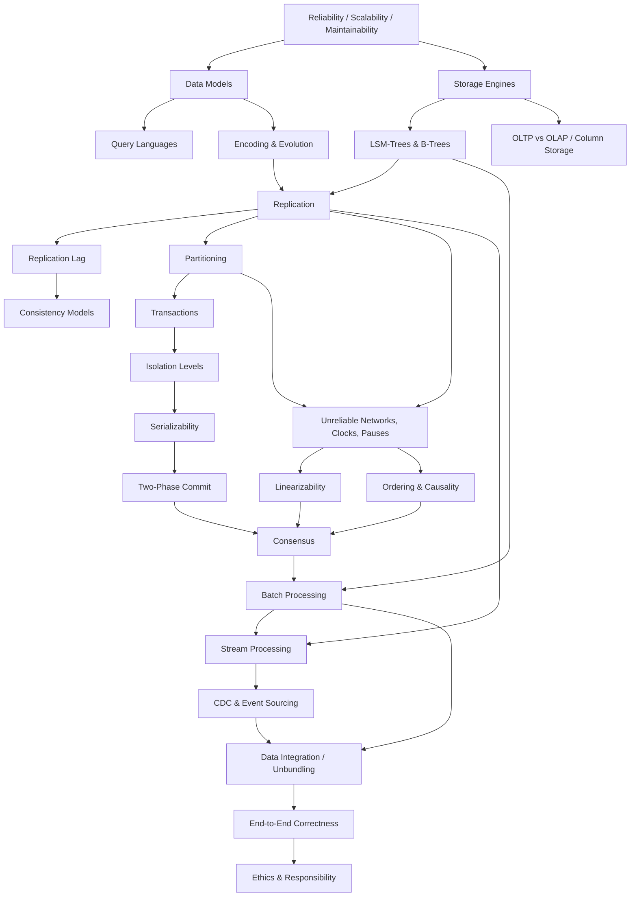

# DDIA Learning Guide

A teaching repository built on *Designing Data-Intensive Applications* by Martin Kleppmann (O'Reilly, 2017).

---

## 1. About This Guide

This is not a summary of the book. It is a **course** built on the book's conceptual spine.

The book is dense. It assumes you already know why a problem matters before it tells you how the problem is solved. That works if you've already been bitten by the problem in production. It works badly if you haven't.

This guide inverts that. Every topic starts with the **failure that forced the idea to exist**, then walks to the mechanism, then to the trade-offs, then to the interview answer.

Each file is written to be learned **independently** in one sitting (30–60 minutes), but the ordering is deliberate: later files assume the vocabulary of earlier ones.

**What each topic file contains:**

- What it is (plain English, no jargon)
- Why it exists (the problem that came first)
- A real-world analogy, mapped back to the technical concept
- The technical explanation and mechanism, step by step
- Mermaid diagrams for flows and architectures
- A concrete example from a system you've heard of
- When to use it, and when *not* to
- Advantages, disadvantages, and an explicit trade-off table
- Failure scenarios and how they're handled
- Production considerations
- Common mistakes and why they're wrong
- How an engineer reasons about it
- A compressed mental model
- Interview questions with answers, at three levels
- A 30-second spoken answer
- Quick revision

**On added material.** Anything not in the book is marked `💡 Additional Context`. The book was published in 2017; where the industry has moved since, that's flagged rather than blended in. The core explanations stay faithful to Kleppmann's argument.

---

## 2. How to Use This Guide

**If you're learning the material for the first time:** go in order. Part I → Part II → Part III. Do not skip Part I because it looks basic — Chapter 1's vocabulary (load parameters, percentiles, fault vs. failure) is used constantly for the next 400 pages.

**If you're revising for an interview:** start with `FINAL-CHEATSHEET.md`, find your weak spots, then read the specific topic files. The cheatsheet has 10-minute / 30-minute / 1-hour / 1-day revision plans.

**If you're stuck on a specific problem at work:** use the Topic Index below to jump directly. Each file names its prerequisites at the top.

**Per topic, the recommended loop:**

1. Read "What Is It?" and "Why Does It Exist?" — stop, and try to state the problem in your own words before reading the solution.
2. Read the mechanism and diagram.
3. Cover the trade-off table and try to reconstruct it. This is the part interviews actually test.
4. Read the interview Q&A. Say the 30-second answer out loud. Out loud matters — the gap between "I understand this" and "I can explain this under pressure" is larger than it feels.

---

## 3. Complete Book Roadmap

```
PART I — FOUNDATIONS OF DATA SYSTEMS (single machine)
  Reliability, Scalability, Maintainability
        ↓
  Data Models & Query Languages   (how you describe data)
        ↓
  Storage & Retrieval             (how the database stores it)
        ↓
  Encoding & Evolution            (how data moves between processes and versions)
        ↓
PART II — DISTRIBUTED DATA (multiple machines)
  Replication      (same data, many machines)
        ↓
  Partitioning     (different data, many machines)
        ↓
  Transactions     (hiding concurrency and faults behind an abstraction)
        ↓
  Trouble with Distributed Systems  (what actually breaks)
        ↓
  Consistency & Consensus           (what guarantees you can buy, and their price)
        ↓
PART III — DERIVED DATA (systems of systems)
  Batch Processing   (bounded input)
        ↓
  Stream Processing  (unbounded input)
        ↓
  The Future of Data Systems  (composing everything; correctness; ethics)
```

The book has a spine, and it's worth naming it explicitly because it's easy to miss:

> **A single machine can give you strong guarantees cheaply. The moment you need more than one machine — for scale, for fault tolerance, or for latency — those guarantees become expensive, and most of the field is about deciding which ones to pay for.**

Part I is the single machine. Part II is the bill that arrives when you leave it. Part III is what you build once you accept that no single system does everything.

---

## 4. Concept Dependency Map



**How to read this map.** An arrow means *"you will be confused without the source topic."* Note the three convergence points — they're the intellectual peaks of the book:

- **Consistency Models** pull together replication lag, transactions, and clocks.
- **Consensus** pulls together linearizability, ordering, and atomic commit. Nearly everything in Part II drains into it.
- **Data Integration** pulls together batch, stream, and replication into a single idea: *derived data*.

---

## 5. Topic Index

| # | Topic | File | Difficulty | Interview Importance | Prerequisites |
|---|-------|------|-----------|---------------------|---------------|
| 0 | What Is a Data-Intensive Application? | `00-orientation/01-what-is-a-data-system.md` | Beginner | Medium | None |
| 1 | Reliability & Fault Tolerance | `01-foundations/01-reliability.md` | Beginner | High | None |
| 2 | Scalability, Load & Percentiles | `01-foundations/02-scalability.md` | Beginner | **Critical** | 1 |
| 3 | Maintainability & Evolvability | `01-foundations/03-maintainability.md` | Beginner | Medium | 1, 2 |
| 4 | Relational vs Document Models | `01-foundations/04-relational-vs-document.md` | Beginner | High | None |
| 5 | Graph Models & Query Languages | `01-foundations/05-graph-models-and-query-languages.md` | Intermediate | Medium | 4 |
| 6 | Log-Structured Storage & LSM-Trees | `01-foundations/06-log-structured-storage.md` | Intermediate | **Critical** | None |
| 7 | B-Trees & the Storage Trade-off | `01-foundations/07-b-trees-and-comparison.md` | Intermediate | **Critical** | 6 |
| 8 | OLTP vs OLAP & Column Storage | `01-foundations/08-oltp-olap-column-storage.md` | Intermediate | High | 6, 7 |
| 9 | Encoding, Schemas & Evolution | `01-foundations/09-encoding-and-evolution.md` | Intermediate | High | 4 |
| 10 | Single-Leader Replication | `02-distributed-data/01-single-leader-replication.md` | Intermediate | **Critical** | 1, 6 |
| 11 | Replication Lag & Read Guarantees | `02-distributed-data/02-replication-lag.md` | Intermediate | **Critical** | 10 |
| 12 | Multi-Leader Replication | `02-distributed-data/03-multi-leader-replication.md` | Advanced | High | 10, 11 |
| 13 | Leaderless Replication & Quorums | `02-distributed-data/04-leaderless-replication.md` | Advanced | **Critical** | 10, 11 |
| 14 | Partitioning Strategies | `02-distributed-data/05-partitioning-strategies.md` | Intermediate | **Critical** | 10 |
| 15 | Partitioning Secondary Indexes | `02-distributed-data/06-secondary-indexes.md` | Advanced | High | 14 |
| 16 | Rebalancing & Request Routing | `02-distributed-data/07-rebalancing-and-routing.md` | Intermediate | High | 14 |
| 17 | Transactions & ACID | `02-distributed-data/08-transactions-acid.md` | Intermediate | **Critical** | None |
| 18 | Weak Isolation Levels & Race Conditions | `02-distributed-data/09-weak-isolation.md` | Advanced | **Critical** | 17 |
| 19 | Serializability | `02-distributed-data/10-serializability.md` | Advanced | High | 17, 18 |
| 20 | Unreliable Networks | `02-distributed-data/11-unreliable-networks.md` | Intermediate | **Critical** | 10 |
| 21 | Unreliable Clocks & Process Pauses | `02-distributed-data/12-clocks-and-pauses.md` | Advanced | High | 20 |
| 22 | Truth, Quorums & Fencing Tokens | `02-distributed-data/13-truth-and-fencing.md` | Advanced | High | 20, 21 |
| 23 | Linearizability & CAP | `02-distributed-data/14-linearizability.md` | Advanced | **Critical** | 11, 20 |
| 24 | Ordering, Causality & Total Order Broadcast | `02-distributed-data/15-ordering-and-causality.md` | Advanced | High | 23 |
| 25 | Atomic Commit & Two-Phase Commit | `02-distributed-data/16-two-phase-commit.md` | Advanced | High | 17, 20 |
| 26 | Consensus & Coordination Services | `02-distributed-data/17-consensus.md` | Advanced | **Critical** | 23, 24, 25 |
| 27 | Batch Processing & MapReduce | `03-derived-data/01-batch-processing.md` | Intermediate | High | 6 |
| 28 | Distributed Join Algorithms | `03-derived-data/02-join-algorithms.md` | Advanced | High | 27, 14 |
| 29 | Beyond MapReduce: Dataflow Engines | `03-derived-data/03-dataflow-engines.md` | Advanced | Medium | 27 |
| 30 | Messaging & Log-Based Brokers | `03-derived-data/04-messaging-and-logs.md` | Intermediate | **Critical** | 9 |
| 31 | CDC & Event Sourcing | `03-derived-data/05-cdc-and-event-sourcing.md` | Advanced | **Critical** | 30, 10 |
| 32 | Stream Processing & Time | `03-derived-data/06-stream-processing.md` | Advanced | **Critical** | 30 |
| 33 | Stream Fault Tolerance & Exactly-Once | `03-derived-data/07-stream-fault-tolerance.md` | Advanced | High | 32, 25 |
| 34 | Data Integration & Unbundling the Database | `03-derived-data/08-data-integration.md` | Advanced | High | 31, 32 |
| 35 | End-to-End Correctness | `03-derived-data/09-correctness.md` | Advanced | High | 34, 26 |
| 36 | Ethics of Data Systems | `03-derived-data/10-ethics.md` | Beginner | Low (but read it) | None |

---

## 6. Recommended Learning Path

### Path A — Complete study (the book, properly)

Go in file order, 00 → 03. Roughly 35–45 hours if you actually do the exercises in your head rather than skimming.

### Path B — Interview sprint (2 weeks)

If you're preparing for senior/staff backend interviews and time is short, this is the priority order. It is deliberately *not* book order — it front-loads what gets asked.

**Week 1 — the things you will definitely be asked about**

1. `02-scalability.md` — load parameters, percentiles, tail latency. Asked in every design round, usually implicitly.
2. `06-log-structured-storage.md` + `07-b-trees-and-comparison.md` — "why is Cassandra fast at writes?" is an LSM question.
3. `01-single-leader-replication.md` + `02-replication-lag.md` — read-after-write and failover are the highest-yield topics in the whole book.
4. `05-partitioning-strategies.md` + `06-secondary-indexes.md` — hot partitions, celebrity keys, local vs global index.
5. `08-transactions-acid.md` + `09-weak-isolation.md` — lost updates and write skew. Staff-level interviewers love write skew because most candidates have never heard of it.

**Week 2 — the things that separate senior from staff**

6. `14-linearizability.md` — including *why CAP is a bad frame*. Saying that well is a differentiator.
7. `11-unreliable-networks.md` + `12-clocks-and-pauses.md` — timeouts, GC pauses, why you can't trust `System.currentTimeMillis()` for ordering.
8. `17-consensus.md` — you don't need to implement Raft. You need to know what problems reduce to consensus.
9. `04-messaging-and-logs.md` + `05-cdc-and-event-sourcing.md` — log-based brokers vs. traditional queues. Extremely common in backend interviews.
10. `07-stream-fault-tolerance.md` + `09-correctness.md` — idempotence and exactly-once. This is where most candidates hand-wave and get caught.

### Path C — "I have a specific problem at work"

| Problem | Read |
|---------|------|
| Reads are stale after a write | Topic 11 |
| One partition is melting under load | Topics 14, 16 |
| Two users overwrote each other's changes | Topic 18 |
| Should we add a queue or a log? | Topic 30 |
| We need to keep a search index in sync with Postgres | Topics 31, 34 |
| Our nightly job is too slow | Topics 27, 28 |
| The database failover lost data | Topics 10, 11 |
| Duplicate charges in a payment flow | Topics 33, 35 |

---

## 7. Repository Layout

```
DDIA_LEARNING_GUIDE/
├── README.md                     ← you are here
├── 00-orientation/               ← how to think about data systems at all
├── 01-foundations/               ← Part I: the single machine
├── 02-distributed-data/          ← Part II: many machines
├── 03-derived-data/              ← Part III: systems of systems
├── 04-interview-prep/            ← design playbook + question bank
├── GLOSSARY.md                   ← every term, plain + technical definition
└── FINAL-CHEATSHEET.md           ← revision plans: 10 min / 30 min / 1 hr / 1 day
```

---

## 8. A Note on What This Book Is Actually Arguing

Most people read DDIA as a catalogue of technologies. It isn't. It's an argument, and the argument is roughly:

1. There is no one-size-fits-all data system. (Chapter 1, 2)
2. Every storage design is a trade between read cost, write cost, and space. (Chapter 3)
3. The hard part of distribution is not scale; it's that **partial failure** is now possible and undetectable. (Chapter 8)
4. Strong guarantees (linearizability, serializability, distributed transactions) are purchasable but expensive, and much of the time you can get what you actually need more cheaply. (Chapters 7, 9)
5. The most robust systems are built from **immutable event logs plus derived views**, because that structure survives bugs, schema changes, and reprocessing. (Chapters 10, 11, 12)

If you can defend point 3 and point 5 in an interview with concrete examples, you have understood the book.
