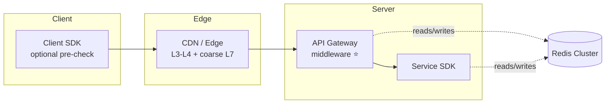
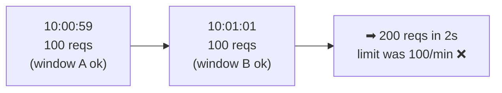
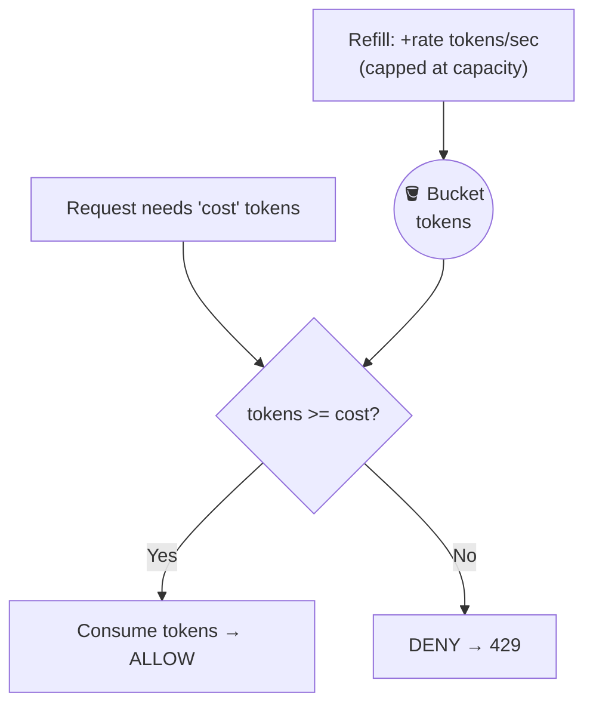
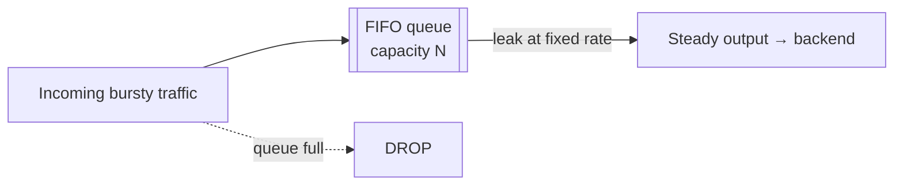
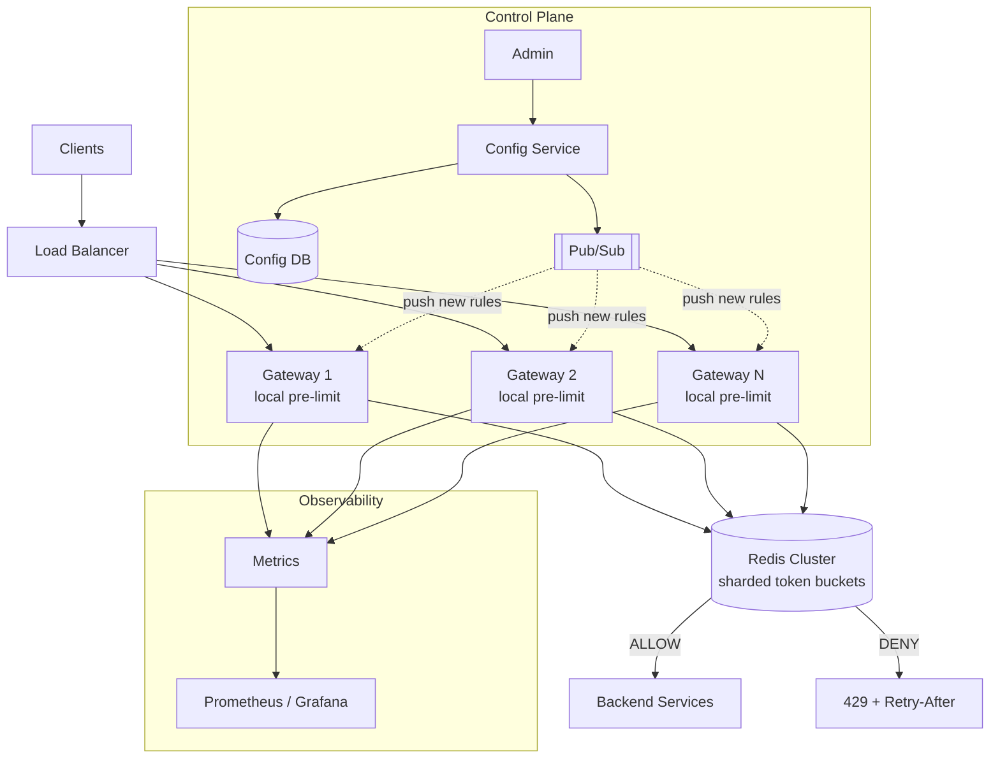
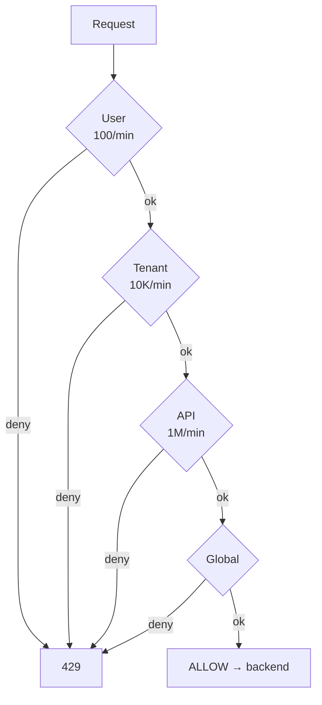
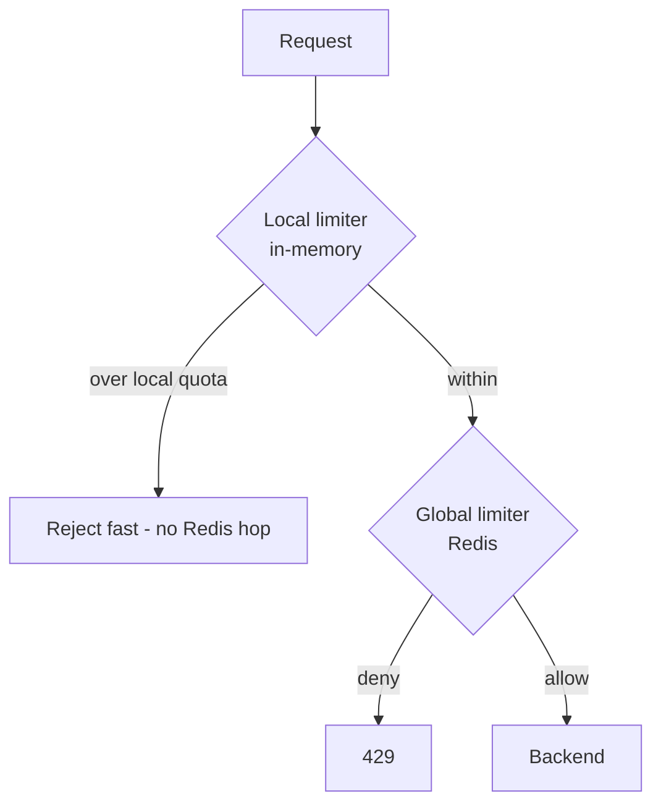
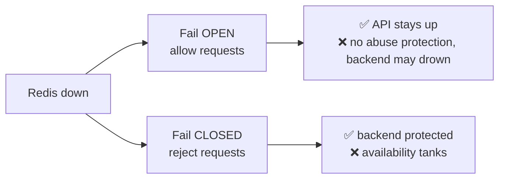
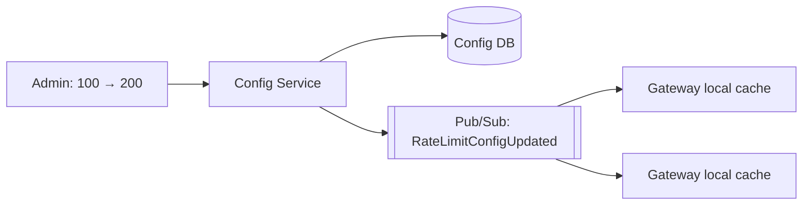

# Distributed Rate Limiter — Staff/SSE System Design

**Difficulty:** Intermediate → Advanced
**Interview importance:** ⭐ **Critical** (asked constantly; it's the classic "warm-up that's secretly deep")
**References:** ByteByteGo — *Design a Rate Limiter*; DDIA Ch. 8–9 (clocks, atomicity, quorums)

---

## 0. Why This Design Matters

A rate limiter looks like a `counter++` with an `if`. It is not. It sits **on the critical path of every request**, must be **atomic under massive concurrency**, must stay **fast when the thing it protects is already on fire**, and forces you to make an honest choice between **accuracy and availability**. That combination is why interviewers love it: a weak candidate ships `GET`/`SET` and a race condition; a strong candidate talks about Lua atomicity, hot keys, fail-open policy, and clock skew.

> The one-line thesis: **a rate limiter trades a little accuracy for a lot of speed and availability — and the whole design is about *where* you spend that trade.**

---

## 1. Problem Overview — Explain It Simply

Build a service that answers one question, millions of times per second, in single-digit milliseconds:

> **"Has this caller done too much, too fast? Allow or deny."**

It protects APIs and backends from:

- Excessive traffic and abuse (scrapers, brute-force)
- Application-layer DDoS
- Accidental **retry storms** (a client bug that hammers you)
- **Noisy tenants** starving everyone else (fairness)
- Expensive downstream calls (protect a fragile third party)

```text
User U123        → 100 requests / minute
Tenant T1        → 10,000 requests / minute
POST /payments   → 20 requests / second / user
```

It must stay correct while **thousands of API servers** ask concurrently.

### Real-world analogy — the nightclub bouncer

A bouncer enforces a **capacity** (limit) over a **door** (the API). Two philosophies:

- **Token bucket** — you hand out 100 wristbands; a machine drips 10 new ones per second. A crowd can rush in *if* wristbands are stockpiled (**bursts allowed**), but the long-run rate is fixed by the drip.
- **Leaky bucket** — the door only opens once every 100 ms, no matter how big the crowd is (**perfectly smooth output**, no bursts).

Everything else — Redis, Lua, sharding — is just "how do 50 bouncers at 50 doors agree on one shared count without tripping over each other?"

---

## 2. Functional Requirements

**Core**
- Allow / deny a request (the decision).
- Configure limits per **user / IP / API / tenant / global**.
- Support **multiple time windows** (per-sec, per-min, per-hour).
- Return **remaining quota** and **retry-after** to the caller.
- Update limits **without a restart**.

**Optional (name them, then defer)**
- Dynamic / adaptive limits, burst allowance, priority tiers, geo limits, admin dashboard, **cost-weighted** requests (a heavy call costs 5 tokens, not 1).

---

## 3. Non-Functional Requirements

| Requirement | Target | Why it dominates the design |
|---|---|---|
| Decision latency | **p99 < 5–10 ms** | It's added to *every* request; it can't be the bottleneck |
| Availability | **99.99%+** | If the limiter is down, does your whole API go down? (→ fail-open/closed) |
| Throughput | Millions of decisions/sec | Forces sharding + O(1) algorithms |
| Accuracy | **Exact for critical APIs**, approximate OK elsewhere | The core trade-off |
| Failure mode | **Configurable** fail-open / fail-closed | Per-API business decision |
| Config propagation | Seconds | Ops must change limits live during an incident |

> **Say this out loud in an interview:** *"The rate limiter is on the critical path, so latency and availability matter as much as correctness. That single sentence drives most of my decisions."*

---

## 4. Capacity Estimation (do the math — don't hand-wave)

Assume the classic large-scale prompt:

```text
Peak traffic        = 10,000,000 requests/sec  (10M QPS)
Peak-to-average     = 3×  → provision for ~30M QPS
```

**Redis throughput → shard count.** One Redis node handles ~**100K ops/sec** comfortably (a Lua rate-check is a few ops). Even generously assuming 200K ops/sec/node:

```text
30,000,000 decisions/sec ÷ 200,000 ops/sec ≈ 150 shards (before replicas)
```

→ **A single Redis instance is impossible.** You need a **sharded cluster** (this is the headline conclusion).

**Memory → cost.** Each token-bucket key stores ~little: `key (~40 B) + tokens (8 B) + last_refill (8 B) + Redis overhead (~50 B) ≈ 100 B/key`.

```text
100M active keys × 100 B ≈ 10 GB   → trivially fits in a small cluster
1B  active keys × 100 B ≈ 100 GB   → ~a few nodes; TTLs evict idle keys automatically
```

**What the numbers tell us:**
- Sharding is mandatory (throughput, not memory, is the constraint).
- The algorithm must be **O(1) per request** with **tiny state**.
- Payloads must be small; the network hop is part of the latency budget.
- **TTLs are your garbage collector** — idle keys must expire or memory grows unbounded.

---

## 5. API Design

**Check a limit** (the hot path):
```http
POST /v1/ratelimit/check
```
```json
{ "key": "user:U123", "api": "POST:/payments", "cost": 1 }
```
```json
{
  "allowed": true,
  "limit": 100,
  "remaining": 87,
  "resetAt": "2026-08-23T10:01:00Z",
  "retryAfterSeconds": 0
}
```

**Configure a rule** (the control path):
```http
PUT /v1/ratelimit/rules/{ruleId}
```
```json
{ "scope": "USER", "api": "POST:/payments", "limit": 100, "windowSeconds": 60, "algorithm": "TOKEN_BUCKET" }
```

**Response to the *end user* when throttled** — standard headers (this is a known-detail interviewers check for):
```text
HTTP 429 Too Many Requests
X-RateLimit-Limit: 100
X-RateLimit-Remaining: 0
X-RateLimit-Reset: 1692783660
Retry-After: 2
```

---

## 6. Where Does the Rate Limiter Live?



- **Client-side** — cheap, but **forgeable**. Use only as a courtesy pre-check, never for security.
- **Edge / CDN** (e.g. Cloudflare) — absorbs volumetric abuse near the user; handles **L3/L4** (network) that an app limiter can't see.
- **API Gateway middleware ⭐** — the default answer. One place, all APIs, alongside auth/SSL termination.
- **Service SDK** — when limits are service-specific and you want to avoid an extra network hop.

> **Layered defense** is the mature framing: **L3/L4 (SYN floods, IP bans via iptables) at the edge; L7 (per-user/tenant quotas) at the gateway.** A rate limiter only sees Layer 7 — say so, so the interviewer knows you know the difference.

---

## 7. The Five Algorithms

The single most useful artifact in this whole doc — memorize this table, then we detail each:

| Algorithm | Accuracy | Memory | Bursts? | Boundary bug? | Cost/req | Use when |
|---|---|---|---|---|---|---|
| **Fixed Window** | Low | Tiny | Uncontrolled | **Yes (2×)** | O(1) | Simple, cheap, non-critical |
| **Sliding Window Log** | **Exact** | **Heavy** (stores every ts) | No | No | O(log n) | Low volume, need precision |
| **Sliding Window Counter** | ~99.997% | Tiny | Smoothed | No | O(1) | **General high-scale default** |
| **Token Bucket** ⭐ | High | Tiny | **Yes (controlled)** | No | O(1) | APIs that want bursts + avg rate |
| **Leaky Bucket** | High | Small | **No (smooths)** | No | O(1) | Protect a fixed-rate downstream |

> Cloudflare reported the **sliding-window-counter** approximation was off by only **0.003% across 400M requests** — approximate does *not* mean sloppy.

### 7.1 Fixed Window Counter

Count per fixed clock window; reset each window. In Redis this is literally `INCR` + `EXPIRE`:

```text
INCR  rl:user:U123:1692783600   → 1
EXPIRE rl:user:U123:1692783600 60
if value > limit → DENY
```

**Con — the boundary burst.** 100 requests at `10:00:59` and 100 at `10:01:01` = **200 requests in ~2 seconds**, yet neither window exceeds 100.



### 7.2 Sliding Window Log

Store a **timestamp per request** in a Redis **sorted set**; drop old ones; count what's left:

```text
ZREMRANGEBYSCORE  rl:U123  0  (now - window)   # evict old
ZADD              rl:U123  now  now            # record this request
ZCARD             rl:U123                       # how many in window?
if count > limit → DENY
```

**Exact**, but stores one entry per request → **memory-heavy** and even *rejected* requests may occupy space. Bad at millions of QPS.

### 7.3 Sliding Window Counter (the pragmatic winner)

Blend the **current** and **previous** fixed windows by overlap:

```text
estimate = current_count + previous_count × (overlap fraction of window still in view)
```

**Worked example** — limit 100/min, we're 25% into the current minute:
```text
previous window = 80 requests, current window = 30 requests
overlap of previous still counted = 75%
estimate = 30 + 80 × 0.75 = 30 + 60 = 90  → under 100 → ALLOW
```
Two counters, O(1), no boundary bug, tiny memory. This is the **default for high scale**.

### 7.4 Token Bucket ⭐

A bucket of `capacity` tokens, refilled at `refill_rate`/sec. Each request spends `cost` tokens; empty ⇒ deny. Allows **bursts up to capacity** while holding the **long-run average** to the refill rate. Used by **Amazon** and **Stripe**.



**State (tiny):** `tokens`, `last_refill_timestamp`. On each request, lazily refill based on elapsed time — no background thread needed:
```text
elapsed = now - last_refill
tokens  = min(capacity, tokens + elapsed × refill_rate)
if tokens >= cost: tokens -= cost; ALLOW
else:              DENY
last_refill = now
```

### 7.5 Leaky Bucket (the one your old notes forgot)

A **FIFO queue** drained at a **fixed** rate. Requests join the queue; if the queue is full, they're dropped. Output is perfectly smooth — **no bursts ever**. Used by **Shopify**.



**Token bucket vs leaky bucket** — the distinction interviewers probe:
- **Token bucket** lets a burst through *if* tokens are saved up → protects *average* rate, tolerates spikes. Best for **user-facing APIs**.
- **Leaky bucket** enforces a *constant* output rate regardless of input → protects a **fragile fixed-throughput downstream** (e.g. a payment processor that accepts exactly 500 TPS).

---

## 8. High-Level Architecture



**Two planes, kept separate:**
- **Data plane (hot):** Gateway → Redis, on every request, in milliseconds.
- **Control plane (warm):** Admin → Config Service → Config DB → Pub/Sub → gateways' **local config cache**. Rules change live; **no counter ever touches the DB** on the request path.

### Why Redis for counters?
In-memory (µs latency), **atomic ops**, native **TTL**, **Lua** for read-modify-write atomicity, and horizontal **clustering**. A rate check is O(1). Postgres could *store the rules* but must **never** be the per-request counter — 10M `UPDATE`s/sec means lock contention, write amplification, and connection exhaustion.

---

## 9. The Concurrency Trap → Lua Atomicity

The mistake that fails the interview:

```text
GET tokens        # A reads 1, B reads 1
...compute...
SET tokens        # both think they succeeded → over-admission
```

Read-modify-write across the network is a **race condition**. Fix: run the whole decision **inside Redis atomically** via a **Lua script** (Redis executes a script single-threaded, so it's atomic w.r.t. other commands):

```lua
-- KEYS[1] = bucket key
-- ARGV: capacity, refill_rate(/sec), now(ms), cost, ttl(s)
local capacity  = tonumber(ARGV[1])
local rate      = tonumber(ARGV[2])
local now       = tonumber(ARGV[3])
local cost      = tonumber(ARGV[4])
local ttl       = tonumber(ARGV[5])

local state = redis.call('HMGET', KEYS[1], 'tokens', 'ts')
local tokens = tonumber(state[1]) or capacity
local ts     = tonumber(state[2]) or now

-- lazy refill based on elapsed time
local elapsed = math.max(0, now - ts) / 1000.0
tokens = math.min(capacity, tokens + elapsed * rate)

local allowed = 0
if tokens >= cost then
  tokens = tokens - cost
  allowed = 1
end

redis.call('HMSET', KEYS[1], 'tokens', tokens, 'ts', now)
redis.call('EXPIRE', KEYS[1], ttl)          -- self-cleaning
return { allowed, math.floor(tokens) }       -- {decision, remaining}
```

> **This is a top-3 thing to mention.** "The read, refill, decision, write, and TTL all happen in one atomic Lua script, so concurrent requests can't over-admit."

---

## 10. Redis Key Design & Cardinality

```text
rl:user:U123:POST:/payments
rl:tenant:T123:POST:/payments
rl:ip:1.2.3.4:POST:/payments
```
**Watch cardinality:** per-IP keys can explode (IPv6!). TTLs bound it, but a limit keyed on something unbounded is a memory-leak footgun.

---

## 11. Multiple Limits at Once + Cross-Shard Atomicity

One request can be subject to **user AND tenant AND API AND global** limits — allowed only if **all** pass.



**The subtle bug:** if you consume the user token, *then* the tenant limit denies, you've **leaked** a user token. Options, in order of quality:

1. **Check cheapest/broadest limit first** (order matters), decrement only on full pass.
2. **One Lua script over all counters** — cleanest, but in **Redis Cluster a Lua script's keys must be in the same hash slot.** Force that with **hash tags:**
   ```text
   {tenant123}:user:U123      # both keys hash on {tenant123}
   {tenant123}:limit          # → same slot → one atomic script works
   ```
3. **Accept non-atomic** multi-step with best-effort refund — fine when approximate is OK.

> This "consumed-then-denied → do we refund?" question is a genuine **staff-level** discriminator.

---

## 12. Hot Keys & the Two-Tier (Local + Global) Pattern

A single **global** key (`rl:global:payments`) takes *all* the traffic → **hot shard**. Two fixes:

- **Sharded counters:** split into `global:payments:0..99`, sum them — cheaper, but exact counting gets fuzzy.
- **Local + global (the pattern to lead with):** each gateway gets a **local sub-quota** and rejects obvious excess *in-memory*, only consulting Redis for shared quotas.



**Buys:** µs-fast local rejection, far less Redis traffic, resilience if Redis blips. **Costs:** the global quota becomes **approximate**, and quota allocation across gateways needs care (static split, or gateways lease tokens from a central pool).

---

## 13. Fail-Open vs Fail-Closed (a business decision, not a technical one)

Redis is unavailable. Now what?



The mature answer is **not to pick one globally**:

> *"I'd make it **configurable per API by business risk**. A public read API fails **open** — availability matters more than a brief loss of throttling. A payment or login API fails **closed**, or to a **conservative local fallback**, because unbounded traffic there is more dangerous than a few 429s."*

---

## 14. Correctness Gotchas Most Candidates Miss

- **Clock skew.** Token-bucket refill uses `now`. *Whose* clock? Gateways drift. Prefer **Redis server time** (`TIME` / `redis.call('TIME')` inside Lua) as the single source, so all decisions agree. (DDIA Ch. 8 territory — mention it.)
- **Async replication loses counter state.** Redis replicates asynchronously; on failover the promoted replica can be **behind**, briefly allowing over-admission. Rate limiting tolerates this; *don't* build a financial ledger on it.
- **Rate limiting ≠ concurrency limiting.** Rate = "N requests per window." Concurrency = "at most N *in flight* at once." Different tool (semaphore), often what people actually need for protecting a slow downstream.
- **Hard vs soft limits.** Hard = strict cutoff. Soft = allow brief overage (grace) before enforcing — kinder to bursty legit traffic.
- **GCRA** (Generic Cell Rate Algorithm) — a single-value variant of token/leaky bucket (stores one "theoretical arrival time" instead of token count). It's what production libraries like Stripe's use; a one-line name-drop signals depth.

---

## 15. Retry Storms → Backoff + Jitter

A naive client that retries a `429` instantly makes the overload *worse*:


The server's job: return `429` + `Retry-After`. The client's job: **exponential backoff with jitter** (jitter prevents a synchronized "thundering herd" of retries). Bake this into your SDK — you can't trust every caller.

---

## 16. Configuration Management

Limits must change **without a restart** (during an incident you may raise/lower them live):



Each gateway keeps an **in-memory config cache** (rules for user/tenant/API), refreshed by pub/sub — so **rule lookups cost nothing on the hot path**. Rules can live in a Lyft-style descriptor format:

```yaml
domain: messaging
descriptors:
  - key: message_type
    value: marketing
    rate_limit: { unit: day, requests_per_unit: 5 }
```

---

## 17. Multi-Datacenter & Global Scale

Deploy limiters at **edge locations** close to users (Cloudflare runs ~hundreds). Latency drops, but a single global count across continents would be slow to synchronize. Resolution: **eventual consistency** — each region enforces locally and reconciles asynchronously. You accept slight global over-admission in exchange for latency and availability. (This is the *same* accuracy-vs-speed trade, at planetary scale.)

---

## 18. Observability

| Category | Metrics |
|---|---|
| Traffic | requests/sec, allowed/sec, **denied/sec, 429 rate** |
| Redis | latency (p99), CPU, memory, **hot keys**, errors |
| Config | propagation delay (admin change → gateway) |
| Fairness | top users / tenants / APIs by consumption |
| Effectiveness | are rules too strict (dropping valid traffic) or too loose? |

Use these to **tune**: too many valid requests rejected → raise limits or switch algorithm; sudden pattern (flash sale) → adjust proactively.

---

## 19. Low-Level Design (clean OO)

```java
interface RateLimiter {                 // one entry point
    Decision check(String key, int cost);
}

interface RateLimitAlgorithm {          // Strategy pattern
    Decision check(State state, Request req);
}
// FixedWindow | SlidingWindowCounter | TokenBucket | LeakyBucket

interface RateLimitStore {              // DIP: depend on abstraction, not Redis
    Decision executeAtomically(String key, Request req);  // → Lua
}
// RedisRateLimitStore

class TokenBucketState { long capacity; double tokens; long refillRate; long lastRefillTs; }
```

**Patterns worth naming:**
- **Strategy** — swap algorithms via config, no core rewrite (OCP).
- **Chain of Responsibility** — user → tenant → API → global handlers, any link can reject.
- **DIP** — `RateLimiter` depends on `RateLimitStore`, not on Redis directly (swappable, testable).
- **SRP** — separate `Algorithm`, `Store`, `ConfigProvider`, `Metrics`.

---

## 20. Failure Scenarios

| Failure | Handling |
|---|---|
| Redis node down | Cluster replication + failover; per-API fail-open/closed; local fallback |
| Redis fully unavailable | Configured policy per API; local limiter keeps coarse protection |
| Gateway down | Load balancer reroutes to healthy gateways |
| Config Service down | Serve last cached config (stale but functional) |
| Pub/Sub down | Existing config keeps working; new-rule propagation delayed |
| Hot key | Sharded counters or local pre-limiting |
| Retry storm | 429 + Retry-After + client backoff/jitter |
| Clock skew | Use Redis server time as the single clock |

---

## 21. Latency Budget

```text
API p99 target ............ 100 ms
  Gateway processing ....... 1 ms
  Redis rate check ......... 1 ms
  Network overhead ......... 1 ms
  Backend .................. ~80 ms
  Response ................. ~10 ms
```
→ The limiter gets **~2–5 ms total**. Corollary: **never put a slow DB query on the limiter's path.** That's why config is cached and counters live in Redis.

---

## 22. Trade-Offs to Say Out Loud

| Axis | Option A | Option B | Choose by |
|---|---|---|---|
| State location | Central Redis (accurate, global) | Local limiter (fast, resilient, approximate) | Accuracy vs latency/resilience |
| Accuracy | Exact (coordination, cost) | Approximate (scales) | API criticality |
| Failure | Fail-open (availability) | Fail-closed (protection) | Business risk of overload |
| Algorithm | Token bucket (bursts) | Leaky bucket (smooth) / Fixed window (simple) | Downstream tolerance for bursts |
| Placement | Gateway (central policy) | SDK (flexible, fewer hops) | Org structure & consistency needs |

---

## 23. Interview Q&A

**Beginner**

**Q: Which algorithm and why?**
Token bucket as the default for user-facing APIs — it enforces an average rate while allowing controlled bursts, is O(1), and needs only two numbers of state. For a fragile fixed-rate downstream I'd use leaky bucket to smooth output; for high-scale approximate limiting, sliding-window-counter.

**Q: Why Redis, not Postgres, for counters?**
Counters are read-modified-written on every request. Redis is in-memory (µs), atomic, has TTL, and Lua for atomic decisions. Postgres at 10M writes/sec would die on lock contention and write amplification — it holds the *rules*, never the hot counters.

**Intermediate**

**Q: How do you make the decision atomic under concurrency?**
A naive GET/compute/SET races — two requests both read the same count and over-admit. I run the entire read-refill-decide-write-TTL sequence in a single Redis **Lua script**, which Redis executes atomically single-threaded.

**Q: Fixed window's flaw?**
The boundary burst: 100 requests just before the window rolls and 100 just after = 200 in ~2 seconds under a 100/min limit. Sliding-window-counter fixes it by weighting the previous window.

**Q: One key takes all the traffic — what happens?**
Hot shard. Fix with sharded sub-counters, or a two-tier local+global design where gateways reject obvious excess in-memory and only hit Redis for shared quotas — at the cost of the global count becoming approximate.

**Advanced / Staff**

**Q: You consumed a user token, then the tenant limit denies. Now what?**
That's a token leak. Best is one atomic Lua script over all counters — but in Redis Cluster the keys must share a hash slot, so I co-locate them with hash tags like `{tenant123}:user:U123`. If exactness isn't required, I check the broadest limit first and accept best-effort refunds.

**Q: Redis is down. Allow or deny?**
Configurable per API by business risk. Public reads fail open (availability > brief loss of throttling); payments/login fail closed or to a conservative local fallback. I wouldn't hard-code one global policy.

**Q: What breaks that most people miss?**
Clock skew — token refill uses `now`, and gateways drift, so I use Redis server time as the single clock. And async replication: on failover the replica can lag and briefly over-admit — acceptable for rate limiting, never for a ledger.

---

## 24. 30-Second Interview Answer

> "I'd put the rate limiter at the API gateway so it protects downstream services before expensive work. Algorithm: token bucket by default — it allows controlled bursts while capping the average rate. Hot state lives in a **sharded Redis cluster**, and the token calc + update runs in a single **Lua script** so concurrent requests can't over-admit. For scale I add a **local limiter** at each gateway to reject obvious excess in-memory and reserve Redis for shared tenant/global quotas — trading a little global accuracy for speed and resilience. Rules live separately and propagate via **pub/sub into local caches**, off the hot path. If Redis fails, behavior is **configurable per API**: fail-open for availability-sensitive reads, fail-closed for payments. I return standard **429 + Retry-After** and expect clients to back off with jitter, and I watch denied-rate, Redis p99, and hot keys."

---

## 25. Mental Model

```text
REQUEST
   ↓ local pre-limit (in-memory, µs)  ── reject obvious excess
   ↓ Redis atomic check (Lua)         ── shared user/tenant/global quota
   ↓
ALLOW → backend      DENY → 429 + Retry-After

ALGORITHM   → Token Bucket (bursts) | Leaky (smooth) | SlidingCounter (scale)
STATE       → Redis (sharded)
ATOMICITY   → Lua (same hash slot for multi-key)
SCALE       → sharding + local pre-limit
CONFIG      → Config Service + Pub/Sub → local cache (off hot path)
FAILURE     → fail-open/closed, per-API
CLOCK       → Redis server time (skew!)
CLIENT      → backoff + jitter
```

---

## 26. How This Connects to Other Topics

- **Scalability** — hot keys are the celebrity/skew problem; two-tier limiting is the same "handle the head of the distribution differently" move as Twitter fan-out.
- **Unreliable clocks (DDIA Ch. 8)** — token-bucket refill is a real-world case of "don't trust wall-clock time across machines."
- **Atomicity / weak isolation** — the GET/SET race is a lost-update; Lua is your single-node serialization point.
- **Leaderless replication & quorums** — the accuracy-vs-availability trade here is CAP in miniature: exact counting needs coordination; approximate scales.
- **Message queues** — leaky bucket *is* a bounded queue drained at a fixed rate; "queue the overflow" is one way to handle exceeded requests instead of dropping.
