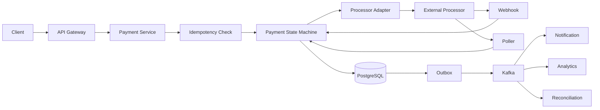
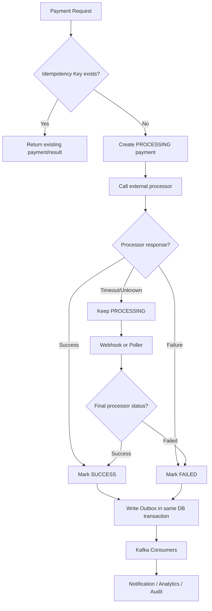

# Payment System

## 0. Why This Design Matters

Paytm-critical topic. Covers idempotency, state machines, external processors, webhooks, polling, reconciliation, ledger, transactions and outbox.

## 1. Problem Overview — Explain It Simply

A payment system accepts a payment request, safely sends it to a bank/payment processor, figures out the final result even when networks or services fail, and records the financial result without charging the customer twice.

## 2. Functional Requirements

- Create payment
- Get payment status
- Refund
- Processor webhook
- Poll uncertain transactions
- Payment history
- Reconciliation
- Audit/ledger

## 3. Non-Functional Requirements

- Strong correctness for financial state
- High availability
- No duplicate charge caused by our retries
- p95 API latency around 300 ms excluding processor latency
- Durable/auditable records
- Horizontal scalability

## 4. Capacity Estimation

Example: 20M DAU × 5 payment attempts/day = 100M attempts/day. Average ≈ 1,157 QPS. At 5× peak ≈ 5,800 QPS. State clearly that the assumptions are adjustable.

## 5. API Design

```text
POST /v1/payments
Idempotency-Key: ABC123

{
  "orderId": "O123",
  "amount": 1000,
  "currency": "INR",
  "method": "UPI"
}

GET /v1/payments/{paymentId}

POST /v1/payments/{paymentId}/refund
Idempotency-Key: R123
```

## 6. High-Level Architecture

```text
Client
  ↓
API Gateway
  ↓
Payment Service
  ├── Idempotency
  ├── State Machine
  ├── Processor Adapter
  └── Ledger
        ↓
   PostgreSQL
        ↓
      Outbox
        ↓
      Kafka
        ├── Notification
        ├── Analytics
        └── Audit

Payment Service ↔ External Processor
                     ↓
                 Webhook
                     ↓
                  Poller
                     ↓
              Reconciliation
```

### HLD Flowchart

The following is the primary interview flowchart. Draw this first, then explain each box.



## 7. Database Selection

PostgreSQL for payment state, idempotency, transactions and ledger metadata. Redis for temporary caching/rate limiting, never as the financial source of truth. Kafka for events. Cassandra can be considered for massive historical read models, not as the first choice for the core financial transaction.

### HLD Deep-Dive Flowchart

Use this second flowchart when the interviewer asks **"walk me through the complete flow"**.



## 8. HLD Deep Dive — Why Each Decision?

### Why Why is idempotency mandatory?

A client can retry after a timeout. Store an idempotency key with a unique constraint and return the original result for the same request. Idempotency must also be passed to the processor when supported.

### Why Why is timeout not failure?

After a processor timeout we do not know whether the processor charged the customer. Marking FAILED immediately could cause a second charge. Keep PROCESSING/UNKNOWN and resolve through webhook, polling or reconciliation.

### Why Why webhook plus poller?

Webhooks are efficient but can be delayed, duplicated or lost. Polling provides recovery for uncertain transactions. Reconciliation is the final safety net.

### Why Why Outbox?

Without outbox, DB update and Kafka publish are two independent operations. The DB can commit while Kafka fails. Store the event in the same DB transaction and publish asynchronously.

### Why Why a ledger?

Payment status is a workflow state; a ledger is an auditable financial record. Prefer immutable financial entries and, where appropriate, double-entry accounting.

### Why Why strong consistency here?

The business invariant is financial correctness. Payment/ledger state cannot safely rely on stale reads.

## 9. Interview Question & Answer

### Q: Payment succeeded but our service crashed before updating DB?

**Answer:** Webhook/poller/reconciliation discovers processor state and updates the payment idempotently.

### Q: Webhook arrives twice?

**Answer:** Use webhookEventId or processorTransactionId with a unique constraint; second delivery becomes a no-op.

### Q: Two refund requests arrive?

**Answer:** Refund idempotency key plus transactional state transition.

### Q: Processor is down?

**Answer:** Timeout, circuit breaker, controlled retry with backoff/jitter, and optionally route to another processor.

### Q: Kafka is down?

**Answer:** Outbox remains durable and retries later.

### Q: How do you prevent double charging?

**Answer:** End-to-end idempotency: client request key, our payment record, and processor idempotency key where supported.

### Q: What is reconciliation?

**Answer:** Periodically compare our transaction state with processor records and repair mismatches.

### Q: Exactly once?

**Answer:** Do not promise end-to-end exactly-once. Use at-least-once delivery with idempotent processing.

## 10. LLD

```text
PaymentService
 ├── IdempotencyService
 ├── PaymentRepository
 ├── PaymentProcessorRouter
 ├── LedgerService
 └── OutboxPublisher

PaymentProcessor
 ├── ProcessorAAdapter
 └── ProcessorBAdapter

Key patterns:
- State Machine → payment lifecycle
- Strategy → processor routing
- Adapter → provider API differences
- Outbox → reliable events
- Saga → larger distributed order/payment workflow
```

## 11. Failure Checklist

Always walk through:
- Service crash
- Database failure
- Cache/Redis failure
- Kafka/queue failure
- External dependency timeout
- Duplicate request
- Duplicate event
- Hot key/hot partition
- Network partition
- Partial success
- Recovery/reconciliation

## 12. Trade-Offs You Should Say Out Loud

A strong interview answer does not say "this is the only solution."

Instead say:

> "I'm choosing X because of requirement Y. The alternative is Z, which would be better if requirement A were more important."

Typical trade-offs:

| Choice | Benefit | Cost |
|---|---|---|
| Strong consistency | Correctness | Higher latency/coordination |
| Eventual consistency | Scale/availability | Stale reads |
| Redis | Very low latency | Memory/cost/failure considerations |
| PostgreSQL | Transactions | Horizontal write scaling is harder |
| Cassandra | Huge scale/availability | Query-driven modeling, weaker transactions |
| Kafka | Decoupling/replay | Operational complexity |
| Sync processing | Simple response semantics | Higher latency/coupling |
| Async processing | Resilience/scale | Eventual completion |

## 13. Staff-Level Follow-Up Questions

Be ready for these:

1. What breaks first at 10× traffic?
2. What is your hottest key/partition?
3. Can this operation be retried safely?
4. What happens if the service crashes after the external side effect but before the DB update?
5. Which data needs strong consistency?
6. Where can you tolerate eventual consistency?
7. How would you shard it?
8. What happens to a shard becoming hot?
9. How do you recover from a partial failure?
10. How do you observe correctness, not just availability?
11. What would you cache?
12. What would you never cache?
13. Where does backpressure happen?
14. How do you handle replay?
15. Why did you choose this database over the alternatives?

## 14. 2-Minute Interview Explanation

If the interviewer asks you to summarize **Payment System**, use this structure:

> "I'll first separate the read-heavy and correctness-critical paths. The authoritative state lives in the database best suited to the business invariant, while cache and distributed stores handle high-volume/temporary access. Requests that don't need to block the user are moved to an asynchronous queue/event stream. For concurrency, I use atomic updates, constraints, locks or idempotency depending on the invariant. For failures, I use timeout, retry with exponential backoff and jitter, circuit breakers where appropriate, and reconciliation when an external system can have an unknown outcome. At scale, I shard based on the dominant query/access pattern and explicitly handle hot keys and backpressure."


# Interview Framework

Use this exact flow in the interview:

```text
1. Clarify requirements
       ↓
2. Estimate scale
       ↓
3. Define APIs
       ↓
4. Define data model
       ↓
5. Draw HLD
       ↓
6. Explain request/data flow
       ↓
7. Deep dive into the hardest invariant
       ↓
8. Discuss DB/cache/Kafka
       ↓
9. Concurrency + consistency
       ↓
10. Failure handling
       ↓
11. Scaling/sharding
       ↓
12. LLD
       ↓
13. Trade-offs
```

## Universal Scale Formula

```text
Average QPS = daily requests / 86,400
Peak QPS = average QPS × peak factor
```

Start with an assumption such as 5× and say:

> "I'll use 5× as a starting peak multiplier; we can adjust if you give me a traffic pattern."

## Universal Database Cheat Sheet

### PostgreSQL

Use when you need:

- ACID transactions
- Strong consistency
- Relationships
- Constraints
- Conditional updates
- Booking/payment/inventory

### MongoDB

Use when:

- Data is naturally document-shaped
- Flexible schema matters
- Access is mostly by document
- Relationships are not the dominant problem

### Cassandra

Use when:

- Very high write volume
- High availability
- Predictable query patterns
- Massive time-series/activity/message data

Remember:

> Cassandra data modeling starts from queries, not from normalized entities.

### Redis

Use for:

- Cache
- Counters
- Rate limits
- Locks/leases
- Sessions
- Presence
- Temporary state

Do not automatically make Redis the source of truth for critical durable business state.

### Elasticsearch/OpenSearch

Use for:

- Full-text search
- Ranking
- Autocomplete
- Filtering/faceting

Think of it as a read model, not automatically your transactional source of truth.

### Kafka

Use for:

- Async events
- Decoupling
- Buffering
- Replay
- Fanout
- Stream processing

## Universal Reliability

When interviewer asks "what if X fails?":

```text
Timeout
 ↓
Should we retry?
 ↓
Idempotency
 ↓
Exponential backoff + jitter
 ↓
Circuit breaker
 ↓
Fallback?
 ↓
DLQ?
 ↓
Reconciliation?
```

## Universal Cache Problems

```text
Cache Stampede
→ request coalescing / lock / background refresh

Hot Key
→ local cache / CDN / replication / sharding

Cache Penetration
→ negative cache / Bloom filter

Cache Avalanche
→ TTL jitter / staggered expiry
```

## Universal Kafka

```text
Producer
 ↓
Topic
 ↓
Partitions
 ↓
Consumer Group
 ↓
Consumers
```

- Ordering → within a partition
- Scale → partitions
- Parallelism → consumers
- Replay → retention
- Duplicate events → idempotent consumers

## Universal Consistency Rule

Use strong consistency when the business invariant cannot tolerate stale state:

- Payment
- Wallet
- Booking
- Critical inventory
- Ledger

Eventual consistency is often fine for:

- Search index
- Analytics
- Recommendations
- Notifications
- Like/view counters

The best sentence to remember:

> "Consistency should follow the business invariant, not the technology."

## Universal Concurrency

Ask:

> "What happens if two requests execute this operation at exactly the same time?"

Possible tools:

- Atomic DB update
- Optimistic locking
- Pessimistic locking
- Unique constraint
- Distributed lock/lease
- Idempotency key
- Queue serialization

## Universal Idempotency

If the same request can safely be retried:

```text
request
 ↓
idempotency key
 ↓
existing result?
 ├── yes → return existing result
 └── no → process + store result
```

## Universal Staff-Level Thinking

Always discuss:

1. What happens at 10× traffic?
2. What becomes the bottleneck?
3. What is the hot key/hot partition?
4. What if a dependency fails?
5. What happens if the same request arrives twice?
6. Which state must be strongly consistent?
7. What can be eventually consistent?
8. What can be asynchronous?
9. Where does backpressure happen?
10. How do we observe and reconcile failures?

# Final Interview Rule

Do not jump directly into technologies.

First say:

> "Let me clarify the requirements and scale. Then I'll identify the critical business invariant, because that will drive my consistency and database choices."

That sentence alone makes the discussion much more senior.
