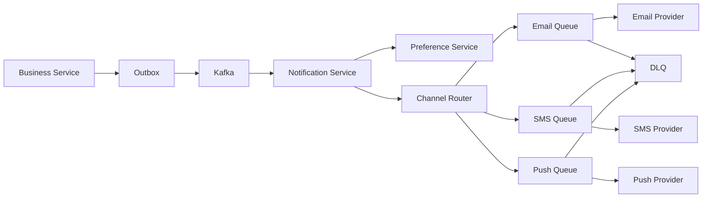
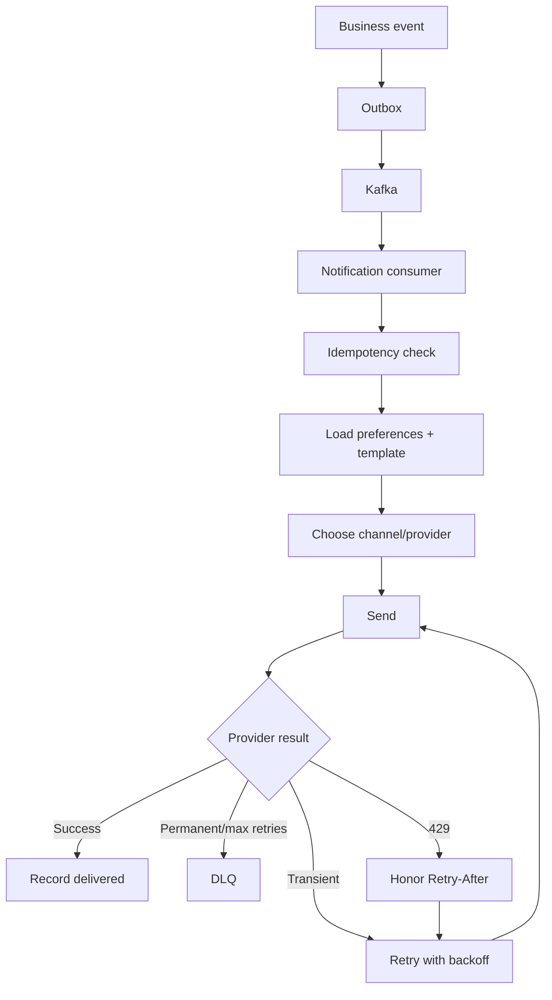
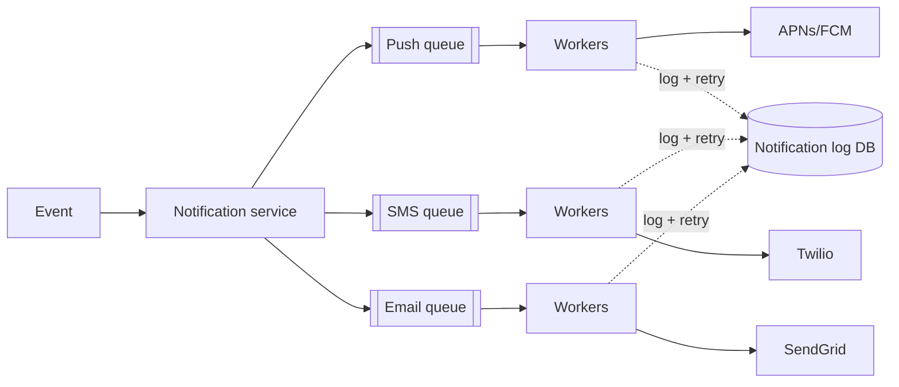

# Notification System

## 0. Why This Design Matters

Covers asynchronous architecture, Kafka, channel abstraction, retries, provider failure, rate limiting, DLQ and preferences.

## 1. Problem Overview — Explain It Simply

Business services publish events such as PaymentSuccessful. A notification platform consumes them, checks user preferences, selects channels, and delivers through email/SMS/push providers without blocking the business transaction.

## 2. Functional Requirements

- Email/SMS/push/in-app
- Templates
- Preferences
- Scheduling
- Retry
- Delivery status
- Provider fallback
- Deduplication

## 3. Non-Functional Requirements

- High throughput
- Durable events
- Async delivery
- Provider failure recovery
- Rate limits
- At-least-once processing

## 4. Capacity Estimation

Example: 100M business events/day with average 1.5 notifications/event = 150M notifications/day ≈ 1,736/sec average and ≈ 8,700/sec at 5×.

## 5. API Design

```text
POST /v1/notifications
{
  "userId":"U1",
  "template":"PAYMENT_SUCCESS",
  "channels":["PUSH","EMAIL"],
  "payload":{"paymentId":"P1"},
  "idempotencyKey":"N1"
}
```

## 6. High-Level Architecture

```text
Business Service
 ↓
Outbox
 ↓
Kafka
 ↓
Notification Service
 ↓
Preference Service
 ↓
Channel Queues
 ├── Email Worker → Provider
 ├── SMS Worker → Provider
 └── Push Worker → Provider
```

### HLD Flowchart

The following is the primary interview flowchart. Draw this first, then explain each box.



## 7. Database Selection

PostgreSQL for templates, preferences and notification metadata. Kafka for events. A wide-column store can hold very large delivery history if needed.

### HLD Deep-Dive Flowchart

Use this second flowchart when the interviewer asks **"walk me through the complete flow"**.



## 8. HLD Deep Dive — Why Each Decision?

### Why Why async?

Email/SMS provider latency or failure should not make payment/order APIs slow or unavailable.

### Why Why separate channel queues?

SMS, email and push have different throughput limits and provider behavior, so they should scale independently.

### Why Retry policy?

Retry timeouts, transient 5xx and rate limits. Do not retry permanent validation errors.

### Why Provider failover?

Adapter layer can select provider B after provider A fails, subject to idempotency and provider semantics.

### Why Why priority queues?

Security/OTP messages may need faster delivery than marketing.

### Why How prevent duplicates?

Use notification/event IDs and idempotent consumers. Some channels cannot guarantee absolute exactly-once delivery, so design for safe duplicates where possible.

## 9. Interview Question & Answer

### Q: Provider is down?

**Answer:** Retry with backoff/jitter and optionally fail over.

### Q: Kafka down?

**Answer:** Outbox holds the event.

### Q: User opted out?

**Answer:** Preference check before delivery.

### Q: Provider returns 429?

**Answer:** Backoff and respect Retry-After/provider quota.

### Q: Worker crashes?

**Answer:** Queue redelivery; idempotent processing prevents duplicate critical sends.

## 10. LLD

```text
NotificationService
 ├── PreferenceService
 ├── TemplateService
 ├── ChannelRouter
 └── NotificationRepository

NotificationChannel
 ├── EmailChannel
 ├── SmsChannel
 └── PushChannel

Patterns:
- Strategy → channel selection
- Adapter → provider APIs
- Factory → provider selection
- Outbox/DLQ → reliability
```

## 11. Failure Checklist

Always walk through:
- Service crash
- Database failure
- Cache/Redis failure
- Kafka/queue failure
- External dependency timeout
- Duplicate request
- Duplicate event
- Hot key/hot partition
- Network partition
- Partial success
- Recovery/reconciliation

## 12. Trade-Offs You Should Say Out Loud

A strong interview answer does not say "this is the only solution."

Instead say:

> "I'm choosing X because of requirement Y. The alternative is Z, which would be better if requirement A were more important."

Typical trade-offs:

| Choice | Benefit | Cost |
|---|---|---|
| Strong consistency | Correctness | Higher latency/coordination |
| Eventual consistency | Scale/availability | Stale reads |
| Redis | Very low latency | Memory/cost/failure considerations |
| PostgreSQL | Transactions | Horizontal write scaling is harder |
| Cassandra | Huge scale/availability | Query-driven modeling, weaker transactions |
| Kafka | Decoupling/replay | Operational complexity |
| Sync processing | Simple response semantics | Higher latency/coupling |
| Async processing | Resilience/scale | Eventual completion |

## 13. Staff-Level Follow-Up Questions

Be ready for these:

1. What breaks first at 10× traffic?
2. What is your hottest key/partition?
3. Can this operation be retried safely?
4. What happens if the service crashes after the external side effect but before the DB update?
5. Which data needs strong consistency?
6. Where can you tolerate eventual consistency?
7. How would you shard it?
8. What happens to a shard becoming hot?
9. How do you recover from a partial failure?
10. How do you observe correctness, not just availability?
11. What would you cache?
12. What would you never cache?
13. Where does backpressure happen?
14. How do you handle replay?
15. Why did you choose this database over the alternatives?

## 14. 2-Minute Interview Explanation

If the interviewer asks you to summarize **Notification System**, use this structure:

> "I'll first separate the read-heavy and correctness-critical paths. The authoritative state lives in the database best suited to the business invariant, while cache and distributed stores handle high-volume/temporary access. Requests that don't need to block the user are moved to an asynchronous queue/event stream. For concurrency, I use atomic updates, constraints, locks or idempotency depending on the invariant. For failures, I use timeout, retry with exponential backoff and jitter, circuit breakers where appropriate, and reconciliation when an external system can have an unknown outcome. At scale, I shard based on the dominant query/access pattern and explicitly handle hot keys and backpressure."


# Interview Framework

Use this exact flow in the interview:

```text
1. Clarify requirements
       ↓
2. Estimate scale
       ↓
3. Define APIs
       ↓
4. Define data model
       ↓
5. Draw HLD
       ↓
6. Explain request/data flow
       ↓
7. Deep dive into the hardest invariant
       ↓
8. Discuss DB/cache/Kafka
       ↓
9. Concurrency + consistency
       ↓
10. Failure handling
       ↓
11. Scaling/sharding
       ↓
12. LLD
       ↓
13. Trade-offs
```

## Universal Scale Formula

```text
Average QPS = daily requests / 86,400
Peak QPS = average QPS × peak factor
```

Start with an assumption such as 5× and say:

> "I'll use 5× as a starting peak multiplier; we can adjust if you give me a traffic pattern."

## Universal Database Cheat Sheet

### PostgreSQL

Use when you need:

- ACID transactions
- Strong consistency
- Relationships
- Constraints
- Conditional updates
- Booking/payment/inventory

### MongoDB

Use when:

- Data is naturally document-shaped
- Flexible schema matters
- Access is mostly by document
- Relationships are not the dominant problem

### Cassandra

Use when:

- Very high write volume
- High availability
- Predictable query patterns
- Massive time-series/activity/message data

Remember:

> Cassandra data modeling starts from queries, not from normalized entities.

### Redis

Use for:

- Cache
- Counters
- Rate limits
- Locks/leases
- Sessions
- Presence
- Temporary state

Do not automatically make Redis the source of truth for critical durable business state.

### Elasticsearch/OpenSearch

Use for:

- Full-text search
- Ranking
- Autocomplete
- Filtering/faceting

Think of it as a read model, not automatically your transactional source of truth.

### Kafka

Use for:

- Async events
- Decoupling
- Buffering
- Replay
- Fanout
- Stream processing

## Universal Reliability

When interviewer asks "what if X fails?":

```text
Timeout
 ↓
Should we retry?
 ↓
Idempotency
 ↓
Exponential backoff + jitter
 ↓
Circuit breaker
 ↓
Fallback?
 ↓
DLQ?
 ↓
Reconciliation?
```

## Universal Cache Problems

```text
Cache Stampede
→ request coalescing / lock / background refresh

Hot Key
→ local cache / CDN / replication / sharding

Cache Penetration
→ negative cache / Bloom filter

Cache Avalanche
→ TTL jitter / staggered expiry
```

## Universal Kafka

```text
Producer
 ↓
Topic
 ↓
Partitions
 ↓
Consumer Group
 ↓
Consumers
```

- Ordering → within a partition
- Scale → partitions
- Parallelism → consumers
- Replay → retention
- Duplicate events → idempotent consumers

## Universal Consistency Rule

Use strong consistency when the business invariant cannot tolerate stale state:

- Payment
- Wallet
- Booking
- Critical inventory
- Ledger

Eventual consistency is often fine for:

- Search index
- Analytics
- Recommendations
- Notifications
- Like/view counters

The best sentence to remember:

> "Consistency should follow the business invariant, not the technology."

## Universal Concurrency

Ask:

> "What happens if two requests execute this operation at exactly the same time?"

Possible tools:

- Atomic DB update
- Optimistic locking
- Pessimistic locking
- Unique constraint
- Distributed lock/lease
- Idempotency key
- Queue serialization

## Universal Idempotency

If the same request can safely be retried:

```text
request
 ↓
idempotency key
 ↓
existing result?
 ├── yes → return existing result
 └── no → process + store result
```

## Universal Staff-Level Thinking

Always discuss:

1. What happens at 10× traffic?
2. What becomes the bottleneck?
3. What is the hot key/hot partition?
4. What if a dependency fails?
5. What happens if the same request arrives twice?
6. Which state must be strongly consistent?
7. What can be eventually consistent?
8. What can be asynchronous?
9. Where does backpressure happen?
10. How do we observe and reconcile failures?

# Final Interview Rule

Do not jump directly into technologies.

First say:

> "Let me clarify the requirements and scale. Then I'll identify the critical business invariant, because that will drive my consistency and database choices."

That sentence alone makes the discussion much more senior.

---

# 📚 Book Cross-Reference & Added Depth

**Source:** Alex Xu, *System Design Interview* Vol 1, Ch 10 — *Design a Notification System* (companion note `Book-System-Design-Vol-1/10-design-a-notification-system.md`).

Book specifics to add:

- **Channel-specific providers** — you don't deliver notifications yourself, you hand off to third parties: **iOS push → APNs**, **Android → FCM**, **SMS → Twilio/Nexmo**, **Email → SendGrid/Mailchimp**. Each has its own payload format and auth.
- **Per-channel queues + workers.** A message queue **decouples** the notification service from the (rate-limited, sometimes-down) providers; separate queues per channel so a slow SMS provider doesn't block push. Scale: ~**10M push / 1M SMS / 5M email per day** in the book's estimate.
- **Reliability = notification log + retries.** Persist every send attempt to a **notification log DB**; on provider failure, **retry** (with backoff). Providers give **at-least-once**, so you **dedup by event/notification ID** — there is **no exactly-once**.
- **User settings & opt-out** are checked before sending; **rate limiting** prevents spamming a user.



**Interview line:** *"Fan out through per-channel queues to third-party providers (APNs/FCM/Twilio/SendGrid), log every attempt for retries, and dedup by event ID since delivery is only at-least-once."*
