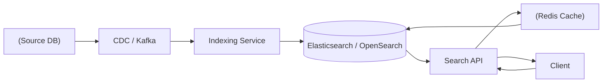
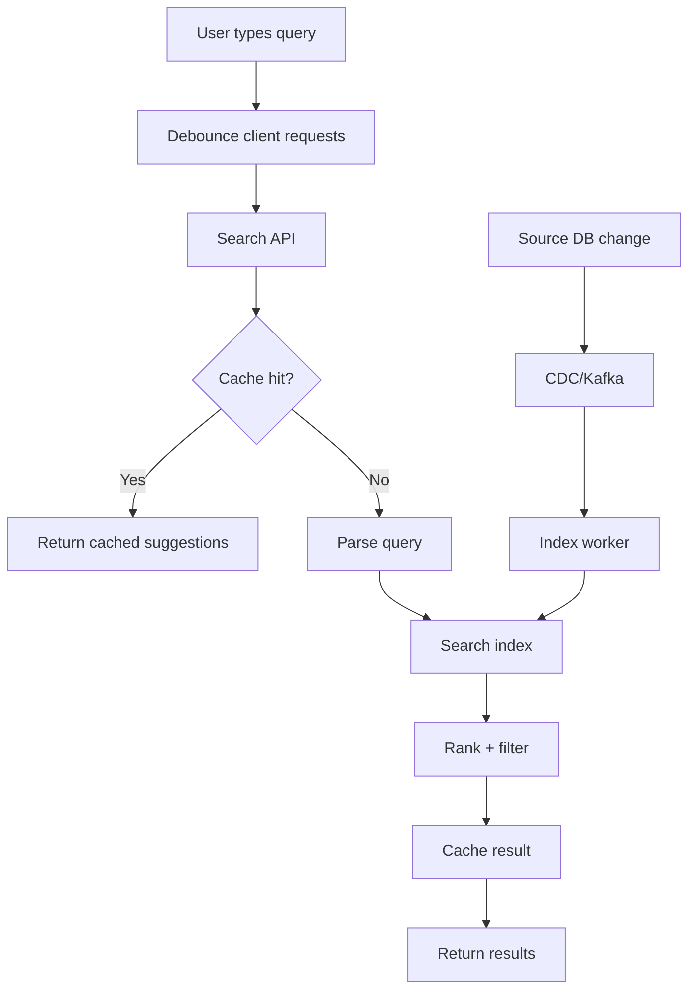
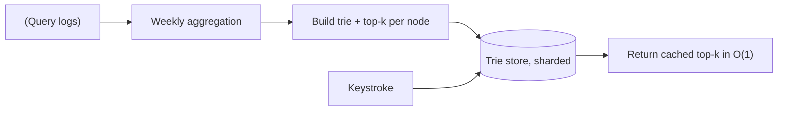

# Search / Autocomplete

## 0. Why This Design Matters

Covers Elasticsearch/OpenSearch, inverted indexes, indexing pipelines, shards, replicas, ranking and eventual consistency.

## 1. Problem Overview — Explain It Simply

The transactional database stores the real data. A search index builds a specialized structure so users can quickly find matching documents, filter them and rank results.

## 2. Functional Requirements

- Full-text search
- Autocomplete
- Filtering/facets
- Sorting
- Pagination
- Ranking
- Typo tolerance

## 3. Non-Functional Requirements

- Low latency
- High QPS
- High availability
- Eventual consistency acceptable

## 4. Capacity Estimation

Example: 50M searches/day ≈ 579 QPS average and ≈ 2,900 QPS at 5×. Autocomplete can multiply requests significantly, so caching/debouncing matters.

## 5. API Design

```text
GET /v1/search?q=iphone&filters=...
GET /v1/autocomplete?q=iph&limit=10
```

## 6. High-Level Architecture

```text
Source DB
 ↓
CDC / Kafka
 ↓
Indexer
 ↓
Elasticsearch/OpenSearch
 ↓
Search API
 ↓
Cache
 ↓
Client
```

### HLD Flowchart

The following is the primary interview flowchart. Draw this first, then explain each box.



## 7. Database Selection

Use the transactional DB as source of truth. Elasticsearch/OpenSearch is a read model optimized for text search. Redis can cache hot queries/autocomplete.

### HLD Deep-Dive Flowchart

Use this second flowchart when the interviewer asks **"walk me through the complete flow"**.



## 8. HLD Deep Dive — Why Each Decision?

### Why Why inverted index?

Instead of scanning every document, map terms to matching documents.

### Why Why not query PostgreSQL with LIKE?

At large scale, full-text relevance, fuzzy search and faceting are better handled by a search engine.

### Why Why shards?

Split the index so storage and query work can scale horizontally.

### Why Why replicas?

Availability and read throughput.

### Why Why eventual consistency?

The search index may lag behind the source DB; for most search experiences this is acceptable.

### Why Autocomplete options?

Prefix fields, edge n-grams, completion suggesters or specialized prefix indexes.

## 9. Interview Question & Answer

### Q: Indexer crashes?

**Answer:** Kafka retains events; restart and replay.

### Q: Search node fails?

**Answer:** Replica handles traffic.

### Q: Data appears late?

**Answer:** Expected eventual consistency; monitor index lag.

### Q: How rank results?

**Answer:** Text relevance + popularity + recency + business rules; advanced systems can add ML ranking.

## 10. LLD

```text
SearchService
 ├── QueryParser
 ├── SearchRepository
 └── RankingStrategy

Indexer
 ├── EventConsumer
 ├── Transformer
 └── IndexWriter

Patterns:
- CQRS/read model
- Pipeline
- Strategy → ranking
```

## 11. Failure Checklist

Always walk through:
- Service crash
- Database failure
- Cache/Redis failure
- Kafka/queue failure
- External dependency timeout
- Duplicate request
- Duplicate event
- Hot key/hot partition
- Network partition
- Partial success
- Recovery/reconciliation

## 12. Trade-Offs You Should Say Out Loud

A strong interview answer does not say "this is the only solution."

Instead say:

> "I'm choosing X because of requirement Y. The alternative is Z, which would be better if requirement A were more important."

Typical trade-offs:

| Choice | Benefit | Cost |
|---|---|---|
| Strong consistency | Correctness | Higher latency/coordination |
| Eventual consistency | Scale/availability | Stale reads |
| Redis | Very low latency | Memory/cost/failure considerations |
| PostgreSQL | Transactions | Horizontal write scaling is harder |
| Cassandra | Huge scale/availability | Query-driven modeling, weaker transactions |
| Kafka | Decoupling/replay | Operational complexity |
| Sync processing | Simple response semantics | Higher latency/coupling |
| Async processing | Resilience/scale | Eventual completion |

## 13. Staff-Level Follow-Up Questions

Be ready for these:

1. What breaks first at 10× traffic?
2. What is your hottest key/partition?
3. Can this operation be retried safely?
4. What happens if the service crashes after the external side effect but before the DB update?
5. Which data needs strong consistency?
6. Where can you tolerate eventual consistency?
7. How would you shard it?
8. What happens to a shard becoming hot?
9. How do you recover from a partial failure?
10. How do you observe correctness, not just availability?
11. What would you cache?
12. What would you never cache?
13. Where does backpressure happen?
14. How do you handle replay?
15. Why did you choose this database over the alternatives?

## 14. 2-Minute Interview Explanation

If the interviewer asks you to summarize **Search / Autocomplete**, use this structure:

> "I'll first separate the read-heavy and correctness-critical paths. The authoritative state lives in the database best suited to the business invariant, while cache and distributed stores handle high-volume/temporary access. Requests that don't need to block the user are moved to an asynchronous queue/event stream. For concurrency, I use atomic updates, constraints, locks or idempotency depending on the invariant. For failures, I use timeout, retry with exponential backoff and jitter, circuit breakers where appropriate, and reconciliation when an external system can have an unknown outcome. At scale, I shard based on the dominant query/access pattern and explicitly handle hot keys and backpressure."


# Interview Framework

Use this exact flow in the interview:

```text
1. Clarify requirements
       ↓
2. Estimate scale
       ↓
3. Define APIs
       ↓
4. Define data model
       ↓
5. Draw HLD
       ↓
6. Explain request/data flow
       ↓
7. Deep dive into the hardest invariant
       ↓
8. Discuss DB/cache/Kafka
       ↓
9. Concurrency + consistency
       ↓
10. Failure handling
       ↓
11. Scaling/sharding
       ↓
12. LLD
       ↓
13. Trade-offs
```

## Universal Scale Formula

```text
Average QPS = daily requests / 86,400
Peak QPS = average QPS × peak factor
```

Start with an assumption such as 5× and say:

> "I'll use 5× as a starting peak multiplier; we can adjust if you give me a traffic pattern."

## Universal Database Cheat Sheet

### PostgreSQL

Use when you need:

- ACID transactions
- Strong consistency
- Relationships
- Constraints
- Conditional updates
- Booking/payment/inventory

### MongoDB

Use when:

- Data is naturally document-shaped
- Flexible schema matters
- Access is mostly by document
- Relationships are not the dominant problem

### Cassandra

Use when:

- Very high write volume
- High availability
- Predictable query patterns
- Massive time-series/activity/message data

Remember:

> Cassandra data modeling starts from queries, not from normalized entities.

### Redis

Use for:

- Cache
- Counters
- Rate limits
- Locks/leases
- Sessions
- Presence
- Temporary state

Do not automatically make Redis the source of truth for critical durable business state.

### Elasticsearch/OpenSearch

Use for:

- Full-text search
- Ranking
- Autocomplete
- Filtering/faceting

Think of it as a read model, not automatically your transactional source of truth.

### Kafka

Use for:

- Async events
- Decoupling
- Buffering
- Replay
- Fanout
- Stream processing

## Universal Reliability

When interviewer asks "what if X fails?":

```text
Timeout
 ↓
Should we retry?
 ↓
Idempotency
 ↓
Exponential backoff + jitter
 ↓
Circuit breaker
 ↓
Fallback?
 ↓
DLQ?
 ↓
Reconciliation?
```

## Universal Cache Problems

```text
Cache Stampede
→ request coalescing / lock / background refresh

Hot Key
→ local cache / CDN / replication / sharding

Cache Penetration
→ negative cache / Bloom filter

Cache Avalanche
→ TTL jitter / staggered expiry
```

## Universal Kafka

```text
Producer
 ↓
Topic
 ↓
Partitions
 ↓
Consumer Group
 ↓
Consumers
```

- Ordering → within a partition
- Scale → partitions
- Parallelism → consumers
- Replay → retention
- Duplicate events → idempotent consumers

## Universal Consistency Rule

Use strong consistency when the business invariant cannot tolerate stale state:

- Payment
- Wallet
- Booking
- Critical inventory
- Ledger

Eventual consistency is often fine for:

- Search index
- Analytics
- Recommendations
- Notifications
- Like/view counters

The best sentence to remember:

> "Consistency should follow the business invariant, not the technology."

## Universal Concurrency

Ask:

> "What happens if two requests execute this operation at exactly the same time?"

Possible tools:

- Atomic DB update
- Optimistic locking
- Pessimistic locking
- Unique constraint
- Distributed lock/lease
- Idempotency key
- Queue serialization

## Universal Idempotency

If the same request can safely be retried:

```text
request
 ↓
idempotency key
 ↓
existing result?
 ├── yes → return existing result
 └── no → process + store result
```

## Universal Staff-Level Thinking

Always discuss:

1. What happens at 10× traffic?
2. What becomes the bottleneck?
3. What is the hot key/hot partition?
4. What if a dependency fails?
5. What happens if the same request arrives twice?
6. Which state must be strongly consistent?
7. What can be eventually consistent?
8. What can be asynchronous?
9. Where does backpressure happen?
10. How do we observe and reconcile failures?

# Final Interview Rule

Do not jump directly into technologies.

First say:

> "Let me clarify the requirements and scale. Then I'll identify the critical business invariant, because that will drive my consistency and database choices."

That sentence alone makes the discussion much more senior.

---

# 📚 Book Cross-Reference & Added Depth

**Source:** Alex Xu, *System Design Interview* Vol 1, Ch 13 — *Design a Search Autocomplete System* (companion note `Book-System-Design-Vol-1/13-design-search-autocomplete.md`).

Book specifics to fold in:

- **Trie is the core data structure**, but a naive trie is too slow to walk for top-k on every keystroke. Optimizations: **cache the top-k suggestions at each node**, and **cap the maximum prefix length** — together these make a lookup effectively **O(1)** instead of traversing the subtree.
- **Reads and writes are separated.** The trie is **rebuilt offline** (e.g. weekly) from **aggregated query logs** by a data-gathering pipeline, not updated live per query — autocomplete tolerates slightly stale suggestions.
- **Sharding the trie by first letter is uneven** ('a' vs 'x'); a **shard-map manager** assigns prefixes to shards to balance load.
- **Latency target ~100 ms**, so suggestions are also **cached in the browser** and served from CDN/edge where possible.



**Interview line:** *"A trie with top-k cached at each node and a bounded prefix length for O(1) reads, rebuilt offline weekly from aggregated query logs, sharded via a shard-map to handle uneven letter distribution."*
