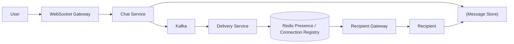
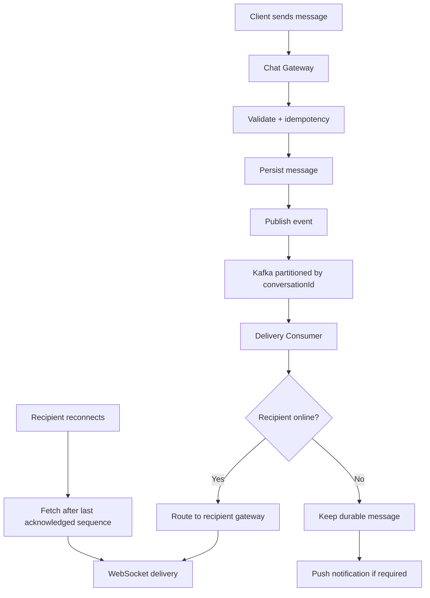
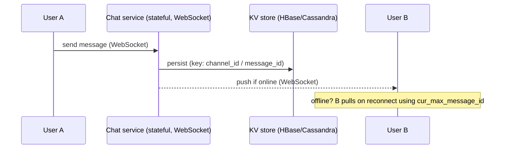

# Chat System

## 0. Why This Design Matters

Covers WebSockets, connection routing, Redis presence, Kafka ordering, offline delivery, idempotency and Cassandra.

## 1. Problem Overview — Explain It Simply

A chat system keeps real-time connections open, accepts messages, stores them durably, routes them to the gateway holding the recipient's connection, and lets offline users catch up later.

## 2. Functional Requirements

- 1:1 and group chat
- Real-time messaging
- Message history
- Delivery/read status
- Presence
- Offline delivery
- Push notifications

## 3. Non-Functional Requirements

- Low message latency
- High availability
- Durable messages
- Ordered messages per conversation
- At-least-once delivery

## 4. Capacity Estimation

Example: 50M DAU × 20 messages/day = 1B messages/day ≈ 11.6K/sec average. Peak can be 5–10× depending on traffic pattern.

## 5. API Design

```text
WebSocket: wss://chat.example.com/connect

Send:
{
  "conversationId":"C1",
  "clientMessageId":"M1",
  "text":"Hello"
}

GET /v1/conversations/{id}/messages?cursor=...
```

## 6. High-Level Architecture

```text
Client
 ↓ WebSocket
Gateway Cluster
 ↓
Chat Service
 ↓
Message Store
 ↓
Kafka
 ↓
Delivery Service
 ↓
Recipient Gateway
 ↓
Recipient

Presence/connection registry → Redis
```

### HLD Flowchart

The following is the primary interview flowchart. Draw this first, then explain each box.



## 7. Database Selection

Cassandra is a strong fit for massive message history when the primary query is conversation + time range. PostgreSQL can be sufficient initially. Redis is for ephemeral presence and connection routing, not durable messages.

### HLD Deep-Dive Flowchart

Use this second flowchart when the interviewer asks **"walk me through the complete flow"**.



## 8. HLD Deep Dive — Why Each Decision?

### Why Why WebSocket?

Persistent bidirectional connections avoid constant polling and allow server push.

### Why How Gateway 1 reaches Gateway 7?

Redis maps userId to gatewayId; Kafka/event routing sends the delivery event to the correct gateway.

### Why How preserve ordering?

Partition Kafka by conversationId and maintain an application sequence number.

### Why How support offline users?

Persist messages first; when user reconnects, fetch messages after last acknowledged sequence.

### Why Why clientMessageId?

Network retries can duplicate sends. Unique clientMessageId makes send idempotent.

### Why Why Cassandra?

High write throughput and predictable partition-key/time-range reads fit chat history.

## 9. Interview Question & Answer

### Q: Gateway crashes?

**Answer:** Client reconnects and requests messages after last acknowledged sequence.

### Q: Message delivered twice?

**Answer:** Use messageId/clientMessageId and idempotent client/server processing.

### Q: Redis down?

**Answer:** Presence can degrade; durable messages remain available.

### Q: Huge group?

**Answer:** Avoid synchronous fanout to every member; use optimized fanout and asynchronous delivery.

## 10. LLD

```text
ChatService
 ├── MessageRepository
 ├── MessageIdempotency
 └── EventPublisher

ConnectionRegistry
 └── RedisConnectionRegistry

DeliveryService
 └── GatewayRouter

Patterns:
- Adapter → gateway/provider
- Event-driven → delivery
- State Machine → SENT/DELIVERED/READ
```

## 11. Failure Checklist

Always walk through:
- Service crash
- Database failure
- Cache/Redis failure
- Kafka/queue failure
- External dependency timeout
- Duplicate request
- Duplicate event
- Hot key/hot partition
- Network partition
- Partial success
- Recovery/reconciliation

## 12. Trade-Offs You Should Say Out Loud

A strong interview answer does not say "this is the only solution."

Instead say:

> "I'm choosing X because of requirement Y. The alternative is Z, which would be better if requirement A were more important."

Typical trade-offs:

| Choice | Benefit | Cost |
|---|---|---|
| Strong consistency | Correctness | Higher latency/coordination |
| Eventual consistency | Scale/availability | Stale reads |
| Redis | Very low latency | Memory/cost/failure considerations |
| PostgreSQL | Transactions | Horizontal write scaling is harder |
| Cassandra | Huge scale/availability | Query-driven modeling, weaker transactions |
| Kafka | Decoupling/replay | Operational complexity |
| Sync processing | Simple response semantics | Higher latency/coupling |
| Async processing | Resilience/scale | Eventual completion |

## 13. Staff-Level Follow-Up Questions

Be ready for these:

1. What breaks first at 10× traffic?
2. What is your hottest key/partition?
3. Can this operation be retried safely?
4. What happens if the service crashes after the external side effect but before the DB update?
5. Which data needs strong consistency?
6. Where can you tolerate eventual consistency?
7. How would you shard it?
8. What happens to a shard becoming hot?
9. How do you recover from a partial failure?
10. How do you observe correctness, not just availability?
11. What would you cache?
12. What would you never cache?
13. Where does backpressure happen?
14. How do you handle replay?
15. Why did you choose this database over the alternatives?

## 14. 2-Minute Interview Explanation

If the interviewer asks you to summarize **Chat System**, use this structure:

> "I'll first separate the read-heavy and correctness-critical paths. The authoritative state lives in the database best suited to the business invariant, while cache and distributed stores handle high-volume/temporary access. Requests that don't need to block the user are moved to an asynchronous queue/event stream. For concurrency, I use atomic updates, constraints, locks or idempotency depending on the invariant. For failures, I use timeout, retry with exponential backoff and jitter, circuit breakers where appropriate, and reconciliation when an external system can have an unknown outcome. At scale, I shard based on the dominant query/access pattern and explicitly handle hot keys and backpressure."


# Interview Framework

Use this exact flow in the interview:

```text
1. Clarify requirements
       ↓
2. Estimate scale
       ↓
3. Define APIs
       ↓
4. Define data model
       ↓
5. Draw HLD
       ↓
6. Explain request/data flow
       ↓
7. Deep dive into the hardest invariant
       ↓
8. Discuss DB/cache/Kafka
       ↓
9. Concurrency + consistency
       ↓
10. Failure handling
       ↓
11. Scaling/sharding
       ↓
12. LLD
       ↓
13. Trade-offs
```

## Universal Scale Formula

```text
Average QPS = daily requests / 86,400
Peak QPS = average QPS × peak factor
```

Start with an assumption such as 5× and say:

> "I'll use 5× as a starting peak multiplier; we can adjust if you give me a traffic pattern."

## Universal Database Cheat Sheet

### PostgreSQL

Use when you need:

- ACID transactions
- Strong consistency
- Relationships
- Constraints
- Conditional updates
- Booking/payment/inventory

### MongoDB

Use when:

- Data is naturally document-shaped
- Flexible schema matters
- Access is mostly by document
- Relationships are not the dominant problem

### Cassandra

Use when:

- Very high write volume
- High availability
- Predictable query patterns
- Massive time-series/activity/message data

Remember:

> Cassandra data modeling starts from queries, not from normalized entities.

### Redis

Use for:

- Cache
- Counters
- Rate limits
- Locks/leases
- Sessions
- Presence
- Temporary state

Do not automatically make Redis the source of truth for critical durable business state.

### Elasticsearch/OpenSearch

Use for:

- Full-text search
- Ranking
- Autocomplete
- Filtering/faceting

Think of it as a read model, not automatically your transactional source of truth.

### Kafka

Use for:

- Async events
- Decoupling
- Buffering
- Replay
- Fanout
- Stream processing

## Universal Reliability

When interviewer asks "what if X fails?":

```text
Timeout
 ↓
Should we retry?
 ↓
Idempotency
 ↓
Exponential backoff + jitter
 ↓
Circuit breaker
 ↓
Fallback?
 ↓
DLQ?
 ↓
Reconciliation?
```

## Universal Cache Problems

```text
Cache Stampede
→ request coalescing / lock / background refresh

Hot Key
→ local cache / CDN / replication / sharding

Cache Penetration
→ negative cache / Bloom filter

Cache Avalanche
→ TTL jitter / staggered expiry
```

## Universal Kafka

```text
Producer
 ↓
Topic
 ↓
Partitions
 ↓
Consumer Group
 ↓
Consumers
```

- Ordering → within a partition
- Scale → partitions
- Parallelism → consumers
- Replay → retention
- Duplicate events → idempotent consumers

## Universal Consistency Rule

Use strong consistency when the business invariant cannot tolerate stale state:

- Payment
- Wallet
- Booking
- Critical inventory
- Ledger

Eventual consistency is often fine for:

- Search index
- Analytics
- Recommendations
- Notifications
- Like/view counters

The best sentence to remember:

> "Consistency should follow the business invariant, not the technology."

## Universal Concurrency

Ask:

> "What happens if two requests execute this operation at exactly the same time?"

Possible tools:

- Atomic DB update
- Optimistic locking
- Pessimistic locking
- Unique constraint
- Distributed lock/lease
- Idempotency key
- Queue serialization

## Universal Idempotency

If the same request can safely be retried:

```text
request
 ↓
idempotency key
 ↓
existing result?
 ├── yes → return existing result
 └── no → process + store result
```

## Universal Staff-Level Thinking

Always discuss:

1. What happens at 10× traffic?
2. What becomes the bottleneck?
3. What is the hot key/hot partition?
4. What if a dependency fails?
5. What happens if the same request arrives twice?
6. Which state must be strongly consistent?
7. What can be eventually consistent?
8. What can be asynchronous?
9. Where does backpressure happen?
10. How do we observe and reconcile failures?

# Final Interview Rule

Do not jump directly into technologies.

First say:

> "Let me clarify the requirements and scale. Then I'll identify the critical business invariant, because that will drive my consistency and database choices."

That sentence alone makes the discussion much more senior.

---

# 📚 Book Cross-Reference & Added Depth

**Source:** Alex Xu, *System Design Interview* Vol 1, Ch 12 — *Design a Chat System* (companion note `Book-System-Design-Vol-1/12-design-a-chat-system.md`).

Book specifics worth stating:

- **WebSocket** for real-time, bidirectional delivery (server can push to the client). HTTP/long-polling is fine for send, but receive needs a persistent connection.
- **The chat (WebSocket) service is the only *stateful* service** — every other service (auth, presence, API) stays stateless. This shapes scaling and connection routing (a service-discovery layer maps a user to their chat server).
- **Message storage:** a **key-value store (HBase/Cassandra)** for chat history — huge write volume, simple access by key, easy horizontal scale. 1:1 messages key by `message_id`; group messages key by `channel_id`.
- **Multi-device sync** via a per-device **`cur_max_message_id`** cursor — each device tracks the last message it has, so it fetches only newer ones.
- **Online presence** via **heartbeats** — client periodically pings; miss N heartbeats → mark offline (avoids flapping on brief disconnects). Presence changes fan out to friends via a pub/sub-style channel.



**Interview line:** *"WebSocket for real-time; the chat service is the one stateful tier; history in a wide-column KV store; multi-device sync via a per-device max-message-id cursor; presence via heartbeats with a grace window."*
