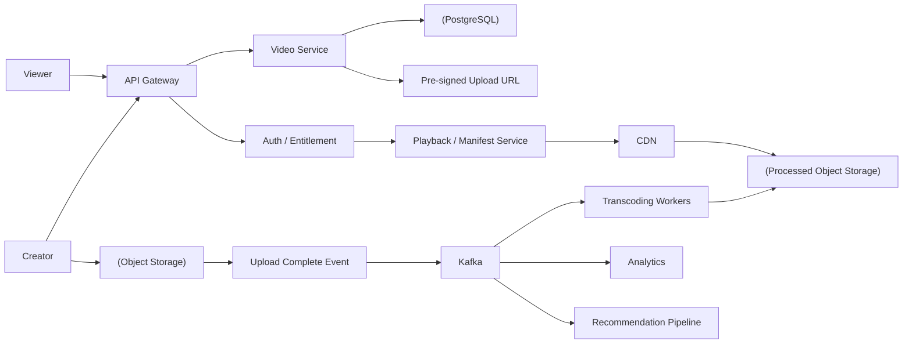
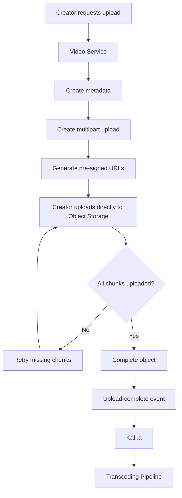
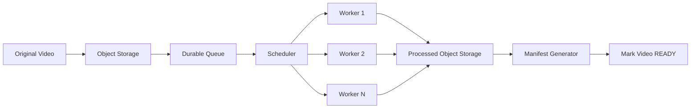
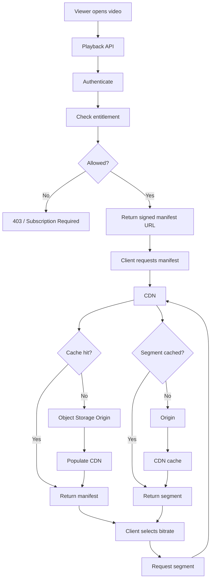
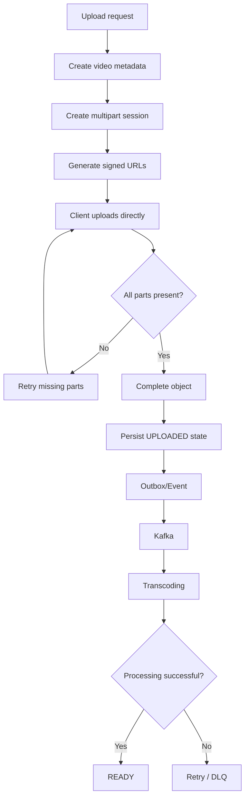
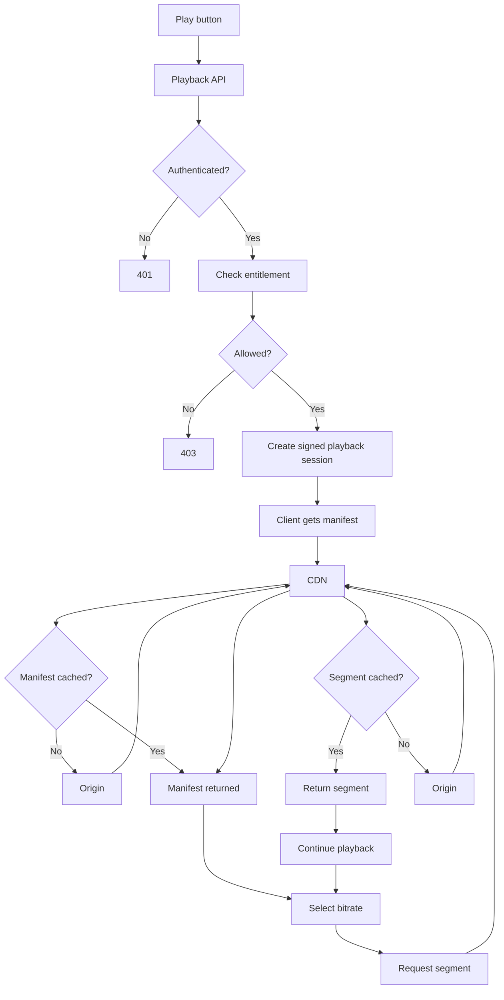
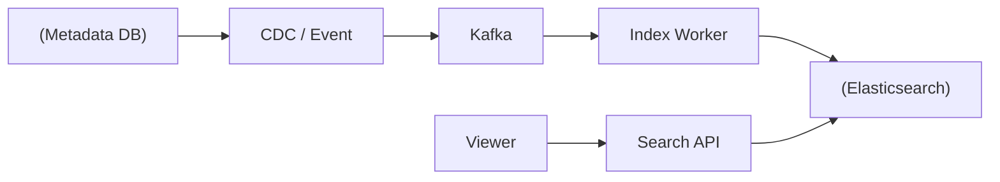
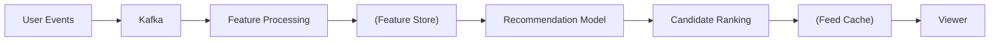
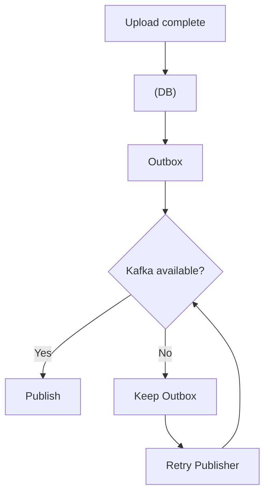

# Video Streaming System — Complete System Design Interview Guide

## 1. Problem Overview

Design a Netflix/YouTube-style platform where users can upload, process, search and stream videos with low latency and high availability.

The most important architectural decision:

> **Do not stream large video bytes through application servers. Store them in object storage and deliver them through a CDN.**

```text
Creator
  ↓
Video Service
  ↓
Pre-signed URL
  ↓
Object Storage
  ↓
Transcoding
  ↓
Multiple qualities
  ↓
CDN
  ↓
Millions of viewers
```

## 2. Functional Requirements

- Upload video
- Process/transcode video
- Publish video
- Browse/search
- Start playback
- Adaptive bitrate streaming
- Pause/resume
- Continue watching
- Watch history
- Likes/comments
- Delete video
- Optional recommendations, subscriptions, ads and live streaming

## 3. Non-Functional Requirements

- Millions of concurrent viewers
- High availability
- Low time-to-first-frame
- High durability
- Global low-latency delivery
- Horizontal scalability
- Eventual consistency acceptable for search, analytics and recommendations

Example targets:

```text
API p95        < 200–300 ms
Manifest p95   < 100–200 ms
Startup        < 1–2 sec
```

These are interview assumptions and should be adjusted if requirements change.

## 4. Capacity Estimation

Assume:

```text
DAU = 100M
Videos watched/user/day = 5
```

Playback starts:

```text
100M × 5 = 500M/day

500M / 86,400 ≈ 5,787 QPS average
Peak at 5× ≈ 29K QPS
```

The harder problem is bandwidth.

If:

```text
5M concurrent viewers
Average bitrate = 5 Mbps
```

Then:

```text
5M × 5 Mbps = 25 Tbps
```

This is why CDN is mandatory.

### Storage

If 1M videos/day are uploaded and average original size is 500 MB:

```text
1M × 500 MB = 500 TB/day
```

Multiple transcoded resolutions increase storage further.

## 5. Video Streaming Protocol

Know:

- HLS
- MPEG-DASH

A video is divided into small segments and multiple representations:

```text
Master Manifest
 ├── 1080p
 │    ├── segment1
 │    ├── segment2
 │    └── segment3
 ├── 720p
 │    ├── segment1
 │    └── ...
 └── 480p
      ├── segment1
      └── ...
```

The player selects the appropriate quality according to network conditions.

## 6. APIs

### Upload

```http
POST /v1/videos/upload
```

```json
{
  "fileName": "movie.mp4",
  "contentType": "video/mp4",
  "size": 2147483648
}
```

Response:

```json
{
  "videoId": "V123",
  "uploadId": "U123",
  "uploadUrls": ["..."]
}
```

### Complete Upload

```http
POST /v1/videos/{videoId}/complete
```

### Get Video

```http
GET /v1/videos/{videoId}
```

### Playback

```http
GET /v1/videos/{videoId}/playback
```

```json
{
  "videoId": "V123",
  "manifestUrl": "https://cdn.example.com/V123/master.m3u8",
  "expiresAt": "2026-08-22T12:00:00Z"
}
```

### Progress

```http
POST /v1/videos/{videoId}/progress
```

```json
{
  "positionSeconds": 1234,
  "clientEventId": "E123"
}
```

# 7. High-Level Architecture



## 8. Component Explanation

### API Gateway

- Authentication
- Authorization
- Rate limiting
- Routing
- Logging

It should **not proxy video bytes**.

### Video Service

Handles:

- Metadata
- Upload sessions
- Permissions
- Publishing
- Playback authorization

Video state:

```text
UPLOADING
   ↓
UPLOADED
   ↓
PROCESSING
   ↓
READY
   ↓
PUBLISHED
```

### PostgreSQL

Stores:

```text
video_id
owner_id
title
description
duration
status
visibility
created_at
storage_location
manifest_location
```

Use it because metadata and permissions benefit from transactions and constraints.

### Object Storage

Stores:

- Original video
- Transcoded files
- Segments
- Manifests
- Thumbnails
- Subtitles

It is designed for huge objects, durability and massive scale.

### Redis

Good for:

- Hot metadata
- Sessions
- Entitlement cache
- Rate limiting
- Recommendation cache

Do not store petabytes of video in Redis.

### Kafka

Events:

```text
VIDEO_UPLOADED
VIDEO_PROCESSING_STARTED
VIDEO_READY
VIDEO_PUBLISHED
VIDEO_STARTED
VIDEO_PROGRESS
VIDEO_COMPLETED
VIDEO_LIKED
```

Consumers can independently process:

- Transcoding
- Analytics
- Search indexing
- Recommendations
- Notifications

# 9. Upload Flow



### Why pre-signed URLs?

Application servers should not carry multi-GB upload traffic.

```text
Client → Object Storage
```

instead of:

```text
Client → API Server → Object Storage
```

### Why multipart upload?

A 2 GB file can be split into chunks.

If one chunk fails, retry only that chunk.

# 10. Transcoding

Original:

```text
movie.mp4
```

Generate:

```text
1080p
720p
480p
360p
144p
```

Potential codecs:

```text
H.264
H.265
AV1
```

## Transcoding Architecture



Transcoding is asynchronous because it can take minutes.

```text
Upload
 ↓
202 Accepted
 ↓
PROCESSING
 ↓
Async Transcoding
 ↓
READY
```

Scale workers based on:

- Queue depth
- Oldest job age
- CPU/GPU utilization
- Processing time

# 11. Playback HLD



## Key Principle

Authorize once at the playback/control plane, then let CDN serve segments.

Do not:

```text
Every segment
 ↓
Application Server
 ↓
Database authorization
```

That would destroy scalability.

# 12. CDN

CDN is the most important data-plane component.

```text
Viewer Mumbai → Mumbai CDN Edge
Viewer Delhi  → Delhi CDN Edge
Viewer London → London CDN Edge
```

A video segment can be cached at the edge.

First request:

```text
Viewer
 ↓
CDN
 ↓
Origin
 ↓
CDN
 ↓
Viewer
```

Next 100,000 requests:

```text
Viewer
 ↓
CDN
 ↓
Viewer
```

## Why video caching is easy

Video segments are mostly immutable.

Therefore:

- Long TTL
- Immutable URLs
- High cache hit ratio
- Easy CDN distribution

# 13. Manifest vs Segment

### Manifest

Describes:

- Available resolutions
- Bitrates
- Segment locations
- Audio tracks
- Subtitles

### Segment

Contains the actual video/audio data.

```text
Manifest
   ↓
Segment URLs
   ↓
Video playback
```

# 14. Adaptive Bitrate

Client monitors:

- Throughput
- Buffer
- Device capability
- Current bitrate

Then:

```text
Good network  → 1080p
Medium         → 720p
Poor           → 480p
```

The switch normally happens between segment boundaries.

# 15. Signed URLs

Premium content should not have a permanent public URL.

Instead:

```text
https://cdn.example.com/V123/master.m3u8
       ?token=ABC
       &expires=...
```

Token can contain:

- User/video identity
- Expiration
- Entitlement information

Use short-lived signed access.

# 16. Database Selection

| Data | Technology | Why |
|---|---|---|
| Video metadata | PostgreSQL | Transactions/constraints |
| Video bytes | Object Storage | Huge durable objects |
| CDN delivery | CDN | Global bandwidth |
| Cache | Redis | Low latency |
| Events | Kafka | Async/replay |
| Search | Elasticsearch/OpenSearch | Text search |
| Analytics | OLAP | Large aggregations |
| Watch history | Cassandra/KV or PostgreSQL depending on scale | High-volume access |
| Recommendations | Feature Store + ML | Low-latency features |

## PostgreSQL vs MongoDB

PostgreSQL is a strong default because:

- Relationships
- Constraints
- Transactions
- Permissions/subscriptions

MongoDB is reasonable if metadata is heavily document-oriented and flexible schema is important.

## Cassandra

Good for:

- Massive watch history
- Activity
- Playback events
- High-volume time-series data

Not the default for:

- Billing
- Permissions
- Subscription transactions

# 17. HLD Deep-Dive — Video Upload



# 18. HLD Deep-Dive — Playback



# 19. Continue Watching

Store:

```text
userId
videoId
positionSeconds
updatedAt
```

Do not write to a relational DB every second.

Better:


Send progress periodically, or on pause/seek/close.

# 20. View Counter

Avoid:

```sql
UPDATE videos
SET views = views + 1;
```

for every view at huge scale.

Prefer:

```text
View Events
 ↓
Kafka
 ↓
Aggregation
 ↓
OLAP / Redis
 ↓
Periodic durable aggregation
```

Exact semantics depend on product requirements.

# 21. Search



Search should be an eventually consistent read model.

# 22. Recommendations



Two-stage recommendation:

```text
All content
   ↓
Candidate Generation
   ↓
Hundreds/thousands
   ↓
Ranking
   ↓
Top 20
```

Do not rank millions of videos per request.

# 23. Hot Video

A viral video can have millions of concurrent viewers.

Use:

```text
Viewer
 ↓
CDN Edge
 ↓
Origin Shield
 ↓
Object Storage
```

Do not allow every viewer to hit origin storage.

# 24. Hot Partition

If billions of events belong to one video, avoid an unbounded single partition.

Possible:

```text
videoId + timeBucket
```

if query/ordering requirements allow it.

# 25. Failure Scenarios

## Transcoding Worker Crash

Use:

```text
Queue
 ↓
Lease
 ↓
Worker
 ↓
Heartbeat
```

If heartbeat expires, another worker can retry.

## Kafka Failure

Use durable outbox:



## Application Crash

Direct-to-object-storage upload means uploaded bytes survive application failure.

A reconciliation job can find:

```text
Object exists
BUT metadata = UPLOADING
```

and repair state.

## CDN Failure

For very high criticality:

```text
Primary CDN
 ↓ failure
Secondary CDN
 ↓
Origin
```

Multi-CDN increases resilience but also complexity/cost.

# 26. Idempotency

Kafka and queues commonly provide at-least-once processing.

Use:

```text
eventId
```

or:

```text
videoId + processingVersion
```

to make consumers idempotent.

```text
First event  → process
Duplicate    → no-op
```

# 27. LLD

```java
interface VideoService {
    UploadSession createUpload(CreateVideoRequest request);
    void completeUpload(String videoId);
    VideoMetadata getVideo(String videoId);
    PlaybackSession createPlaybackSession(
        String videoId,
        String userId
    );
}

interface ObjectStorage {
    String createMultipartUpload(String key);
    List<UploadPart> generateUploadUrls(String uploadId);
    void completeUpload(String uploadId);
}

interface CdnService {
    String createSignedUrl(String resource, Duration expiry);
}

interface TranscodingService {
    void process(String videoId);
}
```

# 28. Design Patterns

### Adapter

```text
ObjectStorage
 ├── S3Storage
 ├── GcsStorage
 └── AzureStorage
```

### Strategy

Use for:

- Transcoding profile
- CDN selection
- Recommendation strategy

### State Machine

```text
UPLOADING
 ↓
UPLOADED
 ↓
PROCESSING
 ↓
READY
 ↓
PUBLISHED
```

# 29. SOLID

### SRP

Separate:

```text
VideoService
PlaybackService
TranscodingService
AnalyticsService
```

### OCP

Add new storage/CDN providers without modifying business logic.

### DIP

Business logic depends on:

```text
ObjectStorage
CdnService
VideoRepository
```

rather than concrete implementations.

# 30. Interview Questions & Answers

### Q: Why CDN?

**Answer:** Video delivery is extremely bandwidth-heavy. CDN caches immutable segments close to users and prevents the origin from serving every request.

### Q: Why object storage?

**Answer:** Video files are large immutable objects. Object storage provides huge capacity, durability and scalable throughput at lower cost than a relational database.

### Q: Why not send video through API servers?

**Answer:** Application servers would become a bandwidth and connection bottleneck. They should handle control-plane operations while CDN handles video bytes.

### Q: Why adaptive bitrate?

**Answer:** Users have different network speeds. Multiple representations allow the player to switch quality and reduce buffering.

### Q: Why HLS/DASH?

**Answer:** They divide video into segments and provide manifests describing available representations, enabling adaptive bitrate streaming over HTTP.

### Q: How protect premium content?

**Answer:** Authorize playback and issue short-lived signed access. Avoid a DB authorization call for every segment.

### Q: How handle viral videos?

**Answer:** CDN edge caching, immutable segment URLs, origin shielding and potentially multi-CDN.

### Q: What if transcoding fails?

**Answer:** Durable queue, worker lease, retries with exponential backoff/jitter and DLQ.

### Q: What if worker crashes halfway?

**Answer:** Lease expires and another worker retries. Expensive pipelines can checkpoint completed work.

### Q: Why Kafka?

**Answer:** It decouples upload from transcoding, analytics, search and recommendations and provides buffering/replay.

### Q: Where Cassandra?

**Answer:** Large predictable workloads such as watch history/activity where high write throughput and horizontal scale matter more than relational transactions.

### Q: Where Redis?

**Answer:** Hot metadata, sessions, entitlement cache, rate limiting and recommendation cache—not the actual video bytes.

# 31. Staff-Level Follow-Ups

Be ready for:

1. What breaks first at 10× scale?
2. What is the bandwidth bottleneck?
3. What is the hottest key/partition?
4. How do you scale transcoding?
5. How do you handle duplicate events?
6. What happens if CDN fails?
7. What happens if object storage is unavailable?
8. How do you reduce storage cost?
9. How do you reduce time-to-first-frame?
10. How do you support multi-region?
11. How do you handle DRM?
12. How do you handle live streaming?
13. How do you recover an object/metadata mismatch?
14. How do you prevent unauthorized segment access?
15. Which parts need strong consistency?

# 32. Trade-Offs

| Choice | Benefit | Cost |
|---|---|---|
| CDN | Huge scale | Cost/provider complexity |
| Object storage | Durable/cheap | Origin access latency |
| Kafka | Decoupling/replay | Operational complexity |
| PostgreSQL | Strong metadata consistency | Harder horizontal writes |
| Redis | Very fast | Memory cost |
| HLS/DASH | Adaptive streaming | Segmentation complexity |
| Multi-region | Availability/latency | Replication complexity |
| Multi-CDN | Provider resilience | More operational complexity |
| Async processing | Scale/resilience | Eventual consistency |

# 33. 2-Minute Interview Answer

> "I'll separate the control plane from the video data plane. The control plane handles metadata, authorization, uploads and playback sessions. The actual video bytes should go directly between object storage/CDN and the client rather than through application servers.
>
> For upload, I'll use multipart upload with pre-signed URLs. Once the upload completes, I'll publish an event to Kafka and asynchronously transcode the original into multiple resolutions and bitrates. The processed segments and manifests go into object storage and are served through a CDN.
>
> During playback, the client calls the playback service for authorization and a short-lived signed manifest URL. The player then downloads manifests and video segments directly from the CDN and performs adaptive bitrate switching.
>
> PostgreSQL stores authoritative metadata and permissions, Redis provides low-latency cache/session state, Kafka handles asynchronous workflows and analytics, and object storage holds the actual video data.
>
> At scale, bandwidth is the main challenge rather than API QPS, so CDN caching, origin shielding and potentially multi-CDN become important. For reliability, transcoding is asynchronous with retries and leases, and Kafka consumers are idempotent."

# 34. Final Cheat Sheet

```text
UPLOAD

Client
 ↓
Video API
 ↓
Pre-signed URL
 ↓
Object Storage
 ↓
Kafka
 ↓
Transcoding
 ↓
Multiple Resolutions
 ↓
Object Storage
 ↓
CDN


PLAYBACK

Client
 ↓
Playback API
 ↓
Auth + Entitlement
 ↓
Signed Manifest
 ↓
CDN
 ↓
Manifest
 ↓
Video Segments
 ↓
Adaptive Bitrate


TECHNOLOGY

Metadata        → PostgreSQL
Video bytes     → Object Storage
Delivery        → CDN
Cache           → Redis
Events          → Kafka
Search          → Elasticsearch/OpenSearch
Analytics       → OLAP
Recommendations → Feature Store + ML


KEY CONCEPTS

Pre-signed URLs
Multipart Upload
HLS / DASH
Adaptive Bitrate
CDN
Object Storage
Transcoding
Kafka
Idempotency
Retries
Leases
Multi-region
Origin Shielding
```

## One Sentence to Remember

> **Application servers manage the video; object storage stores the video; CDN delivers the video.**

---

# 📚 Book Cross-Reference

**Source:** Alex Xu, *System Design Interview* Vol 1, Ch 14 — *Design YouTube* (companion note `Book-System-Design-Vol-1/14-design-youtube.md`). This chapter is already thorough; the book adds detail on two areas:

- **Transcoding as a DAG pipeline.** A raw upload is transcoded into many formats/resolutions/bitrates by a pipeline modeled as a **Directed Acyclic Graph** of tasks (inspect → split → encode → thumbnail → merge …), run by a **preprocessor + DAG scheduler + resource manager (task/worker queues) + workers**. This is the "how" behind "app servers manage the video."
- **Resumable, chunked upload.** Video is uploaded (and transcoded) in **GOP-aligned chunks**, so an interrupted upload **resumes** from the last chunk instead of restarting; clients get **pre-signed URLs** to upload directly to object storage.
- **CDN economics.** Only the **popular "head"** of the catalog is served from CDN; the **long tail** is served from origin/cheaper storage — the book notes CDN egress can cost on the order of **~$150k/day** at scale, which is *why* you don't blindly CDN everything.

**Takeaway:** the transcoding DAG, resumable GOP-chunk uploads, and selective (head-only) CDN caching are the details that turn "store + CDN" into a real YouTube answer.
