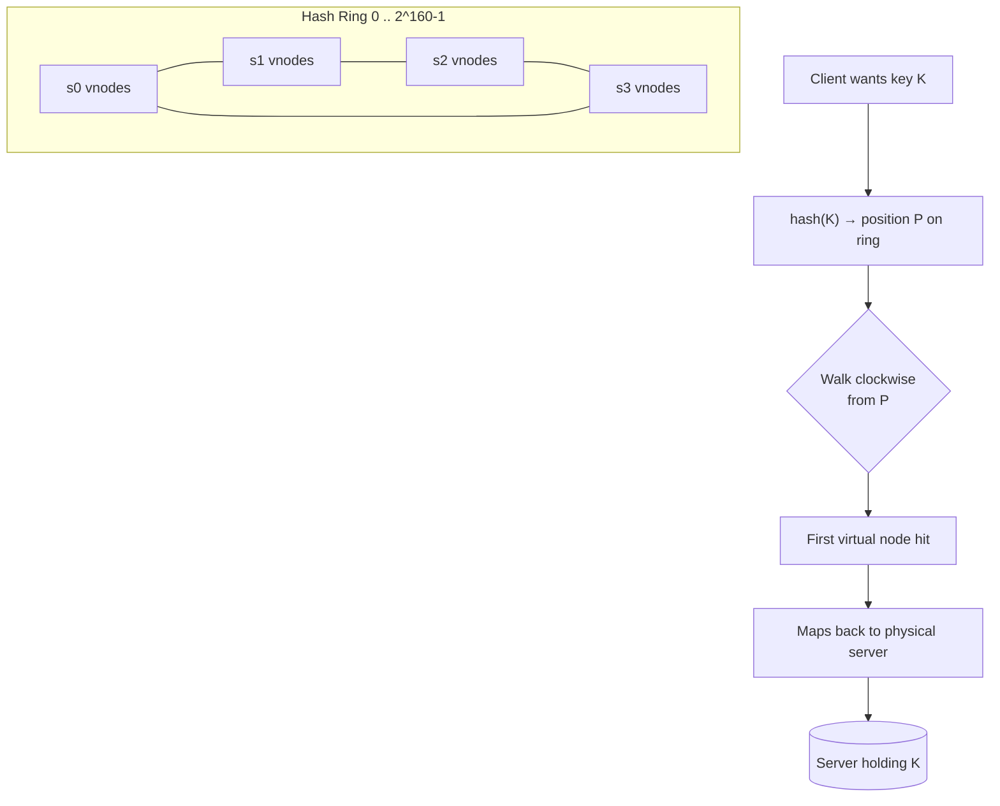
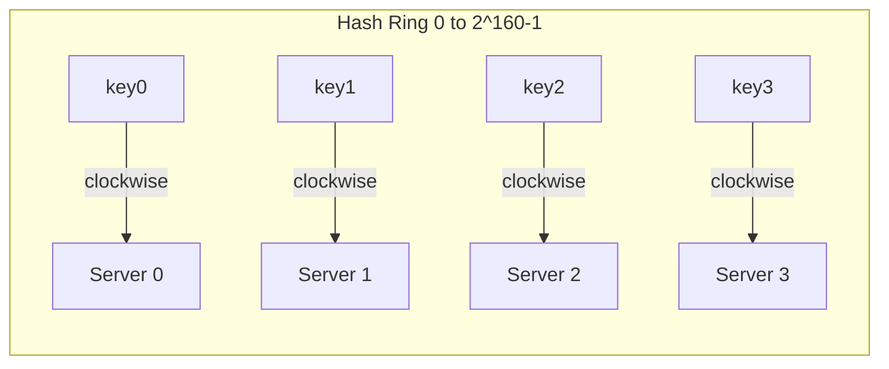
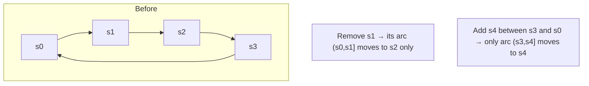
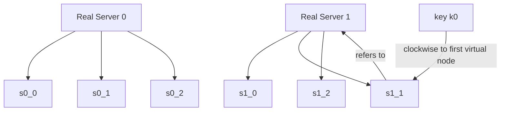

# Consistent Hashing — System Design

**Difficulty:** Intermediate → Advanced
**Interview importance:** ⭐ **Critical** (it's the load-balancing primitive under Dynamo, Cassandra, sharded caches — asked directly *and* as a building block inside bigger designs)
**References:** ByteByteGo Vol. 1 Ch. 5 — *Design Consistent Hashing*; Karger et al. (MIT); Amazon Dynamo paper

---

## 0. Why This Design Matters

The moment you have more data than one machine can hold, you must **split it across servers** — and then answer one deceptively hard question: *"given a key, which server owns it?"* The naive answer, `hash(key) % N`, works beautifully right up until the day you add or remove a server. Then `N` changes, `% N` reshuffles **almost every key**, and your cache turns cold all at once — a self-inflicted outage disguised as a scale-up.

Consistent hashing is the fix. It is the technique that lets a distributed cache, database, or load balancer **add and remove nodes while moving only a tiny fraction of the data**. It's small enough to derive on a whiteboard and deep enough that the follow-ups (virtual nodes, standard deviation, hotspot keys) separate people who *memorized* it from people who *understand* it.

> The one-line thesis: **consistent hashing turns "which server owns this key?" from a function of `N` into a function of *position on a ring* — so changing `N` only disturbs the keys near the change, not all of them.**

---

## 1. Problem Overview — in Plain English

You want to spread keys (cache entries, database rows, requests) **evenly** across a set of servers, and you want that mapping to **survive membership changes** — servers dying, servers being added during a traffic spike — without a mass reshuffle.

The naive scheme is modular hashing:

```text
serverIndex = hash(key) % N          # N = number of servers
```

This distributes keys nicely **while N is fixed**. But the instant `N` changes:

```text
4 servers:  hash(key) % 4   →  key "user42" lands on server 2
1 dies →
3 servers:  hash(key) % 3   →  key "user42" now lands on server 0
```

Almost every key gets a *different* index, so almost every lookup goes to the wrong server → a **cache-miss storm**, and every backing store gets hammered at once. Consistent hashing rewrites the mapping so that only **k/n keys** (k = number of keys, n = number of slots) move on average when membership changes.

### Real-world analogy — a circular seating chart at a big round table

Picture guests (keys) and hosts (servers) seated around one **big round table**. Each guest is served by the **first host they reach walking clockwise**. Now a host leaves the table: only the guests who *were* being served by that host slide to the next host clockwise. Everyone else keeps their same host. Add a host and it's the same — only the guests immediately "upstream" of the new seat switch over. Nobody reshuffles the whole table just because one seat changed. That round table is the **hash ring**, and "walk clockwise to the first host" is the entire lookup rule.

---

## 2. Functional Requirements

**Core**
- Map any key to exactly one server (deterministically — same key always resolves to the same server given the same membership).
- **Add a server** and move only the keys that now belong to it.
- **Remove a server** and move only *its* keys to the next server clockwise.
- Distribute keys **evenly** across servers.
- Support **horizontal scaling** — grow the cluster without a global reshuffle.

**Optional (name them, then defer)**
- **Weighted/heterogeneous servers** (a bigger box owns proportionally more of the keyspace).
- **Replication awareness** (return the next N distinct servers, not just one — the hook into a KV store).
- **Bounded-load** variants (cap how much any one node can own to fight hotspots).

---

## 3. Non-Functional Requirements

| Requirement | Target | Why it dominates the design |
|---|---|---|
| Key movement on membership change | **~k/n keys**, not ~all | The entire reason consistent hashing exists |
| Distribution balance | std-dev small (**~5% of mean @ 200 vnodes**) | Uneven balance = hot servers = wasted capacity |
| Lookup latency | O(log V) via binary search over V ring points | It's on the hot path of every request |
| Scalability | Add/remove nodes with local disruption only | Enables elastic clusters |
| Memory overhead | Proportional to (servers × virtual nodes) | Balance-vs-memory is the core tunable trade-off |
| Hotspot resistance | Spread a celebrity key's neighborhood | Prevents one shard from drowning |

> **Say this out loud in an interview:** *"The whole point is bounding disruption. Naive modulo remaps O(k) keys on any change; consistent hashing remaps O(k/n). Everything else — virtual nodes, ring structure — exists to make that mapping *balanced* as well as *stable*."*

---

## 4. Capacity Estimation (do the math — don't hand-wave)

**How bad is the naive scheme, quantitatively?** With `hash % N` and a uniform hash, changing `N` from 4 → 3 changes the index for a fraction of keys equal to roughly `1 − 1/lcm...` — in practice, empirically **~75%+ of keys move**. With consistent hashing:

```text
Keys moved when 1 of n servers is removed ≈ k / n
Example: k = 1,000,000 keys, n = 10 servers
  Naive % N:            ~900,000 keys remap   (catastrophic)
  Consistent hashing:   ~100,000 keys remap   (k/n = 1M/10)  ✅
```

**Ring space.** Using **SHA-1**, the hash space runs from **0 to 2¹⁶⁰ − 1** — an unimaginably large circle. Collisions of *positions* are effectively impossible; the ring is never "full."

**Virtual nodes → balance (the key number).** An experiment in the reference measured how tightly keys cluster around the ideal even split (standard deviation as a percentage of the mean):

```text
100 virtual nodes/server  →  std-dev ≈ 10% of mean
200 virtual nodes/server  →  std-dev ≈  5% of mean
```

More virtual nodes ⇒ smoother distribution ⇒ but more ring entries to store and search.

**Ring-storage cost.** With `S` servers and `V` virtual nodes each:

```text
ring points = S × V
Example: 100 servers × 200 vnodes = 20,000 points on the ring
  → a sorted structure of 20,000 (hash → server) entries
  → lookup = binary search = ~log2(20,000) ≈ 15 comparisons  → trivial
```

**What the numbers tell us:**
- The ring is *huge* (2¹⁶⁰) but the *number of points on it* is small (S × V) — so lookups are cheap.
- Virtual-node count is a **dial**: turn it up for balance, down for memory. 100–200 is the sweet spot.
- The headline win is asymptotic: **O(k/n) movement vs O(k)** — that's the sentence that wins the question.

---

## 5. Core Operations (the "API" of the ring)

Consistent hashing is a data structure more than a service, but framing it as an API clarifies it:

```text
addNode(serverId)        # hash serverId (× V virtual nodes) onto the ring
removeNode(serverId)     # delete its virtual-node points from the ring
getNode(key) -> serverId # hash key, walk clockwise to first virtual node → its real server
getNodes(key, N) -> [servers]  # walk clockwise collecting first N DISTINCT physical servers (replication)
```

```java
class ConsistentHashRing {
    TreeMap<Long, String> ring = new TreeMap<>();  // sorted: hashPosition -> serverId
    int virtualNodes = 200;

    void addNode(String server) {
        for (int i = 0; i < virtualNodes; i++)
            ring.put(hash(server + "#" + i), server);   // V points per server
    }
    String getNode(String key) {
        if (ring.isEmpty()) return null;
        long h = hash(key);
        Map.Entry<Long, String> e = ring.ceilingEntry(h);   // first point clockwise
        if (e == null) e = ring.firstEntry();               // wrap around the ring
        return e.getValue();
    }
}
```

`ceilingEntry` = "smallest key ≥ h" = the first virtual node clockwise. The wrap-around (`firstEntry`) is what makes it a *ring* and not a line.

---

## 6. High-Level Architecture



The ring itself lives wherever routing decisions are made:
- **Client-side** (a smart client / SDK that knows the topology — Cassandra-style).
- **A coordinator/proxy node** (any node can route; Dynamo-style).
- **A load balancer** (Maglev at Google uses consistent hashing to pin flows to backends).

The topology (who owns which vnodes) is shared via **gossip** or a config service so every router agrees.

---

## 7. Deep Dive — The Ring, Its Two Problems, and the Fix

### 7.1 The hash ring

Take a hash function `f` (e.g. **SHA-1**, range 0 to 2¹⁶⁰ − 1) and bend that number line into a circle so the two ends meet. Then:

- **Place servers** on the ring by hashing their IP or name.
- **Place keys** on the ring by hashing the key. **Crucially, there is NO `% N`** — the key just lands at `hash(key)`.
- **Look up** a key by going **clockwise** to the first server you meet. That server owns the key.



### 7.2 Adding and removing a server (the payoff)

**Adding server s4:** only keys in the arc *ending* at s4 move. Walk **anticlockwise** from s4 to the previous server (s3); the keys in `(s3, s4]` migrate from whoever owned them to s4. Everyone else is untouched.

**Removing server s1:** only s1's keys move. The arc `(s0, s1]` gets redistributed to the **next server clockwise** (s2). s0's, s2's, and s3's own keys don't budge.



This is the formal guarantee (Karger et al., MIT): resizing the table remaps only **k/n keys on average** instead of nearly all of them.

### 7.3 Two problems with the *basic* ring

1. **Unequal partition sizes.** A **partition** is the arc between two adjacent servers. As servers join/leave, arcs stop being equal. Remove s1 and s2's arc becomes **twice as big** as s0's and s3's — s2 now owns twice the data.
2. **Non-uniform key distribution.** With only one point per server, servers can randomly cluster on one side of the ring. You can end up with server 2 owning almost everything while servers 1 and 3 own nearly nothing.

### 7.4 Virtual nodes — the fix

Instead of placing each server once, place it **many times** under aliases. A **virtual node** is a ring position that *points back to a real server*. Server 0 becomes `s0_0, s0_1, s0_2, …`; server 1 becomes `s1_0, s1_1, s1_2, …`. Each server now owns **many small arcs scattered around the ring**, so its total share converges to the fair average and the impact of any single arc is small.



Lookup is unchanged — walk clockwise to the first **virtual** node, then dereference to its **real** server (e.g. `k0 → s1_1 → Server 1`). The more virtual nodes, the smoother the distribution: **~10% std-dev at 100 vnodes, ~5% at 200 vnodes** — at the cost of more ring entries to store and search. That's the tunable trade-off.

Virtual nodes also enable **heterogeneity**: give a beefier server **more** virtual nodes so it owns proportionally more of the keyspace.

### 7.5 Finding exactly which keys are affected

When membership changes you only need to move a bounded range:
- **Add s4:** affected range = from s4 **anticlockwise** to the previous node (s3). Keys in that arc move *to* s4.
- **Remove s1:** affected range = from s1 **anticlockwise** to the previous node (s0). Keys in that arc move *to* the next node clockwise (s2).

This lets a real system compute the migration set precisely instead of rescanning everything.

---

## 8. Comparison / Trade-off Table

| Scheme | Keys moved on change | Balance | Lookup cost | Handles heterogeneity | Notes |
|---|---|---|---|---|---|
| **Naive `hash % N`** | **~all keys** ❌ | Good (while N fixed) | O(1) | No | Fine only for a *fixed* server set |
| **Basic consistent hashing** (1 point/server) | ~k/n ✅ | **Poor** (uneven arcs) | O(log N) | No | Correct movement, bad balance |
| **Consistent hashing + virtual nodes** ⭐ | ~k/n ✅ | **Good** (tune vnodes) | O(log(N·V)) | **Yes** (more vnodes = more share) | The production answer |
| **Rendezvous (HRW) hashing** | ~k/n ✅ | Good | O(N) per lookup | Yes (weights) | No ring; pick `max(hash(key,server))`. Simpler, but O(N) lookup |
| **Jump consistent hash** | ~k/n ✅ | Excellent | O(log N) | No | Very memory-light; but nodes must be numbered 0..N-1 (no arbitrary removal) |

> **Vnode count is the dial:** more virtual nodes → tighter balance and finer heterogeneity control → more memory + slower ring updates. 100–200 per server is the usual sweet spot.

---

## 9. Failure Scenarios

| Failure | What happens | Handling |
|---|---|---|
| Server goes offline | Its arcs' keys are now "owned" by the next node clockwise | Only *that* server's keys move; the rest are untouched (the whole point). Replication (getNodes with N>1) means the data already exists on the next nodes |
| Server added during a spike | New node claims arcs from its clockwise-predecessor neighbors | Migrate only the affected arcs; warm the new node before routing full traffic |
| **Hotspot / celebrity key** | One key (e.g. a mega-popular user) still lands on one server | Consistent hashing spreads *different* keys well, but a single scorching key still needs help: replicate that key, add a per-key cache, or use bounded-load consistent hashing |
| Uneven load despite the ring | Too few virtual nodes → lumpy arcs | Increase virtual nodes (10% → 5% std-dev going 100 → 200) |
| Topology disagreement | Two routers have different views of the ring → keys resolve differently | Propagate membership via gossip/config service; converge quickly |
| Hash collision of positions | Two vnodes at the same point | Astronomically unlikely with SHA-1's 2¹⁶⁰ space; tie-break deterministically |

---

## 10. Common Mistakes

- **Using `hash % N` and calling it done.** It's the anti-pattern the whole topic exists to replace; naming it and rejecting it is the first point scored.
- **Forgetting virtual nodes.** A basic ring "works" but is badly unbalanced — interviewers *will* ask about the lumpy-arc problem, and vnodes are the expected answer.
- **Confusing "spreads keys evenly" with "solves hotspots."** Consistent hashing balances *many distinct keys*; a *single* celebrity key still overloads one node and needs replication/caching.
- **Doing a modulo somewhere on the ring.** There is no `% N` in consistent hashing — the key just lands at `hash(key)`. Sneaking a modulo back in defeats the stability guarantee.
- **Ignoring the memory cost of vnodes.** "Just use 10,000 virtual nodes" ignores ring size and update cost; the answer is a *tuned* number.
- **Counting virtual nodes as physical servers for replication.** When choosing N replicas clockwise, you must collect **distinct physical servers**, or all N "copies" could land on one machine.

---

## 11. Interview Q&A

**Beginner**

**Q: What problem does consistent hashing solve?**
The rehashing problem. With `hash(key) % N`, adding or removing a server changes `N`, so almost every key remaps — a cache-miss storm. Consistent hashing places servers and keys on a ring and assigns each key to the first server clockwise, so a membership change moves only ~k/n keys.

**Q: How do you find which server owns a key?**
Hash the key onto the ring, then walk clockwise to the first server (or virtual node) you hit. There's no modulo — the key just lands at its hash position.

**Intermediate**

**Q: What are the two problems with a basic ring and how do virtual nodes fix them?**
Basic rings have unequal partition sizes (arcs between servers aren't equal) and non-uniform key distribution (servers can cluster). Virtual nodes place each server at many points around the ring, so each server owns many small scattered arcs — the total share converges to fair, and standard deviation drops (~10% at 100 vnodes, ~5% at 200).

**Q: What's the trade-off in choosing the number of virtual nodes?**
More vnodes → better balance and finer control over heterogeneous servers, but more memory for ring points and slower ring updates. 100–200 per server is typical.

**Q: How do you support servers of different sizes?**
Give bigger servers more virtual nodes, proportional to capacity — they claim more of the keyspace.

**Advanced / Staff**

**Q: Consistent hashing spreads keys well but I still have a hot server — why?**
Because it balances *distinct* keys, not a single scorching key. If one celebrity key gets 90% of traffic, it still lands on one node. Fixes: replicate that key across nodes, front it with a dedicated cache, or use bounded-load consistent hashing to cap any node's share.

**Q: Exactly which keys move when I add a server, and how do you compute that set?**
Only the arc ending at the new node moves. Walk anticlockwise from the new node to its predecessor; the keys in that arc migrate to the new node. That bounded range is what you scan and migrate — you never touch the rest of the data.

**Q: When would you pick rendezvous or jump hashing instead?**
Rendezvous (HRW) needs no ring and supports weights cleanly, but lookup is O(N) per key — fine for small N. Jump consistent hash is extremely memory-light and well-balanced, but requires nodes numbered 0..N−1, so it can't handle arbitrary node removal — good for a fixed-shape shard set, not an elastic cluster.

---

## 12. 30-Second Interview Answer

> "The problem is that `hash(key) % N` remaps almost every key when N changes, cold-starting your cache. Consistent hashing fixes it by hashing both servers and keys onto a ring — say SHA-1's 0 to 2¹⁶⁰ space — and assigning each key to the first server clockwise, with **no modulo**. Now adding or removing a server only moves the keys in that server's arc, about **k/n keys** instead of all of them. To keep the load balanced I use **virtual nodes** — each physical server appears at many ring positions, which drops the distribution's standard deviation to about 5% at 200 vnodes and lets me weight bigger servers with more vnodes. It's the partitioning layer under Dynamo, Cassandra, Discord, and Akamai. The one caveat is a single celebrity key still lands on one node, so I'd replicate or cache that separately."

---

## 13. Mental Model

```text
KEY  →  hash(key)  →  land on the RING (no % N !)
                          ↓ walk CLOCKWISE
                     first VIRTUAL NODE  →  its REAL server

MOVEMENT   → only k/n keys move on add/remove (vs ~all for % N)
BALANCE    → virtual nodes (more = smoother; 5% std-dev @ 200)
WEIGHTING  → bigger server → more virtual nodes
REPLICATION→ next N DISTINCT physical servers clockwise
HOTSPOT    → spreads distinct keys; a single hot key still needs replication/cache
USERS      → Dynamo, Cassandra, Discord, Akamai, Maglev
```

---

## 14. How This Connects to Other Topics

- **Distributed Key-Value Store** — consistent hashing is *the* partitioning layer of Dynamo/Cassandra; `getNodes(key, N)` (next N distinct servers clockwise) is exactly how replicas are chosen.
- **Distributed Cache** — sharded Memcached/Redis clusters use it so adding a cache node doesn't cold-start the whole tier.
- **Load Balancing** — Google's Maglev uses consistent hashing to pin connections to backends so a backend change doesn't reshuffle every flow.
- **Rate Limiter** — the "hot key / celebrity" problem shows up identically; the head of the distribution always needs special handling.
- **Sharding in general** — consistent hashing is the answer to "how do I resize a sharded system without a full data reshuffle?"
