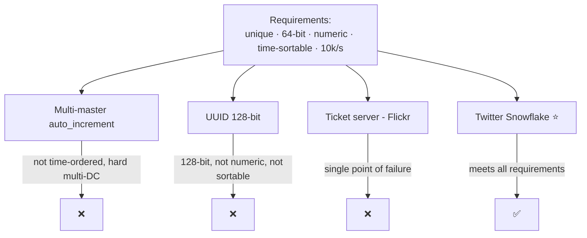
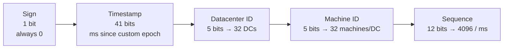
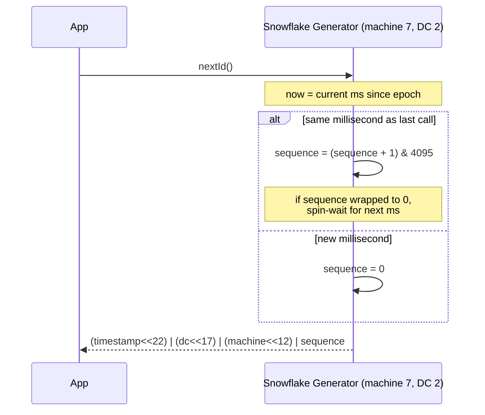

# Unique ID Generator in Distributed Systems — System Design

**Difficulty:** Intermediate
**Interview importance:** ⭐ **Critical** (a building block for URL shorteners, tweets, orders, messages — it shows up inside a dozen other designs)
**Reference:** Alex Xu, *System Design Interview* Vol 1, Ch 7

---

## 0. Why This Design Matters

Every row in every distributed system needs a name — an ID. On one machine you'd reach for `AUTO_INCREMENT` and move on. The moment you have *many* databases, that single counter becomes a bottleneck and a single point of failure, and "just use a UUID" quietly breaks three requirements at once (size, sortability, numeric). This question is really a lesson in **doing more with fewer coordination points**: the winning answer (Snowflake) generates globally-unique, time-sortable IDs with **zero coordination on the hot path**.

> One-line thesis: **encode the uniqueness into the bits of the ID itself, so no machine ever has to ask another machine "what number am I allowed to use?"**

---

## 1. Problem Overview — in Plain English

Generate IDs that are unique across a fleet of servers, fast, and (ideally) roughly ordered by time.

**Real-world analogy — hotel room numbers.** A single reception desk handing out the next room number works until you have 32 hotels in 32 cities. If every desk calls head office for the next number, head office melts. Instead you give each room a *structured* number — `city-building-floor-room` — and every desk can mint unique numbers locally, forever, without a phone call. Snowflake is exactly that: `time-datacenter-machine-sequence`.

---

## 2. Functional Requirements

Clarify these with the interviewer (the book does):

- IDs are **unique**.
- IDs are **numeric only**.
- IDs fit in **64 bits**.
- IDs are **ordered by date/time** (an ID made this evening > one made this morning).
- IDs need not increase by exactly 1 — just **trend upward** over time.
- Generate **≥ 10,000 unique IDs per second**.

---

## 3. Non-Functional Requirements

| Requirement | Target | Why |
|---|---|---|
| Throughput | ≥ 10k IDs/sec (headroom to millions) | It's a shared dependency |
| Latency | Sub-millisecond | It's on the write path of everything |
| Availability | Very high | If IDs stop, all inserts stop |
| Coordination | **None on the hot path** | Coordination = latency + SPOF |
| Ordering | Roughly time-sortable | Enables range scans, "newest first" |

---

## 4. Capacity Estimation

- Requirement: **10,000 IDs/sec**.
- Snowflake sequence field: **2¹² = 4096 IDs per millisecond per machine** = **4,096,000 IDs/sec on a *single* machine**. So one node already exceeds the requirement by ~400×.
- Timestamp field: **2⁴¹ ms ≈ 69 years** before overflow.
- Fleet ceiling: **32 datacenters × 32 machines × 4096/ms** — effectively unlimited for interview purposes.

---

## 5. The Four Approaches (and why Snowflake wins)



| Approach | Unique | 64-bit | Numeric | Time-sorted | No coordination | Verdict |
|---|---|---|---|---|---|---|
| **Multi-master** (`+k` increment) | ✅ | ✅ | ✅ | ❌ (not across servers) | ⚠️ hard to add/remove nodes | Breaks on multi-DC |
| **UUID** (128-bit) | ✅ | ❌ (128) | ❌ | ❌ | ✅ best | Wrong size/format |
| **Ticket server** (Flickr) | ✅ | ✅ | ✅ | ✅ | ❌ **SPOF** | Bottleneck |
| **Snowflake** ⭐ | ✅ | ✅ | ✅ | ✅ | ✅ | **Chosen** |

**Multi-master:** each of *k* DB servers uses `AUTO_INCREMENT` but steps by *k* (server A: 1,3,5…; server B: 2,4,6…). Scales with servers, but IDs don't grow with time across servers, and adding/removing a server is painful.

**UUID:** 128-bit, generated with no coordination — collision odds are astronomically low (1B UUIDs/sec for ~100 years → 50% chance of *one* dupe). But it's 128 bits (we need 64), non-numeric, and not time-sortable.

**Ticket server:** one central DB hands out incrementing numbers (Flickr's design). Simple and numeric, but a **single point of failure**; adding servers to fix that reintroduces synchronization problems.

---

## 6. Deep Dive — Twitter Snowflake

The trick is **divide and conquer**: don't generate the ID as one opaque number — split the 64 bits into meaningful sections, each independently determined, so no two machines can ever collide.



**Bit layout — total 1 + 41 + 5 + 5 + 12 = 64 bits:**

- **Sign (1 bit):** always 0; reserved for future use.
- **Timestamp (41 bits):** milliseconds since a **custom epoch** (Snowflake's default = `1288834974657` = Nov 4, 2010). Sits in the *high* bits, which is *why IDs sort by time*.
- **Datacenter ID (5 bits):** 32 datacenters. Fixed at startup.
- **Machine ID (5 bits):** 32 machines per DC. Fixed at startup.
- **Sequence (12 bits):** a per-machine counter, **reset to 0 every millisecond**, incremented for each ID minted within the same millisecond.

**What's decided when:**
- **Datacenter ID + Machine ID** → chosen at **startup**, fixed while running (an accidental change can cause collisions).
- **Timestamp + Sequence** → computed **live** on each request.



**Why it's time-sortable:** the timestamp occupies the most significant bits, so comparing two IDs as integers compares their creation time first. Two IDs from the same millisecond are then ordered by sequence.

**Timestamp lifetime:** 2⁴¹ − 1 = 2,199,023,255,551 ms ÷ 1000 ÷ 3600 ÷ 24 ÷ 365 ≈ **69 years**. Choosing a custom epoch near "today" pushes the overflow far into the future.

**Tuning the fields:** the split isn't sacred. A low-concurrency, long-lived system can steal bits from *sequence* and give them to *timestamp* (fewer IDs/ms, but a longer lifespan).

---

## 7. Failure Scenarios

| Scenario | What happens | Handling |
|---|---|---|
| **Clock moves backwards** (NTP correction) | Could mint an ID with an older timestamp → out-of-order or (rarely) duplicate | Detect `now < lastTimestamp`; **refuse / wait** until clock catches up; alert |
| **Clocks drift across machines** | IDs from different machines slightly mis-ordered | Accept coarse ordering; sync via **NTP**; strict order isn't a requirement |
| **>4096 IDs in one millisecond** | Sequence field overflows | **Spin-wait** until the next millisecond, then reset sequence to 0 |
| **Datacenter/Machine ID misconfigured** (two machines share one) | **Duplicate IDs** | Assign IDs via ZooKeeper/etcd at startup; validate uniqueness |
| **Timestamp overflow (~69 yrs)** | IDs stop fitting | Re-epoch or migrate (a very-future problem) |
| **Generator unavailable** | All inserts stall | Run the generator **as a library co-located in each service**, not a remote call — no network SPOF |

---

## ❌ 8. Common Mistakes

- **"Just use UUIDs."** They're 128-bit, non-numeric, and not sortable — and random UUIDs as a primary key **fragment B-tree indexes** (bad insert locality). If you must, use time-ordered UUIDv7.
- **Calling a central ID service over the network.** That reintroduces the ticket-server SPOF and adds a network hop to every insert. Snowflake's point is *local* generation.
- **Trusting `System.currentTimeMillis()` blindly.** Handle the clock-going-backwards case explicitly, or you'll mint duplicates during an NTP step.
- **Forgetting sequence-overflow handling.** Under burst load you *will* exceed 4096/ms; you must spin to the next millisecond.
- **Hardcoding machine IDs.** Two pods with the same machine ID = silent duplicates. Allocate them dynamically.

---

## 9. Interview Q&A

**Beginner**

**Q: Why not just use a database auto-increment ID?**
It needs a single source of truth, which becomes a bottleneck and a single point of failure at scale, and coordinating a shared counter across many databases with low latency is hard. We want each machine to mint IDs locally.

**Q: What's wrong with UUIDs?**
They're 128 bits (we asked for 64), can be non-numeric, and aren't time-sortable. They're great when you need zero coordination and don't care about size or ordering, but they fail this spec — and random UUIDs hurt index locality as primary keys.

**Intermediate**

**Q: Walk me through the Snowflake bit layout.**
64 bits: 1 sign bit (always 0), 41 timestamp bits (ms since a custom epoch), 5 datacenter bits (32 DCs), 5 machine bits (32 machines each), and 12 sequence bits (4096 IDs per millisecond per machine). The timestamp is in the high bits, so IDs sort by time. Datacenter and machine IDs are fixed at startup; timestamp and sequence are computed per request.

**Q: How does it stay unique across machines without coordination?**
Uniqueness is structural. Within a machine-millisecond, the sequence counter guarantees uniqueness (up to 4096). Across machines, the datacenter+machine bits differ. Across time, the timestamp differs. No two machines can produce the same combination, so no machine ever has to ask another for permission.

**Advanced / Staff**

**Q: What happens if the clock moves backwards, and how do you handle it?**
An NTP correction can push the clock back, which could produce a smaller timestamp and, worst case, a duplicate. The generator tracks the last timestamp it used; if `now < last`, it either waits until the clock catches up or rejects and raises an alert. Some implementations reserve a bit or fall back to a monotonic clock. The key is to *detect* it rather than silently mint bad IDs.

**Q: How do you assign the datacenter and machine IDs safely?**
Statically hardcoding them invites collisions when config drifts. The robust approach is dynamic assignment at boot from a coordination service (ZooKeeper/etcd), which leases a unique worker ID and detects conflicts. You trade a tiny bit of startup coordination for zero hot-path coordination.

**Q: How would you get more than 4096 IDs/ms on one machine?**
Either spin-wait into the next millisecond (simplest, bounded), rebalance bits (more sequence, fewer timestamp — at the cost of lifespan), or run more generator instances with distinct machine IDs. In practice 4096/ms per machine is rarely the binding constraint.

---

## 🎯 10. 30-Second Interview Answer

> "A single auto-increment counter is a bottleneck and a SPOF, and UUIDs are 128-bit, non-numeric, and not time-sortable. So I'd use **Twitter Snowflake**: a 64-bit ID split into 1 sign bit, 41 timestamp bits, 5 datacenter bits, 5 machine bits, and 12 sequence bits. The timestamp is in the high bits, so IDs sort by time; the datacenter+machine bits make each generator independent; and the 12-bit sequence gives 4096 IDs per millisecond per machine — millions per second — with **zero coordination on the hot path**. The 41-bit timestamp lasts about 69 years from a custom epoch. The two things to watch are clock-going-backwards, which I detect and wait out, and safe assignment of machine IDs via something like ZooKeeper."

---

## 🧠 11. Mental Model

```
Encode uniqueness INTO the bits → no hot-path coordination
        ↓
[ 1 sign | 41 timestamp | 5 DC | 5 machine | 12 sequence ] = 64 bits
        ↓
time in high bits  → sortable
DC+machine bits    → unique across the fleet
sequence (0..4095) → unique within a machine-millisecond
        ↓
Watch: clock-backwards (wait), machine-ID collisions (ZooKeeper), seq overflow (spin to next ms)
```

---

## 🔗 12. How This Connects to Other Topics

- **URL Shortener** — Snowflake IDs (or a range-handed-out counter) can be base-62 encoded into short keys; the "unique numeric ID → short string" pipeline is the same.
- **Consistent Hashing / Key-Value Store** — time-sortable keys give good range-scan locality but can create **hot partitions** (newest writes all land on one node); random keys spread load but lose ordering. Snowflake sits in the middle.
- **Message Queue / Log** — per-partition offsets are a specialized monotonic ID; the "sequence within a partition" idea mirrors Snowflake's sequence field.
- **Clocks & causality (DDIA Ch. 8)** — the clock-backwards problem is the classic "you can't fully trust wall-clock time in a distributed system" lesson.
- **Payments / idempotency** — client-supplied unique IDs (idempotency keys) rely on the same "generate a collision-free ID" primitive.
