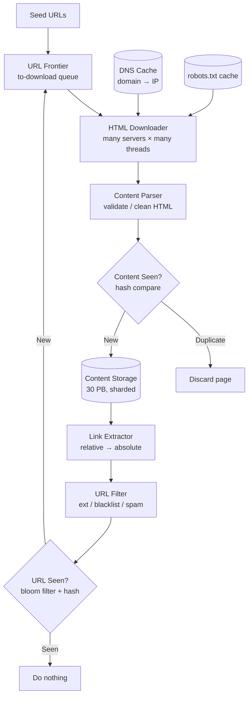
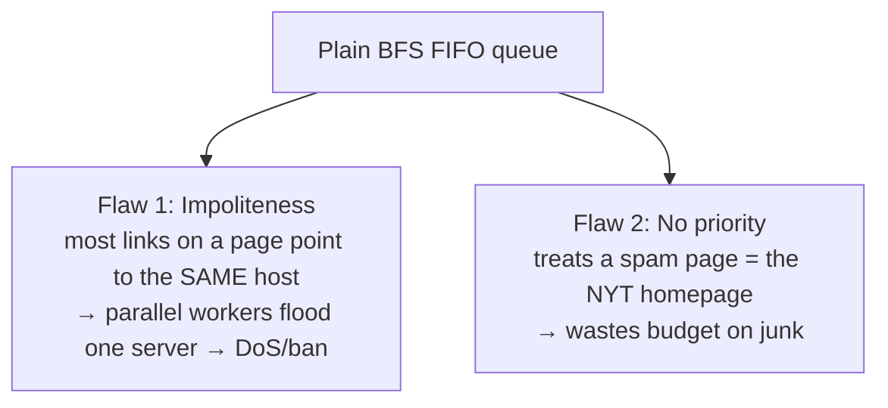
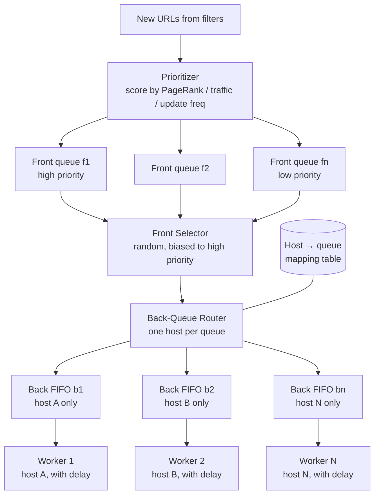
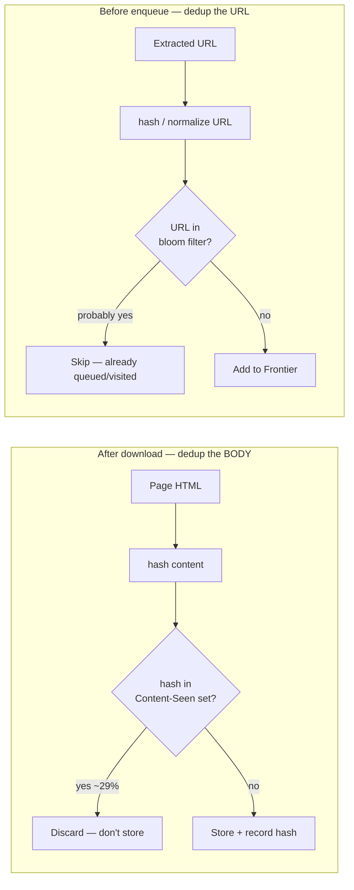
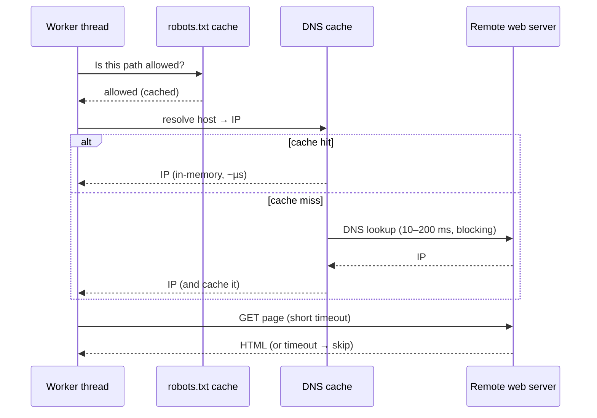

# Web Crawler — System Design

**Difficulty:** Intermediate → Advanced
**Interview importance:** ⭐ **High** (a classic "sounds trivial, is secretly a distributed-systems minefield")
**References:** *System Design Interview Vol. 1*, Ch. 9 — *Design a Web Crawler*; DDIA Ch. 5–6 (replication, partitioning)

---

## 0. Why This Design Matters

A web crawler is the interview's favorite bait-and-switch. The naive version is a whiteboard one-liner: *"download a page, extract links, repeat."* That's a 5-line recursive function — and it's wrong in every way that matters. The web is a **hostile, adversarial, effectively-infinite graph**: pages that link back to themselves forever, servers that will fall over if you hit them twice a second, 30% duplicate content, DNS that blocks your threads for 200 ms a call, and a scale (billions of pages) where a single machine is a rounding error.

The candidate who says "BFS with a queue" and stops has failed. The candidate who talks about the **URL Frontier** (politeness *and* priority as first-class concerns), **dedup at two layers**, **DNS as the hidden bottleneck**, and **spider traps** is demonstrating that they understand systems don't fail in the happy path — they fail at the edges, at scale, under adversarial input.

> The one-line thesis: **a web crawler is a distributed BFS over a graph you don't control — so the entire design is about staying polite, avoiding traps, and never doing the same work twice.**

---

## 1. Problem Overview — in plain English

Build a system that, given a handful of **seed URLs**, discovers and downloads the reachable web, stores the content for indexing, and keeps it reasonably fresh — at a scale of **1 billion pages per month**.

The core loop is deceptively small:

1. Take a URL from the "to-do" list.
2. Download the page.
3. Extract the links (new URLs).
4. Add the *new* ones back to the "to-do" list.
5. Store the content. Repeat forever.

The hard part is everything wrapped around that loop:

- The "to-do" list has **hundreds of millions of URLs** — it doesn't fit in memory.
- You must not hammer any single website (**politeness**), or you'll get IP-banned and behave like a DoS attack.
- ~29% of what you download is a **duplicate** — detecting that cheaply saves petabytes.
- The web has **traps** designed (accidentally or maliciously) to keep you crawling forever.
- You must respect each site's **robots.txt** rules.

**Uses:** search-engine indexing (Googlebot — the main one), web archiving (Library of Congress, EU Web Archive), web mining (financial firms scraping reports), and web monitoring (copyright/trademark infringement detection).

### Real-world analogy — the mail carrier for the entire planet

Imagine one postal service that must **visit every building on Earth**, read what's posted on each door, and follow the "see also, next door" signs to find new buildings.

- You can't send 10,000 carriers to knock on the *same* house at once — the resident calls the police (**politeness**: one carrier per house, with a pause between knocks).
- Some houses have a sign at the gate saying "no mail past this point" (**robots.txt**).
- Some streets loop back on themselves in an infinite spiral (**spider traps**).
- Many buildings have *identical* flyers posted (**duplicate content** — don't re-file the same flyer).
- Important buildings (city hall, the news office) should be re-visited often; a derelict shed, rarely (**priority + freshness**).

Everything else — Kafka, consistent hashing, bloom filters — is just *"how do a thousand carriers split up the planet without visiting the same house twice or getting anyone arrested?"*

---

## 2. Functional Requirements

**Core**
- Given seed URLs, **crawl the reachable web** (HTML pages only, for this design).
- **Extract and follow links** to discover new pages.
- **Store** the downloaded HTML for indexing (retain up to **5 years**).
- **Deduplicate** — never store the same content twice, never queue the same URL twice.
- Handle **newly added and edited** pages (freshness via recrawl).
- Obey **robots.txt** and be **polite** per host.

**Optional (name them, then defer)**
- Other content types (images, PDFs, video) via pluggable downloaders.
- JavaScript-rendered pages (dynamic/SSR rendering).
- Anti-spam / low-quality page filtering.
- Web-monitoring hooks (copyright, trademark).

---

## 3. Non-Functional Requirements

| Requirement | Target | Why it dominates the design |
|---|---|---|
| **Scalability** | 1B pages/mo (~400 QPS avg, ~800 peak) | A single box is impossible → distributed crawl, partitioned URL space |
| **Politeness** | ≤ 1 concurrent request/host + delay | Ignore it and you get IP-banned; you *are* a DDoS otherwise |
| **Robustness** | Survive bad HTML, dead servers, crashes, malicious links | The input is adversarial and you don't control it |
| **Freshness** | Recrawl by importance + change rate | The web mutates constantly; re-crawling *everything* is unaffordable |
| **Extensibility** | Plug in new content types w/o rewrite | New requirements (images) shouldn't force a redesign |
| **Efficiency** | Never do duplicate work | ~29% dup content; DNS/network are the scarce resources |

> **Say this out loud in an interview:** *"Politeness and robustness are not nice-to-haves here — they're the two constraints that reshape the entire architecture. A crawler that ignores them is indistinguishable from an attack, and it will crash on the first malformed page."*

---

## 4. Capacity Estimation (do the math — don't hand-wave)

Start from the headline number: **1 billion pages per month.**

**Throughput (QPS):**
```text
1,000,000,000 pages / 30 days / 24 h / 3600 s ≈ 400 pages/second (average)
Peak (2×)                                      ≈ 800 pages/second
```

**Storage:**
```text
Average page size ............ 500 KB
Monthly storage .............. 1B × 500 KB = 500 TB / month
5-year storage ............... 500 TB × 12 × 5 = 30 PB
```

**What the numbers tell us:**

- **30 PB** rules out any single machine or single disk — content lives in a **distributed, sharded, replicated blob store** (mostly disk, hot pages cached in memory).
- **400–800 QPS of downloads** sounds modest, *but* each download involves a DNS lookup (10–200 ms, often **blocking**) and a network round-trip to an unpredictable remote server. At 800 concurrent slow I/O operations, you need **many servers each running many threads** — the bottleneck is I/O wait, not CPU.
- The **URL Frontier** may hold **hundreds of millions of URLs** at once. At ~100+ bytes per URL that's tens of GB — too big to keep purely in memory, too slow to keep purely on disk → **hybrid disk + in-memory buffers**.
- ~29% duplicate content means naive storage would waste ~**9 PB over 5 years**. Dedup pays for itself many times over → cheap **hash comparison**, not byte-by-byte.

---

## 5. API Design

A crawler is mostly an internal pipeline, but framing its interfaces sharpens the design.

**Submit seed URLs (control path):**
```http
POST /v1/crawl/seeds
```
```json
{ "urls": ["https://en.wikipedia.org", "https://news.ycombinator.com"],
  "priorityHint": "HIGH", "maxDepth": null }
```

**Internal Frontier interface (the hot path):**
```text
frontier.enqueue(url, priority, host)   // add a discovered URL (after filters)
frontier.dequeue() -> url               // worker asks for the next polite URL to fetch
```

**Content storage interface:**
```text
storage.putIfNew(contentHash, html) -> bool   // atomic dedup + store
storage.get(url) -> html
```

**Query crawl status (ops):**
```http
GET /v1/crawl/stats
```
```json
{ "pagesCrawled": 812340021, "frontierSize": 240113988,
  "qps": 412, "dupContentRate": 0.29, "activeHosts": 1840221 }
```

---

## 6. High-Level Architecture



**The pipeline, step by step:** seed URLs enter the Frontier → the Downloader pulls a URL, resolves its IP via the DNS cache, checks robots.txt, and fetches → the Parser validates/cleans the HTML → **"Content Seen?"** discards duplicate content or passes new content to storage → the Link Extractor pulls out links and absolutizes them → the URL Filter drops unwanted extensions/blacklisted/spam URLs → **"URL Seen?"** drops URLs already visited or already queued → survivors go back into the Frontier. The loop repeats until the Frontier drains (which, for the whole web, is "never" — you recrawl).

**Why each component is separate:** the **Content Parser** is its own service so slow/malformed-page parsing never stalls the download servers. The **two dedup checks** ("Content Seen?" on the *body*, "URL Seen?" on the *link*) catch duplicates at two different stages. **DNS and robots.txt are cached** because both are per-request costs that would otherwise dominate latency.

---

## 7. Deep Dive

### 7.1 Why BFS, not DFS

Model the web as a **directed graph**: pages are nodes, hyperlinks are edges. Crawling is graph traversal.

- **DFS (depth-first)** is a **bad choice** — the web's depth is effectively unbounded (a site can generate infinitely deep paths), so DFS can wander down one branch forever and starve breadth.
- **BFS (breadth-first)** is the standard, implemented with a **FIFO queue**: URLs come out in roughly the order they were discovered, giving even coverage.

But plain BFS has **two fatal flaws** that the URL Frontier exists to fix:



1. **Impoliteness.** Most links on a page point back to the **same host** (all Wikipedia links are internal). A naive parallel BFS would fire dozens of workers at one server simultaneously — that's a denial-of-service attack, and you'll be banned.
2. **No prioritization.** Standard BFS treats every page as equally important, but pages differ wildly in value (PageRank, traffic, update frequency).

### 7.2 The URL Frontier — the heart of the design

The Frontier is a smart queue that solves **politeness**, **priority**, and **freshness** at once. It's built from **front queues** (handle priority) feeding **back queues** (handle politeness).



**Politeness (back queues).** The invariant: **at most one download in flight per host, with a delay between requests.**
- **Back-queue router:** ensures each back queue holds URLs from **exactly one host**.
- **Mapping table:** host → back queue.
- **Queue selector:** each **worker thread is pinned to one back queue** (one host), and inserts a **delay** between successive downloads to the same host.

**Priority (front queues).** A **Prioritizer** scores each URL by usefulness — **PageRank**, site traffic, update frequency. Higher-scored URLs land in higher-priority front queues, and a **front selector picks queues with a bias toward the high-priority ones** (randomized so low-priority URLs aren't starved forever).

**Freshness.** Pages change, so the crawler **periodically recrawls**. Two efficiency levers: recrawl based on each page's observed **update history**, and recrawl **important pages first and more often** — you can't afford to recrawl everything uniformly.

**Frontier storage (memory vs disk trade-off).** With hundreds of millions of URLs:
- *All in memory* → not durable, and too big.
- *All on disk* → too slow (disk I/O on the hot path).
- **Hybrid (the answer):** the bulk of URLs live **on disk**; each queue keeps small **in-memory buffers** for enqueue/dequeue that are periodically flushed to and refilled from disk. You get memory speed on the hot path with disk's capacity and durability.

### 7.3 The two dedup layers — hashes + bloom filters

Deduplication happens **twice**, at two different stages, because there are two different things to dedup:



**"Content Seen?" — dedup the page body.** About **29% of web pages are duplicates** (mirrors, reposts, syndicated content). Comparing pages **byte-by-byte** is far too slow at this scale, so we compare **hash values** of the content. If the hash is already in the "content seen" set, discard the page — don't waste 500 KB storing it again. (Advanced: near-duplicate detection uses SimHash/MinHash so slightly-different pages also collapse.)

**"URL Seen?" — dedup the URL.** Before adding a discovered link to the Frontier, check whether we've already visited it *or* already queued it. With **billions of URLs**, an exact hash set would be huge, so we front it with a **bloom filter**: a compact probabilistic structure that answers "definitely never seen" or "probably seen." False positives (skipping a URL we hadn't actually seen) are rare and acceptable; false negatives are impossible, so we never re-crawl. This prevents **infinite loops** and redundant load.

> **Why a bloom filter here is the "right" answer:** it turns a "does this billion-element set contain X?" question into a few bit-lookups in a fixed-size array — O(1) time, tiny memory — at the cost of a tunable, tiny false-positive rate. That trade (a little accuracy for enormous space savings) is exactly the kind of thing interviewers want to hear named.

### 7.4 HTML Downloader — DNS cache and robots.txt

The Downloader is where the crawler touches the real, hostile internet, and it has two caches that turn per-request costs into near-free lookups.

**robots.txt (Robots Exclusion Protocol).** Every site can publish a `/robots.txt` declaring which paths crawlers may fetch. A well-behaved crawler **checks robots.txt before fetching** and obeys it (e.g., Amazon disallows `/creatorhub/*` for Googlebot). Re-downloading robots.txt on every request would be wasteful, so it's **cached and refreshed periodically**.

**DNS is the hidden bottleneck.** Turning `www.wikipedia.org` into `198.35.26.96` takes **10–200 ms**, and many DNS resolver interfaces are **synchronous** — the calling thread *blocks*, starving the other threads on that machine. At 800 QPS this alone would cripple throughput. Fix: maintain our **own DNS cache** (domain → IP), refreshed by background cron jobs, so the vast majority of resolutions are in-memory lookups.



**Other performance optimizations:**
- **Distributed crawl:** spread jobs over many servers, each running many threads; **partition the URL space** so each downloader owns a disjoint subset of hosts.
- **Locality:** place crawl servers geographically **close to the sites** they crawl (lower RTT); applies to servers, caches, queues, and storage.
- **Short timeouts:** set a **max wait**; if a host is slow/dead, skip it and move on rather than blocking a worker indefinitely.

### 7.5 Robustness and extensibility

**Robustness** (the input is adversarial):
- **Consistent hashing** to distribute hosts across downloaders, so servers can be **added/removed smoothly** without reshuffling everything.
- **Save crawl state + data** so a crash can restart from a checkpoint instead of from seeds.
- **Exception handling + data validation** so one malformed page or malicious link doesn't crash a worker.

**Extensibility** — design so new capabilities **plug in** as modules: a **PNG/Image downloader**, a **Web Monitor** for copyright/trademark infringement, a **dynamic renderer** for JS-heavy pages. The pipeline shape doesn't change; you add a stage.

### 7.6 Spider traps and other edge cases

A **spider trap** is a page structure that lures a crawler into an **infinite loop** — e.g. `www.spidertrapexample.com/foo/bar/foo/bar/foo/bar/…` generated on the fly. There's **no perfect automatic detection**. Defenses:
- Cap the **maximum URL length** (traps produce absurdly long URLs).
- **Anomaly detection:** a trap manifests as an unusually huge page count from one host — flag it for manual review or a custom URL filter.

**Other edge cases:** JavaScript/AJAX sites generate links dynamically, so you may need **dynamic rendering** (execute the page) before parsing to capture those links; **data noise** (ads, boilerplate, spam URLs) should be filtered; an **anti-spam** component drops low-quality pages given finite storage.

---

## 8. BFS vs DFS vs Frontier — trade-off table

| Approach | Coverage | Politeness | Priority | Loop-safe | Verdict |
|---|---|---|---|---|---|
| **DFS** | Uneven (goes deep) | ❌ hammers one host | ❌ none | ❌ can run forever | **Never** — depth is unbounded |
| **Plain BFS (FIFO)** | Even | ❌ floods same-host links | ❌ all pages equal | ⚠️ needs URL-Seen | Correct traversal, wrong operationally |
| **URL Frontier (front + back queues)** | Even | ✅ 1 req/host + delay | ✅ PageRank-biased | ✅ URL-Seen + traps | **The design** — BFS with politeness + priority bolted on |

---

## 9. Failure Scenarios

| Failure | Handling |
|---|---|
| **Duplicate content (~29%)** | "Content Seen?" — compare **content hashes**, discard dups before storing |
| **Same URL re-discovered** | "URL Seen?" — **bloom filter + hash table**, drop before enqueue (prevents loops) |
| **Spider trap (infinite loop)** | Max URL length + per-host page-count anomaly detection + manual/custom filters |
| **DNS slow/blocking** | Local **DNS cache** refreshed by cron; async resolution where possible |
| **Unresponsive / dead server** | **Short timeout**, skip the host, keep crawling others |
| **Bad / malformed HTML** | Parser validation + exception handling; don't crash the worker |
| **Malicious links** | URL filter + data validation + sandboxed parsing |
| **Crawl server crashes** | **Saved crawl state** → restart from checkpoint; consistent hashing reroutes its hosts |
| **Storage node failure** | **Replication + sharding** of content storage |
| **Politeness breach (accidental DoS)** | One worker per host + inter-request delay + robots.txt compliance |

---

## 10. Common Mistakes

- **"BFS with a queue"** and stopping there — ignores politeness, priority, dedup, and traps (the whole point).
- **Using DFS** — sounds clever, dies on unbounded depth.
- **Downloading in parallel per host** — that's a DoS attack; you'll be IP-banned within minutes.
- **Forgetting robots.txt** — instant "you'd get us sued/blocked" from a good interviewer.
- **Byte-by-byte content comparison** — comparing full pages doesn't scale; use **hashes**.
- **Exact set for "URL Seen?"** — a billion-entry hash set is huge; front it with a **bloom filter**.
- **Ignoring DNS** — the single most-missed bottleneck; synchronous DNS blocks threads.
- **No spider-trap defense** — one malicious site can consume your entire crawl budget.
- **Keeping the whole Frontier in memory** — hundreds of millions of URLs → hybrid disk+buffer.
- **Treating storage as an afterthought** — 30 PB needs sharding + replication from day one.

---

## 11. Interview Q&A

**Beginner**

**Q: Why BFS and not DFS?**
The web's depth is effectively infinite — a site can generate arbitrarily deep paths — so DFS can wander down one branch forever and never achieve breadth. BFS with a FIFO queue gives even coverage and is the standard. In practice we don't use *plain* BFS, though; we use a URL Frontier because plain BFS is impolite and has no priority.

**Q: How do you avoid storing the same page twice?**
Two dedup layers. "Content Seen?" hashes the downloaded page body and discards it if the hash was seen before (~29% of pages are dups). "URL Seen?" checks a bloom filter before queuing a link so we never re-crawl a URL. Hashing beats byte comparison at this scale.

**Q: What's robots.txt and why care?**
It's the file where a site declares which paths crawlers may fetch. A polite crawler checks it before every fetch (cached to avoid re-downloading) and obeys it — ignore it and you get blocked or worse.

**Intermediate**

**Q: What is the URL Frontier and why is it the heart of the design?**
It's a smart queue that turns plain BFS into a polite, prioritized traversal. Front queues handle **priority** (a Prioritizer scores URLs by PageRank/traffic/update-frequency, and a selector picks high-priority queues more often). Back queues handle **politeness** (each back queue holds one host, and a worker thread pinned to it downloads one page at a time with a delay). It also drives freshness via recrawl.

**Q: Why is DNS a bottleneck, and how do you fix it?**
Each resolution takes 10–200 ms and many DNS APIs are synchronous, so the thread blocks — at 800 QPS that starves your workers. Fix: maintain a local DNS cache (domain → IP) refreshed by cron, so most lookups are in-memory.

**Q: Why a bloom filter for "URL Seen?" instead of a hash set?**
With billions of URLs an exact set is enormous. A bloom filter answers "definitely new" or "probably seen" in O(1) time and tiny fixed memory, with a tunable false-positive rate. False positives just skip a URL (acceptable); it never produces false negatives, so we never accidentally re-crawl.

**Advanced / Staff**

**Q: How do you keep the crawl polite *and* fast across a distributed cluster?**
Politeness is a per-host invariant: one in-flight request per host plus a delay. I enforce it in the back queues (one host per queue, one pinned worker). To scale, I partition the *host space* across downloaders with **consistent hashing** so each host is owned by exactly one server — that keeps the "one request per host" guarantee even across machines, and lets me add/remove servers without global reshuffling. Speed comes from parallelism *across* hosts, never *within* a host.

**Q: The Frontier has hundreds of millions of URLs — where does it live?**
Neither pure memory (not durable, too big) nor pure disk (too slow on the hot path). Hybrid: the bulk on disk, with small per-queue in-memory buffers for enqueue/dequeue, periodically flushed and refilled. That gives memory-speed hot-path ops with disk capacity and durability, and it survives restarts when combined with saved crawl state.

**Q: How do you detect and stop spider traps?**
There's no perfect automatic detection. I cap maximum URL length (traps generate absurd URLs), and I run per-host anomaly detection — a trap shows up as an implausible page count from a single site, which I flag for a custom URL filter or manual review. This is a case where I'd be explicit with the interviewer that the mitigation is heuristic, not exact.

---

## 12. 30-Second Interview Answer

> "I'd model the web as a directed graph and do **BFS**, but not plain BFS — I'd use a **URL Frontier**: front queues that prioritize by PageRank/traffic and back queues that enforce **politeness**, one host per queue with one worker and a delay so I never DoS a site. Downloaders resolve IPs through a **local DNS cache** (DNS is the sneaky bottleneck — 10–200 ms and often blocking) and obey **cached robots.txt**. I dedup twice: **'Content Seen?'** compares page **hashes** to drop the ~29% of duplicate content, and **'URL Seen?'** uses a **bloom filter** to never queue a URL twice, which also breaks loops. Content goes to a **sharded, replicated store** — 30 PB over 5 years. I scale by partitioning the host space with **consistent hashing** across many multi-threaded servers, use **short timeouts** for dead hosts, cap URL length to fight **spider traps**, and checkpoint crawl state so a crash resumes instead of restarting."

---

## 13. Mental Model

```text
SEED URLs
   ↓
URL FRONTIER  ── front queues = PRIORITY (PageRank/traffic)
              └─ back queues  = POLITENESS (1 host/queue, 1 worker, delay)
   ↓ dequeue
DOWNLOADER  ── DNS cache (the hidden bottleneck) + robots.txt cache + short timeout
   ↓
PARSER  ── validate/clean HTML
   ↓
CONTENT SEEN?  ── hash the BODY → drop ~29% dups
   ↓ new
STORAGE  ── 30 PB, sharded + replicated, hot pages cached
   ↓
LINK EXTRACTOR → URL FILTER → URL SEEN? (bloom filter) → back to FRONTIER

TRAVERSAL   → BFS, never DFS (depth is infinite)
DEDUP       → twice: content-hash + URL-bloom-filter
SCALE       → distributed, consistent hashing over the host space
BOTTLENECK  → DNS (cache it)
ADVERSARIAL → spider traps (cap URL length), bad HTML (validate), robots.txt (obey)
FRESHNESS   → recrawl important + frequently-changing pages first
```

---

## 14. How This Connects to Other Topics

- **Rate limiter** — politeness *is* a rate limiter, per host: "at most one request per host per delay" is exactly a token/leaky bucket keyed on the hostname. Same accuracy-vs-throughput trade.
- **Consistent hashing** — the same technique that shards a cache/DB shards the *host space* across downloaders, so adding/removing servers doesn't reshuffle everything.
- **Bloom filters / probabilistic structures** — "URL Seen?" is the canonical bloom-filter use case; the "trade a tiny false-positive rate for huge space savings" idea recurs in caching and databases (e.g., LSM-tree bloom filters).
- **Message queues** — the URL Frontier is a specialized distributed queue with priority and per-key (per-host) serialization; a real crawler often backs it with Kafka.
- **Partitioning & replication (DDIA Ch. 5–6)** — 30 PB of content storage is a textbook sharded+replicated blob store; the freshness/recrawl problem is a distributed scheduling problem.
- **Distributed systems failure modes** — short timeouts, checkpointing, and graceful degradation on dead/slow hosts are the same robustness patterns every large system needs.
