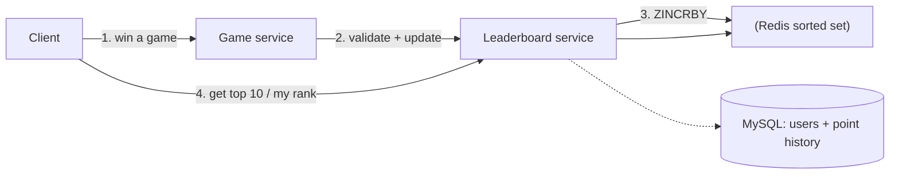
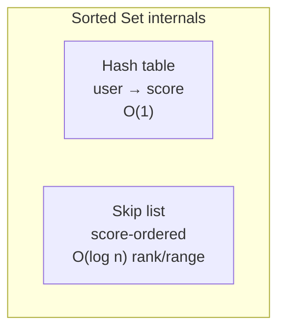

# Real-time Gaming Leaderboard — System Design

**Difficulty:** Intermediate
**Interview importance:** ⭐ High (the canonical "why a relational DB can't rank in real time, and what Redis sorted sets buy you" question)
**Reference:** Alex Xu, *System Design Interview* Vol 2, Ch 10

---

## 0. Why This Design Matters

A leaderboard looks trivial — "sort by score, show the top 10." It becomes a real systems problem the instant you add two words: **real-time** and **arbitrary user's rank**. Ranking *one* user among 25 million others, on data that changes thousands of times a second, is a table-scan that takes tens of seconds in SQL. This design teaches the right data structure for the job (**Redis sorted sets**), and — the harder half — how to **shard a ranking structure** without losing the ability to compute an exact rank.

> Thesis: **ranking is a data-structure problem, not a query problem.** Pick the structure (skip list) that makes rank O(log n), then figure out how to shard it.

---

## 1. Problem Overview — in Plain English

Show who's winning, live. Specifically:
- The **top 10 players**.
- **Any specific user's rank**.
- Bonus: the players **4 places above and below** a given user.

Scores change constantly, so a nightly batch won't do.

**Real-world analogy — a leaderboard at a marathon.** Posting the top 10 finishers is easy. But if runner #14,231 walks up and asks "what's my exact position right now?", you can't recount all 40,000 runners on the spot. You need them kept in a **continuously sorted** structure so any position is instantly answerable.

---

## 2. Functional Requirements

- Display the **top 10** players.
- Show a **user's specific rank**.
- Show 4 players above and below a user (nice-to-have).

**Rules clarified with the interviewer:**
- **+1 point** per match won (simple scoring).
- **All players** appear on the board.
- A **fresh leaderboard each month** (a tournament).
- **Ties share a rank** (tie-breaking is a bonus).

---

## 3. Non-Functional Requirements

| Requirement | Target |
|---|---|
| Score→board latency | **Real-time** |
| Scalability | Millions of DAU |
| Availability & reliability | High; must be rebuildable after failure |

---

## 4. Capacity Estimation

- **5M DAU**, **25M MAU**, each plays **10 matches/day**.
- Scoring events: 5M ÷ 86,400 s ≈ **50 users/sec**; ×10 matches = **500 updates/sec**; peak ×5 ≈ **2,500 updates/sec**.
- Top-10 fetches: **~50 QPS** (assume once/day per active user).
- **Storage:** 25M entries × (24-char id + 2-byte score ≈ 26 bytes) ≈ **650 MB**. Even doubled for skip-list/hash overhead, **one Redis node** holds it and handles 2,500 writes/sec easily.

Conclusion: at this scale, **one Redis node suffices**. Sharding is a *scale-up* discussion (see §7).

---

## 5. API Design

- `POST /v1/scores` — **internal only** (called by game servers). Body: `user_id`, `points`. → 200 / 400.
- `GET /v1/scores` — fetch top 10 → list of `{user_id, user_name, rank, score}`.
- `GET /v1/scores/{user_id}` — a specific user's rank and score.

---

## 6. High-Level Design



**Two key design decisions:**
1. **The client must never set the score directly.** Otherwise an attacker uses a proxy (man-in-the-middle) to fake scores. Scores are set **server-side** — the game server knows the real result.
2. **No message queue here.** Kafka would help *if* many services consumed score events (analytics, notifications), but that's not a requirement, so it's omitted (add it if the scope grows).

**Why not a relational DB?** A table of `(user_id, score)` works for writes (`UPDATE ... SET score = score + 1`), but ranking means `ORDER BY score DESC` over millions of rows — essentially a **table scan taking tens of seconds**. `LIMIT 10` helps only the top-10 case, not "find *this* user's rank," which needs a `COUNT(*)` of everyone above them. Caching doesn't help because the data changes constantly.

---

## 7. Deep Dive — Redis Sorted Sets

A **sorted set** stores unique members each with a score, kept sorted. Internally it uses **two structures**:
- a **hash table** (member → score, O(1) lookup), and
- a **skip list** (score → member, kept in sorted order).



**Skip list intuition:** a sorted linked list has O(n) search. Add express lanes (level-1 skips every other node, level-2 skips further…) and you jump like binary search. The book's example: reaching a node takes **62 hops** on the base list but only **11 hops** with 5 index levels. Result: insert / update / rank / range are all **O(log n)**.

**The operations we use:**

| Command | Purpose | Complexity |
|---|---|---|
| `ZADD` | insert user / update score | O(log n) |
| `ZINCRBY` | +N to a user's score (creates at 0 if new) | O(log n) |
| `ZREVRANGE` | top-K (high→low), `WITHSCORES` for scores | O(log n + m) |
| `ZREVRANK` | a user's position (high→low) | O(log n) |

**Workflow** (monthly set `leaderboard_feb_2021`):
1. **Score a point:** `ZINCRBY leaderboard_feb_2021 1 'mary1934'`
2. **Top 10:** `ZREVRANGE leaderboard_feb_2021 0 9 WITHSCORES`
3. **A user's rank:** `ZREVRANK leaderboard_feb_2021 'mary1934'`
4. **4 above & below** (say user is rank 361): `ZREVRANGE leaderboard_feb_2021 357 365`

**Backing store (MySQL):** a **user table** (id, display name, avatar) and a **point table** (user_id, score, timestamp per win). The point table gives play history *and* lets us **rebuild Redis** after a crash. Optionally cache top-10 profile details for fast rendering.

**Cloud option:** the book notes you can go serverless — **API Gateway + AWS Lambda** with three functions (`FetchTop10`, `FetchPlayerRank`, `UpdateScore`) that call Redis + MySQL and auto-scale. Recommended if building from scratch.

---

## 8. Scaling to 500M DAU (100×) — the sharding discussion

At 100× scale: worst-case ≈ **65 GB** and ≈ **250,000 writes/sec** → one node no longer fits. Now shard. Two options:

### Option A — Fixed partition by score range (preferred)

Split by score band across N shards (e.g. shard for scores 1–100, 101–200, …, 901–1000).

```mermaid
flowchart TD
    subgraph Fixed partition by score range
      S1["Shard ["1,100"]"]
      S2["Shard ["101,200"]"]
      S3["Shard ["201,300"]"]
      S4["Shard ["901,1000"]<br/>top players"]
    end
```

- **Top 10** = read the highest-range shard.
- **A user's rank** = their local rank + the total count of players in all higher shards (`info keyspace` gives shard size in O(1)).
- **Needs** a roughly even score distribution (adjust bands otherwise), and a **user→score lookup** (secondary cache) to know which shard a user is in.
- When a user's score **crosses a boundary**, move them to the new shard.
- ✅ Can compute an **exact rank**. This is why the book prefers it.

### Option B — Hash partition (Redis Cluster)

Redis Cluster auto-shards using **16,384 hash slots**; a key's slot = `CRC16(key) % 16384`. Nodes join/leave without redistributing everything.

- **Top 10** needs a **scatter-gather**: get top 10 from each shard, then merge/sort in the app (queries run in parallel).
- ❌ **No straightforward way to get a specific user's exact rank**, and top-K latency waits on the slowest shard.

**Sizing note:** write-heavy Redis needs ~2× memory for snapshots; use `redis-benchmark` to measure real throughput on your hardware.

### Alternative: NoSQL (DynamoDB) with percentile rank

If you replace Redis+MySQL with a write-optimized NoSQL that sorts within a partition:
- Partition key `game#year-month`, sort key `score` → recent month becomes a **hot partition**.
- Fix with **write sharding**: `chess#2020-02#p0`, `#p1`, … (more partitions = less hot, more scatter-gather).
- Exact rank is hard, but a **cron job** can compute **percentile thresholds** per shard and cache them — telling a user "you're in the top 10–20%" is often more useful than "rank 1,200,001."

---

## 9. Failure Scenarios

| Scenario | Handling |
|---|---|
| **Redis node dies** | Configure a **read replica**; promote on failure, attach a new replica. (Restarting a big instance from disk is slow.) |
| **Whole cluster outage** | **Rebuild from MySQL**: iterate every win (each has a timestamp), `ZINCRBY` per win. |
| **Ties** | Keep a Redis hash of user→timestamp of latest winning game; on a tie, **earlier timestamp ranks higher** (scored first). |
| **User crosses shard boundary** (fixed partition) | Remove from old shard, add to new. |
| **Client tries to set score** | Rejected — scores are **server-authoritative** only. |

---

## ❌ 10. Common Mistakes

- **Ranking in SQL.** `ORDER BY score` over millions of rows is a table scan; finding one user's rank is a `COUNT(*)` of everyone above. Tens of seconds — not real-time.
- **Trusting the client's score.** Always set scores server-side.
- **Choosing Redis Cluster (hash) for exact ranks.** Hash partitioning makes exact rank essentially impossible — use **fixed partition by score range** if exact rank matters.
- **Forgetting a durable backup.** Redis is the serving layer; MySQL (or NoSQL) is the source of truth that lets you rebuild.
- **Caching the leaderboard.** It changes constantly; a stale cache defeats "real-time."

---

## 11. Interview Q&A

**Beginner**

**Q: Why not a relational database?**
Updating a score is fine, but ranking means sorting millions of rows, and finding one user's rank means counting everyone above them — tens of seconds, not real-time. A Redis sorted set keeps everything continuously sorted, so rank is O(log n).

**Q: What Redis operations power this?**
`ZINCRBY` to add points, `ZREVRANGE` for the top 10, and `ZREVRANK` for a specific user's rank — all O(log n) thanks to the skip list.

**Intermediate**

**Q: How does a sorted set give O(log n) rank?**
It stores a hash table (member→score) and a skip list (score-ordered with multiple express lanes). The skip list lets you jump toward a position like binary search, so insert, update, range, and rank are all O(log n) instead of the O(n) of a plain list or the table scan of SQL.

**Q: How do you handle cheating?**
Scores are set server-side only. If the client could set its own score, an attacker would use a proxy to inject fake scores. The game server, which knows the real match result, writes the score.

**Advanced / Staff**

**Q: 500M DAU — how do you shard while keeping exact rank?**
Fixed partition by score range: each shard owns a score band. Top 10 = the highest band's shard; a user's rank = their local rank plus the total player count of all higher shards, which each shard reports in O(1). This preserves exact rank. Redis Cluster's hash partitioning is easier operationally but can't give an exact arbitrary rank and needs scatter-gather for top-K, so I'd only use it if approximate ranking were acceptable.

**Q: When is exact rank not worth it?**
At extreme scale, computing an exact global rank across shards is expensive. A cron job can analyze the score distribution and cache **percentile thresholds**, so you tell the user "top 10–20%." For most players that's more meaningful than "rank 1,200,001," and it's far cheaper.

---

## 🎯 12. 30-Second Interview Answer

> "The core insight is that ranking is a data-structure problem: a relational DB would table-scan millions of rows, so I use a **Redis sorted set**, which keeps players continuously sorted via a skip list and gives O(log n) `ZINCRBY`, `ZREVRANGE` for the top 10, and `ZREVRANK` for any user's rank. Scores are set **server-side** to stop cheating, and MySQL stores users plus a per-win point history so I can rebuild Redis after a failure. At 5M DAU one node holds ~650 MB and 2,500 writes/sec. To scale to 500M DAU I shard with **fixed partitions by score range** rather than Redis Cluster's hash slots, because fixed ranges let me compute an **exact** rank — a user's local rank plus the counts of all higher shards. If exact rank gets too costly at the extreme, I fall back to cached **percentile** ranks."

---

## 🧠 13. Mental Model

```
Ranking = data structure, not a query
        ↓
Redis SORTED SET = hash table (member→score) + skip list (sorted)
   ZINCRBY (score) · ZREVRANGE (top-K) · ZREVRANK (rank) — all O(log n)
        ↓
Server-side scores (anti-cheat) · MySQL point history (rebuild source)
        ↓
Scale: FIXED PARTITION by score range → exact rank
       (hash/Redis Cluster → scatter-gather, no exact rank)
        ↓
Extreme scale: percentile rank via cron + cache
```

---

## 🔗 14. How This Connects to Other Topics

- **Consistent Hashing / KV Store** — Redis Cluster's 16,384 hash slots are an alternative to consistent hashing for auto-sharding; the hot-partition problem here is the same skew problem.
- **Rate limiter** — also leans on Redis atomic ops; both live or die by keeping the hot path in memory.
- **Analytics / Ad-click aggregation** — if score events fed analytics too, you'd introduce the Kafka queue deliberately omitted here.
- **News feed / Twitter** — the "hot key / celebrity" and scatter-gather-merge patterns recur; top-K merging across shards is the same shape as merging timelines.
- **Payments idempotency** — server-authoritative writes (never trust the client) is the same trust boundary as not trusting a client-reported payment status.
