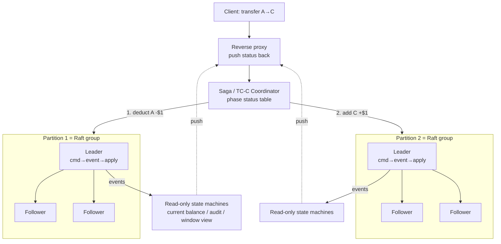
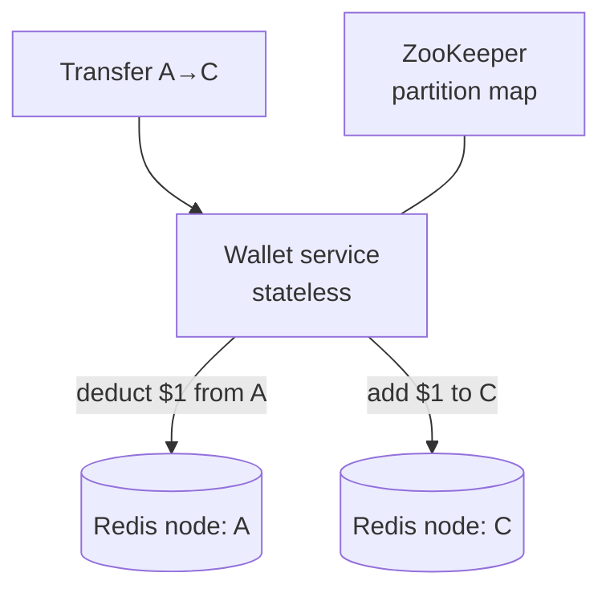
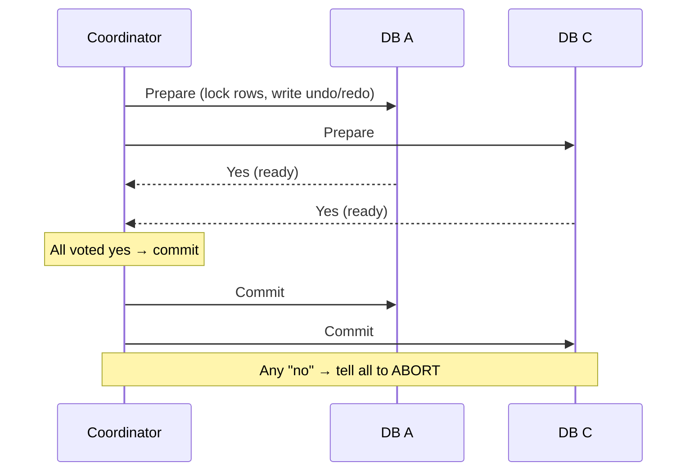
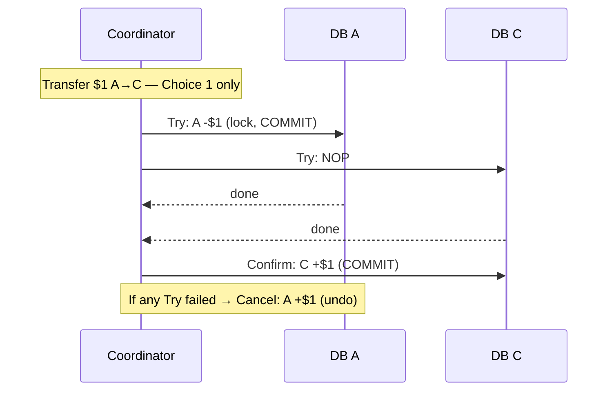
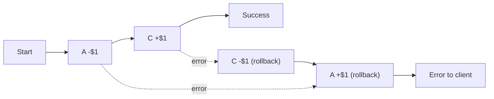
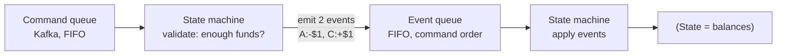
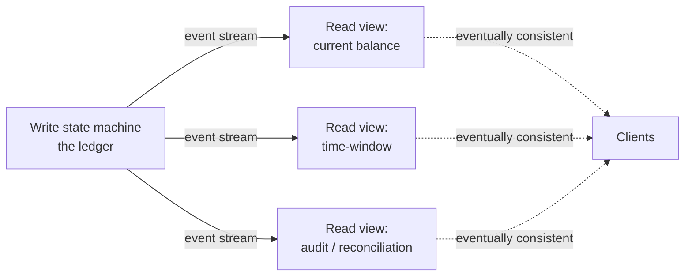
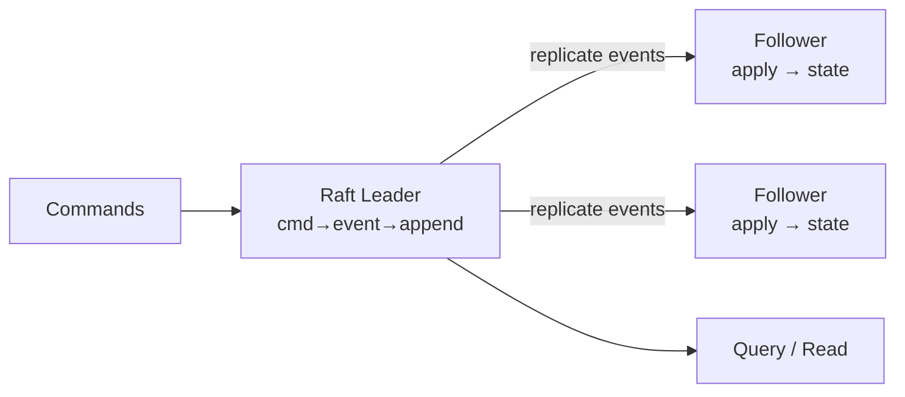
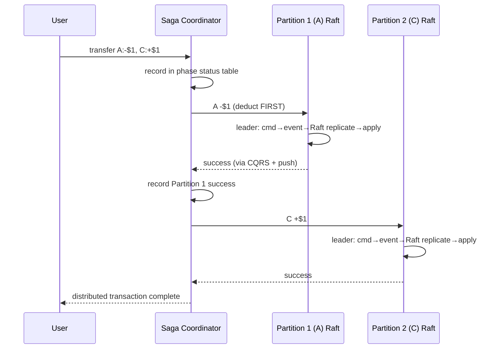

# Digital Wallet — System Design

**Difficulty:** Advanced
**Interview importance:** ⭐ **Critical** (the canonical "correctness at scale" money problem — the one that separates people who *say* "use a transaction" from people who can actually build atomicity across 2,000 nodes)
**References:** ByteByteGo *System Design Interview Vol. 2* — Ch. 12 *Design a Digital Wallet*; DDIA Ch. 7–9 (transactions, distributed transactions, consensus); Domain-Driven Design (event sourcing, CQRS)

---

## 0. Why This Design Matters

A digital wallet transfer looks like `A.balance -= 1; B.balance += 1`. It is not. That one line hides **the two hardest problems in distributed systems at once**: doing two writes on two different machines **atomically** (so money is never lost or created), and being able to **prove** — to an auditor, months later — that every balance is correct and *why* it changed.

It sits on the critical path of money movement, must be exactly right under **1,000,000 transfers per second**, and forces you to walk a real engineering progression: from a naive Redis map that loses money, through **2PC / TC-C / Saga** distributed transactions, to **event sourcing + CQRS** for reproducibility, to **file-based (mmap + RocksDB)** for speed, to **Raft-replicated event lists** for reliability. Interviewers love it because each step *fails for a specific reason* and the next step fixes exactly that reason.

> The one-line thesis: **a wallet is not a balance — it's an immutable, replayable log of events, and the "balance" is just a cached view you can always recompute.**

---

## 1. Problem Overview — in plain English

Build the backend for the operation that moves money **from one wallet to another wallet on the same platform** (PayPal → PayPal, not PayPal → bank). Wallet-to-wallet is fast and usually free because it never leaves the platform.

> **"Move $X from wallet A to wallet B — and never lose it, never duplicate it, and always be able to prove afterward exactly what happened."**

The hard part is **not throughput alone**. It's **correctness**:
- Money must never be **created** (add succeeds, deduct fails) or **lost** (deduct succeeds, add fails).
- The system must be **reproducible** — able to reconstruct *any* historical balance by replaying from the beginning. (Reconciling against bank statements tells you *that* there's a discrepancy; it can't tell you *how* it arose. Reproducibility does.)

Foreign exchange is **out of scope** — same currency, wallet to wallet.

### Real-world analogy — the accountant's ledger vs the whiteboard

Two ways to track money:

- **The whiteboard** (naive design): you write "A: $50, B: $30". Someone bumps you mid-write and you lose track — money vanishes or appears. You can never answer "what was A's balance last Tuesday?" because you only ever kept the *latest* number.
- **The accountant's double-entry ledger** (event sourcing): you never erase. Every movement is a new immutable line: `A -$1`, `B +$1`. Two entries per transfer, and **every line must sum to zero** — that's how accountants have caught fraud for 500 years. Want yesterday's balance? Replay the ledger up to yesterday. Suspect a bug? Re-run today's ledger with fixed code and compare.

The entire design is: *how do we make the accountant's ledger run at a million lines per second across thousands of machines, without ever losing a line?*

---

## 2. Functional Requirements

**Core**
- **Balance transfer between two wallets** — the single operation we design.
- **Deduplication** — the same transfer submitted twice (client retry) must apply **once** (idempotency via `transaction_id`).
- **Reproducibility / audit** — reconstruct historical balances by replaying events; verify current balances; re-run new code over old events to compare.

**Optional (name them, then defer)**
- Add money from a bank card, withdraw to bank, multi-currency + FX, spending limits, fraud scoring, statements. Say them, then scope down to *same-currency wallet-to-wallet transfer* — that's where the interesting distributed-systems problems live.

---

## 3. Non-Functional Requirements

| Requirement | Target | Why it dominates the design |
|---|---|---|
| Throughput | **1,000,000 TPS** | 2 ops/transfer → ~2M ops/sec → forces sharding into thousands of nodes |
| Correctness | **Atomic across two accounts** | The whole problem; money never created or lost |
| Reliability | **≥ 99.99%** | It's money; downtime and data loss are both unacceptable |
| Reproducibility | **Replay from t=0** | Auditors need *why* a balance changed, not just *that* it's wrong |
| Consistency | Strong on write path; **eventually consistent** reads | Write path is the ledger; read views (CQRS) lag and catch up |
| Durability | **No committed transfer ever lost** | Only the *event list* truly needs this guarantee |

> **Say this out loud in an interview:** *"Throughput is a distraction — sharding solves that. The real requirement is atomicity across two nodes plus provable reproducibility. Every design decision I make is chasing those two."*

---

## 4. Capacity Estimation (do the math)

Start from the classic large-scale prompt and let the numbers *choose the architecture*:

```text
Target throughput   = 1,000,000 transfers/sec  (1M TPS)
Ops per transfer    = 2   (deduct from A, add to B)
Total operations    = 2,000,000 ops/sec  (2M ops/sec)
```

**Ops/sec → node count.** A single relational DB node handles a few thousand transactional writes/sec. Take a middle-of-the-road **1,000 TPS/node**:

```text
2,000,000 ops/sec ÷ 1,000 ops/sec/node = 2,000 nodes
```

→ **~2,000 database nodes.** That's the headline conclusion: *no single machine, no single database — this is inherently a sharded, distributed-transaction problem.* And it tells you the whole game is **raising per-node TPS** to cut hardware cost:

| Per-node TPS | Nodes needed | Cost implication |
|---|---|---|
| 100 | 20,000 | Absurd — this is why naive designs fail |
| 1,000 | 2,000 | Baseline relational DB |
| 10,000 | 200 | The prize — what file-based + mmap buys you |

**What the numbers tell us:**
- Sharding is mandatory (throughput, not memory, is the constraint).
- The per-node design *matters enormously* — 10× per-node throughput is 10× fewer machines. This is why we eventually go **file-based (mmap, RocksDB)** to hit the machine's max I/O.
- A transfer touches **two shards** → cross-shard atomicity (distributed transactions) is unavoidable.

---

## 5. API Design

A single RESTful endpoint on the write path:

```http
POST /v1/wallet/balance_transfer
```
```json
{
  "from_account": "A",
  "to_account": "C",
  "amount": "1.00",
  "currency": "USD",
  "transaction_id": "6820f3e0-..."
}
```
```json
{
  "status": "SUCCESS",
  "transaction_id": "6820f3e0-...",
  "applied_at": "2026-08-23T10:01:00Z"
}
```

Two details interviewers check for:
- **`amount` is a string, not a float.** Floating point silently loses cents (`0.1 + 0.2 != 0.3`). Money is always decimal/integer-minor-units, transported as a string.
- **`transaction_id` is a client-supplied UUID for idempotency.** A network timeout makes the client retry; the same `transaction_id` must be recognized and applied **exactly once**. Without it, a retry double-charges.
- **`currency` is ISO 4217** (`USD`, `EUR`) — validated, even though FX is out of scope.

---

## 6. High-Level Architecture

The mature design is **event sourcing sharded into Raft groups**, coordinated by a Saga/TC-C coordinator. But you *earn* that picture by walking three designs. Here is where we land:



**The shape to remember:**
- **Coordinator** runs a Saga/TC-C across two partitions, **always deduct-before-add**, recording progress in a **phase status table** so it survives its own crash.
- Each **partition is a Raft group** — the event list is consensus-replicated so no committed transfer is ever lost (majority-up survives failures).
- Inside a group, the flow is **command → validate → event → apply** (event sourcing).
- **CQRS** read-only state machines rebuild views from the event stream; a **reverse proxy pushes** status back so the client sees near-real-time results instead of polling.

---

## 7. Deep Dive — The Three Designs (each fixes the last one's flaw)

### 7.1 Design 1 — In-memory sharding (Redis) → *fails on atomicity*

Balances are a `<user, balance>` map. One Redis node can't do 1M TPS, so shard: `partition = hash(accountID) % partitionCount`. **ZooKeeper** holds the partition count and node addresses (highly-available config). A **stateless wallet service** validates and applies transfers, updating two (usually different) Redis nodes.



**Why it fails:** the two updates are **not atomic**. If the wallet service crashes *after* deducting from A but *before* adding to C, $1 vanishes. Redis is also not durable enough for a ledger. We need both writes in **one atomic transaction** — which means a **distributed transaction**, because the two accounts live on two machines.

### 7.2 Design 2 — Distributed transactions → *fixes atomicity, fails on audit*

Replace each Redis node with a **transactional relational database**. A transfer still touches **two** databases, so we need a distributed transaction. Three families, in ascending order of how staff-level they are:

#### Two-Phase Commit (2PC) — database-level

The **coordinator** (wallet service) drives all DBs through two phases. Relies on the DB's **X/Open XA** support.



- **Fix:** genuinely atomic.
- **Problems:** **not performant** — rows stay **locked** across the network round-trip while the coordinator waits, and locks are *still held* when phase 2 starts. The **coordinator is a single point of failure** — if it dies between prepare and commit, participants are stuck holding locks (blocking). Locky + SPOF = wrong for 1M TPS.

#### Try-Confirm/Cancel (TC/C) — application-level compensating

A compensating transaction in two phases, but — unlike 2PC — **each phase is its own independent, committed transaction**. You implement the "undo" yourself in the app layer.



**Why only "Choice 1" (deduct on A in Try, add on C in Confirm)?**
- **Choice 2** (`NOP` on A, `+$1` on C in Try): if A's later step fails, someone could **spend C's $1** before Cancel claws it back → money created.
- **Choice 3** (`-$1` and `+$1` concurrently): if the add succeeds but the deduct fails, **money is created**.
- Only **deduct-before-add** is safe: worst case the money is *temporarily missing* (A+C = $0, an "unbalanced state"), which is fine because TC/C is app-driven and corrects it in Confirm or Cancel. **Never add first.**

**Surviving a restart — the phase status table.** Persist progress (in the DB of the account being **deducted from**): transaction id + content, per-DB Try status, second-phase name (Confirm/Cancel), second-phase status, and an **out-of-order flag**.

**Out-of-order execution:** a `Cancel` can arrive at a node *before* its `Try` (network reorder). Fix: a node may Cancel without a prior Try — it leaves an **out-of-order flag**; a later Try that sees the flag **returns failure** instead of applying.

TC/C is **database-agnostic** and allows **any order / parallel** execution → lower latency.

#### Saga — application-level, linear

The **de-facto standard in microservices**. Operations run in a fixed **sequence**, first→last, each its own committed transaction. On failure, **roll back in reverse order** with compensating transactions. For *n* operations you write **2n** (n forward + n compensating). Still **deduct-before-add**.



Coordination is either **Choreography** (services react to each other's events — decentralized, gets messy with many services) or **Orchestration** (one coordinator directs everyone — **preferred for a wallet**).

**TC/C vs Saga — the comparison to say out loud:**

| Axis | 2PC | TC/C | Saga |
|---|---|---|---|
| Level | Database (XA) | Application | Application |
| Isolation | Locks held across phases | No long locks | No long locks |
| Ordering | N/A | **Any order / parallel** | **Linear** (no parallelism) |
| Compensation | DB rollback | **Cancel phase** (explicit undo) | **Reverse-order rollback** |
| Coordinator SPOF | **Yes (blocking)** | Recoverable via phase table | Recoverable via phase table |
| Best when | Rarely — legacy | **Latency-sensitive, many services** | **Following microservice trends** |
| Audit? | No | No | No |

**The remaining flaw of *all* distributed transactions:** they still can't **audit**. You can't trace *why* a balance changed, or prove the logic is still correct after a code change. That's what pushes us to Design 3.

### 7.3 Design 3 — Event Sourcing → *fixes audit & reproducibility*

Event sourcing answers the three questions an auditor asks: (1) balance at any point in time? (2) are historical/current balances correct? (3) is the logic still correct after a code change? Four terms:

- **Command** — an *intended* action ("transfer $1 A→C"). Goes into a **FIFO queue** (order matters). May contain randomness/IO.
- **Event** — the **validated, deterministic fact** ("transferred $1 A→C", past tense). One command → zero or more events. Also stored **FIFO, in command order**.
- **State** — what an event changes (the balances map).
- **State machine** — the driver: (1) validates commands → generates events; (2) applies events → updates state. **Must be deterministic** (no random, no external IO) so replay always yields the identical result.



Wallet flow: transfer commands land in a **Kafka** FIFO queue; the state machine reads each command, reads balances, validates (sufficient funds?), and if valid emits **two events** (`A:-$1`, `C:+$1`), then applies each to update the DB. **Double-entry invariant: every transfer's events sum to zero** — that's your built-in correctness check.

**Reproducibility (the big win):** all changes are saved first as an **immutable event history**; the DB is merely the *current view*. Because events are immutable and the logic is deterministic, replaying from the start always reproduces the same historical states — answering all three audit questions (replay to any time; recompute to verify; run *different code versions* over the same events to compare).

#### CQRS — Command-Query Responsibility Segregation

Outside clients need to *read* balances. Instead of publishing state, event sourcing **publishes all events**, and the outside world rebuilds whatever view it needs: **one write state machine + many read-only state machines**, each deriving its own view (current balance; a time-window view to investigate a double-charge; an audit trail for reconciliation). Read-only machines **lag but catch up** → the system is **eventually consistent** on reads.



#### High-performance event sourcing (raising per-node TPS)

Naive event sourcing (remote Kafka + remote DB) is slow — network hops everywhere. Go **file-based** to hit the machine's max I/O:

- **File-based command & event lists** on local disk instead of remote Kafka — no network transit. **Append-only = sequential writes**, which are extremely fast (sequential disk can beat *random* memory access). Use **mmap** to write to disk and cache recent content in memory *simultaneously*.
- **File-based state:** replace the remote relational DB with a local **SQLite** (file-based relational) or **RocksDB** (local key-value store on a **log-structured merge-tree / LSM** — write-optimized, with a read cache). **RocksDB** is chosen.
- **Snapshot:** periodically pause the state machine and dump current state to a file (an immutable historical view). Replay can then resume from a snapshot instead of t=0. Finance often wants a **daily 00:00 snapshot**. Snapshots are big binary blobs → store in object storage like **HDFS**.

The cost: the node is now **stateful** and a **single point of failure** — which motivates the last step.

### 7.4 Reliable high-performance event sourcing (Raft)

**The key insight — data vs computation.** If the *data* is durable, computation can be re-run anywhere. Of the four data types (command, event, state, snapshot):
- **State and snapshot are regenerable** from events.
- **Command is *not* enough** — event generation may be non-deterministic (random/IO), so you can't safely regenerate events from commands.
- → **Only the event list needs a strong reliability guarantee.**

Replicate the event list with **Raft** consensus: no data loss, same relative order across nodes, as long as **more than half** the nodes are up (5 nodes tolerate 2 failures; 3 tolerate 1). Roles: **Leader, Candidate, Follower**. The **leader** takes commands, converts to events, appends locally, and Raft replicates to **followers**; all nodes apply the event list to update state (same events → same state).



**Failure handling:**
- **Leader crashes** → Raft elects a new leader. If the crash happened *before* commands became events, the client sees a timeout/error and **resends** to the new leader (safe — no event was committed).
- **Follower crashes** → easy; Raft retries until it restarts or is replaced.

### 7.5 Distributed event sourcing (scaling to 1M TPS)

Two limits remain: (1) CQRS request/response can be slow (client may have to **poll**); (2) one Raft group's capacity is limited → **shard** into many groups + distributed transactions.

**Pull vs push (client experience):**
- **Pull:** client polls the read-only state machine — not real-time; overloads if polled too often.
- **Pull + reverse proxy:** proxy forwards the command and polls status — simpler client, still not real-time.
- **Push ⭐:** the read-only state machine **pushes** status to the reverse proxy the moment it has the event — feels real-time, making each node group *synchronous* to external users.

**Sharding + distributed transaction:** partition by `hash(key) % N`. Each partition is its own **Raft node group**. Reuse **TC/C or Saga** across groups via a coordinator. Happy-path Saga transfer (A→C):



---

## 8. Failure Scenarios

| Failure | Handling |
|---|---|
| Wallet service crash mid-transfer (Design 1) | Non-atomic → money lost. **Fixed by** distributed transactions |
| Coordinator crash mid-TC/C or Saga | Recover from the **phase status table** and resume Confirm/Cancel or rollback |
| Out-of-order Cancel before Try | **Out-of-order flag** — the later Try sees it and returns failure |
| Unbalanced state during Try (A+C=$0) | Temporary and expected; corrected in Confirm/Cancel — invariant holds by the end |
| Raft leader crash | Re-election; client **resends** if command never became a committed event |
| Raft follower crash | Raft retries until restart/replacement; majority still serves |
| Duplicate transfer (client retry) | **Idempotency** via `transaction_id` — dedup, apply exactly once |
| Non-deterministic event generation | Why **events (not commands)** are the durable source of truth |
| Float precision loss | `amount` transported as **string / minor units**, never float |
| State/snapshot corruption | Regenerable — **replay events** from last good snapshot |

---

## 9. Common Mistakes

- **Adding before deducting.** The classic money-creation bug. Always **deduct-before-add** in TC/C and Saga.
- **Storing balances as floats.** Silently loses cents. Use decimal / integer minor units, string on the wire.
- **Treating Redis as the source of truth.** In-memory + async replication is fine for rate limiting, fatal for a ledger.
- **Forgetting idempotency.** Without `transaction_id` dedup, a retried timeout double-spends.
- **Making the state machine non-deterministic** (random IDs, `now()`, external calls inside apply). Breaks replay — the entire value of event sourcing evaporates.
- **Replicating *everything* with Raft.** Only the **event list** needs strong reliability; state and snapshots are regenerable. Replicating them wastes throughput.
- **Choosing 2PC for 1M TPS.** Locky + coordinator SPOF. It's the *textbook* answer, not the *scale* answer.
- **No phase status table.** A coordinator crash mid-transaction then leaves money in limbo with no way to recover.

---

## 10. Interview Q&A

**Beginner**

**Q: Why isn't sharded Redis enough?**
It gives throughput but not atomicity across two accounts, and it isn't durable enough for money. If the service crashes between the deduct and the add, $1 disappears. Money movement needs an atomic distributed transaction.

**Q: Why is `amount` a string and not a number?**
Floating point can't represent decimal money exactly (`0.1 + 0.2 != 0.3`), so it silently loses cents. We use decimal / integer minor units and transport it as a string.

**Intermediate**

**Q: Walk me through TC/C for a $1 transfer A→C.**
Try phase: `A -$1` as its own committed transaction, `C: NOP`. If both succeed, Confirm: `C +$1`. If any Try fails, Cancel: `A +$1` to undo. Crucially, **deduct before add** — the only ordering that can't create money; the worst case is the $1 being temporarily missing, which we correct in Confirm or Cancel.

**Q: 2PC vs TC/C vs Saga — when each?**
2PC is DB-level (XA), simple but holds locks across the network and has a blocking coordinator SPOF — wrong at scale. TC/C is app-level, allows any-order/parallel execution → low latency, good when latency-sensitive with many services. Saga is app-level but linear with reverse-order rollback → the microservice standard, good when you're following that trend or latency isn't critical.

**Q: How do you survive a coordinator crash mid-transaction?**
A persisted **phase status table** — transaction id/content, per-DB Try status, the second-phase name and status, and an out-of-order flag. On restart the coordinator reads it and resumes Confirm/Cancel or the Saga rollback.

**Advanced / Staff**

**Q: Why event sourcing instead of just storing balances?**
Balances alone can't answer an auditor: *why* did this change, was it always right, is the logic still correct after a code change? Event sourcing stores immutable events as the source of truth and treats the balance as a derived view. Because events are immutable and the state machine is deterministic, you can replay to any point in time, recompute to verify, and re-run new code over old events to compare — that's **reproducibility**, and it's why event sourcing is the de-facto wallet solution.

**Q: You have four data types — command, event, state, snapshot. Which must you replicate with Raft, and why only that one?**
Only the **event list**. State and snapshot are regenerable by replaying events. Command isn't sufficient because event generation can be non-deterministic (randomness/IO), so you can't safely reconstruct events from commands. Replicating only the events minimizes what consensus has to protect while still guaranteeing no committed transfer is lost.

**Q: How do you get from ~1,000 to ~10,000 TPS per node?**
Go file-based to hit the machine's max I/O: local append-only command/event logs via **mmap** (sequential writes beat random memory access, and mmap gives disk-write + memory-cache at once), **RocksDB** (LSM, write-optimized) for local state, and periodic **snapshots** to object storage so replay doesn't start from t=0. Fewer nodes, less hardware — the whole point of the estimation.

**Q: How does the client get a real-time result across sharded Raft groups?**
Pure CQRS is eventually consistent, so a naive client polls. Add a **reverse proxy** that the read-only state machine **pushes** status to the instant it has the event, making each group synchronous to the outside user. Across shards, a Saga/TC-C coordinator sequences the deduct-then-add, recording progress in the phase status table.

---

## 11. 30-Second Interview Answer

> "A wallet transfer is two writes on two shards, so the real problem is **atomicity across nodes** plus **provable reproducibility** — throughput is just sharding. I'd walk three designs: sharded Redis fails because the two updates aren't atomic; distributed transactions fix that — **2PC** is DB-level but locky with a coordinator SPOF, so I'd use **TC/C or Saga**, always **deduct-before-add**, with a **phase status table** to survive coordinator crashes. But distributed transactions can't audit, so the real answer is **event sourcing**: immutable commands → deterministic events → derived state, giving full replay and reproducibility, with **CQRS** for many read views. For performance I go **file-based — mmap logs, RocksDB, snapshots** — to raise per-node TPS, then replicate only the **event list with Raft** for durability, since state and snapshots are regenerable. To reach **1M TPS** I shard into many **Raft groups** coordinated by Saga/TC-C, with a **push-based reverse proxy** for near-real-time responses. Reads are eventually consistent; the write ledger is the truth, and every transfer's events sum to zero."

---

## 12. Mental Model

```text
TRANSFER (A → C)
   ↓ command (intended) → FIFO queue
   ↓ deterministic state machine: validate → EVENT (fact), sum = 0
   ↓ append event (Raft-replicated, majority-up)
   ↓ apply event → state (derived, regenerable)
   ↓ CQRS read views (eventually consistent) → push to client

ATOMICITY   → deduct-BEFORE-add, always
CROSS-SHARD → TC/C (parallel) or Saga (linear) + phase status table
TRUTH       → the EVENT LIST (only thing Raft must protect)
DERIVED     → state + snapshot (replay to rebuild)
SPEED       → file-based: mmap logs + RocksDB(LSM) + snapshots→HDFS
SCALE       → shard into Raft groups + coordinator
IDEMPOTENCY → transaction_id, apply exactly once
MONEY       → string/minor-units, never float
```

---

## 13. How This Connects to Other Topics

- **Distributed Rate Limiter** — both hinge on atomicity, but note the *opposite* tolerance: a rate limiter happily accepts async-replication lag and slight over-admission; a wallet **cannot** — that's the difference between an approximate counter and a ledger.
- **Stock Exchange (Ch. 13)** — the *same* toolkit reused for a different goal: **event sourcing + a single deterministic writer + Raft**. There it buys deterministic matching and microsecond latency; here it buys reproducibility and audit. Learn one, you're halfway to the other.
- **Distributed transactions (DDIA Ch. 9)** — 2PC/TC-C/Saga are the canonical answers; the wallet is the canonical *use case*.
- **Consensus / Raft (DDIA Ch. 9)** — "only the event log needs consensus" is the general lesson: replicate the minimal source of truth, regenerate the rest.
- **CQRS & event-driven architecture** — one write model, many read models; the read side lags and catches up (eventual consistency by design).
- **Double-entry bookkeeping** — the 500-year-old "sum to zero" invariant is your cheapest, strongest correctness check.
