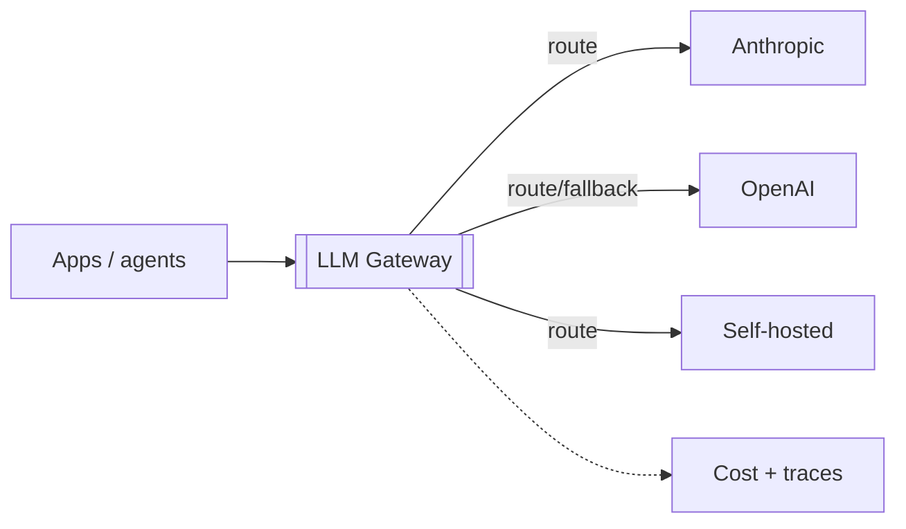
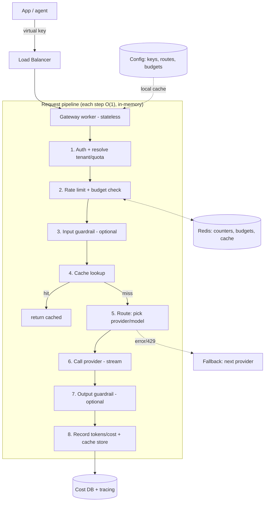

# LLM Gateway / Inference Platform — System Design

**Difficulty:** Advanced (AI infrastructure)
**Interview importance:** ⭐ High — the *platform* under all the agents; this is classic distributed-systems design (proxy, cache, rate limit, cost, reliability) wearing an AI hat. **Strongly favors a backend/staff engineer.**
**Companion:** `files/Agentic-AI/` (Ch 17 cost/latency), and `01-distributed_rate_limiter`, `04-url_shortener` (caching), DDIA replication.

---

## 0. Why This Design Matters

Every company running many AI features hits the same problem: dozens of apps calling LLM providers directly → no cost visibility, no shared caching, no rate limiting, no fallback when a provider has an outage, secrets sprayed everywhere. An **LLM gateway** is the single control point that fixes all of it. It's the question that lets *you* shine, because under the AI veneer it's a **rate-limited, cost-metered, cached, multi-provider reverse proxy with fallback and observability** — exactly your wheelhouse.

> Thesis: **it's a smart reverse proxy for LLM traffic — centralizing auth, rate limiting, caching, routing/fallback, cost accounting, and guardrails — so apps get reliability and the org gets control.**

---

## 1. Problem Overview — in Plain English

Build a service that sits between all your internal apps/agents and the LLM providers (Anthropic, OpenAI, self-hosted, etc.). Apps call the gateway with a unified API; the gateway handles **auth, rate limits, quotas, caching, model routing, provider fallback, cost tracking, guardrails, and observability**, then forwards to the right provider and streams the response back.

**Analogy — an API gateway for AI, or a corporate travel desk.** Instead of every team booking flights (calling providers) directly — no negotiated rates, no policy, no visibility — everyone goes through one desk that enforces budgets, gets volume discounts (caching), has backup airlines (fallback), and reports spend. The LLM gateway is that desk for model calls.



---

## 2. Functional Requirements

**Core**
- **Unified API** for chat/completions + streaming across providers.
- **AuthN/Z + virtual keys** per team/app (not raw provider keys in every app).
- **Rate limiting & quotas** per key/team/user (RPM + tokens-per-minute + budget).
- **Caching** — exact and/or semantic — to cut cost & latency.
- **Model routing** — pick provider/model by policy (cost/capability/availability).
- **Fallback / retries** across providers on error/rate-limit.
- **Cost tracking** — per request/team/app, with budgets and alerts.
- **Observability** — logs, traces, latency, token usage.
- **Guardrails** — optional shared input/output filters (PII, injection, moderation).

**Optional / advanced**
- A/B testing & canary of prompts/models; prompt/version registry; batching; multi-region; spend limits with hard cut-off.

---

## 3. Non-Functional Requirements

| Requirement | Target | Why |
|---|---|---|
| **Low added latency** | Gateway overhead ≪ model latency (single-digit ms) | It's on every AI call's critical path |
| **High availability** | 99.9%+; provider outage ≠ your outage | Fallback is the point |
| **Throughput** | Scale to all org AI traffic | Stateless horizontal scale |
| **Cost visibility & control** | Per-tenant accounting + budget caps | The core value prop |
| **Streaming** | First-class SSE/streaming passthrough | Chat UX needs it |
| **Security** | Provider keys never leave the gateway | Centralized secret management |

---

## 4. Capacity / Cost Estimation

(Illustrative.) Suppose the org does **10M LLM calls/day** across features.

- **QPS:** 10M / 86,400 ≈ **~115 avg, ~350 peak req/s** — modest for a stateless proxy; scale horizontally.
- **The gateway itself is cheap; the *provider spend* is the number that matters** — that's *why* the gateway exists (to see and cut it). A good cache hit rate can cut spend and latency dramatically.
- **Latency budget:** the model call is hundreds of ms to seconds; the gateway must add **only a few ms** (auth + rate check + cache lookup + route) — so those must be O(1) and in-memory (Redis), never a slow DB on the hot path.
- **State:** rate-limit counters, cache, and cost meters live in **Redis**; config (keys, routing rules, budgets) in a DB + local cache.

---

## 5. API & Interface

```jsonc
POST /v1/chat/completions   // unified request; provider-agnostic shape
  headers: Authorization: Bearer <virtual_key>
  body: { model, messages, stream?, tools?, max_tokens, ... }
  -> streamed or full response (normalized), + usage (tokens, cost, cache_hit, provider)

// control plane
PUT  /v1/keys/{id}          // create/rotate virtual keys, set quotas/budgets
PUT  /v1/routes            // routing rules (model aliases -> provider/model)
GET  /v1/usage             // cost/usage reports per key/team
```

**Virtual keys:** apps authenticate with a **gateway-issued key**, never a provider key. The gateway maps it to a team, quota, budget, and allowed models — so you can rotate, revoke, and meter per app centrally.

---

## 6. High-Level Architecture



**The gateway is a pipeline** of cheap, ordered steps. Note the ordering: **auth → rate limit → cache → route → call → meter** (reject/serve-from-cache before spending on a provider).

---

## 7. Deep Dive

### 7.1 Rate limiting & quotas (reuse `01`)
Per virtual key: **requests/min** *and* **tokens/min** (LLM limits are token-based, not just request-based) *and* a **budget** ($/day). Counters in **Redis with atomic ops** (a token-bucket/sliding-window — your rate-limiter file applies directly). Enforce **before** calling the provider so an over-budget team is rejected cheaply. This also protects you from your *own* apps looping.

### 7.2 Caching — exact + semantic (biggest cost lever)
- **Exact cache:** identical request (same model + messages + params) → return the stored response. Simple, safe, huge win for repeated prompts.
- **Semantic cache:** embed the request; if a past request is *semantically near* (cosine similarity over a threshold), return its cached answer. Powerful for FAQ-like traffic but risky (near ≠ same) — gate by threshold and use only where staleness/approximation is acceptable.
- **Also expose provider-native prompt caching** (Ch 17): reuse a stable system-prompt prefix at reduced cost — the gateway can insert cache breakpoints.
- **Cache key must include tenant/permissions** where responses are tenant-specific — never serve one tenant's cached answer to another.

### 7.3 Model routing & fallback (the availability core)
- **Routing policy:** map a virtual model alias (e.g. `"smart"`, `"fast"`) to a concrete provider/model by **cost, capability, latency, or availability** — so apps aren't hard-coded to one provider, and you can shift traffic centrally.
- **Fallback:** on **429 (rate limit)** or **5xx/timeout**, retry on the **next provider/model** in the policy (with backoff + jitter). This is what turns a provider outage into a non-event for your apps.

```mermaid
flowchart LR
    Req[Request: model="smart"] --> R{Primary provider}
    R -->|ok| Resp[Response]
    R -->|429/5xx/timeout| F{Fallback provider}
    F -->|ok| Resp
    F -->|also fails| Err[Return error - degraded]
```

### 7.4 Cost accounting (the value prop)
On every response, read the provider's **token usage**, compute cost from a price table, and record it per **request / key / team / app** (async, off the hot path). Power **dashboards, budgets, and alerts**. Enforce **hard budget caps** (reject when a tenant is over) and soft alerts. This visibility is *the* reason orgs build a gateway.

### 7.5 Streaming
Chat needs token streaming. The gateway must **stream provider output straight through** (SSE/chunked) while still metering usage at the end. Don't buffer the whole response (adds latency, risks timeouts). Handle the case where fallback must kick in *before* the first token.

### 7.6 Guardrails (optional shared layer, Ch 16)
Centralize input/output filters so every app inherits them: PII detection/redaction, prompt-injection heuristics, content moderation. Optional per-route, because they add latency.

---

## 8. Reliability & Production (your strength)
- **Stateless workers** behind an LB; all shared state (counters, cache, budgets) in **Redis**; config in a DB with a local in-memory cache refreshed via pub/sub (rate-limiter pattern).
- **Retries/backoff + fallback** across providers; **circuit breaker** per provider (stop hammering a down provider; route around it).
- **Timeouts** on every provider call; stream to avoid HTTP timeouts on long generations.
- **Redis failure policy:** decide fail-open (allow, lose rate limiting briefly) vs fail-closed (reject) per policy — same trade-off as the rate limiter.
- **Multi-region** for latency/HA; **config hot-reload** so routes/budgets change without redeploy.

---

## 9. Observability & Evaluation
- **Per-request trace:** tenant, model, tokens in/out/cached, cost, latency, cache hit, provider, fallback used, guardrail verdicts.
- **Dashboards & alerts:** spend per team, error/fallback rate per provider, cache hit rate, p99 gateway overhead, budget burn.
- **This is also where agent observability plugs in** (Ch 15) — the gateway is the natural place to capture every LLM call org-wide.

---

## 10. Trade-offs to Say Out Loud

| Axis | A | B | Choose by |
|---|---|---|---|
| Cache | Exact only (safe) | + Semantic (aggressive) | Correctness risk vs savings |
| Routing | Static per app | Policy-based (cost/avail) | Flexibility/HA → policy |
| Redis down | Fail-open | Fail-closed | Availability vs control |
| Guardrails | Always on | Per-route opt-in | Latency vs safety |
| Streaming | Buffer | Passthrough | UX/timeouts → passthrough |
| Multi-provider | Single | Fallback across many | Availability → fallback |

---

## 11. Failure Scenarios

| Scenario | Handling |
|---|---|
| Provider outage / 5xx | Fallback to another provider; circuit breaker |
| Provider rate-limits you (429) | Backoff + fallback; respect retry-after; your own client-side limits |
| One team drains the quota | Per-tenant rate limits + budget caps |
| Runaway app loops | RPM/TPM caps reject cheaply before provider spend |
| Redis down | Configured fail-open/closed; degrade gracefully |
| Cache serves wrong tenant's data | Tenant/permissions in the cache key |
| Long generation times out | Stream; per-call timeout; fallback before first token |
| Cost spike | Real-time cost metering + budget alert/cap |

---

## ❌ 12. Common Mistakes
- **Slow work on the hot path** (DB lookups per request) — auth/rate/cache must be O(1) in Redis; add only a few ms.
- **No fallback** → a single provider outage takes down every AI feature.
- **No per-tenant limits/budgets** → one app's loop bankrupts the org.
- **Provider keys in every app** → unrotatable, unmeterable, a security mess. Use virtual keys.
- **Semantic cache without a threshold** → serving "close but wrong" answers.
- **Cross-tenant cache leakage** — forgetting tenant in the cache key.
- **Buffering instead of streaming** — added latency and timeouts.
- **No cost accounting** — the whole reason the gateway exists.

---

## 13. LLD
```java
interface Gateway { Response handle(Request r, VirtualKey k); }        // the pipeline
interface Authenticator { Tenant resolve(VirtualKey k); }
interface RateLimiter { Decision check(Tenant t, int estTokens); }     // RPM + TPM + budget (Redis atomic)
interface Cache { Optional<Response> get(CacheKey k); void put(...); } // exact + semantic
interface Router { Provider pick(Request r, Policy p); }               // by cost/capability/availability
interface ProviderClient { Stream call(Request r); }                   // per provider adapter
interface CostMeter { void record(Tenant t, Usage u); }               // async, budgets/alerts
```
**Patterns:** Chain of Responsibility (the pipeline steps), Strategy (routing policy), Adapter (per-provider clients), Circuit Breaker (per provider). **Secret management**: provider keys live only in `ProviderClient`, never in apps.

---

## 14. Interview Q&A

**Beginner**
**Q: Why put a gateway in front of the providers at all?**
Centralization: one place for auth, rate limiting, caching, cost tracking, fallback, and guardrails. Without it, every app calls providers directly — no cost visibility, no shared cache, no protection when a provider goes down, and provider keys sprayed everywhere. The gateway gives the org control and the apps reliability.

**Q: How does it save money?**
Mainly caching — identical (and optionally semantically similar) requests return a stored answer instead of paying the provider again — plus routing cheap work to cheaper models and prompt-caching stable prefixes. And it *measures* spend per team so you can actually manage it.

**Intermediate**
**Q: How do you keep gateway overhead low?**
Every hot-path step is O(1) and in-memory: auth resolves a virtual key from a cached config, rate/budget checks are atomic Redis ops, the cache lookup is a Redis/vector hit — no synchronous DB on the request path. Cost metering and logging happen asynchronously after the response. Target a few ms of overhead against a model call that's hundreds of ms.

**Q: How does fallback work?**
Routing maps a model alias to a primary provider; on a 429 or 5xx/timeout, the gateway retries the next provider in the policy with backoff and jitter, and a circuit breaker stops sending to a provider that's consistently failing. For streaming, fallback must trigger before the first token is sent to the client. This turns a provider outage into a non-event.

**Advanced / Staff**
**Q: How do you stop one team from blowing the budget?**
Per-virtual-key limits on requests-per-minute AND tokens-per-minute AND a dollar budget, enforced in Redis before the provider is called, plus real-time cost metering with soft alerts and a hard cap that rejects once a tenant is over. This also contains a buggy app stuck in a loop — it gets rate-limited cheaply instead of running up a huge bill.

**Q: What are the caching pitfalls?**
Two big ones. Semantic caching can serve a "close but not the same" answer — so it needs a similarity threshold and only applies where approximation is acceptable. And cache keys must include the tenant/permissions, or you leak one tenant's response to another. Exact caching is the safe default; semantic is an opt-in optimization.

---

## 🎯 15. 30-Second Answer

> "An LLM gateway is a smart reverse proxy for all the org's model traffic. Apps use a gateway-issued virtual key, not provider keys. Each request runs a cheap in-memory pipeline: authenticate and resolve the tenant, check rate limits and budget in Redis, look up an exact/semantic cache, route to a provider/model by policy, call it (streaming through), then meter tokens and cost asynchronously. The wins are cost — caching plus per-tenant budgets and full spend visibility — and availability — fallback across providers with a circuit breaker so one provider's outage isn't yours. It's stateless and horizontally scaled, adds only a few ms, and it's the natural place to centralize guardrails and observability. Under the hood it's a rate limiter plus a cache plus a router — classic backend design."

---

## 🧠 16. Mental Model

```
App --(virtual key)--> GATEWAY pipeline:
  AUTH → RATE/BUDGET (Redis, atomic) → CACHE (exact/semantic) → ROUTE (policy) → CALL (stream) → METER (async)
  fallback across providers on 429/5xx (+ circuit breaker)
HOT PATH = O(1) in-memory (few ms overhead) · STATE = Redis · CONFIG = DB + local cache
VALUE = cost visibility + caching + per-tenant budgets + provider-outage resilience
= a rate limiter (01) + a cache (04) + a router, for LLM traffic
```

---

## 🔗 17. How This Connects
- **This is the platform under every other agent design (28–35)** — they all call models *through* something like this.
- Reuses your strongest files: rate limiting (`01`), caching/hot-key (`04`), replication/config-propagation (DDIA), and cost/latency (`Agentic-AI/17`).
- The natural home for org-wide agent **observability** (`Agentic-AI/15`) and shared **guardrails** (`Agentic-AI/16`).
