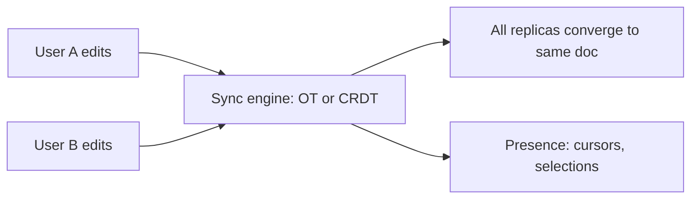
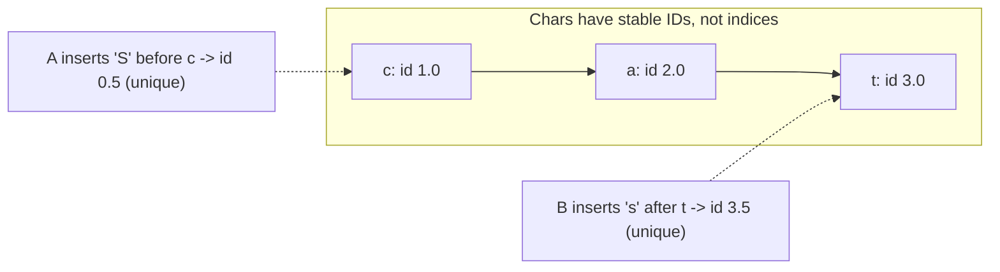
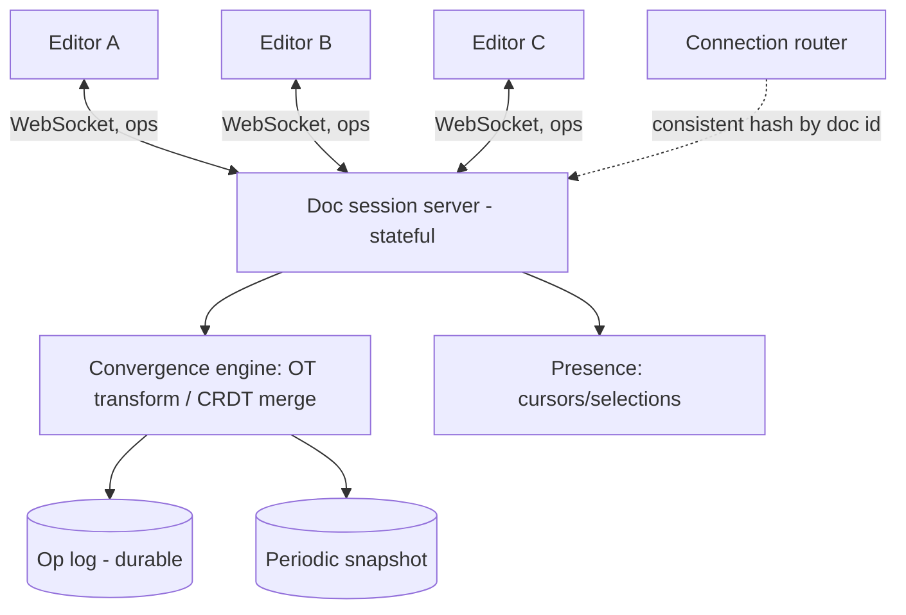

# Collaborative Editing (Google Docs) — System Design

**Difficulty:** Advanced
**Interview importance:** ⭐ High — the classic "real-time collaboration" question; teaches a concurrency-control technique (**OT / CRDT**) that appears nowhere else in system design.
**Core new tech:** **Operational Transformation (OT)** vs **Conflict-free Replicated Data Types (CRDTs)** for convergent concurrent editing.

---

## 0. Why This Design Matters

Multiple people typing into the *same document at the same time* is a concurrency problem no lock or transaction solves nicely — you can't lock a paragraph while someone types. The hard question is: when two edits happen concurrently at overlapping positions, how do all replicas **converge to the same final document** while **preserving each user's intent**? The answer is a family of algorithms (**OT** and **CRDTs**) built specifically for this — and knowing the difference is the whole point of the question.

> Thesis: **model edits as operations on a shared sequence; use OT (transform concurrent ops so they commute, needs a server to order them) or a CRDT (design the data so concurrent ops commute by construction, needs no central transform) to guarantee all replicas converge to the same state.**

---

## 1. Problem Overview — in Plain English

Build a system where many users edit one document simultaneously and each sees the others' changes in near-real-time, with the cursor and text staying consistent for everyone — no lost edits, no divergence, and it keeps working offline and re-syncs.

**Real-world analogy — a shared whiteboard with a coordinator.** If several people write on one whiteboard at once, chaos. Now imagine a coordinator who watches every pen stroke and, before applying yours, **adjusts its position** for strokes that happened concurrently (someone inserted a word to your left, so your stroke shifts right). Everyone ends up seeing the *same* board. That "adjust concurrent edits so they still make sense together" is Operational Transformation. CRDTs achieve the same end differently — by giving every character a permanent, orderable ID so there's never ambiguity about where it goes.



---

## 2. Functional Requirements

**Core**
- Multiple users **edit one document concurrently**; each sees others' edits in **near-real-time** (sub-second).
- **Convergence:** all users always end up with the **identical** document.
- **Intention preservation:** an edit does what the user meant even when others edit concurrently.
- **Presence:** show collaborators' cursors/selections and who's online.
- **Persistence + history:** the doc is durable; support undo/redo and version history.
- Work through brief **disconnects** and reconnect cleanly (offline edits merge).

**Optional / advanced**
- Rich text (bold, headings), comments, suggestions/track-changes, access control/sharing, very large docs.

---

## 3. Non-Functional Requirements

| Requirement | Target | Why it drives the design |
|---|---|---|
| **Convergence (correctness)** | Guaranteed identical state on all replicas | The core invariant — drives OT vs CRDT |
| **Latency** | Local edits feel instant; remote appear <1s | Optimistic local apply + WebSocket |
| **Concurrency** | Many editors, no lost updates | Can't lock; need commutative ops |
| **Availability / offline** | Edit while disconnected, merge on reconnect | Favors CRDT (no central coordinator needed) |
| **Durability** | No committed edit is ever lost | Persist the op log |
| **Scale** | Many concurrent docs; some with many editors | Shard by document |

---

## 4. Capacity Estimation

(Illustrative.) The unit of load is a **document with N active editors**, and the traffic is **small ops** (a keystroke = insert one char at position p), not big payloads.

- **High message rate, tiny messages:** each keystroke is an op broadcast to the other editors → for a doc with 10 editors, one keystroke fans out to 9. Volume of tiny messages is the challenge, not bytes.
- **Stateful connections:** each editor holds a **WebSocket**; the server holding a document's session is **stateful** (like the chat system). Route all editors of a doc to the **same server/session** (consistent-hash by doc id).
- **Storage:** the document state + an **operation log** (for history/undo and for late joiners to catch up). Ops are small; a compaction/snapshot keeps the log bounded.

---

## 5. The Core Problem — Why Naïve Approaches Fail

Represent the doc as a string; edits are operations: `insert(pos, char)` and `delete(pos)`.

**Naïve "last write wins" or send-the-whole-doc fails:**
- Two users insert at the same time → one overwrites the other (**lost update**), or positions get misaligned and text corrupts.

Concrete conflict — doc is `"cat"`, both act concurrently:
- User A: `insert(0, 'S')` → intends `"Scat"`.
- User B: `insert(3, 's')` → intends `"cats"`.

If B's op is applied on a replica that *already* applied A's insert, B's position `3` is now wrong (A shifted everything right by 1) → you get `"Scats"` on one replica but maybe `"Scats"` on another → **divergence**. The fix is to make concurrent ops **commute** so order doesn't matter. Two families do this:

---

## 6. Approach 1 — Operational Transformation (OT)

**Idea:** when you receive a concurrent op, **transform** it against the ops you've already applied so its effect is what the sender *intended* in your current state. Formally, define a transform `T(op_a, op_b)` such that applying them in either order yields the same result.

Example: A did `insert(0,'S')`; B's concurrent `insert(3,'s')` is **transformed** to `insert(4,'s')` on A's replica (shift right by 1 because A inserted before position 3). Now both replicas get `"Scats"`. Order no longer matters.

```mermaid
sequenceDiagram
    participant A as User A
    participant Srv as Server (orders + transforms)
    participant B as User B
    A->>Srv: insert(0,'S')
    B->>Srv: insert(3,'s')   %% concurrent
    Note over Srv: assign order; transform B's op against A's
    Srv-->>B: apply insert(0,'S')
    Srv-->>A: apply insert(4,'s')  %% transformed +1
    Note over A,B: both converge to "Scats"
```

- **Needs a central server** to impose a total order on ops and drive transforms against a known history (classic Google Docs / the old Google Wave used OT).
- **Optimistic UI:** the client applies its own edit **immediately** (feels instant), sends it to the server, and reconciles by transforming incoming ops — so latency is hidden.
- **Pros:** compact ops (just insert/delete + position), efficient over the wire, mature for text.
- **Cons:** the transformation functions are **notoriously hard to get right** (many edge cases; correctness bugs are famous), and it generally **assumes a central server** (harder for pure P2P/offline).

---

## 7. Approach 2 — CRDTs (Conflict-free Replicated Data Types)

**Idea:** design the data structure so concurrent operations **commute by construction** — no transformation needed, no central coordinator required. For text, use a **sequence CRDT** where **every character gets a unique, globally-ordered identifier** that never changes.

- Instead of a position index (which shifts), each char has an immutable ID that defines its order relative to neighbors (e.g. a fractional/position identifier "between" two existing IDs, plus a replica id + counter to break ties uniquely).
- **Insert** = create a char with an ID between its left and right neighbors' IDs. Two concurrent inserts "at the same spot" get **different unique IDs**, so both survive and their order is deterministic on every replica — convergence with no transform.
- **Delete** = mark the char as a **tombstone** (kept as metadata so concurrent ops referencing it still resolve), garbage-collected later.


Both inserts get unique IDs (`0.5`, `3.5`) → every replica orders them identically → `"Scats"`, no coordination.

- **No central server needed** for correctness → great for **offline editing and P2P**; a client can edit disconnected and merge later, because ops commute regardless of order or delay.
- **Pros:** simpler correctness argument (commutativity by design), robust offline/decentralized, powers modern libraries (**Yjs**, **Automerge**).
- **Cons:** **metadata overhead** — every character carries an ID; **tombstones** accumulate (need GC); historically higher memory, though modern CRDTs (Yjs) are highly optimized.

### OT vs CRDT — the comparison the interviewer wants

| | OT | CRDT |
|---|---|---|
| How it converges | **Transform** concurrent ops against history | Ops **commute by construction** (unique IDs) |
| Central server | Usually **required** (to order/transform) | **Not required** (works P2P/offline) |
| Op size / wire | Small (index + char) | Larger (IDs + metadata) |
| Correctness difficulty | Hard (transform edge cases) | Simpler to reason about |
| Memory | Low | Higher (IDs, tombstones → GC) |
| Used by | Google Docs (historically), Wave | Yjs, Automerge, Figma-style, many new tools |

> Interview line: *"OT transforms concurrent operations so they converge and typically needs a central server; CRDTs make the operations commute by construction using stable per-character IDs, so they converge with no central coordinator — better for offline/P2P at the cost of metadata overhead. Google Docs historically used OT; modern collaborative libraries like Yjs and Automerge use CRDTs."*

---

## 8. Architecture


- **WebSocket** per editor for low-latency bidirectional op exchange (like the chat system).
- **All editors of a doc → the same session server** (route by doc id via consistent hashing) so ordering/merge happens in one place (for OT) or is coordinated (for CRDT relay + persistence).
- **Op log** is the durable source of truth; **snapshots** (periodic materialized document state) bound recovery and let late joiners load a snapshot + replay recent ops instead of the whole history.
- **Presence** (cursors, who's online) is separate, ephemeral, high-frequency state — broadcast but not persisted.

---

## 9. Supporting Concerns

- **Optimistic local apply + reconcile:** apply your own edit instantly; send it; reconcile incoming ops (OT transform / CRDT merge). This is what makes typing feel local despite network latency.
- **Offline:** buffer ops locally; on reconnect, sync. CRDTs merge cleanly regardless of gap; OT must transform the backlog against server history.
- **Undo/redo:** per-user undo is subtle in collaboration (you undo *your* op, not others') — represented as inverse ops transformed/merged like any other.
- **History / versioning:** the op log gives fine-grained history; snapshots give named versions.
- **Rich text:** model formatting as attributes on ranges/characters (both OT and CRDTs extend to this).
- **Access control:** authz at the doc-session boundary (who can open/edit).

---

## 10. Failure & Edge Cases

| Scenario | Handling |
|---|---|
| Two concurrent inserts at same position | OT transforms positions / CRDT unique IDs → deterministic order, no loss |
| Client disconnects mid-edit | Buffer ops locally; resync on reconnect (CRDT merges; OT transforms backlog) |
| Session server holding the doc crashes | Recover from snapshot + op log on another server; clients reconnect (route by doc id) |
| Late joiner | Load latest snapshot + replay recent ops (not full history) |
| Op log grows unbounded | Periodic snapshot + compaction; GC CRDT tombstones |
| Huge doc / many editors | Shard by doc; cap editors per doc; sub-document granularity |
| Malicious/oversized op | Validate ops at the server boundary |

---

## ❌ 11. Common Mistakes
- **Proposing locking** ("lock the paragraph") — collaboration can't work with locks; you need commutative ops.
- **Last-write-wins / send whole doc** — lost updates and divergence.
- **Not naming OT vs CRDT** or not knowing the difference — this *is* the question.
- **Forgetting convergence + intention preservation** as the two required guarantees.
- **Ignoring the stateful-connection / route-editors-to-one-session** requirement.
- **No op log/snapshot** — no durability, no history, no crash recovery, painful late-join.
- **Underestimating CRDT tombstone/metadata GC** or **OT transform complexity**.

---

## 12. Trade-offs to Say Out Loud

| Axis | OT | CRDT | Choose by |
|---|---|---|---|
| Coordination | Central server | None needed | Offline/P2P → CRDT |
| Wire/op size | Small | Larger (IDs) | Bandwidth → OT |
| Memory | Low | Higher (tombstones) | Memory → OT |
| Implementation | Hard transforms | Commutative by design | Simplicity → CRDT |
| Ecosystem today | Google Docs legacy | Yjs/Automerge (modern) | Greenfield → often CRDT |

---

## 13. LLD
```java
interface Op { }                       // Insert(pos/id, char, attrs) | Delete(pos/id)
interface ConvergenceEngine {          // OT or CRDT implementation
    Op apply(Op local);                //   apply local op, return normalized op to broadcast
    void merge(Op remote);             //   integrate remote op (transform for OT / commute for CRDT)
    Document materialize();            //   current document state
}
interface OpLog { void append(Op o); List<Op> since(Version v); }   // durable source of truth
interface Snapshotter { Snapshot take(); Document load(Snapshot s); }
interface PresenceService { void update(Cursor c); }               // ephemeral, high-freq
interface DocRouter { SessionServer serverFor(String docId); }      // consistent hash → one session
```
**Patterns:** Strategy (OT vs CRDT engine behind one interface), event-sourced op log + snapshots, stateful-session routing (chat-like).

---

## 14. Interview Q&A

**Beginner**
**Q: Why can't you just lock the document (or the line) while someone edits?**
Because collaboration means people type at the same time — locking would block everyone else and destroy the experience. You need edits to apply concurrently and still converge, which means the operations must be designed to combine without conflict, not serialized by a lock.

**Q: What are the two guarantees the system must provide?**
Convergence (all replicas end at the identical document) and intention preservation (each edit still does what the user meant, even when others edited concurrently). Naïve last-write-wins violates both.

**Intermediate**
**Q: Walk me through the concurrent-insert problem and how OT solves it.**
Doc is "cat"; A inserts 'S' at 0, B concurrently inserts 's' at 3. On a replica that already applied A's insert, B's position 3 is now off by one because everything shifted right. OT transforms B's op against A's — turning insert(3,'s') into insert(4,'s') — so both replicas converge to "Scats". The server orders ops and drives the transforms, and clients apply their own edit optimistically for instant feedback.

**Q: How does a CRDT solve the same problem differently?**
It removes the ambiguity of positions. Every character gets a unique, immutable, globally-orderable ID; an insert creates a char with an ID between its neighbors. Two concurrent inserts "at the same spot" get different unique IDs, so every replica orders them identically with no transformation and no central coordinator. Deletes become tombstones. That's why CRDTs work offline and peer-to-peer.

**Advanced / Staff**
**Q: OT vs CRDT — when would you pick each?**
OT: compact ops, low memory, mature for centralized text editors — but the transform functions are hard to get correct and it assumes a central server. CRDT: converges by construction (easier correctness), works offline/P2P, and powers modern libraries like Yjs and Automerge — at the cost of per-character ID metadata and tombstone GC. I'd pick OT if I have a strong central server and want minimal wire/memory overhead; CRDT for offline-first, decentralized, or when I want simpler convergence guarantees. Google Docs historically used OT; a greenfield build today often uses a CRDT library.

**Q: How do you make it durable and let a new collaborator join a long-lived doc quickly?**
An append-only op log is the durable source of truth (also powering history and undo). Periodically materialize a snapshot of the document state. A late joiner loads the latest snapshot and replays only the recent ops since it, instead of the entire history — and snapshots plus compaction (and CRDT tombstone GC) keep storage bounded. On a session-server crash, another server recovers from snapshot + op log and clients reconnect, routed to it by doc id.

---

## 🎯 15. 30-Second Answer

> "Concurrent editing can't use locks — edits must apply simultaneously and still converge. Two guarantees matter: convergence (everyone ends identical) and intention preservation. Two algorithm families deliver them. Operational Transformation represents edits as insert/delete ops and transforms each incoming op against concurrently-applied ops so positions stay correct — it's compact but needs a central server and the transforms are hard to get right (classic Google Docs). CRDTs instead give every character a unique, orderable ID so concurrent ops commute by construction — no central coordinator, great offline/P2P, at the cost of ID metadata and tombstones (Yjs, Automerge). Architecturally it's WebSocket connections routed so all editors of a doc share one stateful session, an append-only op log as the durable truth plus periodic snapshots, optimistic local apply for instant feel, and separate ephemeral presence."

---

## 🧠 16. Mental Model

```
EDITS = ops on a sequence: insert / delete   (NOT locks, NOT whole-doc sends)
GOAL = converge (all replicas identical) + preserve intention
OT:   transform concurrent op against history so it commutes → needs central server, small ops, hard to implement
CRDT: every char has a unique stable ID → ops commute by construction → no coordinator, offline/P2P, metadata + tombstones (GC)
ARCH: WebSocket per editor · route all editors of a doc → one stateful session · op log (durable) + snapshots · optimistic local apply · presence separate/ephemeral
Google Docs = OT (historically) · Yjs/Automerge = CRDT (modern)
```

---

## 🔗 17. How This Connects
- **Stateful WebSocket sessions + route-by-id** = the **chat system** (`16`) pattern, applied to documents.
- **Op log + snapshots** = **event sourcing** (from the digital wallet `26` and DDIA's event-sourcing/CDC).
- **Convergence without coordination** connects to **CAP/consistency** (DDIA `02-distributed-data`): CRDTs are an AP, eventually-consistent design that still converges.
- **Consistent hashing** (`18`) routes a document's editors to one session server.
