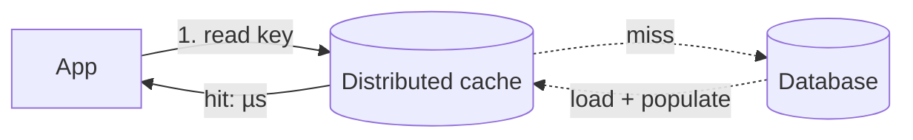
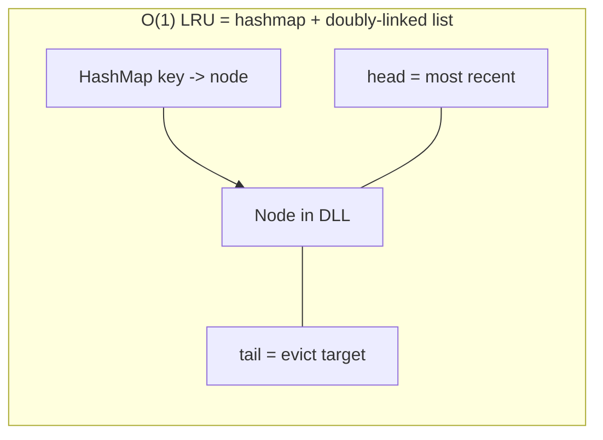
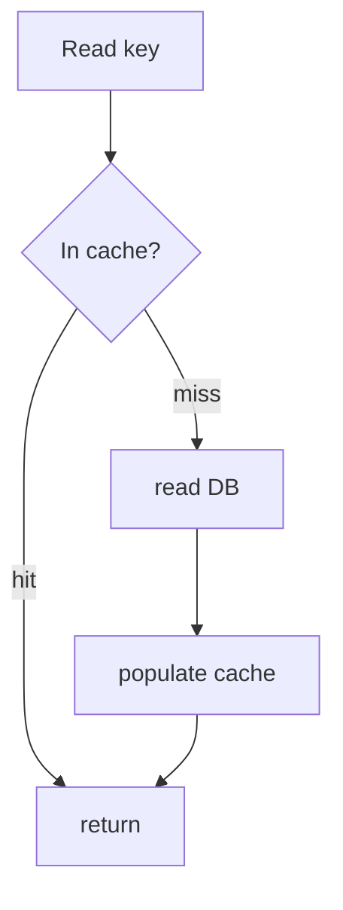
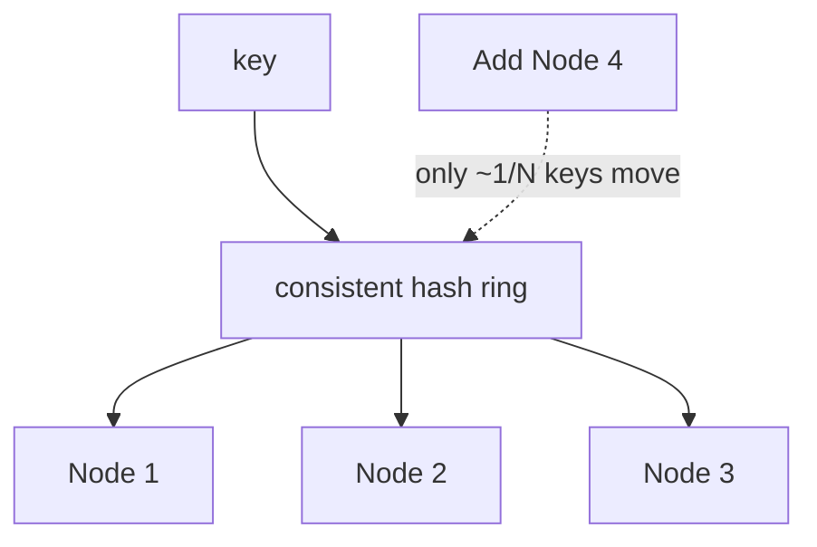
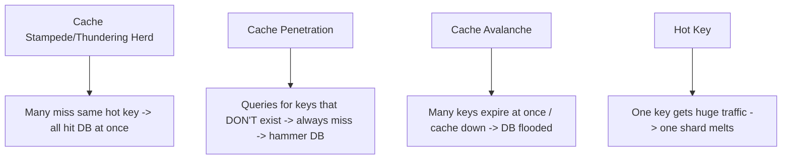
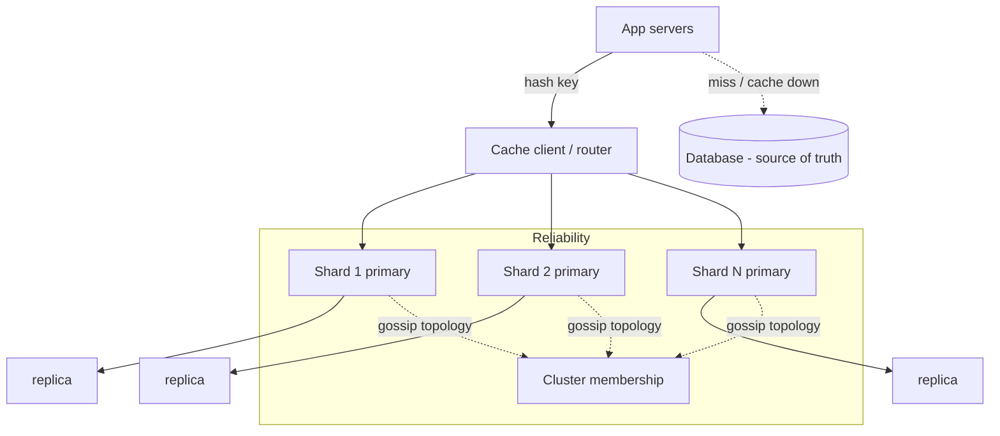

# Distributed Cache — System Design

**Difficulty:** Advanced
**Interview importance:** ⭐ **Critical** — you *use* a cache in almost every other design; this turns "I'll add Redis" into "I understand how a cache works." Teaches eviction, write/invalidation policies, distribution, and the classic cache failure modes.
**Core new tech:** **eviction policies (LRU/LFU/TTL/W-TinyLFU)**, **write & invalidation strategies**, **consistent-hash distribution**, and the **stampede/penetration/avalanche** problems.

---

## 0. Why This Design Matters

A cache is the single most-used performance lever in system design — but "just add a cache" hides the hard parts: **what to evict when full** (eviction policy), **how to keep it consistent with the DB** (write + invalidation strategy — famously one of the two hard problems in CS), **how to spread it across machines** (distribution), and **how it fails under load** (stampede, penetration, avalanche, hot keys). Designing the cache itself forces you to actually know these — and they make *every other* design's caching answer sharper.

> Thesis: **a cache is a fixed-size, fast key-value store that must decide what to keep (eviction), how to stay consistent with the source of truth (write/invalidation policy), how to scale across nodes (sharding + replication), and how to survive load spikes (stampede/penetration/avalanche defenses).**

---

## 1. Problem Overview — in Plain English

Build a distributed in-memory caching layer (think: designing Redis/Memcached, or the caching tier in front of a database) that stores hot key→value data in RAM across many nodes, serving reads in microseconds and reducing load on the slow, expensive backing store — while staying reasonably consistent and highly available.

**Real-world analogy — a chef's *mise en place*.** A chef keeps the most-used ingredients within arm's reach on the counter (RAM), not in the walk-in freezer (the database) across the kitchen. The counter is small, so they keep only what they're using now and clear what they haven't touched (eviction); when a recipe changes they refresh the prepped item (invalidation); and in a big kitchen each station has its own counter (distribution). A cache is *mise en place* for data.



---

## 2. Functional Requirements

**Core**
- `GET(key)`, `PUT(key, value, ttl?)`, `DELETE(key)`.
- **Eviction** when full (bounded memory).
- **TTL / expiry** of entries.
- **Distribution** across many nodes (data bigger than one machine's RAM; scale throughput).
- **High availability** (a node failure doesn't lose the whole cache).

**Optional / advanced**
- Atomic ops / counters, pub/sub, data structures (lists/sets/sorted-sets — Redis-style), persistence/snapshotting, near-cache (client-local L1).

---

## 3. Non-Functional Requirements

| Requirement | Target | Why it drives the design |
|---|---|---|
| **Latency** | Sub-millisecond reads | In-memory; O(1) lookups |
| **Hit rate** | High (the cache's whole value) | Drives eviction policy + sizing |
| **Throughput** | Millions of ops/sec | Sharding + replication |
| **Memory-bounded** | Fixed RAM per node | Must evict → eviction policy |
| **Availability** | Node failure survivable | Replication; graceful DB fallback |
| **Consistency w/ DB** | "Good enough," tunable | A cache is a copy → staleness is inherent |

---

## 4. Capacity Estimation

(Illustrative.) Say you must cache **1 TB** of hot data at **1M ops/sec**.

- **Memory → node count:** if a cache node holds ~64–128 GB RAM, 1 TB → **~10–16 nodes** (before replicas). Add replicas (×2) for HA/read throughput.
- **Throughput:** one node handles ~100K+ ops/sec (in-memory); 1M ops/sec → **~10+ nodes** — sharding is required for *both* memory and throughput.
- **What to cache:** you can't cache everything; cache the **hot set**. Cache value follows a Zipfian/Pareto distribution — a small fraction of keys serves most reads, so even a cache far smaller than the dataset gets a high hit rate.

---

## 5. Eviction Policies (what to remove when full)

The cache is bounded, so on a full `PUT` something must go. The policy decides *what*, and it directly determines the **hit rate**:

| Policy | Evicts | Good when | Weakness |
|---|---|---|---|
| **LRU** (Least Recently Used) | The entry not touched for the longest | General purpose; temporal locality | A one-off scan can flush the hot set |
| **LFU** (Least Frequently Used) | The least-often accessed | Stable popularity | Slow to adapt; old-popular sticks around |
| **FIFO** | Oldest inserted | Rarely ideal | Ignores access pattern |
| **TTL / expiry** | Anything past its time-to-live | Data with a natural freshness | Not an eviction-under-pressure policy by itself |
| **Random** | A random entry | Cheap, surprisingly OK | No smarts |
| **W-TinyLFU** (modern, e.g. Caffeine) | Combines recency + frequency via a small sketch | Best general hit rate in practice | More complex |

**LRU** is the default answer; implement in O(1) with a **hash map + doubly-linked list** (map key→node; move node to head on access; evict the tail). Mention **W-TinyLFU** (used by Caffeine, and Redis's LFU mode) as the modern high-hit-rate choice — it uses a frequency sketch (echoes the probabilistic structures in `38`) to avoid LRU's scan-flush weakness.



---

## 6. Write & Read Strategies (staying consistent with the DB)

A cache is a *copy* of data that lives authoritatively in the DB — so the key question is how writes propagate. Know these:

**Read pattern — Cache-Aside (lazy loading, the most common):**
1. App reads cache → **hit** → return.
2. **Miss** → app reads DB → populates cache → returns.
The app manages the cache; only requested data is cached. Simple and resilient (cache down ≠ app down). Downside: a miss pays DB latency, and there's a stale-window on updates.



**Write patterns:**
| Strategy | How | Pros | Cons |
|---|---|---|---|
| **Write-through** | Write cache **and** DB synchronously | Cache always fresh; no data loss | Slower writes; caches data that may never be read |
| **Write-back (write-behind)** | Write cache now, flush to DB **async** | Very fast writes; absorbs bursts | **Risk of data loss** if node dies before flush; complexity |
| **Write-around** | Write **DB only**; cache fills on read miss | Avoids caching write-only data | First read after write is a miss (stale/slow) |

**Invalidation (the hard problem):** on a DB write, the cached copy is now stale. Options:
- **TTL expiry** — simplest; accept staleness up to the TTL.
- **Explicit invalidation** — on write, **delete** the cache key (preferred over *updating* it, to avoid races) → next read repopulates. This "delete, don't update" rule avoids a classic race where a stale in-flight read writes back an old value after your update.
- **Versioning / generation keys** — bump a version so old entries are ignored.

> "There are only two hard things in computer science: cache invalidation and naming things." Name TTL + delete-on-write as your default, and note the read-after-write race (cache-aside + concurrent update can leave a stale value → mitigate with short TTL, delete-on-write, or versioning).

---

## 7. Distribution — Spreading the Cache Across Nodes

Data and traffic exceed one node, so partition keys across a cluster. **The mechanism is consistent hashing** (your file `18`): hash keys onto a ring so that adding/removing a node remaps only ~1/N of keys instead of everything — critical, because a naive `hash(key) % N` remaps *almost all* keys when N changes, causing a **mass cache miss → DB stampede**.


- **Client-side sharding** (Memcached model): the client library hashes and picks the node; simple, no coordination.
- **Cluster mode** (Redis Cluster): the cluster owns **16,384 hash slots**, `slot = CRC16(key) % 16384`, slots assigned to nodes; nodes gossip topology. (Same as the leaderboard design `25`.)
- **Replication:** each shard has replica(s) for **HA** and read scaling; on primary failure a replica is promoted. Redis replication is **asynchronous** → a failover can lose the last few writes (fine for a cache, not for a ledger).

---

## 8. The Classic Cache Failure Modes (name these — they're the differentiator)



| Problem | What happens | Defense |
|---|---|---|
| **Stampede / thundering herd** | A hot key expires; thousands of concurrent misses all recompute/hit the DB simultaneously | **Request coalescing** (one loader per key, others wait); a **mutex/lock** on recompute; **early/probabilistic refresh** before expiry; serve stale while refreshing |
| **Penetration** | Requests for keys that **don't exist** always miss → every one hits the DB | **Cache the negative result** (null with short TTL); a **Bloom filter** of existing keys to reject non-existent ones (`38`) |
| **Avalanche** | A large set of keys expires at the same instant, or the cache goes down → DB flooded | **TTL jitter** (randomize expiry); **staggered warming**; circuit-breaker + DB rate-limit; multi-layer cache |
| **Hot key** | One key (a celebrity, a viral item) overwhelms its single shard | **Replicate the hot key** across nodes; **client-local (near) cache** for it; split the key |

Also: **hot-key + consistent-hashing** interplay, and **cache warming** (pre-populate on startup to avoid a cold-cache stampede — a cold restart is an avalanche waiting to happen).

---

## 9. Architecture


- **Optional L1 near-cache** in the app process (tiny, per-instance) in front of the L2 distributed cache — cuts network hops for the very hottest keys (at the cost of per-instance staleness).
- **DB remains the source of truth**; the cache is an optimization layer that must **fail open** (a cache outage degrades to slower DB reads, not an outage) — with stampede protection so the DB isn't crushed on cache loss.

---

## 10. Consistency & Trade-offs
- A cache is **inherently eventually consistent** with the DB (it's a copy). Tune the staleness with TTL and invalidation strategy; strong consistency is possible (write-through + delete-on-write) but costs write latency and still races.
- **Fail-open vs fail-closed:** if the cache is down, do you hit the DB (fail-open, risks stampede) or reject (fail-closed, protects DB)? Usually fail-open **with** stampede protection. (Same trade-off as the rate limiter `01`.)
- **Redis vs Memcached:** Memcached = simple, multithreaded, pure LRU KV, client-side sharding — great as a plain cache. Redis = richer data structures, replication/cluster, persistence, single-threaded core, pub/sub — a cache *and* a data-structure server. Pick by whether you need structures/persistence.

---

## 11. Failure & Edge Cases

| Scenario | Handling |
|---|---|
| Cache node dies | Replica promoted; only that shard's keys briefly cold; consistent hashing limits blast radius |
| Cold cache after restart | Warm proactively; stampede protection so the DB survives the fill |
| Hot key melts a shard | Replicate the key / near-cache / split key |
| Mass expiry (avalanche) | TTL jitter; staggered refresh; DB rate-limit |
| Non-existent keys hammering DB | Negative caching + Bloom filter |
| Stale value after DB update | Delete-on-write (not update); short TTL; versioning |
| Cache/DB inconsistency race | Delete-on-write ordering; version keys; accept bounded staleness |
| Write-back node loses unflushed data | Accept for caches; never write-back for the source of truth |

---

## ❌ 12. Common Mistakes
- **"Just add Redis"** with no eviction/invalidation/failure story — that's the answer this question tests against.
- **`hash(key) % N` for distribution** → mass remap + DB stampede when N changes. Use **consistent hashing**.
- **Updating the cache on write** instead of **deleting** it → stale-value races.
- **No stampede protection** → a single hot-key expiry floods the DB (thundering herd).
- **Ignoring penetration** → non-existent-key queries bypass the cache to the DB.
- **Uniform TTLs** → avalanche when they all expire together (add jitter).
- **Treating the cache as the source of truth** (write-back for critical data) → data loss.
- **No fail-open plan** → cache outage becomes a full outage.

---

## 13. Trade-offs to Say Out Loud

| Axis | A | B | Choose by |
|---|---|---|---|
| Eviction | LRU (simple) | W-TinyLFU/LFU (higher hit rate) | Access pattern / hit-rate need |
| Write | Write-through (fresh) | Write-back (fast, lossy) / write-around | Freshness vs write latency vs loss risk |
| Invalidation | TTL (simple, stale) | Delete-on-write / versioning | Staleness tolerance |
| Distribution | Client-side (Memcached) | Cluster slots (Redis) | Simplicity vs features |
| Cache down | Fail-open (+ stampede guard) | Fail-closed | Availability vs DB protection |
| Layers | L2 only | L1 near-cache + L2 | Hottest-key latency vs staleness |

---

## 14. LLD
```java
interface Cache { Optional<V> get(K k); void put(K k, V v, Duration ttl); void delete(K k); }
interface EvictionPolicy { K victim(); void recordAccess(K k); }        // LRU/LFU/W-TinyLFU (O(1))
interface WriteStrategy { void write(K k, V v); }                        // through / back / around
interface CacheRouter { Node nodeFor(K k); }                             // consistent hashing
interface Loader<K,V> { V load(K k); }                                    // cache-aside miss loader (coalesced)
interface StampedeGuard { V getOrLoad(K k, Loader<K,V> l); }             // single-flight per key
```
**Patterns:** hashmap+DLL for O(1) LRU, consistent-hash routing (`18`), single-flight/request-coalescing (stampede), cache-aside, negative caching + Bloom (penetration).

---

## 15. Interview Q&A

**Beginner**
**Q: What is cache-aside and why is it common?**
The app checks the cache first; on a hit it returns, on a miss it reads the DB, populates the cache, and returns. The app owns the cache, only requested data gets cached, and if the cache is down the app still works by hitting the DB. Its downsides are miss-latency and a staleness window on updates.

**Q: The cache is full and you need to add a key — what do you remove?**
Whatever the eviction policy says. LRU (least recently used) is the default — evict the entry untouched longest — implemented O(1) with a hashmap plus a doubly-linked list. LFU or the modern W-TinyLFU can give a higher hit rate by considering frequency, not just recency.

**Intermediate**
**Q: On a DB update, should you update the cache or delete it?**
Delete it. Updating the cache invites a race: a slow concurrent read can write back a stale value *after* your update, leaving the cache wrong. Deleting the key means the next read repopulates from the fresh DB value. Combine with a TTL as a backstop, or versioned keys for stronger guarantees.

**Q: Why consistent hashing instead of hash(key) % N?**
Because `% N` remaps almost every key when you add or remove a node, so the whole cache misses at once and the stampede hits the DB. Consistent hashing (a hash ring) remaps only ~1/N of keys on a membership change, keeping most of the cache valid. Redis Cluster uses 16,384 hash slots for the same reason.

**Advanced / Staff**
**Q: A hot key's entry just expired and 10,000 requests miss simultaneously — what happens and how do you prevent it?**
That's a cache stampede / thundering herd — all 10,000 recompute or hit the DB at once and can take it down. Defenses: request coalescing / single-flight (the first miss loads, the rest wait for that result), a per-key mutex on recompute, probabilistic early refresh (refresh slightly before expiry so it never fully expires under load), and serving stale-while-revalidate. I'd also jitter TTLs so many hot keys don't expire together (avalanche).

**Q: How do you keep a cache outage from becoming an app outage?**
Fail open: on cache miss or cache down, fall through to the DB — the DB is the source of truth, the cache is an optimization. But fail-open under a full cache loss risks stampeding the DB, so I pair it with stampede protection (coalescing, DB rate-limit, circuit breaker) and cache warming on restart. For a critical DB, I might fail-closed on part of the traffic. It's the same fail-open/closed trade-off as a rate limiter, decided by whether an overloaded DB or a degraded feature is worse.

---

## 🎯 16. 30-Second Answer

> "A distributed cache is a bounded, in-memory KV layer in front of the DB, and designing it means answering four things. Eviction: what to drop when full — LRU by default (O(1) via hashmap + doubly-linked list), or W-TinyLFU for a better hit rate. Consistency with the DB: cache-aside for reads; on writes, delete the key rather than update it to avoid stale-value races, backed by TTLs. Distribution: consistent hashing (or Redis Cluster's 16,384 slots) so adding a node remaps only ~1/N of keys instead of stampeding the DB, plus replicas for HA. And failure modes: stampede (coalesce requests, early refresh), penetration (negative-cache + Bloom filter), avalanche (jitter TTLs), and hot keys (replicate/near-cache). The DB stays the source of truth and the cache fails open with stampede protection."

---

## 🧠 17. Mental Model

```
Cache = bounded in-memory KV in front of the DB (source of truth), fails OPEN
EVICT (full)   → LRU (hashmap + DLL, O(1)) | LFU | W-TinyLFU (best hit rate)
READ           → cache-aside: hit? return : load DB → populate
WRITE          → through (fresh) | back (fast, lossy) | around ; INVALIDATE = DELETE key (not update) + TTL
DISTRIBUTE     → CONSISTENT HASHING (not %N!) + replicas ; Redis Cluster = 16,384 slots
FAILURE MODES  → Stampede (coalesce/early-refresh) · Penetration (neg-cache + Bloom) · Avalanche (TTL jitter) · Hot key (replicate/near-cache)
```

---

## 🔗 18. How This Connects
- **Consistent hashing** (`18`) is the distribution mechanism; **Bloom filter** (`38`) defends penetration; **W-TinyLFU** uses a frequency sketch (`38`).
- Cache-aside, stampede, hot-key, CDN all appear in `04-url_shortener` — this design is the *general theory* behind that file's caching sections.
- **Fail-open/closed** mirrors the **rate limiter** (`01`); **async replication can lose writes** mirrors the KV store (`19`) and DDIA replication.
- Redis specifics reappear in the **leaderboard** (`25`, sorted sets) and **rate limiter** (`01`, atomic ops) — same engine, different use.
