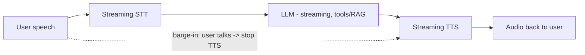
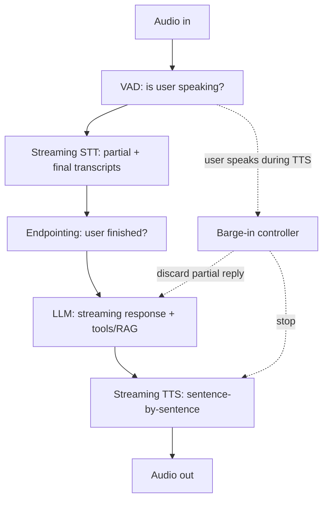
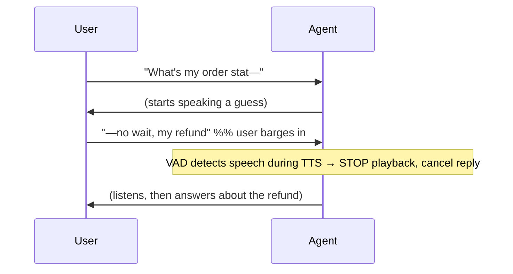
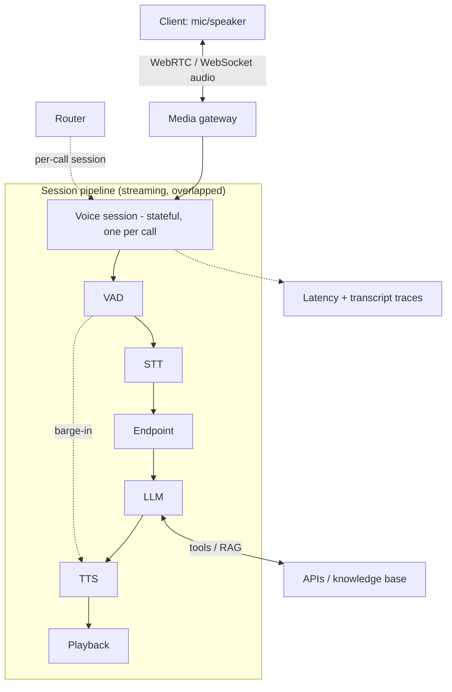

# Voice AI Agent (Real-Time Voice Assistant) — System Design

**Difficulty:** Advanced (agentic AI + real-time systems)
**Interview importance:** ⭐ High and rising — voice agents (support lines, assistants) are a hot product area; this is the one agentic design where **latency is the dominant constraint**.
**Core new tech:** **streaming STT → LLM → TTS pipeline**, **sub-second latency budgets**, **turn-taking / barge-in (interruption)**, VAD, WebRTC transport.

---

## 0. Why This Design Matters

Every other agent design optimizes for correctness or cost; a voice agent lives or dies on **latency and turn-taking**. Humans expect a reply within ~a few hundred milliseconds; a 3-second pause feels broken, and if the agent can't be **interrupted mid-sentence** (barge-in) it feels robotic. So the whole system is a **low-latency streaming pipeline** — speech-to-text, LLM, text-to-speech — where you overlap stages and shave milliseconds everywhere, while still doing real agent work (tools, RAG) underneath.

> Thesis: **a voice agent is a streaming STT → LLM → TTS loop engineered for sub-second response and natural turn-taking — stream every stage, detect when the user starts/stops talking, and support barge-in.**

---

## 1. Problem Overview — in Plain English

Build a real-time voice assistant: the user speaks, the system understands, thinks (possibly using tools/knowledge), and speaks back — fast enough to feel like a conversation, and interruptible like a real one.

**Real-world analogy — a great phone interpreter.** They start translating *while* you're still finishing your sentence (streaming), know exactly when you've stopped so they don't talk over you (turn detection), and if you cut in they stop immediately and listen (barge-in). A bad interpreter waits for silence, pauses awkwardly, and talks over you. The engineering is all about being the *great* interpreter.



---

## 2. Functional Requirements

**Core**
- Capture user **audio** in real time; transcribe to text (**STT**).
- **Understand + respond** with an LLM (with tools / RAG for real tasks).
- Convert the reply to **speech** (**TTS**) and stream it back.
- **Turn-taking:** know when the user has finished speaking (endpointing) before responding.
- **Barge-in:** if the user starts talking while the agent is speaking, **stop and listen**.
- Maintain **conversation context** across turns.

**Optional / advanced**
- Multiple languages, voice cloning, emotion/tone, phone (SIP/telephony) integration, background-noise handling, function calls (book, look up), fallback to human.

---

## 3. Non-Functional Requirements

| Requirement | Target | Why it drives the design |
|---|---|---|
| **End-to-end latency** | **~800 ms–1 s** perceived response | The dominant constraint — stream every stage |
| **Turn-taking accuracy** | Detect end-of-speech fast, few false cuts | Natural conversation; over/under-eager both bad |
| **Barge-in** | Interrupt within ~100–200 ms | Feels responsive/human |
| **Streaming** | First audio out ASAP (low time-to-first-byte) | Perceived latency > total latency |
| **Reliability** | Handle drops, noise, silence | Real audio is messy |
| **Concurrency** | Many simultaneous calls | Each call is a stateful session |

---

## 4. The Latency Budget (this *is* the design)

The response must feel instant. Budget the ~1 s round trip across the pipeline, and **overlap** stages instead of running them serially:

```text
User stops speaking
  → endpoint detection (VAD)         ~100–300 ms
  → final STT transcription           (mostly already streamed)
  → LLM first token                  ~200–500 ms   ← usually the biggest chunk
  → TTS first audio chunk            ~100–300 ms
  → audio playback begins           ────────────────
  Target: first sound back within ~800 ms of the user finishing
```

Key latency techniques:
- **Stream every stage.** STT emits partial transcripts as the user talks; the LLM starts generating from the (near-)final transcript; TTS starts speaking the LLM's **first sentence** while the LLM is still generating the rest; playback starts on the first audio chunk. Stages **overlap** — you don't wait for each to fully finish.
- **Time-to-first-token/audio matters more than total.** The user hears *something* fast; the rest streams. So optimize first-token latency (smaller/faster model for the first response, prompt caching of the system prompt).
- **Speculative / eager start:** begin LLM inference on a high-confidence partial transcript before the user fully stops, cancel if they keep talking.

---

## 5. The Pipeline Components



- **VAD (Voice Activity Detection):** cheaply detects speech vs silence — drives when to start STT and when the user has stopped (endpointing). Also the trigger for barge-in.
- **STT (Speech-to-Text):** streaming ASR emitting *partial* transcripts live and a *final* once the utterance ends. (Tech: Deepgram, AssemblyAI, Whisper-streaming, Google/Azure STT.)
- **Endpointing / turn detection:** decides the user has finished (a short trailing silence, or a smarter semantic endpointer that knows "…and that's it" vs a mid-thought pause). Too eager → cuts the user off; too slow → laggy.
- **LLM:** the brain — streaming generation, with **tools** (look up an order, book a slot) and **RAG** for grounded answers, exactly like your other agents. Stream tokens out.
- **TTS (Text-to-Speech):** streaming synthesis; feed it the LLM's output **sentence by sentence** so audio starts before the full reply exists. (Tech: ElevenLabs, Cartesia, PlayHT, Azure/Google TTS.)
- **Barge-in controller:** if VAD detects the user speaking while TTS is playing, **immediately stop playback**, discard the in-flight reply, and switch to listening.

---

## 6. Turn-Taking & Barge-In (what makes it feel human)

The hardest UX problem isn't understanding — it's **knowing when to talk**.

- **Endpointing:** a fixed silence threshold (e.g. 500–800 ms) is simple but clumsy (people pause mid-sentence). Better: a **semantic/ML endpointer** that predicts turn-completion from prosody + partial text, so it waits through "um, let me think…" but responds promptly after a complete thought.
- **Barge-in:** while the agent speaks, keep listening. If the user starts talking (VAD fires above a threshold, filtering out the agent's own audio via echo cancellation), **stop TTS within ~100–200 ms**, cancel the current LLM/TTS work, and process the new input. Without this, the agent talks over the user — the #1 "feels like a robot" failure.



---

## 7. Architecture


- **Transport:** **WebRTC** (low-latency, handles jitter/packet loss, echo cancellation) for browser/app; **SIP** for phone lines. WebSocket for simpler cases.
- **Stateful session per call** (like chat/collab): holds the conversation, pipeline state, and streams. Route a call to one session server; scale horizontally across calls.
- **The LLM stage is a normal agent** underneath — tools, RAG, guardrails all apply; voice just wraps it in a real-time audio pipeline.

---

## 8. Failure & Edge Cases

| Scenario | Handling |
|---|---|
| Background noise / cross-talk | VAD + noise suppression; echo cancellation so the agent doesn't hear itself |
| User pauses mid-sentence | Semantic endpointing (don't cut them off on a natural pause) |
| Agent talks over user | Barge-in: stop TTS on detected speech |
| STT mistranscription | Ask to confirm on low confidence; LLM tolerant of ASR errors |
| High LLM latency | Filler/acknowledgement ("let me check…") while working; smaller model for first response |
| Network jitter/packet loss | WebRTC handles; buffer minimally (buffering adds latency) |
| Long tool call (slow backend) | Speak a "one moment" filler; stream result when ready |
| Silence / user hangs up | Timeout; graceful end |

---

## ❌ 9. Common Mistakes
- **Serial pipeline** (wait for full STT → full LLM → full TTS) → multi-second lag. **Stream and overlap** every stage.
- **No barge-in** → the agent talks over people; feels robotic.
- **Naïve fixed-silence endpointing** → cuts users off mid-thought or lags.
- **Optimizing total latency instead of time-to-first-audio** — the user cares when they hear *something*.
- **Forgetting echo cancellation** → the agent's own voice triggers its VAD.
- **Treating it as "just STT + ChatGPT + TTS"** without the real-time/turn-taking engineering.
- **Ignoring that the LLM stage is still a full agent** (tools, RAG, guardrails).

---

## 10. Trade-offs to Say Out Loud

| Axis | A | B | Choose by |
|---|---|---|---|
| Pipeline | Cascaded STT→LLM→TTS | Speech-to-speech model (end-to-end) | Flexibility/control vs raw latency |
| Endpointing | Fixed silence | Semantic/ML | Naturalness vs simplicity |
| First response | Strong model | Fast small model for first tokens | Latency vs quality |
| Transport | WebSocket | WebRTC/SIP | Simplicity vs real audio robustness |
| Latency vs quality | Bigger model | Smaller/faster | Perceived responsiveness |

> Note the emerging alternative: **end-to-end speech-to-speech models** (audio in → audio out, no separate STT/LLM/TTS) cut latency further and preserve tone, at the cost of the modularity/tool-control the cascaded pipeline gives you. Mention both.

---

## 11. LLD
```java
interface VoiceSession { void onAudioChunk(byte[] pcm); }              // per call, stateful
interface VAD { boolean isSpeech(byte[] pcm); }                        // + barge-in trigger
interface StreamingSTT { void feed(byte[] pcm); Stream<Partial> out(); Final finalize(); }
interface Endpointer { boolean userFinished(Transcript t, Prosody p); }
interface Agent { Stream<Token> respond(Transcript t, Context c); }    // tools + RAG underneath
interface StreamingTTS { Stream<byte[]> speak(Stream<String> sentences); }
interface BargeInController { void onUserSpeech(); }                   // stop TTS + cancel reply
```
**Patterns:** streaming pipeline with overlapped stages, per-call stateful session (chat-like), Strategy (cascaded vs speech-to-speech), cancellation/barge-in.

---

## 12. Interview Q&A

**Beginner**
**Q: Why is latency the central problem for a voice agent?**
Because conversation has a rhythm — people expect a response within a few hundred milliseconds, and a multi-second pause feels broken. Text chat tolerates a spinner; voice doesn't. So the whole design is a low-latency streaming pipeline optimized for how fast the user hears *something* back.

**Q: What's barge-in and why does it matter?**
Barge-in is the user interrupting the agent while it's talking — the agent must stop immediately and listen. Without it, the agent talks over you, which instantly feels robotic. You detect it with voice-activity detection during playback and cut the TTS within ~100–200 ms.

**Intermediate**
**Q: How do you get the response latency under ~1 second?**
Stream and overlap every stage instead of running them serially: STT emits partial transcripts live, the LLM starts generating from the near-final transcript, TTS speaks the first sentence while the LLM is still producing the rest, and playback starts on the first audio chunk. I optimize time-to-first-audio specifically — a fast model for the first tokens, prompt-cached system prompt — because the user cares when they first hear something, not the total.

**Q: How do you decide the user has finished speaking?**
Endpointing. A fixed trailing-silence threshold is simple but cuts people off on natural mid-sentence pauses, so I use a semantic/ML endpointer that combines silence with prosody and partial-text cues to distinguish "I'm thinking" from "I'm done." Too eager interrupts the user; too slow feels laggy — it's a real tuning problem.

**Advanced / Staff**
**Q: Cascaded pipeline vs end-to-end speech-to-speech — trade-offs?**
Cascaded (STT → LLM → TTS) is modular: I can plug in tools, RAG, guardrails, swap components, and inspect the transcript — at the cost of latency accumulating across stages and losing tone/emotion in the text bottleneck. End-to-end speech-to-speech models take audio in and emit audio out, cutting latency and preserving prosody, but they're harder to ground with tools and to control/observe. For a task agent that must call APIs and stay grounded, I'd lean cascaded (heavily streamed); for a low-latency chit-chat companion, speech-to-speech is compelling.

**Q: It's still an agent underneath — how does that part work?**
The LLM stage is a normal agent loop: it can call tools (look up an order, book a slot), use RAG for grounded answers, and is bounded and guarded like any agent (Ch 4/6/16). Voice just wraps that agent in a real-time audio pipeline. For slow tool calls I speak a short filler ("one moment") so the line isn't dead, then stream the result when it's back.

---

## 🎯 13. 30-Second Answer

> "A voice agent is a real-time streaming pipeline: voice-activity detection → streaming speech-to-text → an LLM agent (with tools and RAG) → streaming text-to-speech → playback, all overlapped so the user hears a response within about a second. The two things that make it feel human are turn-taking — a semantic endpointer that knows when the user actually finished rather than cutting them off on a pause — and barge-in — stopping the agent's speech within ~150 ms when the user starts talking. I optimize time-to-first-audio (fast first-token model, prompt caching), transport over WebRTC for low latency and echo cancellation, run one stateful session per call, and remember the LLM stage is still a full agent that must be grounded and guarded. The emerging alternative is an end-to-end speech-to-speech model — lower latency, but less tool control."

---

## 🧠 14. Mental Model

```
PIPELINE (streamed + OVERLAPPED): VAD → streaming STT → endpoint → LLM (tools/RAG, streaming) → streaming TTS → playback
LATENCY is king: target ~1s; optimize TIME-TO-FIRST-AUDIO (fast first-token model + prompt cache); overlap stages
HUMAN FEEL: endpointing (semantic, don't cut off) + BARGE-IN (stop TTS <200ms on user speech; echo-cancel)
TRANSPORT: WebRTC/SIP · one stateful SESSION per call · LLM stage is still a full agent
ALT: end-to-end speech-to-speech (lower latency, less tool control)
```

---

## 🔗 15. How This Connects
- The **LLM stage is a normal agent** — tools/RAG/guardrails from `Agentic-AI/` Ch 4, 6, 16.
- **Stateful per-connection session + route-by-id** = the chat (`16`) / collaborative-editing (`37`) pattern.
- **Latency budgeting + streaming** = the cost/latency chapter (`Agentic-AI/17`) taken to the real-time extreme.
- Under a fleet of calls, model calls go through an **LLM gateway** (`34`).
