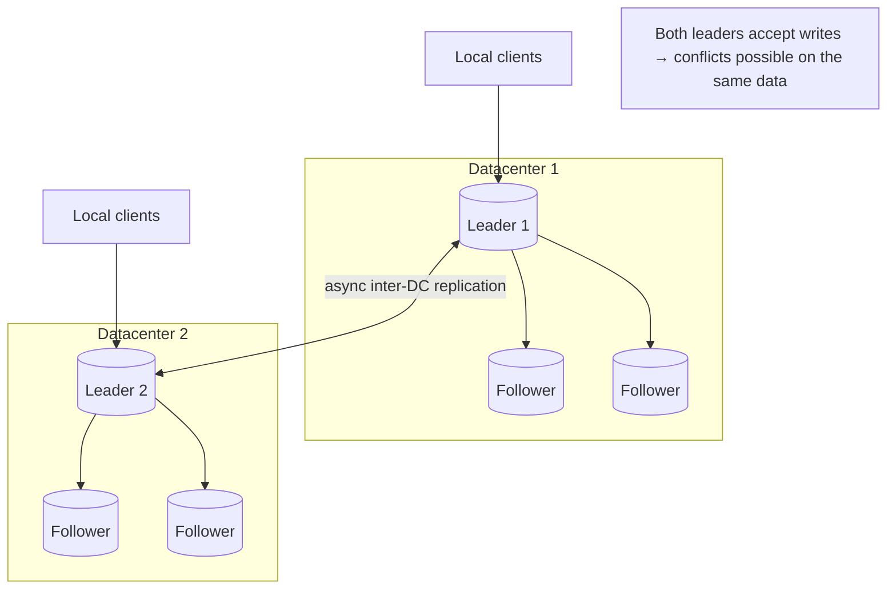
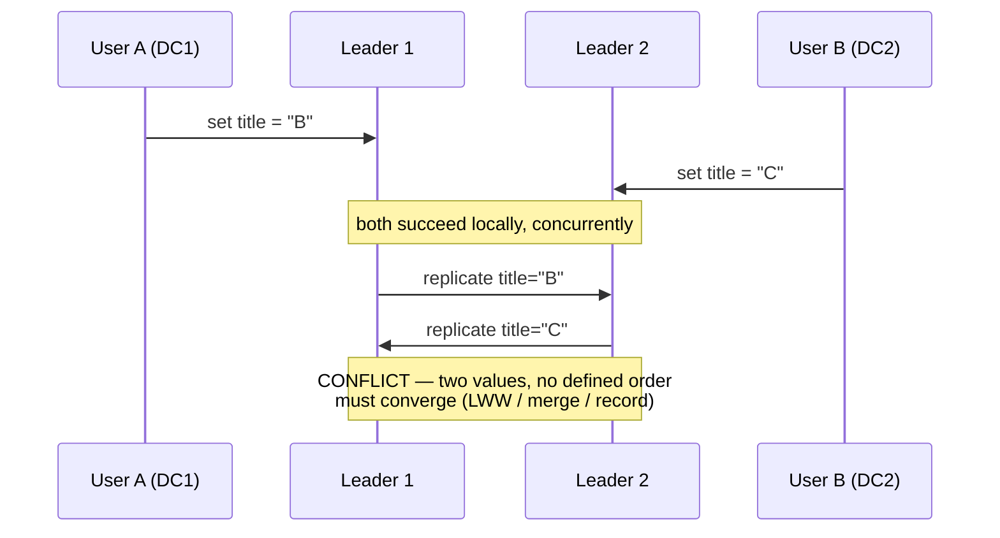
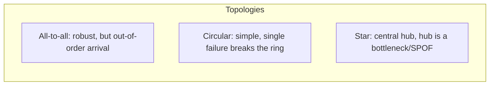

# Multi-Leader Replication

**Prerequisites:** Topics 10, 11
**Difficulty:** Advanced
**Interview importance:** High
**Source:** Chapter 5 — "Multi-Leader Replication"

---

## 1. What Is It?

**Multi-leader replication** (master–master, active/active) allows **more than one node to accept writes.** Each leader also acts as a follower to the other leaders: it processes their writes and forwards its own.

The single-leader model has one node ordering all writes. Multi-leader relaxes that — several nodes accept writes concurrently, and they replicate to each other. The price of that relaxation is the entire subject of this file: **write conflicts.**

---

## 2. Why Does It Exist?

Single-leader has one glaring limitation: **every write must go to the one leader.** If a client can't reach that leader — because of network issues, or because it's on the other side of the world — it can't write at all.

Multi-leader exists for three situations where "all writes to one node" is unworkable:

1. **Multi-datacenter operation.** With one leader, every write from every datacenter must cross the internet to the leader's datacenter. High latency for distant users, and a total write outage if that datacenter is unreachable. With a leader *per datacenter*, writes are handled locally and replicated asynchronously between datacenters. Better performance (writes are local), better datacenter-outage tolerance (each keeps working independently), better tolerance of network problems between datacenters (async replication absorbs blips).

2. **Clients with offline operation.** An app that must work with no internet — a calendar on your phone. Each device is effectively a leader with a local database; changes sync when connectivity returns. The replication lag between devices can be hours or days. Architecturally this is exactly multi-leader (each device is a datacenter of one).

3. **Collaborative editing.** Google Docs, etc. Multiple people edit simultaneously; each person's local changes apply instantly and sync to others. This is a multi-leader replication problem in miniature — apply changes locally with low latency, replicate asynchronously, resolve conflicts.

The catch, stated plainly by the book: multi-leader replication is often considered dangerous territory to be avoided if possible, precisely because of conflicts.

---

## 3. Simple Explanation

Many editors, each accepting changes, syncing to each other.

The moment two editors change **the same thing at the same time** without having seen each other's change, you have a **conflict** — two "true" values for one piece of data, and no built-in authority to say which wins. Single-leader never had this problem because one node decided the order. Multi-leader trades that away for local writes, and now conflict resolution is *your* problem.

Everything hard about multi-leader is conflict handling.

---

## 4. Real-World Analogy

**A shared document edited on paper by teams in two offices, faxing changes to each other.**

Each office edits its own copy instantly (local writes, low latency). Periodically they fax changes across (async replication). Usually fine. But if both offices edit the *same sentence* on the same day before the faxes cross, you get two contradictory versions of that sentence — a conflict. Someone has to decide the rule for reconciling them: last one wins? merge both? flag for a human? That decision is conflict resolution, and there's no universally right answer.

---

## 5. Technical Explanation

### Multi-datacenter topology

Within each datacenter, ordinary single-leader replication runs (leader + followers). Between datacenters, each datacenter's leader replicates asynchronously to the others.

Compared with single-leader across datacenters, multi-leader wins on:

- **Performance:** writes are processed in the local datacenter, then replicated async. The inter-datacenter delay is hidden from users.
- **Tolerance of datacenter outages:** each datacenter operates independently; a failed datacenter's writes catch up when it recovers.
- **Tolerance of network problems:** inter-datacenter traffic goes over the public internet, which is less reliable than an intra-datacenter network. Single-leader is very sensitive to that link (every write crosses it synchronously). Multi-leader with async replication tolerates it much better — a temporary interruption doesn't block writes.

But the big downside: **the same data may be concurrently modified in two datacenters, and those conflicts must be resolved.** Multi-leader is often retrofitted onto databases as an add-on, which means it interacts badly with other features — autoincrement keys, triggers, integrity constraints. For this reason it's often considered dangerous and avoided if possible.

### Handling write conflicts — the core problem

**Synchronous vs asynchronous conflict detection.** In single-leader, the second writer blocks or aborts. In multi-leader, both writes succeed locally, and the conflict is only detected later, asynchronously, when the writes replicate to each other — at which point it may be too late to ask the user to resolve it. You *could* detect conflicts synchronously (wait for the write to replicate to all leaders before confirming), but that throws away multi-leader's main advantage — letting each node accept writes independently. If you want synchronous conflict detection, just use single-leader.

**Conflict avoidance.** The simplest strategy: **avoid conflicts entirely** by ensuring all writes for a particular record go through the *same* leader. E.g., route all of a given user's writes to their "home" datacenter. Then, from that user's perspective, it's effectively single-leader. This works well and is the most common approach — but it breaks down when you need to change a record's home leader (datacenter failure, or the user moved), at which point conflicts reappear.

**Converging toward a consistent state.** Single-leader applies writes in a defined order, so the last write determines the final value. Multi-leader has no defined write order, so **different leaders might apply writes in different orders and end up with different final values** — which is unacceptable. Every replication scheme must ensure all replicas **converge** to the same final value. Ways to achieve convergent conflict resolution:

- **Last write wins (LWW):** give each write a unique ID (timestamp, long random number, UUID), pick the highest as the winner, discard the rest. Popular but **data-losing** — it silently drops the other concurrent writes, which may have been just as valid. And it depends on ordering writes by timestamp, which requires trustworthy clocks (Topic 21 — they aren't).
- **Highest replica wins:** give each replica a unique ID; writes from higher-numbered replicas win. Also loses data.
- **Merge the values:** concatenate or otherwise combine them (e.g., "B/C" if two writers set "B" and "C"). Preserves data but may produce nonsense.
- **Record the conflict** in an explicit data structure that preserves all information, and write application code that resolves it later (possibly prompting the user).

**Custom conflict resolution logic.** Most multi-leader tools let you write custom resolution code, executed either **on write** (as soon as a conflict is detected in the replicated change log — runs in the background, can't prompt the user) or **on read** (conflicting versions are stored, and the next read returns all of them for the application or user to resolve — as CouchDB does).

Note conflict resolution usually applies at the level of an individual row or document, not a whole transaction — a transaction that makes several writes is treated as several separate conflicts.

**Automatic conflict resolution — the research frontier.** The book mentions three promising approaches:

- **CRDTs (Conflict-free Replicated Data Types):** data structures (sets, maps, ordered lists, counters) that can be concurrently edited and **automatically merge sensibly**, resolving conflicts in reasonable ways. Used in Riak.
- **Mergeable persistent data structures:** track history explicitly (like Git) and use a three-way merge function.
- **Operational transformation (OT):** the algorithm behind collaborative editors like Google Docs, designed for concurrent editing of an ordered list of items (the characters in a document).

**What is a conflict?** Some conflicts are obvious (two writes to the same field). Others are subtle: two people book the same meeting room at the same time for overlapping slots — each booking is a separate record, so there's no field-level conflict, yet it's still a conflict at the application level. Detecting these requires application awareness.

### Multi-leader replication topologies

A **topology** describes the paths along which writes propagate between leaders. With two leaders it's trivial. With more, options include:

- **All-to-all:** every leader sends its writes to every other leader. Most general.
- **Circular:** each node forwards to the next, in a ring. (MySQL default.)
- **Star:** one designated root forwards to all others.

In circular and star topologies, a write must pass through several nodes to reach all leaders, so nodes forward writes received from others. To prevent infinite loops, each write is tagged with the identifiers of the nodes it has passed through; a node ignores a write already tagged with its own identifier.

**A problem with circular and star topologies:** a single node failure can interrupt the flow of replication messages, requiring reconfiguration. All-to-all avoids that single-node dependency.

**But all-to-all has its own fault:** messages can arrive in the wrong order at different nodes due to variable network delays. If one node inserts a row and another updates it, but the update arrives at a third node *before* the insert, the update fails (nothing to update). This is a **causality** problem — the update causally depends on the insert. Timestamps alone are insufficient to fix it (clocks can't be trusted). The proper fix is technique like **version vectors** (below / Topic 13). The book notes that conflict detection in many multi-leader systems is, unfortunately, often poorly implemented — check what your database actually guarantees.

### Version vectors (also relevant to leaderless — Topic 13)

To track which writes are concurrent versus which causally follow others, you use **version numbers per replica** — a collection called a **version vector** (a per-replica generalization of a version number). Each replica tracks its own version and the versions it has seen from others. This lets the system distinguish "this write is newer" from "these writes are concurrent and conflict." Version vectors are what make principled conflict detection possible; LWW-by-timestamp is the cheap, lossy alternative.

---

## 6. Diagrams







---

## 7. Concrete Example

**A globally distributed note-taking app with offline support.**

A user edits notes on their laptop (offline on a flight) and phone. Each device is a leader with a local copy.

- Writes apply instantly on each device — great UX, no waiting for a server.
- On reconnect, devices sync (async replication with hours of lag).
- If the same note was edited on both devices, that's a conflict.

Design choices: for note *bodies*, a CRDT (like a text CRDT) merges character-level edits automatically. For a note's *single-value fields* (e.g., a reminder time), you might record the conflict and surface both to the user. For app-level constraints (a note can only be in one folder), you need custom logic.

This maps cleanly to the book: each device is a leader, sync is async multi-leader replication, and the whole design effort is conflict handling — avoided where possible (route a note's edits through one device when online), merged automatically where a CRDT fits, and surfaced to the user where it can't be.

---

## 8. When to Use / Not Use

**Use multi-leader when:** you genuinely need writes accepted in multiple locations — multiple datacenters with local write latency, offline-capable clients, collaborative editing; you can define a sensible conflict resolution strategy for your data; you can often *avoid* conflicts by routing a record's writes to one leader.

**Avoid multi-leader when:** you can get away with single-leader (usually you can); conflicts on your data have no sensible automatic resolution and can't be surfaced to a user; correctness can't tolerate the data loss of LWW; you'd be bolting it onto a database as an add-on and inheriting all the autoincrement/trigger/constraint hazards.

The book's honest default: **avoid multi-leader if you can.** Reach for it only when the specific need (multi-DC writes, offline, collaboration) is real.

---

## 9. Advantages & Disadvantages

**Advantages**
- Writes accepted locally in each datacenter → **low write latency** for distant users.
- **Datacenter/network fault tolerance** — each region keeps accepting writes independently.
- Enables **offline operation** and **collaborative editing**.
- No single write bottleneck across regions.

**Disadvantages**
- **Write conflicts** — the defining problem, with no universally correct resolution.
- **LWW loses data**; merging can produce nonsense; recording conflicts pushes work to the app/user.
- **Convergence is not automatic** — you must ensure all replicas reach the same state.
- **Causality hazards** in all-to-all topologies (out-of-order arrival).
- Interacts badly with autoincrement keys, triggers, and integrity constraints.
- Generally considered dangerous and hard to reason about.

---

## 10. Trade-off Table

| Conflict strategy | Preserves data? | Complexity | When to Use |
|---|---|---|---|
| Conflict avoidance (route to one leader) | N/A (no conflicts) | Low | Whenever possible — the preferred approach |
| Last write wins (LWW) | **No — silently drops writes** | Low | Only when losing concurrent writes is acceptable |
| Merge values | Yes, but may be nonsensical | Medium | Simple mergeable fields |
| Record conflict, resolve on read/write | Yes | Medium–high | When app/user can adjudicate |
| CRDTs | Yes, sensibly | Medium (if a CRDT fits your data) | Sets, counters, maps, ordered lists |
| Operational transformation | Yes | High | Collaborative text editing |

| Topology | Advantages | Disadvantages |
|---|---|---|
| All-to-all | No single point of failure | Out-of-order message arrival (causality bugs) |
| Circular | Simple | One node down breaks the ring |
| Star | Simple central control | Hub is a bottleneck and SPOF |

---

## 11. Failure Scenarios

| Scenario | Consequence | Handling |
|---|---|---|
| Concurrent writes to same record | Conflict | Avoid (route to one leader), or converge via LWW/merge/record |
| LWW picks the "wrong" write | Silent data loss | Prefer conflict recording or CRDTs where loss is unacceptable |
| Clock skew across leaders | LWW ordering is wrong | Don't trust wall clocks (Topic 21); use version vectors |
| Update arrives before its insert (all-to-all) | Update fails / applies to nothing | Version vectors to enforce causal order |
| Ring node fails (circular topology) | Replication flow interrupted | Reconfigure the ring; prefer all-to-all |
| Record's home leader must change | Conflicts reappear where avoidance held | Careful migration; expect and handle conflicts during the switch |
| App-level conflict (double room booking) | No field conflict, but a real one | Application-aware detection; constraints checked centrally |

---

## 12. Production Considerations

- **Prefer conflict avoidance.** Route all writes for a record through one leader; you get most of multi-leader's benefits without most of its pain.
- **Never assume LWW is safe.** It loses data by design. Use it only where that's acceptable, and know that timestamp ordering across machines is unreliable.
- **Check what your database actually guarantees.** The book warns conflict detection is often poorly implemented in multi-leader add-ons.
- **Use version vectors, not timestamps,** for principled causal/conflict tracking.
- **Watch inter-datacenter lag** — it can be minutes, and it's when conflicts and staleness concentrate.
- **Beware autoincrement keys, triggers, constraints** — they often don't behave under multi-leader.
- **CRDTs where they fit** are the cleanest automatic resolution; evaluate whether your data maps to one.

---

## ❌ 13. Common Mistakes

- **Choosing multi-leader when single-leader would do.** It adds a whole class of hard problems.
- **Trusting LWW.** It silently discards concurrent writes and relies on clocks you can't trust.
- **Assuming replicas converge automatically.** They don't — different apply orders diverge unless you enforce convergence.
- **Ignoring causality in all-to-all topologies.** Out-of-order arrival breaks insert-then-update sequences.
- **Using autoincrement primary keys** across leaders — collisions and reuse.
- **Only detecting field-level conflicts** and missing application-level ones (double booking).
- **Forgetting the home-leader migration problem** — avoidance breaks exactly when a datacenter fails, which is when you needed it.

---

## 🧠 14. Think Like an Engineer

```
Do I actually need writes in more than one place?
   no → use single-leader (stop here)
        ↓
Which driver: multi-DC writes / offline clients / collaboration?
        ↓
Can I AVOID conflicts by routing each record's writes to one leader?
   yes → do that (best outcome)
        ↓
For unavoidable conflicts, what resolution fits the DATA?
   mergeable (sets/counters/text) → CRDT / OT
   single value, loss acceptable   → LWW (know it loses data)
   single value, loss unacceptable → record + resolve on read
        ↓
Does convergence hold? Are causal orders (insert→update) preserved?
   → version vectors, not timestamps
        ↓
Which topology? (prefer all-to-all; mind out-of-order arrival)
```

---

## 15. Mental Model

```
Multiple leaders = local writes everywhere = conflicts
      ↓
Best fix: AVOID conflicts (one leader per record)
      ↓
Can't avoid? Ensure all replicas CONVERGE:
   LWW (loses data) | merge | record+resolve | CRDT/OT
      ↓
Order writes by CAUSALITY (version vectors), never by wall clock
      ↓
Default stance: use single-leader unless you truly can't
```

---

## 🔗 16. How This Connects to Other Concepts

- **Single-Leader (Topic 10)** — the baseline; multi-leader trades its no-conflict guarantee for local writes.
- **Leaderless (Topic 13)** — shares the concurrent-write / convergence / version-vector machinery; different topology.
- **Clocks (Topic 21)** — why LWW-by-timestamp is unsafe.
- **Ordering & Causality (Topic 24)** — the "update before insert" bug is a causality violation; happens-before and version vectors formalize the fix.
- **CDC & Stream Processing (Topics 31–32)** — collaborative editing and offline sync are increasingly built on event streams and CRDTs.
- **Consensus (Topic 26)** — the opposite philosophy: multi-leader deliberately avoids global consensus and pays with conflicts; some conflicts (uniqueness) fundamentally require consensus.

---

## 17. Interview Questions & Answers

**Beginner**

**Q: What is multi-leader replication and why use it?**
It lets more than one node accept writes, with the leaders replicating to each other. You use it when writes genuinely need to happen in multiple places: multiple datacenters where you want local write latency and independent operation, offline-capable clients where each device is effectively a leader, and collaborative editing. The trade-off is that concurrent writes to the same data create conflicts, which single-leader never has because one node orders all writes.

**Q: What's the main problem with multi-leader replication?**
Write conflicts. When two leaders accept writes to the same record without seeing each other's, you have two competing values and no built-in authority to order them. Resolving that — and ensuring all replicas converge to the same final state — is the hard part, and there's no universally correct resolution.

**Intermediate**

**Q: What are the ways to resolve write conflicts?**
Best is to avoid them: route all writes for a given record through the same leader, so it's effectively single-leader per record. When you can't, you need a convergent resolution. Last-write-wins picks a winner by ID or timestamp but silently drops the other writes and relies on untrustworthy clocks. Merging combines values but can produce nonsense. Recording the conflict and resolving on read or write preserves everything and lets the app or user decide. And for suitable data types, CRDTs merge automatically and sensibly, while operational transformation handles collaborative text editing.

**Q: Why is last-write-wins dangerous?**
Two reasons. It's lossy by design — of two concurrent writes it keeps one and discards the other, even though both may be valid, so you can lose committed data silently. And it decides the winner by timestamp, which means it depends on comparing clocks across machines, and clocks drift and jump, so the "last" write may not actually be the later one. It's fine when losing concurrent writes is genuinely acceptable, but it's a bad default for anything where writes matter.

**Q: What causality problem appears in all-to-all topologies?**
Messages can arrive in different orders at different nodes because network delays vary. If one leader inserts a row and another updates it, a third leader might receive the update before the insert, so the update applies to nothing and fails. The update causally depends on the insert, but the topology doesn't preserve that order. Timestamps can't fix it reliably; the proper mechanism is version vectors, which track what each replica has seen and let the system enforce causal ordering.

**Advanced / Staff**

**Q: Design replication for a collaborative document editor.**
Each client is effectively a leader: edits apply locally and instantly for good UX, then replicate asynchronously. So the whole design is conflict handling. For the document text, I'd use a data structure built for concurrent editing — operational transformation, which is what Google Docs uses, or a text CRDT — because both let concurrent character-level edits merge deterministically so every client converges to the same document. For single-value metadata like a title, where a merge would be nonsense, I'd either route those changes through a single authority or record conflicts and surface both. I'd track causality with version vectors rather than timestamps so that dependent operations apply in the right order and I don't get an edit applied before the insertion it depends on. And I'd treat convergence as the invariant to test: throw concurrent edits at replicas in different orders and assert they all reach the same final state.

**Q: A team wants multi-leader across three datacenters for a financial ledger. What's your advice?**
I'd push back hard, because a financial ledger is close to the worst case for multi-leader. The conflict resolution options all fail here: last-write-wins loses transactions, merging balances is meaningless, and you can't defer every conflict to a human. Uniqueness and balance constraints fundamentally require agreement across nodes, which is consensus, and multi-leader specifically avoids consensus — so you'd be building the hard thing on a foundation designed to skip it. My recommendation would be single-leader per account or per shard, with the account's home region owning its writes, so most transactions are local and conflict-free, and cross-account operations go through a proper mechanism. If they need multi-region availability, I'd rather have a consensus-based system that keeps a single order of writes than a multi-leader system that silently diverges. The one place multi-leader might fit is genuinely independent, per-region data with no shared invariants — but a ledger isn't that.

---

## 🎯 30-Second Interview Answer

> "Multi-leader replication lets several nodes accept writes and replicate to each other. You use it when writes must happen in multiple places — multiple datacenters with local latency, offline clients, or collaborative editing. The defining problem is write conflicts: two leaders accept concurrent writes to the same data and there's no built-in order, so you have to make all replicas converge. The best strategy is to avoid conflicts by routing each record's writes through one leader. When you can't, options are last-write-wins, which silently loses data and relies on untrustworthy clocks; merging; recording the conflict for the app to resolve; or CRDTs and operational transformation for data types that merge automatically. And you order writes by causality using version vectors, not timestamps. My default is to use single-leader unless there's a real need, because multi-leader adds a whole class of hard problems."

---

## ⚡ Quick Revision

- **Multi-leader:** several nodes accept writes; each is a follower to the others.
- **Use cases:** multi-datacenter (local writes, DC-outage tolerance), offline clients, collaborative editing.
- **Core problem: write conflicts.** No single authority to order concurrent writes.
- **Best strategy: conflict avoidance** — route a record's writes to one leader.
- **Convergence is mandatory** — all replicas must reach the same state.
- **Resolution options:** LWW (**loses data**, needs trustworthy clocks — bad), merge (may be nonsense), record + resolve on read/write, **CRDTs**, **operational transformation** (collab text).
- **Topologies:** all-to-all (robust, out-of-order arrival), circular (SPOF in the ring), star (hub SPOF).
- **Causality:** use **version vectors**, not timestamps (fixes update-before-insert).
- **Beware** autoincrement keys, triggers, constraints; conflict detection is often poorly implemented.
- **Default: use single-leader unless you truly can't.**
