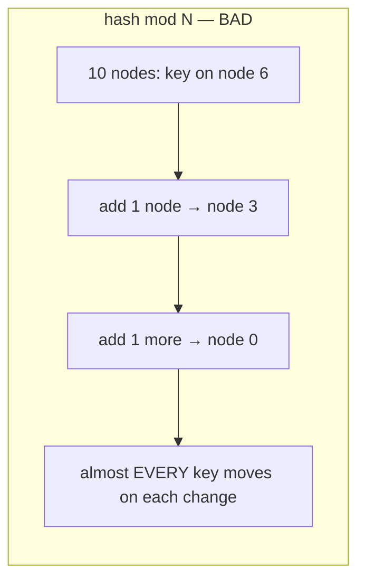
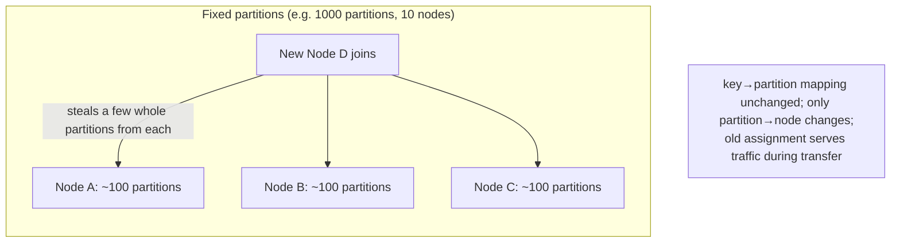
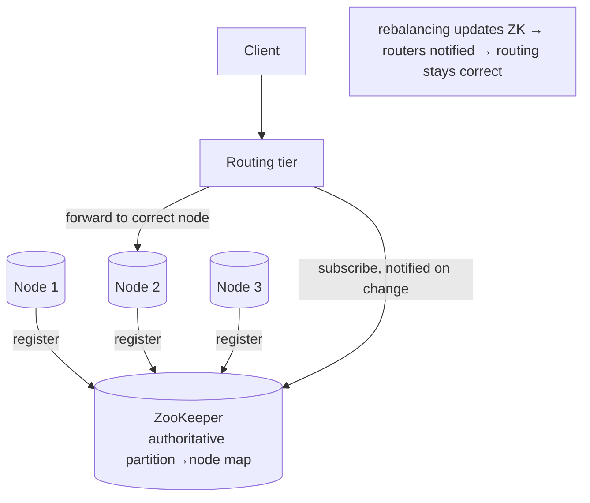

# Rebalancing Partitions & Request Routing

**Prerequisites:** Topic 14 (partitioning strategies)
**Difficulty:** Intermediate
**Interview importance:** High
**Source:** Chapter 6 — "Rebalancing Partitions", "Request Routing"

---

## 1. What Is It?

Two operational problems that every partitioned system must solve:

- **Rebalancing:** moving partitions (and their data/load) between nodes when you add machines, remove machines, or a node fails. The goal is to keep load even without moving more data than necessary.
- **Request routing:** given a request for some key, figuring out *which node* currently holds the partition for that key — since rebalancing means the answer changes over time.

Topic 14 was about *how to split* the data. This topic is about *keeping the split balanced as the cluster changes*, and *finding the data* afterward.

---

## 2. Why Does It Exist?

Clusters aren't static. Over time: the dataset grows (need more disk), throughput grows (need more CPU/RAM), and machines fail (a dead node's partitions must go somewhere else). All of these require moving load around — **rebalancing**.

Rebalancing has three requirements the book states explicitly, and they're the criteria you evaluate any scheme against:

1. After rebalancing, load (data, reads, writes) should be **fairly shared** across nodes.
2. **While rebalancing, the database should keep accepting reads and writes.**
3. **No more data than necessary** should move between nodes — to minimize network and disk I/O.

And once partitions move, clients face a new problem: the key they want is no longer where it used to be. **Request routing** is how a client (or the system) discovers the current home of a partition. This is a specific instance of the general **service discovery** problem.

---

## 3. Simple Explanation

**Rebalancing** is redistributing the work when the team size changes. The trick is to move as few tasks as possible while ending up balanced — you don't want adding one worker to trigger a reshuffle of everyone's entire workload.

The naive approach, **`hash(key) mod N`**, is a trap: change N (add a node) and almost *every* key moves. The fixes all share one idea — **decouple the number of partitions from the number of nodes**, so adding a node just moves a few whole partitions rather than reshuffling everything.

**Request routing** is the phone book: after tasks move, how does a caller find who's doing a given task now? Three answers — ask any node and get redirected, go through a routing tier, or let clients know the map directly. Usually a coordination service like ZooKeeper keeps the authoritative map.

---

## 4. Real-World Analogy

**A call center reassigning account territories.**

Bad scheme (`mod N`): assign accounts by `account_number mod (number of agents)`. Hire one agent and the divisor changes, so *nearly every* account gets reassigned — chaos, and every customer's file has to move.

Good scheme (fixed partitions): pre-divide accounts into 1,000 territories, hand ~100 territories to each of 10 agents. Hire an 11th agent, and they simply *take a few whole territories* from each existing agent. Only those territories' files move; everyone else is untouched.

Routing: when a customer calls, the switchboard (ZooKeeper) knows which agent currently owns that territory and connects them. When territories are reassigned, the switchboard's map is updated, so calls always reach the right agent.

---

## 5. Technical Explanation

### How NOT to rebalance: `hash mod N`

Tempting: with N nodes numbered 0..N-1, put a key on node `hash(key) mod N`. Simple. And badly broken.

The problem: **when N changes, most keys move.** Example: `hash(key) = 123456`. With 10 nodes it's on node 6 (`123456 mod 10 = 6`). Grow to 11 nodes → moves to node 3 (`mod 11 = 3`). Grow to 12 → node 0 (`mod 12 = 0`). Adding a single node reshuffles almost everything, which makes rebalancing excessively expensive. **Never partition with `mod N`.**

### Fix 1: Fixed number of partitions

Create **many more partitions than nodes**, and assign several partitions to each node. E.g., a 10-node cluster split into **1,000 partitions**, ~100 per node.

- Add a node → it **steals a few partitions from every existing node** until balanced again. Remove a node → the reverse.
- **Only entire partitions move.** The number of partitions doesn't change, nor does the key→partition mapping. Only the **partition→node** assignment changes.
- The change isn't immediate — transferring data takes time — so the **old assignment serves reads/writes during the transfer.**
- You can even handle **heterogeneous hardware**: give powerful nodes more partitions.

Used by Riak, Elasticsearch, Couchbase, Voldemort.

**The catch:** the number of partitions is usually **fixed at setup and never changed.** So that number is effectively the **maximum number of nodes** you can ever have — choose it high enough for future growth, but not so high that per-partition management overhead dominates. And if dataset size varies wildly (starts small, grows huge), a fixed partition count means partitions that are either too big (expensive rebalancing/recovery) or too small (overhead) — the "just right" size is hard to hit when the count is fixed.

### Fix 2: Dynamic partitioning

For **key-range** partitioning, a fixed count with fixed boundaries is dangerous: guess the boundaries wrong and everything lands in one partition. So key-range databases (HBase, RethinkDB) create partitions **dynamically**:

- When a partition grows past a configured size (HBase default: 10 GB), it **splits into two** (~half the data each).
- If a partition shrinks below a threshold, it **merges** with an adjacent one.
- This mirrors what happens at the top level of a B-tree.
- After a split, one half can be **moved to another node** to balance load.

**Advantage:** the number of partitions **adapts to the data volume.** Small data → few partitions → low overhead. Huge data → each partition capped at the max size.

**Caveat:** an empty database starts as a **single partition**, so until the first split, all writes hit one node while others idle. Mitigation: **pre-splitting** — configure an initial set of partitions on an empty database (HBase, MongoDB support it). For key-range, pre-splitting requires knowing the key distribution in advance.

Dynamic partitioning works for hash-partitioned data too (MongoDB since 2.4 does both).

### Fix 3: Partitioning proportionally to nodes

- **Fixed number of partitions:** partition *size* ∝ dataset size; count is independent of nodes.
- **Dynamic partitioning:** partition *count* ∝ dataset size; also independent of nodes.
- **Proportional to nodes** (Cassandra, Ketama): a **fixed number of partitions per node.** Partition size grows with data (nodes constant), but adding nodes makes partitions smaller again. Since more data usually means more nodes, this keeps partition size fairly stable. When a new node joins, it randomly chooses a fixed number of existing partitions to split, taking half of each.

### Automatic vs manual rebalancing

Rebalancing is expensive: rerouting requests, moving large amounts of data. Done carelessly, it can **overload the network or nodes** and harm in-flight queries.

- **Fully automatic** rebalancing is convenient (less operational work) but **dangerous**. Its interaction with automatic failure detection is treacherous: if one node is slow (overloaded), the system may think it's dead, rebalance away from it — which adds load to the already-struggling network and other nodes, **making the problem worse** and potentially cascading.
- So the book recommends a **human in the loop**: it can be good to have automatic rebalancing *generate a suggested assignment* but require an administrator to **commit** it before it takes effect. Slower, but prevents nasty surprises.

### Request routing

After rebalancing, a client asking for a key needs to know which node holds its partition now. This is **service discovery**. Three broad approaches:

1. **Ask any node** (round-robin via a load balancer). If that node owns the partition, it answers; otherwise it **forwards** the request to the correct node and passes the reply back.
2. **A routing tier:** send all requests to a partition-aware load balancer/router first, which determines the node and forwards. It acts as a **partition-aware** proxy.
3. **Clients know the assignment:** clients are aware of the partitioning and connect directly to the appropriate node. No intermediary.

In all three, the key problem is: **how does the component making the routing decision learn about changes to the partition→node assignment?** This requires **consensus** among all participants — everyone must agree, or requests go to the wrong place.

Many systems use a separate **coordination service** like **ZooKeeper** to track cluster metadata. Each node registers itself in ZooKeeper, which maintains the authoritative mapping of partitions to nodes. Routers and clients subscribe to this information and are **notified when the assignment changes**, so routing stays current. (HBase, SolrCloud, Kafka use ZooKeeper this way; MongoDB uses its own config servers; Cassandra and Riak use a **gossip protocol** among nodes to disseminate cluster-state changes, avoiding a dependency on an external service like ZooKeeper.)

**Parallel query execution.** So far we've discussed simple single-key reads and writes. For **massively parallel processing (MPP)** databases used for analytics, query routing is far more sophisticated: a query is broken into stages, executed in parallel across many partitions, and the results combined — the subject of the batch-processing chapters (Topics 27–29).

---

## 6. Diagrams







---

## 7. Concrete Example

**A growing Elasticsearch cluster backing product search.**

Set up at 1,000 shards (partitions) across 10 nodes — ~100 shards each. Business grows; you add nodes 11 through 20.

- Each new node **steals whole shards** from existing nodes until each of the 20 holds ~50. Only the moved shards' data transfers; the shard count and doc→shard mapping never change.
- During transfer, the **old shard locations keep serving** queries and indexing, so search stays up — requirement 2 satisfied.
- The cluster state (which shard is on which node) lives in a coordination layer; routers are **notified on change**, so a search request always reaches the current owner of each shard — requirement of routing satisfied.

The design constraint you accepted at setup: 1,000 shards means you can never exceed ~1,000 nodes without re-sharding (and each shard has overhead, so you didn't pick 100,000). If you'd used `mod N`, adding those 10 nodes would have reshuffled nearly the entire index — hours of I/O and degraded service. This is exactly why fixed-partition-count schemes exist.

---

## 8. When to Use / Not Use

**Fixed number of partitions:** hash-partitioned systems with reasonably predictable growth; when operational simplicity matters. Pick the count for your *maximum* future node count. (Riak, ES, Couchbase, Voldemort.)

**Dynamic partitioning:** key-range systems (boundaries can't be fixed safely); highly variable dataset sizes; when you want partition count to track data volume. Pre-split empty databases to avoid the single-node startup bottleneck. (HBase, RethinkDB, MongoDB.)

**Proportional to nodes:** when you want partition size to stay stable as you scale nodes. (Cassandra, Ketama.)

**Avoid `hash mod N` always** — it's the anti-pattern the whole section exists to warn against.

**Prefer human-in-the-loop rebalancing** for anything where a spurious rebalance during a load spike could cascade — i.e., most production systems.

---

## 9. Advantages & Disadvantages

**Fixed partitions — advantages:** simple; only whole partitions move; stable mapping; handles heterogeneous hardware.
**Fixed partitions — disadvantages:** partition count fixed at setup caps max nodes; hard to size when dataset varies widely.

**Dynamic partitioning — advantages:** adapts to data volume; avoids too-big/too-small partitions.
**Dynamic partitioning — disadvantages:** empty DB starts single-node (needs pre-splitting); splitting/merging is machinery to operate.

**Automatic rebalancing — advantage:** less ops toil. **Disadvantage:** dangerous — can misfire on a slow node and cascade.
**Human-in-the-loop — advantage:** prevents cascades. **Disadvantage:** slower, needs an operator.

---

## 10. Trade-off Table

| Rebalancing scheme | Partition count | Data moved on change | Best for |
|---|---|---|---|
| `hash mod N` | = nodes | **Nearly everything** — avoid | Nothing |
| Fixed number of partitions | Fixed at setup | A few whole partitions | Hash-partitioned, predictable growth |
| Dynamic partitioning | Grows with data | Split/merge as needed | Key-range; variable dataset size |
| Proportional to nodes | Grows with nodes | Split on node join | Stable partition size while scaling |

| Routing approach | How it finds the node | Trade-off |
|---|---|---|
| Ask any node, forward | Node redirects | Simple; extra hop |
| Routing tier | Partition-aware proxy | Central point; clean clients |
| Client-aware | Client holds the map | Fewest hops; client complexity |
| (Underlying) ZooKeeper / gossip | Authoritative map + notifications | Consensus on the mapping |

---

## 11. Failure Scenarios

| Scenario | Consequence | Handling |
|---|---|---|
| Used `mod N`, added a node | Massive reshuffle, hours of I/O, degraded service | Never use mod N; use fixed/dynamic partitions |
| Automatic rebalance triggered by a *slow* (not dead) node | Adds load to a struggling system → cascade | Human-in-the-loop commit; distinguish slow from dead |
| Empty dynamic DB, all writes to one node | Startup bottleneck; other nodes idle | Pre-splitting |
| Fixed partition count too low | Can't scale past that many nodes | Choose count for max future growth at setup |
| Fixed partition count too high | Per-partition overhead dominates | Balance against growth needs |
| Routing map stale after rebalance | Requests hit wrong node | ZooKeeper/gossip notifications keep routers current |
| Coordination service (ZooKeeper) down | Routing can't update | ZooKeeper HA (it's itself a consensus system — Topic 26) |
| Rebalance saturates network | In-flight queries slow | Throttle rebalancing; do it gradually |

---

## 12. Production Considerations

- **Never use `hash mod N`.** Decouple partition count from node count.
- **Choose fixed partition count for your maximum future scale**, balanced against per-partition overhead — you usually can't change it later.
- **Pre-split** empty dynamic-partitioned databases, or the first node takes all the write load.
- **Keep rebalancing human-gated** in production; let the system *propose*, an operator *commit*. Auto-rebalance + auto-failure-detection is a known cascade risk.
- **Throttle rebalancing** so data movement doesn't starve live traffic.
- **The routing map must be authoritative and change-notified** — ZooKeeper or gossip — or requests go stale.
- **Old partition assignment must keep serving** during transfer; verify your system does this (they generally do).

---

## ❌ 13. Common Mistakes

- **`hash(key) mod N`.** The canonical partitioning mistake — adding a node reshuffles almost everything.
- **Choosing too few fixed partitions**, capping your maximum cluster size.
- **Fully automatic rebalancing** that misfires on a slow node and cascades — the book explicitly warns against coupling it with auto-failure-detection.
- **Not pre-splitting** a dynamic empty database, so it starts single-node.
- **Assuming clients magically know the new layout** — routing needs an authoritative, notified map.
- **Rebalancing at full speed** during peak, starving live queries.
- **Confusing partition count with node count** — the whole point is to keep them independent.

---

## 🧠 14. Think Like an Engineer

```
Never mod N. Decouple #partitions from #nodes.
        ↓
Key-range data? → dynamic partitioning (+ pre-split empty DB)
Hash data, predictable growth? → fixed partition count
   (pick count for MAX future nodes, mind per-partition overhead)
Want stable partition size while scaling? → proportional to nodes
        ↓
Rebalancing: automatic or human-gated?
   (production → propose automatically, COMMIT manually;
    auto + auto-failure-detection can cascade on a slow node)
        ↓
Throttle data movement so live traffic survives.
        ↓
Routing: ZooKeeper/gossip holds the authoritative map,
   routers/clients notified on change → requests stay correct.
        ↓
Old assignment must serve traffic during transfer.
```

---

## 15. Mental Model

```
Cluster changes (grow / shrink / fail) → must rebalance
      ↓
Move as LITTLE as possible while staying balanced
      ↓
mod N moves everything → decouple #partitions from #nodes
      ↓
fixed count | dynamic split-merge | proportional to nodes
      ↓
Rebalance is expensive & risky → human commits, throttle it
      ↓
After moves, find the data: authoritative map (ZooKeeper/gossip),
notify routers on change → routing stays correct
```

---

## 🔗 16. How This Connects to Other Concepts

- **Partitioning Strategies (Topic 14)** — this topic keeps that split balanced over time and locates the data afterward.
- **Secondary Indexes (Topic 15)** — both local and global indexes must be rebalanced too.
- **Reliability / Failover (Topics 1, 10)** — the slow-vs-dead node problem is the same detection difficulty that makes failover hard, and it's why auto-rebalancing is risky.
- **Consensus & Coordination (Topic 26)** — the routing map requires agreement; ZooKeeper *is* a consensus system providing exactly this coordination service.
- **Scalability (Topic 2)** — rebalancing is how you actually add the capacity that scaling promises.

---

## 17. Interview Questions & Answers

**Beginner**

**Q: Why is `hash(key) mod N` a bad way to partition?**
Because when N — the number of nodes — changes, almost every key's assignment changes. A key on node 6 with 10 nodes moves to node 3 with 11 and node 0 with 12. So adding a single machine reshuffles nearly the whole dataset, which is enormously expensive. The fix is to decouple the number of partitions from the number of nodes.

**Q: What is request routing?**
Since rebalancing moves partitions between nodes, a client asking for a key needs to know which node currently holds that key's partition. Request routing is how that's determined — either by asking any node and being forwarded, going through a partition-aware routing tier, or having clients hold the map. Underneath, an authoritative map, often in ZooKeeper, tracks partition-to-node assignments and notifies routers when they change.

**Intermediate**

**Q: How does the fixed-number-of-partitions scheme rebalance?**
You create far more partitions than nodes up front — say 1,000 partitions on 10 nodes, 100 each — and each partition is a fixed slice of the key space. When you add a node, it steals a few whole partitions from each existing node until things are balanced again. The key-to-partition mapping never changes; only which node hosts each partition changes, and only the moved partitions' data transfers. The trade-off is that the partition count is fixed at setup, so it effectively caps your maximum number of nodes, and you have to size it for future growth without making it so large that per-partition overhead dominates.

**Q: When would you use dynamic partitioning instead?**
For key-range partitioning, where fixed boundaries are dangerous — guess wrong and everything piles into one partition. Dynamic partitioning splits a partition in two when it exceeds a size threshold and merges adjacent small ones, so the number of partitions tracks the data volume automatically. It's also good when the dataset size is highly variable. The caveat is that an empty database starts as a single partition, so until the first split all writes hit one node — which is why systems like HBase and MongoDB let you pre-split an empty database if you know the key distribution.

**Advanced / Staff**

**Q: Why is fully automatic rebalancing dangerous, and what would you do instead?**
The danger is its interaction with automatic failure detection. Failure detection relies on timeouts, which can't distinguish a dead node from a merely slow, overloaded one. If a node is slow because it's under heavy load and the system decides it's dead, it rebalances that node's partitions elsewhere — which moves large amounts of data across an already-stressed network and piles load onto other nodes, making the overload worse and potentially cascading across the cluster. So in production I'd keep a human in the loop: let the system compute and propose a rebalancing plan automatically, but require an operator to commit it, so a spurious trigger during a load spike doesn't execute on its own. I'd also throttle the actual data movement so rebalancing never starves live traffic, and ensure the old partition assignment keeps serving requests throughout the transfer.

**Q: Design the routing layer for a partitioned datastore. What are the failure modes?**
I'd keep the authoritative partition-to-node map in a coordination service like ZooKeeper, have every node register itself, and have routers and clients subscribe so they're notified the moment the assignment changes — that's what keeps routing correct across rebalancing. I'd probably use a thin routing tier so clients stay simple, accepting one extra hop. The main failure modes: a stale map sends requests to a node that no longer owns the partition, which the notification mechanism prevents but which can still happen briefly during a change, so nodes should be able to forward a misrouted request rather than fail it. The coordination service itself is a dependency — it's a consensus system, so it must be run highly available, and if it's down you can't update routing, though existing routes still work. Cassandra and Riak avoid the external dependency by gossiping cluster state among nodes instead, which trades ZooKeeper's operational burden for eventual-consistency in how fast every node learns of a change. Which I'd choose depends on whether I want a strong single source of truth or fewer moving parts.

---

## 🎯 30-Second Interview Answer

> "Rebalancing is redistributing partitions when you add, remove, or lose nodes, and the goals are to stay balanced, keep serving traffic during the move, and move as little data as possible. The classic mistake is `hash mod N`, because changing N reshuffles almost every key — so instead you decouple partition count from node count. Fixed schemes create many more partitions than nodes and move whole partitions when a node joins; dynamic schemes split and merge partitions to track data volume, which suits key-range partitioning. A subtle but important point is that fully automatic rebalancing is dangerous because it interacts badly with timeout-based failure detection — a slow node gets mistaken for a dead one and rebalancing away from it cascades the overload — so production systems keep a human to commit the plan. And request routing needs an authoritative map, usually in ZooKeeper or via gossip, that notifies routers on change so requests always reach the current owner."

---

## ⚡ Quick Revision

- **Rebalancing goals:** (1) fair load after, (2) **keep serving during**, (3) move **minimal data**.
- **NEVER `hash mod N`** — changing N moves almost everything. Decouple #partitions from #nodes.
- **Fixed partition count:** many partitions (e.g. 1000 on 10 nodes); new node **steals whole partitions**; key→partition fixed, only partition→node changes; count caps **max nodes**. (Riak, ES, Couchbase, Voldemort.)
- **Dynamic partitioning:** split at size threshold, merge when small; count tracks data; **pre-split** empty DB to avoid single-node start. (HBase, RethinkDB, MongoDB.)
- **Proportional to nodes:** fixed partitions per node; stable partition size. (Cassandra, Ketama.)
- **Rebalancing is risky** — auto + auto-failure-detection can cascade on a **slow** node. Prefer **propose-automatically, commit-manually**; throttle it.
- **Routing:** ask-any-node / routing-tier / client-aware. Authoritative map via **ZooKeeper** (or **gossip** in Cassandra/Riak), **notified on change**.
- Routing agreement = **consensus** (Topic 26); ZooKeeper is itself a consensus system.
