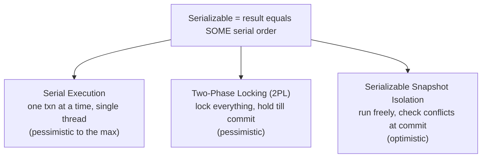
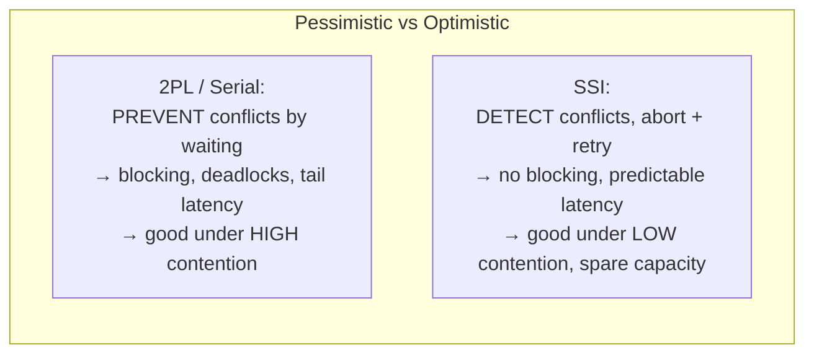
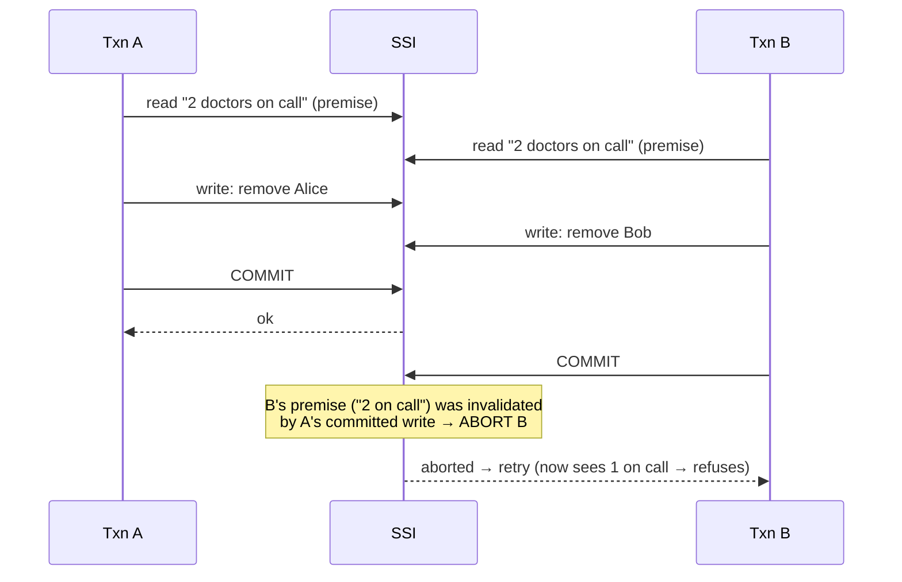

# Serializability

**Prerequisites:** Topics 17, 18 (transactions, weak isolation)
**Difficulty:** Advanced
**Interview importance:** High
**Source:** Chapter 7 — "Serializability"

---

## 1. What Is It?

**Serializable isolation** is the strongest isolation level. It guarantees that even though transactions execute **concurrently**, the end result is the same as if they had executed **one at a time, serially, in some order.** The database prevents *all* possible race conditions — including write skew and phantoms that weaker levels miss (Topic 18).

There are exactly **three ways** databases implement it, and knowing the three (and their trade-offs) is the point of this file:

1. **Actual Serial Execution** — literally run one transaction at a time.
2. **Two-Phase Locking (2PL)** — the classic pessimistic approach.
3. **Serializable Snapshot Isolation (SSI)** — the modern optimistic approach.

---

## 2. Why Does It Exist?

Topic 18 showed that weak isolation levels let real anomalies through, and that reasoning about which anomalies affect your specific application is hard, error-prone, and easy to get wrong under concurrency you can't reproduce in tests. Whole classes of subtle bugs — lost updates, write skew, phantoms — come from weak isolation.

Serializability exists to make that entire problem **go away.** If transactions are serializable, you can pretend concurrency doesn't exist at all: reason about each transaction as if it were the only one running, and the database guarantees the concurrent result matches *some* serial order. No more enumerating anomalies.

The catch — and the reason it's not the universal default — is **performance**. For decades the only serializable implementation (2PL) had poor performance, so people avoided it and lived with weak isolation's hazards instead. The interesting modern story is SSI, which offers serializability at much lower cost, changing the calculus.

---

## 3. Simple Explanation

The guarantee is simple: **the outcome looks as if the transactions ran in a line, one after another** — even though they actually overlapped. Three ways to deliver it:

- **Serial execution:** don't allow concurrency at all. Run everything on one thread, one at a time. Sounds absurd, but if each transaction is fast and fits in memory, it works surprisingly well.
- **Two-phase locking (pessimistic):** assume conflicts will happen, so lock everything you touch and hold the locks until commit. Correct, but locks cause waiting, deadlocks, and low throughput.
- **Serializable snapshot isolation (optimistic):** assume conflicts are rare, so let transactions run without blocking, then *check at commit time* whether anything they read was changed by someone else. If so, abort and retry. Fast when contention is low.

The pessimistic/optimistic split is the key mental model: **2PL prevents conflicts by waiting; SSI detects conflicts and retries.**

---

## 4. Real-World Analogy

**Three ways to stop two people grabbing the last item on a shelf.**

- **Serial execution:** only let one shopper into the aisle at a time. No conflicts possible, but the queue outside can get long. Fine if each shopper is quick.
- **Two-phase locking (pessimistic):** a shopper puts a "reserved" tag on everything they might buy the moment they touch it, and doesn't release the tags until they've paid. Nobody else can touch tagged items. Safe, but shoppers wait on each other, and two shoppers each waiting on an item the other tagged is a deadlock.
- **Serializable snapshot isolation (optimistic):** everyone shops freely, no tags. At the checkout, the system checks: "did anyone else buy something you based your decision on?" If yes, you're sent back to redo your shopping. Fast when the store is quiet; lots of redos when it's crowded.

---

## 5. Technical Explanation

### Approach 1: Actual Serial Execution

Remove concurrency entirely: execute **only one transaction at a time, in serial order, on a single thread.** This sidesteps all concurrency-control problems by construction.

For a long time this was considered impractical, but two developments made it viable:

- **RAM got cheap enough** to keep the entire active dataset in memory for many applications. A transaction executing entirely in memory is *far* faster than one waiting for disk — so a single thread can process a meaningful transaction rate.
- **OLTP transactions are usually short** and make a small number of reads and writes. Long analytic queries are read-only and can run separately on a consistent snapshot (snapshot isolation), outside the serial loop.

VoltDB/H-Store, Redis, and Datomic use serial execution. It can be **faster than systems with locking overhead**, because it avoids all coordination — but its throughput is limited to **a single CPU core.**

**Encapsulating transactions in stored procedures.** Interactive transactions (app sends a query, waits, thinks, sends another) would stall the single thread on network round-trips and human/application think-time. Unworkable for serial execution. So systems using serial execution **require the entire transaction to be submitted as a stored procedure** — code that runs entirely inside the database with no waiting for the outside world. All the data it needs is in memory; it runs to completion in microseconds.

- **Pros of stored procedures:** no waiting on the network mid-transaction, so the single thread stays busy.
- **Cons:** each database vendor has its own procedure language, which are clumsy and lack good tooling/libraries; code running in the database is hard to manage, debug, version, test, and monitor; and a badly-written procedure can cause far more damage in the database than in an app server. (Modern systems mitigate this by using general-purpose languages — VoltDB uses Java/Groovy, Datomic Java/Clojure, Redis Lua.)

**Partitioning.** Single-threaded serial execution is limited to one core, capping throughput. To scale, **partition the data** (Topic 14) so each partition has its own transaction-processing thread on its own core. But a transaction that needs to access **multiple partitions** must coordinate across them — the database runs it across all affected partitions with locking, which is **much slower** (the book cites VoltDB at ~1000× slower for cross-partition transactions). So serial execution scales well only when transactions are **single-partition**; workloads with frequent cross-partition access don't fit.

**Summary of serial execution constraints:** every transaction small and fast (one slow transaction stalls everything); active dataset fits in memory (or rarely-accessed data must be paged, which stalls the thread); write throughput low enough for a single core (or partition without cross-partition transactions); cross-partition transactions possible but heavily constrained.

### Approach 2: Two-Phase Locking (2PL)

The classic serializability algorithm for ~30 years. **Do not confuse 2PL with 2PC** (two-phase *commit*, Topic 25) — completely different things despite the similar name.

2PL is stricter than the locks used for dirty-write prevention. The core rule concerns **readers and writers blocking each other:**

- **Several transactions may read the same object concurrently** (shared locks are compatible with each other).
- But **as soon as anyone wants to write** an object, **exclusive access is required:** a write must wait for all current readers and writers to finish, and while writing, no one else may read.
- Crucially — and this is what makes it serializable — **readers block writers and writers block readers.** (Snapshot isolation's motto is the opposite: readers never block writers, writers never block readers. That difference is exactly why snapshot isolation isn't serializable and 2PL is.)

**Implementation.** Each object has a lock that can be in **shared** or **exclusive** mode. To read, acquire a shared lock (multiple shared locks OK simultaneously); to write, acquire an exclusive lock (must wait for all others). If a transaction holds a shared lock and then wants to write, it upgrades to exclusive. **All locks are held until the transaction commits or aborts** — this is the "two-phase": phase one (growing) acquires locks, phase two (shrinking) releases them, all at the end.

**Deadlocks.** Because transactions can wait on each other's locks, deadlocks arise: transaction A holds a lock B wants, B holds a lock A wants, both wait forever. The database **detects deadlocks automatically and aborts one** of the transactions so the other can proceed; the aborted one retries. This is unavoidable with 2PL.

**Performance of 2PL — its Achilles' heel.** Transaction throughput and response times are **significantly worse** under 2PL than under weak isolation. This is due to:

- The overhead of acquiring and releasing locks.
- **Reduced concurrency** — by design, waiting. If a transaction has to wait on another, there's no limit to how long; and with readers blocking writers and vice versa, contention causes long waits.
- **Unstable latencies** — 2PL can have very high tail latencies (p99+) because one slow transaction (or a chain of transactions waiting on each other) holds up many others. A single expensive transaction holding many locks can stall the whole system.
- **Deadlock aborts and retries** waste work and add latency, especially under high contention.

**Predicate locks and index-range locks.** To prevent **phantoms** (Topic 18) — where a write changes the result of a search — 2PL needs to lock not just existing rows but *the condition of the search itself*. A **predicate lock** locks all objects matching some search condition (e.g., "all bookings for room 123 between noon and 1pm"), including objects that **don't exist yet but might be added.** This is what makes 2PL fully serializable. But predicate locks are expensive to check (they apply to hypothetical future rows). So in practice most 2PL databases use **index-range locks** (next-key locking): a looser approximation that locks a *range* in an index (e.g., all bookings for room 123, any time, or all bookings for any room between noon and 1pm). It locks more than strictly necessary but is far cheaper to enforce, and still prevents phantoms.

### Approach 3: Serializable Snapshot Isolation (SSI)

Described by the book as "fairly new" (first in 2008) but "promising" — potentially fast enough to become the default in the future. It provides **full serializability with only a small performance penalty over snapshot isolation.** PostgreSQL uses it for its serializable level; FoundationDB uses a similar algorithm.

**Optimistic vs pessimistic.** 2PL is **pessimistic:** it assumes something will go wrong, so it locks to prevent it (like mutual exclusion protecting a critical section). Serial execution is pessimistic to the extreme (one at a time). SSI is **optimistic:** instead of blocking when something *might* be dangerous, transactions **proceed anyway, in the hope that everything will be fine.** At commit time, the database **checks whether isolation was actually violated;** if so, the transaction is **aborted and retried.**

Optimistic concurrency control performs badly under **high contention** (many transactions trying to access the same objects → high abort rate → wasted work → can spiral). But if there's enough spare capacity and contention isn't too high, optimistic techniques tend to **outperform pessimistic ones.** Contention can be reduced with commutative atomic operations (e.g., multiple increments to a counter don't need to conflict, regardless of order).

**How SSI works — built on snapshot isolation.** SSI is snapshot isolation (each transaction reads a consistent snapshot via MVCC) **plus an algorithm for detecting serialization conflicts** among writes and deciding which transactions to abort. The core insight: write skew (Topic 18) happens because a transaction acts on a **premise** — a fact it read (e.g., "there are 2 doctors on call") — and that premise may become false due to another transaction's write before commit. The transaction made a **decision based on an outdated premise.** So the database must detect when this happens.

Two cases the database detects:

- **Detecting stale MVCC reads:** the transaction read from a snapshot, but by the time it wants to commit, some data it read has been modified by another committed transaction. The database tracks when a transaction ignores another's writes due to MVCC visibility rules, and checks at commit whether any of those ignored writes have now committed. If the read was the premise for a write, that's a potential violation → abort.
- **Detecting writes that affect prior reads:** as a transaction writes, the database checks whether any *other* transaction has recently read data the write affects — i.e., whether this write invalidates a premise another transaction relied on. It's like acquiring a lock on the affected key range, but instead of blocking, the lock **notifies** the other transactions that their read may no longer be up to date. When a transaction commits, it checks whether any of the reads it depended on have been invalidated; if so, it aborts.

**Performance of SSI.** A big advantage: a transaction **doesn't need to block waiting for locks held by another transaction.** Like snapshot isolation, readers don't block writers and vice versa — so latency is more predictable and less variable, especially for read-heavy workloads. And unlike serial execution, SSI **isn't limited to a single CPU core** — FoundationDB distributes serialization-conflict detection across multiple machines, scaling to high throughput. The **rate of aborts** significantly affects overall performance: transactions that read and write a lot of data have a higher chance of conflict, so SSI wants transactions to be **short** (long read-write transactions are likely to conflict and abort). Still, SSI is much less sensitive to slow transactions than 2PL or serial execution.

---

## 6. Diagrams







---

## 7. Concrete Example

**The on-call scheduling invariant (from Topic 18) under each approach.**

Invariant: at least one doctor on call. Alice and Bob both try to remove themselves concurrently.

- **Serial execution:** Alice's transaction runs completely first; it sees 2 on call, removes Alice, leaving 1. Then Bob's runs; it sees 1 on call, and the invariant check refuses to let him remove himself. Correct. Cost: no concurrency; both were serialized on one thread.
- **2PL:** Alice's transaction takes a shared lock reading the on-call count, then an exclusive lock to remove herself. Bob's transaction tries to read the same count — but reads are blocked by Alice's pending write (readers block writers, writers block readers), so Bob waits until Alice commits, then reads the *updated* count (1) and is refused. Correct. Cost: Bob blocked; if they'd locked each other's rows first, a deadlock abort.
- **SSI:** both transactions run without blocking, each reading "2 on call" from its snapshot, each writing to remove themselves. At commit, the database detects that Bob's premise ("2 on call") was invalidated by Alice's committed write, so it **aborts Bob**, who retries, now sees 1, and is refused. Correct. Cost: one wasted attempt and a retry — cheap if this contention is rare.

The interview-worthy synthesis: **all three are correct; they differ in *how* they pay.** Serial pays in concurrency, 2PL pays in blocking and tail latency, SSI pays in aborts under contention. Which is best depends entirely on contention level and transaction shape.

---

## 8. When to Use Which

**Serial execution:** active dataset fits in memory; transactions are short and expressible as stored procedures; write throughput fits one core (or the data partitions cleanly with few cross-partition transactions). Good for in-memory OLTP (VoltDB, Redis, Datomic).

**2PL:** you need serializability, contention is high (optimistic would abort too much), and you can tolerate the throughput hit and tail-latency variability. The traditional, well-understood choice; still what many databases use for their serializable level.

**SSI:** you need serializability, contention is low-to-moderate, you have spare capacity, transactions are short, and you want predictable latency without blocking. Increasingly the best default where available (PostgreSQL serializable, FoundationDB). Scales beyond one core, unlike serial execution.

**None (weak isolation):** when you've reasoned about your access patterns (Topic 18) and confirmed the anomalies don't affect you, and you need maximum throughput.

---

## 9. Advantages & Disadvantages

**Serial execution — advantages:** simplest correctness (no concurrency to reason about); no lock overhead; can be very fast in memory.
**Disadvantages:** single core cap; needs stored procedures; needs in-memory data; cross-partition transactions ~1000× slower; one slow transaction stalls everything.

**2PL — advantages:** proven, general, handles high contention; full serializability including phantoms (via index-range locks).
**Disadvantages:** poor throughput; deadlocks and abort-retries; unstable/high tail latency; readers and writers block each other.

**SSI — advantages:** no blocking; predictable latency; scales beyond one core; small penalty over snapshot isolation.
**Disadvantages:** aborts under high contention (wasted work); wants short transactions; relatively newer.

---

## 10. Trade-off Table

| Approach | Style | Concurrency | Scales past 1 core? | Weakness | Best when |
|---|---|---|---|---|---|
| Serial execution | Pessimistic (extreme) | None (1 thread) | Only via partitioning | Cross-partition ~1000× slower; in-memory only | Short in-memory single-partition txns |
| Two-Phase Locking | Pessimistic | Low (blocking) | Yes | Deadlocks, tail latency, low throughput | High contention; proven need |
| Serializable Snapshot Isolation | Optimistic | High (no blocking) | Yes (e.g. FoundationDB) | Aborts under high contention | Low-moderate contention, spare capacity, short txns |

---

## 11. Failure Scenarios

| Scenario | Under which approach | Handling |
|---|---|---|
| Deadlock (A waits B, B waits A) | 2PL | DB detects, aborts one, retries |
| One slow transaction | Serial (stalls all) / 2PL (holds locks) | Keep transactions short; SSI is less sensitive |
| High contention | SSI (abort storm) | 2PL or serial may be better; reduce contention (commutative ops) |
| Cross-partition transaction | Serial execution | ~1000× slower; design to stay single-partition |
| Phantom (search-result change) | All must handle | 2PL: index-range locks; SSI: premise-invalidation detection |
| Long read-write transaction | SSI (high abort chance) | Keep transactions short; move long reads to snapshot isolation |
| Data doesn't fit in memory | Serial execution | Paging stalls the thread; not suitable |

---

## 12. Production Considerations

- **Prefer SSI where available** (PostgreSQL serializable) for the common case of low-to-moderate contention — you get serializability with predictable latency and no blocking.
- **Keep transactions short** under SSI — long read-write transactions have high abort rates. Move long read-only work to snapshot isolation.
- **Under 2PL, watch tail latency and deadlock rate** — a single expensive transaction holding locks can stall the system.
- **For serial execution, everything must be a stored procedure** and the data in memory; scale by partitioning and keeping transactions single-partition.
- **Handle abort-and-retry properly** everywhere — retriable errors, backoff, idempotence for external side effects (Topics 9, 17).
- **Reduce contention** with commutative atomic operations (increments) so concurrent updates don't conflict.
- **Measure before choosing** — the right approach depends on your contention level and transaction shape, which you have to observe.

---

## ❌ 13. Common Mistakes

- **Confusing 2PL with 2PC.** Two-phase *locking* (serializability) vs two-phase *commit* (atomic commit across nodes) — unrelated despite the names.
- **Assuming serializable is always too slow.** SSI changed this; measure rather than assume.
- **Using SSI under high contention** and drowning in aborts — 2PL or contention reduction may be better.
- **Long transactions under SSI** — high abort probability; keep them short.
- **Thinking snapshot isolation is serializable.** It isn't — readers/writers don't block, so write skew slips through. 2PL blocks them; SSI detects them.
- **Ignoring deadlocks under 2PL** — they're inevitable; ensure retry logic exists.
- **Interactive transactions on a serial-execution engine** — network round-trips stall the single thread; use stored procedures.

---

## 🧠 14. Think Like an Engineer

```
Do I actually need serializability? (Topic 18: is there a write-skew/phantom risk?)
   no → weak isolation is fine
        ↓
What's my contention level?
   high → optimistic (SSI) aborts too much → 2PL (or reduce contention)
   low/moderate + spare capacity → SSI (no blocking, predictable latency)
        ↓
Can the whole transaction run in-memory as a stored procedure, short?
   yes + single-partition → serial execution is viable and simple
        ↓
Are my transactions SHORT? (long read-write txns hurt SSI and 2PL alike)
        ↓
Is my retry-on-abort logic correct? (backoff, idempotence for side effects)
```

---

## 15. Mental Model

```
Serializable = "as if run one at a time" → all anomalies gone

Three ways to buy it:
  Serial:  don't allow concurrency        (pay: 1 core, in-memory, stored procs)
  2PL:     lock & wait (pessimistic)       (pay: blocking, deadlocks, tail latency)
  SSI:     run free, check at commit (opt.) (pay: aborts under high contention)

Pessimistic = prevent by waiting (good under high contention)
Optimistic  = detect & retry     (good under low contention)
```

---

## 🔗 16. How This Connects to Other Concepts

- **Weak Isolation (Topic 18)** — the anomalies (write skew, phantoms) that serializability eliminates; SSI's premise-invalidation is the direct fix for write skew.
- **Transactions & ACID (Topic 17)** — serializability is the ideal meaning of the "I".
- **B-Trees (Topic 7)** — index-range locks in 2PL attach to B-tree nodes; MVCC underlies SSI.
- **Two-Phase Commit (Topic 25)** — different mechanism (atomic commit across nodes), often confused with 2PL by name.
- **Partitioning (Topic 14)** — serial execution scales only by partitioning with single-partition transactions.
- **Consensus (Topic 26)** — cross-partition serializable transactions ultimately lean on distributed coordination.

---

## 17. Interview Questions & Answers

**Beginner**

**Q: What does serializable isolation guarantee?**
That the result of running transactions concurrently is the same as if they'd run one at a time in some serial order. That eliminates every race condition, including write skew and phantoms that weaker levels allow, so you can reason about each transaction as if it were alone.

**Q: What are the three ways to implement it?**
Actual serial execution — run one transaction at a time on a single thread. Two-phase locking — lock everything you touch and hold the locks until commit, the classic pessimistic approach. And serializable snapshot isolation — let transactions run without blocking and check at commit whether isolation was actually violated, aborting and retrying if so, the optimistic approach.

**Intermediate**

**Q: How does two-phase locking differ from the locking in read committed?**
Read committed uses short-lived locks mainly to prevent dirty writes, and it lets readers and writers proceed fairly freely. Two-phase locking is much stricter: readers block writers and writers block readers, and all locks are held until the transaction commits or aborts. That mutual blocking is exactly what makes it serializable — snapshot isolation's motto is the opposite, readers never block writers, which is why snapshot isolation isn't serializable and 2PL is. The cost is reduced concurrency, deadlocks, and unstable tail latency.

**Q: What's the difference between pessimistic and optimistic concurrency control?**
Pessimistic control assumes conflicts will happen and prevents them by blocking — that's 2PL and, in the extreme, serial execution. Optimistic control assumes conflicts are rare, lets transactions run freely, and checks at commit whether anything they relied on was changed, aborting and retrying if so — that's SSI. The consequence is that pessimistic approaches do better under high contention, because optimistic ones abort too much when everyone fights over the same data, while optimistic approaches do better under low-to-moderate contention with spare capacity, because they avoid all the blocking and give predictable latency.

**Q: Why is serial execution viable now when it wasn't before?**
Two changes. RAM got cheap enough to keep the active dataset in memory, and an in-memory transaction is so fast that a single thread can process a meaningful rate. And OLTP transactions are typically short with few reads and writes, so they finish quickly, while long analytic queries can run separately on a snapshot. The constraints are that transactions must be submitted as stored procedures so the single thread never waits on the network, and to scale past one core you have to partition and keep transactions single-partition, since cross-partition transactions are enormously slower.

**Advanced / Staff**

**Q: How does SSI detect write skew without blocking?**
SSI runs on top of snapshot isolation, so each transaction reads a consistent snapshot, and it adds detection of decisions made on outdated premises. Write skew happens because a transaction reads some fact — a premise like "two doctors are on call" — and acts on it, but another transaction invalidates that fact before commit. SSI tracks two things: when a transaction ignored another's write because of MVCC visibility, it checks at commit whether that ignored write has since committed; and when a transaction writes, it checks whether other transactions have read data this write affects, effectively marking their premises as stale. At commit, if a transaction's premises were invalidated, it aborts and retries. Crucially none of this blocks — it's all detection — so latency stays predictable, and unlike serial execution it can distribute the conflict-detection across machines and scale past one core.

**Q: You need serializable isolation for a high-contention hot-spot workload. Which approach and why?**
High contention is exactly where optimistic SSI struggles, because many transactions touching the same data means a high abort rate, wasted work, and potential spiral. So my first instinct is not to reach for a different serializability mechanism but to reduce the contention itself — if the hot spot is something like a counter, commutative atomic operations let concurrent increments not conflict regardless of order, which sidesteps the problem. If the contention is genuine and unavoidable, 2PL handles high contention better than SSI because it prevents conflicts by waiting rather than discovering them and retrying, so I'd accept 2PL's throughput hit and tail-latency variability in exchange for not thrashing on aborts. I'd keep transactions as short as possible under either scheme, since long transactions hold locks longer in 2PL and are more likely to be invalidated in SSI. And I'd consider whether the hot object can be sharded to spread the contention, which is the same skew-splitting idea from partitioning. The general principle is that the serializability mechanism matters less than the contention level, so I'd attack contention first.

---

## 🎯 30-Second Interview Answer

> "Serializable isolation guarantees the concurrent result matches some serial order, so all anomalies including write skew and phantoms disappear. There are three implementations. Actual serial execution runs one transaction at a time on a single thread — viable now because data fits in memory and OLTP transactions are short, but it needs stored procedures and only scales by partitioning. Two-phase locking is pessimistic: lock everything and hold until commit, with readers and writers blocking each other — correct and good under high contention, but it suffers deadlocks and unstable tail latency. Serializable snapshot isolation is optimistic: run without blocking, then abort and retry if the transaction acted on a premise another transaction invalidated — it gives predictable latency and scales past one core, but aborts too much under high contention. So the choice comes down to contention: pessimistic prevents conflicts by waiting, optimistic detects them and retries. And don't confuse 2PL with 2PC — locking versus atomic commit, unrelated things."

---

## ⚡ Quick Revision

- **Serializable** = result equals **some serial order** → **all anomalies gone** (incl. write skew, phantoms).
- **Three implementations:**
  - **Serial execution:** one txn at a time, single thread. Needs **in-memory data + stored procedures**; capped at **1 core**; scale via **partitioning** (cross-partition ~1000× slower). (VoltDB, Redis, Datomic.)
  - **2PL (pessimistic):** lock everything, hold till commit; **readers block writers & vice versa**. Deadlocks (auto-detect + abort), **poor throughput, unstable tail latency**. **Index-range locks** prevent phantoms. (**≠ 2PC!**)
  - **SSI (optimistic):** snapshot isolation + detect decisions on **outdated premises** → abort + retry. **No blocking, predictable latency, scales past 1 core**; aborts under **high contention**. Wants **short txns**. (PostgreSQL serializable, FoundationDB.)
- **Pessimistic** (prevent by waiting) → good under **high** contention. **Optimistic** (detect + retry) → good under **low/moderate** contention + spare capacity.
- **Reduce contention** with commutative atomic ops.
- Choice depends on **contention level and transaction shape** — measure.
